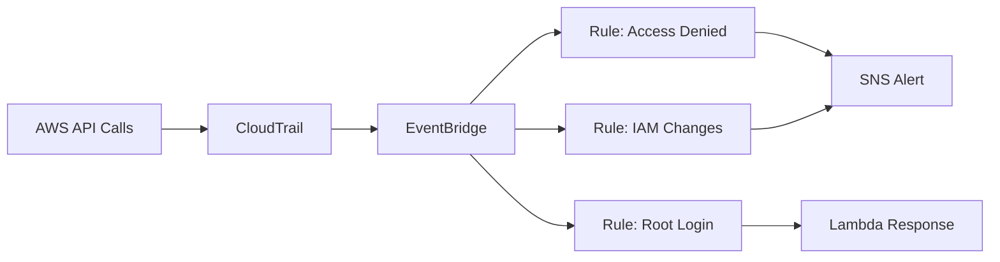

# How to Detect Unauthorized API Calls with CloudTrail and EventBridge

Author: [nawazdhandala](https://github.com/nawazdhandala)

Tags: AWS, CloudTrail, EventBridge, Security, Threat Detection, Automation

Description: Build automated detection rules using CloudTrail and EventBridge to catch unauthorized API calls and suspicious activity in real time.

---

Every API call in your AWS account leaves a trace in CloudTrail. That includes the ones that fail with "Access Denied." Those failed calls are interesting because they often indicate either misconfigured permissions or someone probing your account for weaknesses. By combining CloudTrail with Amazon EventBridge, you can detect these unauthorized API calls in near real-time and trigger automated responses.

This is not a replacement for GuardDuty (which does ML-based threat detection), but it is a lightweight, targeted approach for catching specific patterns you care about.

## How It Works

CloudTrail continuously records API activity. When you enable CloudTrail integration with EventBridge, every management event generates an EventBridge event. You write rules that match specific patterns (like error codes indicating unauthorized access), and EventBridge routes those matches to targets like SNS, Lambda, or Step Functions.



The detection is near real-time. From the moment the API call happens to the time your alert fires, you are looking at seconds to a couple of minutes.

## Prerequisites

- CloudTrail enabled in your account (it is enabled by default for management events)
- EventBridge access (enabled by default in all accounts)
- An SNS topic for notifications
- AWS CLI configured

## Step 1: Create the SNS Topic for Alerts

```bash
# Create an SNS topic for security alerts
aws sns create-topic --name security-alerts

# Subscribe your security team's email
aws sns subscribe \
  --topic-arn arn:aws:sns:us-east-1:123456789012:security-alerts \
  --protocol email \
  --notification-endpoint security-team@example.com
```

## Step 2: Detect Access Denied Errors

The first rule catches any API call that returns an Access Denied error. This is a broad rule that helps you spot both misconfigurations and potential attacks.

```bash
# Create EventBridge rule for Access Denied errors
aws events put-rule \
  --name detect-access-denied \
  --event-pattern '{
    "source": ["aws.iam", "aws.s3", "aws.ec2", "aws.sts"],
    "detail-type": ["AWS API Call via CloudTrail"],
    "detail": {
      "errorCode": ["AccessDenied", "Client.UnauthorizedAccess", "UnauthorizedAccess"]
    }
  }' \
  --description "Detect API calls that return Access Denied"

# Route matches to SNS
aws events put-targets \
  --rule detect-access-denied \
  --targets '[{
    "Id": "sns-security-alerts",
    "Arn": "arn:aws:sns:us-east-1:123456789012:security-alerts",
    "InputTransformer": {
      "InputPathsMap": {
        "time": "$.detail.eventTime",
        "user": "$.detail.userIdentity.arn",
        "action": "$.detail.eventName",
        "source": "$.detail.eventSource",
        "ip": "$.detail.sourceIPAddress",
        "error": "$.detail.errorMessage"
      },
      "InputTemplate": "\"SECURITY ALERT: Access Denied\\nTime: <time>\\nUser: <user>\\nAction: <action>\\nService: <source>\\nSource IP: <ip>\\nError: <error>\""
    }
  }]'
```

The `InputTransformer` formats the event into a human-readable message so your alert email is immediately useful without needing to decode JSON.

## Step 3: Detect Root Account Usage

Root account usage should be extremely rare. Any root login or API call warrants immediate investigation.

```bash
# Create EventBridge rule for root account activity
aws events put-rule \
  --name detect-root-activity \
  --event-pattern '{
    "source": ["aws.signin"],
    "detail-type": ["AWS Console Sign In via CloudTrail"],
    "detail": {
      "userIdentity": {
        "type": ["Root"]
      }
    }
  }' \
  --description "Alert on any root account console sign-in"

aws events put-targets \
  --rule detect-root-activity \
  --targets '[{
    "Id": "sns-root-alert",
    "Arn": "arn:aws:sns:us-east-1:123456789012:security-alerts"
  }]'
```

Also catch root API calls (not just console logins):

```bash
# Detect root account API calls
aws events put-rule \
  --name detect-root-api-calls \
  --event-pattern '{
    "detail-type": ["AWS API Call via CloudTrail"],
    "detail": {
      "userIdentity": {
        "type": ["Root"]
      }
    }
  }' \
  --description "Alert on any root account API call"

aws events put-targets \
  --rule detect-root-api-calls \
  --targets '[{
    "Id": "sns-root-api-alert",
    "Arn": "arn:aws:sns:us-east-1:123456789012:security-alerts"
  }]'
```

## Step 4: Detect Suspicious IAM Changes

Certain IAM changes should trigger alerts because they can escalate privileges or create backdoors.

```bash
# Detect suspicious IAM operations
aws events put-rule \
  --name detect-iam-changes \
  --event-pattern '{
    "source": ["aws.iam"],
    "detail-type": ["AWS API Call via CloudTrail"],
    "detail": {
      "eventName": [
        "CreateUser",
        "CreateAccessKey",
        "CreateLoginProfile",
        "AttachUserPolicy",
        "AttachRolePolicy",
        "PutUserPolicy",
        "PutRolePolicy",
        "AddUserToGroup",
        "CreateRole",
        "UpdateAssumeRolePolicy"
      ]
    }
  }' \
  --description "Alert on IAM changes that could escalate privileges"

aws events put-targets \
  --rule detect-iam-changes \
  --targets '[{
    "Id": "sns-iam-alert",
    "Arn": "arn:aws:sns:us-east-1:123456789012:security-alerts"
  }]'
```

## Step 5: Detect Console Logins from Unusual Locations

You can use a Lambda function to enrich the alert with geolocation data and flag logins from unexpected locations.

```python
# Lambda function to analyze console login events
import json
import boto3
import urllib.request

sns = boto3.client('sns')

# List of expected IP ranges (your office, VPN, etc.)
EXPECTED_CIDRS = [
    '203.0.113.0/24',   # Office network
    '198.51.100.0/24',  # VPN range
]

def handler(event, context):
    detail = event['detail']
    source_ip = detail.get('sourceIPAddress', 'unknown')
    user_arn = detail.get('userIdentity', {}).get('arn', 'unknown')
    event_time = detail.get('eventTime', 'unknown')
    mfa_used = 'unknown'

    # Check if MFA was used
    additional = detail.get('additionalEventData', '{}')
    if isinstance(additional, str):
        additional = json.loads(additional)
    mfa_used = additional.get('MFAUsed', 'unknown')

    # Check if the source IP is in expected ranges
    is_expected = False
    for cidr in EXPECTED_CIDRS:
        # Simplified check - use ipaddress module for production
        if source_ip.startswith(cidr.split('/')[0].rsplit('.', 1)[0]):
            is_expected = True
            break

    if not is_expected:
        # This login is from an unexpected location
        message = f"""
        SECURITY ALERT: Console Login from Unexpected Location

        User: {user_arn}
        Source IP: {source_ip}
        Time: {event_time}
        MFA Used: {mfa_used}

        This login originated from an IP address outside known ranges.
        Please verify this is legitimate activity.
        """

        sns.publish(
            TopicArn='arn:aws:sns:us-east-1:123456789012:security-alerts',
            Subject='Console Login from Unexpected Location',
            Message=message
        )

    return {'statusCode': 200}
```

Wire this Lambda to an EventBridge rule:

```bash
# Rule to trigger Lambda on console logins
aws events put-rule \
  --name analyze-console-logins \
  --event-pattern '{
    "source": ["aws.signin"],
    "detail-type": ["AWS Console Sign In via CloudTrail"],
    "detail": {
      "responseElements": {
        "ConsoleLogin": ["Success"]
      }
    }
  }'

aws events put-targets \
  --rule analyze-console-logins \
  --targets '[{
    "Id": "login-analyzer-lambda",
    "Arn": "arn:aws:lambda:us-east-1:123456789012:function:analyze-console-logins"
  }]'
```

## Step 6: Detect Security Group Changes

Opening security groups to the world (0.0.0.0/0) is a common misconfiguration that can expose your infrastructure.

```bash
# Detect security group modifications
aws events put-rule \
  --name detect-security-group-changes \
  --event-pattern '{
    "source": ["aws.ec2"],
    "detail-type": ["AWS API Call via CloudTrail"],
    "detail": {
      "eventName": [
        "AuthorizeSecurityGroupIngress",
        "AuthorizeSecurityGroupEgress",
        "RevokeSecurityGroupIngress",
        "RevokeSecurityGroupEgress",
        "CreateSecurityGroup",
        "DeleteSecurityGroup"
      ]
    }
  }'

aws events put-targets \
  --rule detect-security-group-changes \
  --targets '[{
    "Id": "sns-sg-alert",
    "Arn": "arn:aws:sns:us-east-1:123456789012:security-alerts"
  }]'
```

## Reducing Alert Noise

These rules can generate a lot of alerts, especially the Access Denied rule. To reduce noise:

**Narrow the event sources**: Instead of matching all services, target specific ones you care about most.

**Add exclusions**: Use the `anything-but` pattern to exclude known noisy sources:

```json
// Exclude known noisy event sources
{
  "detail": {
    "errorCode": ["AccessDenied"],
    "eventSource": [{"anything-but": ["health.amazonaws.com", "trustedadvisor.amazonaws.com"]}]
  }
}
```

**Use a Lambda aggregator**: Instead of sending every event to SNS, send them to Lambda, aggregate for 5 minutes, and send a summary.

## Testing Your Rules

Generate a test event by making an API call you know will fail:

```bash
# This should trigger an Access Denied event (assuming you lack permission)
aws s3 ls s3://some-bucket-you-dont-own 2>&1 || true
```

Then check CloudWatch metrics for your EventBridge rules to see if they matched.

## Wrapping Up

CloudTrail plus EventBridge gives you a lightweight, serverless security monitoring layer. It is not meant to replace comprehensive tools like GuardDuty, but it excels at catching specific patterns you define. The rules are easy to create, the cost is negligible, and the response time is fast.

For deeper audit analysis, check out our guide on [CloudTrail Lake for advanced event analysis](https://oneuptime.com/blog/post/use-cloudtrail-lake-for-advanced-event-analysis/view). For detecting unusual API patterns automatically, see [monitoring API call patterns with CloudTrail Insights](https://oneuptime.com/blog/post/monitor-aws-api-call-patterns-with-cloudtrail-insights/view).
