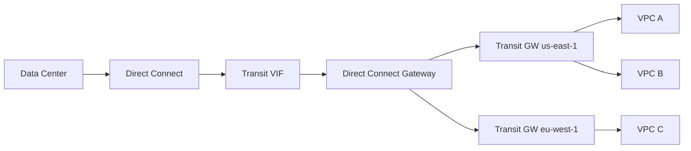

# How to Configure Direct Connect Gateway for Multi-VPC Access

Author: [nawazdhandala](https://github.com/nawazdhandala)

Tags: AWS, Direct Connect, VPC, Networking, Hybrid Cloud

Description: Step-by-step guide to configuring AWS Direct Connect Gateway to provide your on-premises network access to multiple VPCs across different regions.

---

AWS Direct Connect gives you a dedicated network connection between your data center and AWS. But what happens when you've got VPCs in multiple regions and you want on-premises access to all of them? Without a Direct Connect Gateway, you'd need separate Direct Connect connections in each region. That's expensive, complicated, and frankly unnecessary.

A Direct Connect Gateway acts as a global routing hub. You create one, associate it with virtual private gateways or transit gateways across regions, and your single physical Direct Connect connection can reach VPCs everywhere. Let's set it up.

## How Direct Connect Gateway Works

The architecture is layered. At the bottom, you've got your physical Direct Connect connection at an AWS Direct Connect location. On top of that, you create a virtual interface (VIF). The VIF connects to a Direct Connect Gateway, which in turn associates with virtual private gateways (VGWs) or transit gateways in your VPCs.

Here's the logical flow:



A single Direct Connect connection fans out to multiple VPCs through the gateway. Routes are exchanged via BGP, so your on-premises routers learn about VPC CIDRs automatically.

## Creating the Direct Connect Gateway

Start by creating the gateway itself. You'll need to specify an ASN for the Amazon side of the BGP session.

Create a Direct Connect Gateway:

```bash
# Create the Direct Connect Gateway
aws directconnect create-direct-connect-gateway \
  --direct-connect-gateway-name "prod-dx-gateway" \
  --amazon-side-asn 64512

# Output will include the directConnectGatewayId - save this
```

The ASN you choose needs to be in the private range (64512-65534) and shouldn't conflict with your on-premises ASN. If your on-premises routers use 65000, pick something else for the AWS side.

## Associating with Virtual Private Gateways

If you're not using transit gateways, you can associate the Direct Connect Gateway directly with VGWs attached to your VPCs.

Associate a VGW with the Direct Connect Gateway:

```bash
# First, make sure you have a VGW attached to your VPC
aws ec2 create-vpn-gateway --type ipsec.1 --amazon-side-asn 64513
aws ec2 attach-vpn-gateway \
  --vpn-gateway-id vgw-0123456789abcdef0 \
  --vpc-id vpc-prod001

# Associate it with the Direct Connect Gateway
aws directconnect create-direct-connect-gateway-association \
  --direct-connect-gateway-id dx-gw-0123456789abcdef0 \
  --gateway-id vgw-0123456789abcdef0 \
  --add-allowed-prefixes-to-direct-connect-gateway cidr=10.1.0.0/16

# Repeat for VPCs in other regions
aws directconnect create-direct-connect-gateway-association \
  --direct-connect-gateway-id dx-gw-0123456789abcdef0 \
  --gateway-id vgw-abcdef0123456789a \
  --add-allowed-prefixes-to-direct-connect-gateway cidr=10.2.0.0/16
```

The `--add-allowed-prefixes` parameter is crucial. It controls which CIDR blocks are advertised to your on-premises network via BGP. If you don't set this, the VPC CIDR is used by default.

## Using Transit Gateway Instead

For most production setups, you'll want to associate the Direct Connect Gateway with a transit gateway rather than individual VGWs. This gives you more flexibility with routing and lets you connect many more VPCs.

Create a transit VIF and associate with a transit gateway:

```bash
# Create a transit virtual interface
aws directconnect create-transit-virtual-interface \
  --connection-id dxcon-abc123 \
  --new-transit-virtual-interface '{
    "virtualInterfaceName": "prod-transit-vif",
    "vlan": 100,
    "asn": 65000,
    "mtu": 8500,
    "authKey": "your-bgp-auth-key",
    "amazonAddress": "169.254.100.1/30",
    "customerAddress": "169.254.100.2/30",
    "directConnectGatewayId": "dx-gw-0123456789abcdef0",
    "tags": [
      {"key": "Environment", "value": "Production"}
    ]
  }'

# Associate the Direct Connect Gateway with a transit gateway
aws directconnect create-direct-connect-gateway-association \
  --direct-connect-gateway-id dx-gw-0123456789abcdef0 \
  --gateway-id tgw-0123456789abcdef0 \
  --add-allowed-prefixes-to-direct-connect-gateway cidr=10.0.0.0/8
```

Note the MTU of 8500 - jumbo frames are supported on Direct Connect and can improve throughput for large data transfers. Make sure your on-premises network supports jumbo frames end-to-end before enabling this.

## CloudFormation Setup

Here's a CloudFormation template that ties it all together.

CloudFormation template for Direct Connect Gateway with transit gateway association:

```yaml
AWSTemplateFormatVersion: '2010-09-09'
Description: Direct Connect Gateway Multi-VPC Setup

Parameters:
  AmazonSideAsn:
    Type: Number
    Default: 64512
  TransitGatewayId:
    Type: String

Resources:
  DirectConnectGateway:
    Type: AWS::DirectConnect::DirectConnectGateway
    Properties:
      Name: prod-dx-gateway
      AmazonSideAsn: !Ref AmazonSideAsn

  TGWAssociation:
    Type: AWS::DirectConnect::DirectConnectGatewayAssociation
    Properties:
      DirectConnectGatewayId: !Ref DirectConnectGateway
      GatewayId: !Ref TransitGatewayId
      AllowedPrefixes:
        - CIDR: "10.0.0.0/8"
        - CIDR: "172.16.0.0/12"

Outputs:
  GatewayId:
    Value: !Ref DirectConnectGateway
    Description: Direct Connect Gateway ID
```

## Route Propagation and Prefix Management

When you associate VPCs with the Direct Connect Gateway, AWS propagates routes bidirectionally via BGP:

- **AWS to On-Premises**: VPC CIDRs (or your allowed prefixes) are advertised to your on-premises router.
- **On-Premises to AWS**: Your on-premises prefixes are learned by the VPC route tables (if route propagation is enabled).

Enable route propagation on your VPC route tables:

```bash
# Enable route propagation on the VPC route table
aws ec2 enable-vgw-route-propagation \
  --route-table-id rtb-0123456789abcdef0 \
  --gateway-id vgw-0123456789abcdef0
```

If you're using transit gateway, routes from Direct Connect are received in the transit gateway route table and can be propagated to attached VPCs.

## Allowed Prefix Filtering

Allowed prefixes deserve special attention. They serve as a filter for what gets advertised over BGP. If your VPC CIDR is 10.1.0.0/16 but you set the allowed prefix to 10.0.0.0/8, then 10.0.0.0/8 is what your on-premises router sees. This is useful for summarization - instead of advertising 50 individual /16 prefixes, you advertise a single /8.

However, be careful. If you summarize too aggressively, you might attract traffic destined for CIDRs that don't actually exist in your VPCs. Make sure your on-premises routing has appropriate specificity to avoid black-holing traffic.

## Cross-Account Access

Direct Connect Gateways support cross-account associations. If your VPCs live in different AWS accounts (common in organizations using AWS Organizations), the VPC-owning account sends a proposal, and the gateway-owning account accepts it.

Set up cross-account association:

```bash
# From the VPC-owning account: send a proposal
aws directconnect create-direct-connect-gateway-association-proposal \
  --direct-connect-gateway-id dx-gw-0123456789abcdef0 \
  --direct-connect-gateway-owner-account 111111111111 \
  --gateway-id vgw-0123456789abcdef0 \
  --add-allowed-prefixes-to-direct-connect-gateway cidr=10.5.0.0/16

# From the gateway-owning account: accept the proposal
aws directconnect accept-direct-connect-gateway-association-proposal \
  --direct-connect-gateway-id dx-gw-0123456789abcdef0 \
  --association-proposal-id proposal-abc123 \
  --associated-gateway-owner-account 222222222222 \
  --override-allowed-prefixes-to-direct-connect-gateway cidr=10.5.0.0/16
```

## Limits to Keep in Mind

Direct Connect Gateways have some limits worth noting:

- Up to 20 VGW associations per gateway (can request an increase)
- Up to 3 transit gateway associations per gateway
- VPCs associated via the same Direct Connect Gateway can't communicate with each other through it - the gateway doesn't act as a transit point between VPCs
- BGP session limits: 100 prefixes received from on-premises, 20 prefixes advertised to on-premises

That last point about VPC-to-VPC communication is important. If you need VPCs to talk to each other, use transit gateway peering or VPC peering separately. The Direct Connect Gateway only handles on-premises to VPC traffic.

## Monitoring Your Setup

Once everything is running, keep an eye on your BGP sessions and traffic flow. CloudWatch provides metrics for Direct Connect connections including connection state, outbound/inbound traffic, and light levels on the physical port.

For broader network visibility, consider pairing this with [Transit Gateway Network Manager](https://oneuptime.com/blog/post/2026-02-12-transit-gateway-network-manager/view) to get a unified view of your hybrid network.
