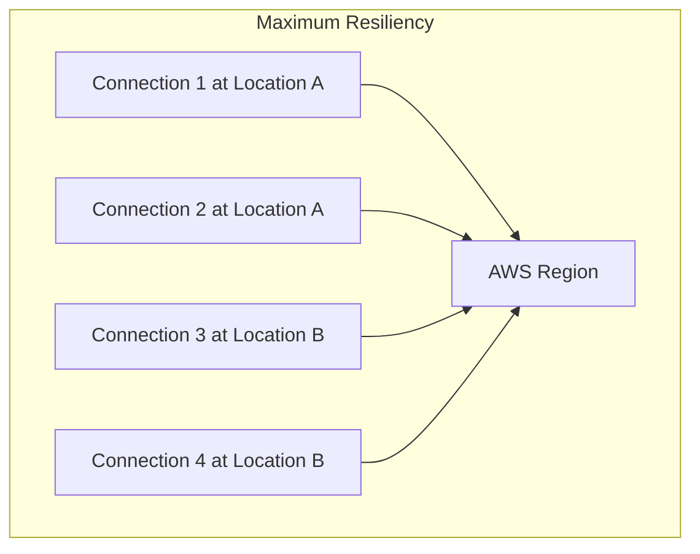

# How to Set Up Direct Connect Resiliency with Dual Connections

Author: [nawazdhandala](https://github.com/nawazdhandala)

Tags: AWS, Direct Connect, High Availability, Networking

Description: Learn how to configure dual AWS Direct Connect connections for high availability, including different resiliency models and failover strategies.

---

A single Direct Connect connection is a single point of failure. Your dedicated 1Gbps or 10Gbps link to AWS is great until someone accidentally cuts a fiber, a port fails on the router, or the Direct Connect location itself has an issue. When that happens, all your hybrid connectivity drops.

Setting up dual Direct Connect connections is the answer. AWS provides several resiliency models - from basic redundancy to maximum resiliency with connections at separate physical locations. Let's walk through the options and how to configure each one.

## Resiliency Models

AWS defines four resiliency tiers:



1. **Maximum Resiliency**: Four connections across two Direct Connect locations. Survives the complete failure of any single location.
2. **High Resiliency**: Two connections at two separate Direct Connect locations. Survives a single location failure.
3. **Development and Test**: Single connection, no redundancy. Only appropriate for non-production workloads.
4. **Classic**: Two connections at the same location. Protects against individual connection failures but not location-level events.

For production workloads, you want at minimum the High Resiliency model.

## Setting Up High Resiliency (Two Locations)

Start by creating connections at two different Direct Connect locations.

Create connections at two separate locations:

```bash
# Connection at first Direct Connect location
aws directconnect create-connection \
  --location EqDC2 \
  --bandwidth "1Gbps" \
  --connection-name "prod-dx-primary" \
  --tags Key=Role,Value=Primary Key=Environment,Value=Production

# Connection at second Direct Connect location
aws directconnect create-connection \
  --location EqCH2 \
  --bandwidth "1Gbps" \
  --connection-name "prod-dx-secondary" \
  --tags Key=Role,Value=Secondary Key=Environment,Value=Production
```

Each connection will be in `ordering` state until AWS provisions the physical cross-connect. This can take days to weeks depending on the location and whether you're working with a Direct Connect partner.

## Creating Virtual Interfaces

Once both connections are active, create virtual interfaces on each one. Both VIFs connect to the same Direct Connect Gateway.

Create transit VIFs on both connections:

```bash
# Primary VIF on first connection
aws directconnect create-transit-virtual-interface \
  --connection-id dxcon-primary123 \
  --new-transit-virtual-interface '{
    "virtualInterfaceName": "prod-primary-vif",
    "vlan": 100,
    "asn": 65000,
    "mtu": 8500,
    "authKey": "bgp-auth-key-primary",
    "amazonAddress": "169.254.100.1/30",
    "customerAddress": "169.254.100.2/30",
    "directConnectGatewayId": "dx-gw-0123456789abcdef0"
  }'

# Secondary VIF on second connection
aws directconnect create-transit-virtual-interface \
  --connection-id dxcon-secondary456 \
  --new-transit-virtual-interface '{
    "virtualInterfaceName": "prod-secondary-vif",
    "vlan": 200,
    "asn": 65000,
    "mtu": 8500,
    "authKey": "bgp-auth-key-secondary",
    "amazonAddress": "169.254.200.1/30",
    "customerAddress": "169.254.200.2/30",
    "directConnectGatewayId": "dx-gw-0123456789abcdef0"
  }'
```

Both VIFs point to the same Direct Connect Gateway. AWS handles the route advertisement through both paths, and BGP takes care of selecting the best path.

## BGP Configuration on Your Router

Your on-premises routers need to peer with both VIFs. The BGP configuration varies by vendor, but here's a generic example.

Example BGP configuration for dual Direct Connect (Cisco-like syntax):

```
! Primary Direct Connect BGP session
router bgp 65000
  neighbor 169.254.100.1 remote-as 64512
  neighbor 169.254.100.1 password bgp-auth-key-primary
  neighbor 169.254.100.1 description AWS-DX-Primary

  address-family ipv4 unicast
    neighbor 169.254.100.1 activate
    neighbor 169.254.100.1 route-map AWS-PRIMARY-IN in
    neighbor 169.254.100.1 route-map AWS-PRIMARY-OUT out

! Secondary Direct Connect BGP session
  neighbor 169.254.200.1 remote-as 64512
  neighbor 169.254.200.1 password bgp-auth-key-secondary
  neighbor 169.254.200.1 description AWS-DX-Secondary

  address-family ipv4 unicast
    neighbor 169.254.200.1 activate
    neighbor 169.254.200.1 route-map AWS-SECONDARY-IN in
    neighbor 169.254.200.1 route-map AWS-SECONDARY-OUT out

! Route maps for traffic engineering
route-map AWS-PRIMARY-IN permit 10
  set local-preference 200

route-map AWS-SECONDARY-IN permit 10
  set local-preference 100

route-map AWS-PRIMARY-OUT permit 10
  ! Advertise on-premises prefixes

route-map AWS-SECONDARY-OUT permit 10
  set as-path prepend 65000 65000
```

The key here is traffic engineering. Setting a higher local preference on the primary path makes your routers prefer that path for traffic going to AWS. AS-path prepending on the secondary path makes AWS prefer the primary path for traffic coming to you. When the primary fails, BGP reconverges and all traffic shifts to the secondary.

## Link Aggregation Groups (LAG)

If you want more bandwidth at a single location, you can bundle multiple connections into a Link Aggregation Group.

Create a LAG with two connections:

```bash
# Create a LAG
aws directconnect create-lag \
  --number-of-connections 2 \
  --location EqDC2 \
  --connections-bandwidth "1Gbps" \
  --lag-name "prod-lag-primary" \
  --tags Key=Environment,Value=Production

# Alternatively, add an existing connection to a LAG
aws directconnect associate-connection-with-lag \
  --connection-id dxcon-existing789 \
  --lag-id dxlag-abc123
```

LAGs use LACP (Link Aggregation Control Protocol) and require that all member connections are at the same Direct Connect location and have the same bandwidth. A LAG increases bandwidth but doesn't add location-level redundancy - you still need connections at a second location for that.

## Failover Testing

You need to test your failover before you actually need it. AWS provides a way to bring down a BGP session for testing.

Test failover by bringing down the primary BGP session:

```bash
# Start a BFD (Bidirectional Forwarding Detection) test
# by requesting a maintenance event on the primary connection
aws directconnect start-bgp-failover-test \
  --virtual-interface-id dxvif-primary123 \
  --bgp-peers 169.254.100.1 \
  --test-duration-in-minutes 5

# Monitor the test
aws directconnect describe-virtual-interface-test-history \
  --virtual-interface-id dxvif-primary123
```

During the test, traffic should shift to the secondary connection. Monitor your application latency and throughput during the switchover. BGP reconvergence typically takes 30-90 seconds, but with BFD enabled, you can get that down to under 3 seconds.

## Enabling BFD for Fast Failover

BFD (Bidirectional Forwarding Detection) dramatically reduces failover time. Without it, you're waiting for BGP hold timers to expire (default 90 seconds). With BFD, failure detection happens in under a second.

BFD configuration on your on-premises router:

```
! Enable BFD on the BGP sessions
router bgp 65000
  neighbor 169.254.100.1 fall-over bfd
  neighbor 169.254.200.1 fall-over bfd

! BFD interface settings
interface GigabitEthernet0/0
  bfd interval 300 min_rx 300 multiplier 3
```

AWS supports BFD on Direct Connect with an interval of 300ms and a multiplier of 3, meaning failure is detected in roughly 900ms. That's a massive improvement over the default 90-second BGP hold timer.

## CloudFormation for the Full Stack

Here's a comprehensive CloudFormation setup.

CloudFormation template for resilient Direct Connect:

```yaml
AWSTemplateFormatVersion: '2010-09-09'
Description: Resilient Direct Connect Configuration

Parameters:
  PrimaryConnectionId:
    Type: String
  SecondaryConnectionId:
    Type: String
  OnPremisesAsn:
    Type: Number
    Default: 65000

Resources:
  DirectConnectGateway:
    Type: AWS::DirectConnect::DirectConnectGateway
    Properties:
      Name: resilient-dx-gateway
      AmazonSideAsn: 64512

  PrimaryVIF:
    Type: AWS::DirectConnect::TransitVirtualInterface
    Properties:
      ConnectionId: !Ref PrimaryConnectionId
      DirectConnectGatewayId: !Ref DirectConnectGateway
      VirtualInterfaceName: primary-transit-vif
      Asn: !Ref OnPremisesAsn
      Vlan: 100
      Mtu: 8500
      Tags:
        - Key: Role
          Value: Primary

  SecondaryVIF:
    Type: AWS::DirectConnect::TransitVirtualInterface
    Properties:
      ConnectionId: !Ref SecondaryConnectionId
      DirectConnectGatewayId: !Ref DirectConnectGateway
      VirtualInterfaceName: secondary-transit-vif
      Asn: !Ref OnPremisesAsn
      Vlan: 200
      Mtu: 8500
      Tags:
        - Key: Role
          Value: Secondary
```

## Monitoring Dual Connections

Keep both connections healthy by monitoring key CloudWatch metrics.

Set up CloudWatch alarms for connection health:

```bash
# Alarm for primary connection state
aws cloudwatch put-metric-alarm \
  --alarm-name "dx-primary-down" \
  --metric-name ConnectionState \
  --namespace AWS/DX \
  --statistic Minimum \
  --period 60 \
  --threshold 1 \
  --comparison-operator LessThanThreshold \
  --evaluation-periods 1 \
  --dimensions Name=ConnectionId,Value=dxcon-primary123 \
  --alarm-actions arn:aws:sns:us-east-1:123456789012:ops-alerts
```

Also monitor BGP session state on both VIFs. You want to know immediately if a BGP session drops, even if the failover is working correctly. A degraded state - where you're running on a single connection - should be treated as an urgent issue.

For comprehensive infrastructure monitoring, check out [OneUptime's monitoring capabilities](https://oneuptime.com/blog/post/aws-cloudwatch-monitoring/view) to keep your hybrid connectivity reliable.
