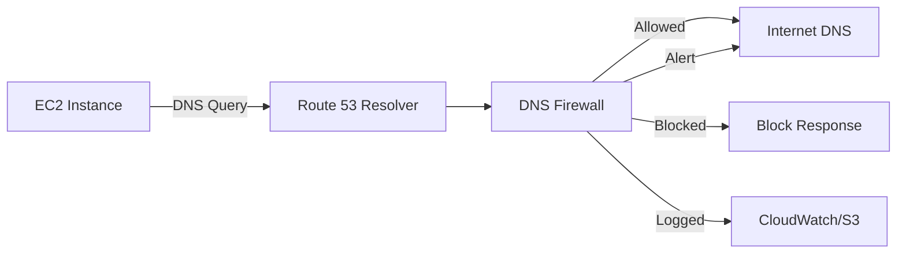

# How to Use DNS Firewall with Route 53 Resolver

Author: [nawazdhandala](https://github.com/nawazdhandala)

Tags: AWS, Route 53, DNS, Firewall, Security

Description: Set up Route 53 Resolver DNS Firewall to filter and block DNS queries from your VPCs to prevent data exfiltration and malicious domain access.

---

DNS is one of the most overlooked attack vectors in cloud environments. Malware phones home via DNS, data exfiltration happens through DNS tunneling, and compromised instances resolve domains they have no business talking to. Traditional network firewalls can block IP addresses and ports, but DNS traffic slips through because it's essential for everything to work.

Route 53 Resolver DNS Firewall gives you control over DNS queries originating from your VPCs. You can block queries to known malicious domains, allow only approved domains, and log all DNS activity for analysis. It sits between your VPC resources and the Route 53 Resolver, inspecting every DNS query before it gets resolved.

## How DNS Firewall Works

Every time an EC2 instance, Lambda function, or any other resource in your VPC makes a DNS query, it goes through the Route 53 Resolver. DNS Firewall evaluates each query against your rule groups in priority order. Rules can allow, block, or alert on specific domains or domain lists.



## Step 1: Create Domain Lists

Domain lists define which domains your rules will match against. You can create your own or use AWS-managed lists.

### Using AWS Managed Domain Lists

AWS provides curated domain lists for common threat categories:

```bash
# List available managed domain lists
aws route53resolver list-firewall-domain-lists \
  --query 'FirewallDomainLists[?ManagedOwnerName!=null].{Name:Name,Id:Id}'
```

AWS provides lists like:
- `AWSManagedDomainsMalwareDomainList` - Known malware domains
- `AWSManagedDomainsBotnetCommandandControl` - Command and control servers
- `AWSManagedDomainsAggregateThreatList` - Combined threat list

### Creating Custom Domain Lists

This creates a custom domain list with domains you want to block:

```bash
# Create a custom block list
aws route53resolver create-firewall-domain-list \
  --name "blocked-domains" \
  --tags Key=Environment,Value=Production

# Add domains to the list
aws route53resolver update-firewall-domains \
  --firewall-domain-list-id rslvr-fdl-abc123 \
  --operation ADD \
  --domains \
    "malicious-site.com" \
    "*.phishing-domain.net" \
    "cryptominer-pool.io" \
    "*.suspicious-cdn.xyz"
```

You can also import domains from a file on S3:

```bash
# Import from S3 (one domain per line)
aws route53resolver import-firewall-domains \
  --firewall-domain-list-id rslvr-fdl-abc123 \
  --operation REPLACE \
  --domain-file-url s3://my-security-bucket/blocked-domains.txt
```

Create an allowlist for domains that must always resolve:

```bash
# Create an allow list for critical services
aws route53resolver create-firewall-domain-list \
  --name "allowed-domains"

aws route53resolver update-firewall-domains \
  --firewall-domain-list-id rslvr-fdl-def456 \
  --operation ADD \
  --domains \
    "*.amazonaws.com" \
    "*.aws.amazon.com" \
    "github.com" \
    "*.docker.io" \
    "*.npmjs.org"
```

## Step 2: Create a Rule Group

Rule groups contain the actual firewall rules. Each rule associates a domain list with an action.

This creates a rule group with allow, block, and alert rules:

```bash
# Create the rule group
aws route53resolver create-firewall-rule-group \
  --name "production-dns-rules"
```

Now add rules to the group. Rules are evaluated in priority order (lower number = higher priority).

```bash
# Rule 1: Allow critical AWS and business domains (highest priority)
aws route53resolver create-firewall-rule \
  --firewall-rule-group-id rslvr-frg-abc123 \
  --firewall-domain-list-id rslvr-fdl-def456 \
  --priority 100 \
  --action ALLOW \
  --name "allow-critical-domains"

# Rule 2: Block known malicious domains
aws route53resolver create-firewall-rule \
  --firewall-rule-group-id rslvr-frg-abc123 \
  --firewall-domain-list-id rslvr-fdl-abc123 \
  --priority 200 \
  --action BLOCK \
  --block-response NXDOMAIN \
  --name "block-malicious-custom"

# Rule 3: Block AWS managed malware list
aws route53resolver create-firewall-rule \
  --firewall-rule-group-id rslvr-frg-abc123 \
  --firewall-domain-list-id rslvr-fdl-managed-malware \
  --priority 300 \
  --action BLOCK \
  --block-response NXDOMAIN \
  --name "block-malware-domains"

# Rule 4: Alert on AWS managed botnet C2 list
aws route53resolver create-firewall-rule \
  --firewall-rule-group-id rslvr-frg-abc123 \
  --firewall-domain-list-id rslvr-fdl-managed-botnet \
  --priority 400 \
  --action ALERT \
  --name "alert-botnet-domains"
```

The `block-response` can be:
- `NXDOMAIN` - Domain doesn't exist (most common)
- `NODATA` - Domain exists but no records
- `OVERRIDE` - Return a custom IP (useful for redirect pages)

For override responses:

```bash
# Block with redirect to a warning page
aws route53resolver create-firewall-rule \
  --firewall-rule-group-id rslvr-frg-abc123 \
  --firewall-domain-list-id rslvr-fdl-abc123 \
  --priority 250 \
  --action BLOCK \
  --block-response OVERRIDE \
  --block-override-domain "security-warning.internal.company.com" \
  --block-override-dns-type CNAME \
  --block-override-ttl 3600 \
  --name "block-with-redirect"
```

## Step 3: Associate with VPCs

The rule group does nothing until you associate it with a VPC.

This associates the DNS firewall rule group with your production VPC:

```bash
# Associate rule group with VPC
aws route53resolver associate-firewall-rule-group \
  --firewall-rule-group-id rslvr-frg-abc123 \
  --vpc-id vpc-12345678 \
  --priority 100 \
  --name "production-vpc-association"
```

You can associate multiple rule groups with a VPC. They're evaluated in priority order.

## Step 4: Enable Logging

DNS Firewall logs can go to CloudWatch, S3, or Kinesis Firehose.

This enables DNS query logging for the VPC and sends it to CloudWatch:

```bash
# Create a query log config
aws route53resolver create-resolver-query-log-config \
  --name "dns-firewall-logs" \
  --destination-arn arn:aws:logs:us-east-1:111111111111:log-group:/aws/route53/dns-firewall

# Associate with VPC
aws route53resolver associate-resolver-query-log-config \
  --resolver-query-log-config-id rslvr-ql-abc123 \
  --resource-id vpc-12345678
```

## Terraform Configuration

Here's the complete Terraform setup:

```hcl
# Custom block list
resource "aws_route53_resolver_firewall_domain_list" "blocked" {
  name    = "blocked-domains"
  domains = [
    "malicious-site.com",
    "*.phishing-domain.net",
    "cryptominer-pool.io"
  ]
}

# Rule group
resource "aws_route53_resolver_firewall_rule_group" "main" {
  name = "production-dns-rules"
}

# Block rule
resource "aws_route53_resolver_firewall_rule" "block_malicious" {
  name                    = "block-malicious"
  action                  = "BLOCK"
  block_response          = "NXDOMAIN"
  firewall_domain_list_id = aws_route53_resolver_firewall_domain_list.blocked.id
  firewall_rule_group_id  = aws_route53_resolver_firewall_rule_group.main.id
  priority                = 200
}

# VPC association
resource "aws_route53_resolver_firewall_rule_group_association" "main" {
  name                   = "production-vpc"
  firewall_rule_group_id = aws_route53_resolver_firewall_rule_group.main.id
  priority               = 100
  vpc_id                 = aws_vpc.main.id
}
```

## Monitoring and Alerting

Set up CloudWatch alarms for blocked DNS queries.

This creates a metric filter and alarm for blocked DNS queries exceeding a threshold:

```bash
# Metric filter for blocked queries
aws logs put-metric-filter \
  --log-group-name /aws/route53/dns-firewall \
  --filter-name BlockedDNSQueries \
  --filter-pattern '{ $.firewall_rule_action = "BLOCK" }' \
  --metric-transformations \
    metricName=BlockedDNSQueries,metricNamespace=DNSFirewall,metricValue=1

# Alarm for spike in blocked queries
aws cloudwatch put-metric-alarm \
  --alarm-name DNSFirewallBlockedSpike \
  --metric-name BlockedDNSQueries \
  --namespace DNSFirewall \
  --statistic Sum \
  --period 300 \
  --threshold 100 \
  --comparison-operator GreaterThanThreshold \
  --evaluation-periods 1 \
  --alarm-actions arn:aws:sns:us-east-1:111111111111:security-alerts
```

## Fail Open vs Fail Closed

An important decision: what happens if DNS Firewall can't evaluate a query (service disruption or latency)? By default, it fails open - queries are allowed through. For high-security environments, you can set it to fail closed.

```bash
# Set fail-close mode for a VPC
aws route53resolver update-firewall-config \
  --resource-id vpc-12345678 \
  --firewall-fail-open DISABLED
```

Be careful with fail-closed. If DNS Firewall has an issue, all DNS resolution in the VPC stops. That means everything breaks.

## Best Practices

**Start in alert-only mode.** Before blocking anything, run with ALERT action for a week. Review the logs to make sure you're not about to block legitimate traffic.

**Use AWS managed lists as a baseline.** They're updated regularly by AWS and cover common threats. Add your own custom lists on top.

**Implement allowlists carefully.** Overly broad allowlists (like `*`) defeat the purpose. Be specific about what you allow.

**Monitor for DNS tunneling.** Unusually long subdomain queries or high query volumes from a single source can indicate DNS tunneling. DNS Firewall logs make this visible.

Pair DNS Firewall with [AWS Network Firewall logging](https://oneuptime.com/blog/post/aws-network-firewall-logging/view) for complete network security visibility. Use [OneUptime](https://oneuptime.com) to monitor both your DNS firewall metrics and overall application availability.
