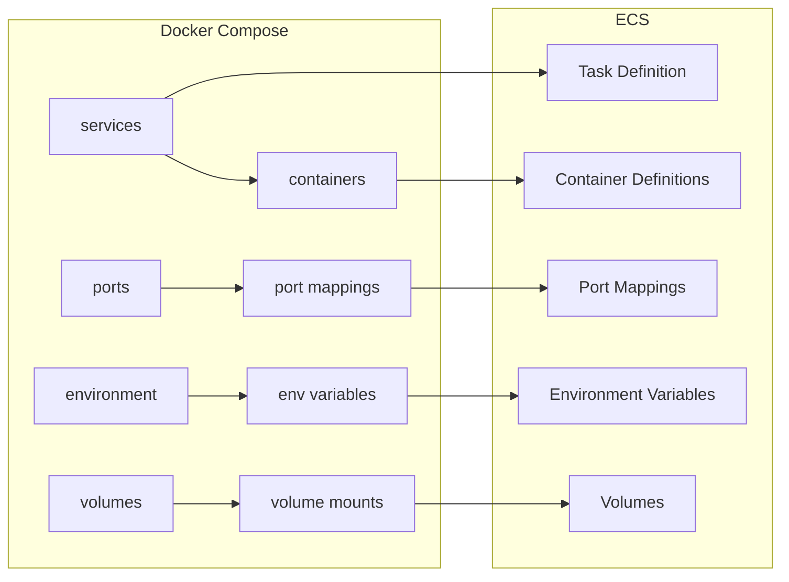

# How to Use Docker Compose Files with Amazon ECS CLI

Author: [nawazdhandala](https://github.com/nawazdhandala)

Tags: AWS, ECS, Docker Compose, ECS CLI, Containers, DevOps

Description: Convert and deploy Docker Compose files to Amazon ECS using the ECS CLI to bridge local development and cloud deployment workflows

---

If your team develops locally with Docker Compose, you already have a file that describes your multi-container application. The Amazon ECS CLI can take that same Compose file and deploy it to ECS, bridging the gap between local development and cloud deployment. Instead of manually translating your docker-compose.yml into ECS task definitions, you can let the ECS CLI do the heavy lifting.

This guide shows you how to use the ECS CLI with Docker Compose files, including the translation quirks you need to know about.

## What Is the ECS CLI?

The ECS CLI is a separate command-line tool from the AWS CLI that provides higher-level commands for ECS. Its killer feature is the ability to read Docker Compose files and translate them into ECS task definitions and services.

Note: AWS also offers the newer AWS Copilot CLI, which is the recommended tool for new projects. But if you have existing Docker Compose workflows, the ECS CLI is still useful for quick translations and deployments.

## Installing the ECS CLI

```bash
# Install on macOS
sudo curl -Lo /usr/local/bin/ecs-cli \
  https://amazon-ecs-cli-linux-amd64-latest
sudo chmod +x /usr/local/bin/ecs-cli

# Verify installation
ecs-cli --version
```

## Step 1: Configure the ECS CLI

Set up your cluster configuration and credentials.

```bash
# Configure the cluster
ecs-cli configure \
  --cluster my-compose-cluster \
  --default-launch-type FARGATE \
  --region us-east-1 \
  --config-name my-config

# Configure credentials
ecs-cli configure profile \
  --access-key YOUR_ACCESS_KEY \
  --secret-key YOUR_SECRET_KEY \
  --profile-name my-profile
```

## Step 2: Create a Docker Compose File

Here is a typical Docker Compose file for a web application with a Redis cache.

```yaml
# docker-compose.yml
version: '3'
services:
  web:
    image: 123456789.dkr.ecr.us-east-1.amazonaws.com/my-web-app:latest
    ports:
      - "80:3000"
    environment:
      - NODE_ENV=production
      - REDIS_HOST=localhost
    depends_on:
      - redis
    logging:
      driver: awslogs
      options:
        awslogs-group: /ecs/my-compose-app
        awslogs-region: us-east-1
        awslogs-stream-prefix: web

  redis:
    image: redis:7-alpine
    ports:
      - "6379:6379"
    logging:
      driver: awslogs
      options:
        awslogs-group: /ecs/my-compose-app
        awslogs-region: us-east-1
        awslogs-stream-prefix: redis
```

## Step 3: Create the ECS Params File

The ECS CLI uses a separate file called `ecs-params.yml` for ECS-specific settings that do not exist in Docker Compose.

```yaml
# ecs-params.yml
version: 1
task_definition:
  task_execution_role: ecsTaskExecutionRole
  task_role_arn: arn:aws:iam::123456789:role/ecsTaskRole
  ecs_network_mode: awsvpc
  task_size:
    mem_limit: 1024
    cpu_limit: 512
  services:
    web:
      essential: true
      cpu_shares: 256
      mem_limit: 512
    redis:
      essential: true
      cpu_shares: 256
      mem_limit: 512

run_params:
  network_configuration:
    awsvpc_configuration:
      subnets:
        - subnet-aaa111
        - subnet-bbb222
      security_groups:
        - sg-abc123
      assign_public_ip: ENABLED
```

## Step 4: Create the Cluster

```bash
# Create the ECS cluster with a VPC
ecs-cli up \
  --cluster-config my-config \
  --ecs-profile my-profile \
  --launch-type FARGATE
```

This creates the cluster. If you already have a cluster, you can skip this step.

## Step 5: Deploy the Compose Application

```bash
# Deploy the Docker Compose application to ECS
ecs-cli compose \
  --file docker-compose.yml \
  --ecs-params ecs-params.yml \
  --project-name my-app \
  --cluster-config my-config \
  --ecs-profile my-profile \
  service up

# Check the status
ecs-cli compose \
  --project-name my-app \
  --cluster-config my-config \
  service ps
```

The `service up` command creates an ECS service that maintains your desired task count. For one-off runs, use `up` instead of `service up`.

## How the Translation Works

Here is how Docker Compose concepts map to ECS.



Key translation rules:

- All services in a Compose file become containers in a single ECS task definition
- `depends_on` is translated to container dependencies
- `ports` become port mappings
- `environment` becomes environment variables
- `volumes` become ECS volumes (EFS for persistent, bind mounts for ephemeral)
- `logging` driver must be set to `awslogs` for Fargate

## Supported Docker Compose Features

The ECS CLI supports most Compose v3 features, but not all.

**Supported:**
- `image`
- `ports`
- `environment` and `env_file`
- `command` and `entrypoint`
- `working_dir`
- `logging` (awslogs driver)
- `depends_on`
- `volumes` (limited)
- `healthcheck`
- `labels`

**Not supported:**
- `build` (you must pre-build and push images to a registry)
- `networks` (ECS uses awsvpc networking)
- `volumes` with local drivers (use EFS instead)
- `restart` (ECS handles restarts through the service scheduler)
- `links` (not needed with awsvpc mode - use localhost)

## Using Volumes with EFS

For persistent storage, map Compose volumes to Amazon EFS.

```yaml
# docker-compose.yml with volume
version: '3'
services:
  web:
    image: my-app:latest
    volumes:
      - data:/app/data

volumes:
  data:
```

```yaml
# ecs-params.yml with EFS configuration
version: 1
task_definition:
  ecs_network_mode: awsvpc
  task_size:
    mem_limit: 512
    cpu_limit: 256
  efs_volumes:
    - name: data
      filesystem_id: fs-abc123
      transit_encryption: ENABLED
      access_point_id: fsap-def456
```

## Deploying Updates

When you update your Compose file or images, redeploy with the same command.

```bash
# Update the running service
ecs-cli compose \
  --file docker-compose.yml \
  --ecs-params ecs-params.yml \
  --project-name my-app \
  --cluster-config my-config \
  --ecs-profile my-profile \
  service up --force-deployment
```

The `--force-deployment` flag ensures a new deployment even if the task definition has not changed (useful when you push a new image with the same tag).

## Scaling the Service

```bash
# Scale to 3 tasks
ecs-cli compose \
  --project-name my-app \
  --cluster-config my-config \
  service scale 3
```

## Viewing Logs

```bash
# View logs from the running tasks
ecs-cli logs \
  --task-id abc123 \
  --follow \
  --cluster-config my-config
```

## Cleaning Up

```bash
# Stop and remove the service
ecs-cli compose \
  --project-name my-app \
  --cluster-config my-config \
  service down

# Delete the cluster
ecs-cli down \
  --cluster-config my-config \
  --force
```

## Alternative: Manual Compose-to-ECS Translation

If you prefer not to use the ECS CLI, you can manually convert your Compose file. Here is a quick reference for translating common Compose patterns.

```bash
# Generate a task definition from a Compose file without deploying
ecs-cli compose \
  --file docker-compose.yml \
  --ecs-params ecs-params.yml \
  --project-name my-app \
  create
```

This creates the task definition in ECS without starting any tasks, which is useful for inspecting the translation.

For a more detailed approach to manual translation, see our guide on [migrating Docker Compose to ECS task definitions](https://oneuptime.com/blog/post/migrate-docker-compose-ecs-task-definitions/view).

## When to Use the ECS CLI vs Other Tools

| Tool | Best For |
|------|----------|
| ECS CLI | Quick Compose-to-ECS deployments, development environments |
| AWS Copilot | New production applications, full lifecycle management |
| CDK | Infrastructure-as-code, complex architectures |
| CloudFormation | Template-based deployments, enterprise governance |
| Terraform | Multi-cloud, existing Terraform workflows |

The ECS CLI is best for teams transitioning from Docker Compose to ECS who want a familiar workflow. For production workloads, consider graduating to CDK or CloudFormation for better infrastructure management.

## Wrapping Up

The ECS CLI bridges the gap between local Docker Compose development and cloud deployment on ECS. While it does not support every Compose feature, it handles the most common patterns well and saves you from manually translating container definitions. Use it for development environments and quick deployments, and consider more robust tooling like CDK for production infrastructure.

For more on deploying to ECS, see our guides on [deploying Docker containers to ECS on Fargate](https://oneuptime.com/blog/post/deploy-docker-ecs-fargate/view) and [deploying multi-container applications on ECS](https://oneuptime.com/blog/post/deploy-multi-container-applications-ecs/view).
