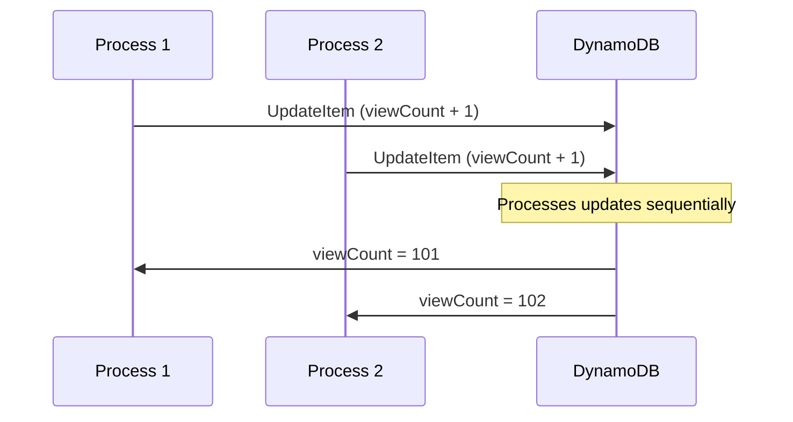

# How to Use DynamoDB Atomic Counters

Author: [nawazdhandala](https://github.com/nawazdhandala)

Tags: AWS, DynamoDB, Atomic Operations, Concurrency

Description: Implement thread-safe counters in DynamoDB using atomic increment and decrement operations, with patterns for view counts, inventory, and rate limiting.

---

Counting things sounds simple until you have hundreds of concurrent processes trying to update the same number. The classic read-modify-write pattern breaks under concurrency - two processes read the value 100, both increment to 101, and you've lost a count. DynamoDB's atomic counters solve this by performing the increment in a single, atomic operation.

## What Makes a Counter Atomic

An atomic counter uses DynamoDB's UpdateItem with an arithmetic expression. The increment happens on the server side, so there's no gap between reading and writing:

```javascript
const AWS = require('aws-sdk');
const docClient = new AWS.DynamoDB.DocumentClient();

// Atomically increment a page view counter
async function incrementViewCount(pageId) {
  const params = {
    TableName: 'PageViews',
    Key: { pageId },
    UpdateExpression: 'SET viewCount = if_not_exists(viewCount, :zero) + :inc',
    ExpressionAttributeValues: {
      ':inc': 1,
      ':zero': 0
    },
    ReturnValues: 'UPDATED_NEW'
  };

  const result = await docClient.update(params).promise();
  return result.Attributes.viewCount;
}
```

The `if_not_exists(viewCount, :zero)` handles the case where the item or attribute doesn't exist yet. It starts from 0 on the first call. Every subsequent call increments by 1, regardless of how many processes are running simultaneously.

## How It Works Internally

When DynamoDB processes an atomic update, it:

1. Acquires a lock on the item
2. Reads the current value
3. Applies the arithmetic
4. Writes the new value
5. Releases the lock

All of this happens in a single API call. There's no window where another process can sneak in a conflicting write.



Both increments are applied. No count is lost.

## Basic Increment and Decrement

Here are the fundamental operations:

```javascript
// Increment by any amount
async function incrementCounter(tableName, key, attribute, amount) {
  const params = {
    TableName: tableName,
    Key: key,
    UpdateExpression: `SET #attr = if_not_exists(#attr, :zero) + :amount`,
    ExpressionAttributeNames: { '#attr': attribute },
    ExpressionAttributeValues: {
      ':amount': amount,
      ':zero': 0
    },
    ReturnValues: 'UPDATED_NEW'
  };

  const result = await docClient.update(params).promise();
  return result.Attributes[attribute];
}

// Decrement (just use a negative number)
async function decrementCounter(tableName, key, attribute, amount) {
  return incrementCounter(tableName, key, attribute, -amount);
}

// Usage examples
await incrementCounter('Metrics', { metricId: 'signups' }, 'count', 1);
await incrementCounter('Metrics', { metricId: 'revenue' }, 'total', 49.99);
await decrementCounter('Products', { productId: 'prod-1' }, 'stock', 1);
```

## Using ADD for Atomic Counters

The ADD action also works for atomic increments and is slightly more concise:

```javascript
// ADD creates the attribute if it doesn't exist (starts at 0)
async function incrementWithAdd(pageId) {
  const params = {
    TableName: 'PageViews',
    Key: { pageId },
    UpdateExpression: 'ADD viewCount :inc',
    ExpressionAttributeValues: {
      ':inc': 1
    },
    ReturnValues: 'UPDATED_NEW'
  };

  const result = await docClient.update(params).promise();
  return result.Attributes.viewCount;
}
```

The difference between `SET` and `ADD`:
- `SET` with `if_not_exists` gives you more control over the initial value and expression
- `ADD` is shorter and auto-creates the attribute starting from the increment value

Both are atomic. Use whichever reads better in your code.

## Real-World Patterns

### Page View Counter

Track views for blog posts or product pages:

```javascript
// Increment view count and return the new total
async function trackPageView(pageId, userId) {
  // Increment the global counter
  const viewCount = await incrementCounter(
    'Pages', { pageId }, 'viewCount', 1
  );

  // Optionally track unique views with a set
  await docClient.update({
    TableName: 'Pages',
    Key: { pageId },
    UpdateExpression: 'ADD uniqueViewers :viewer',
    ExpressionAttributeValues: {
      ':viewer': docClient.createSet([userId])
    }
  }).promise();

  return viewCount;
}
```

### Inventory Management

Track stock levels with safe decrement:

```javascript
// Decrease stock with a floor of zero
async function decreaseStock(productId, quantity) {
  const params = {
    TableName: 'Products',
    Key: { productId },
    UpdateExpression: 'SET stock = stock - :qty',
    ConditionExpression: 'stock >= :qty',
    ExpressionAttributeValues: {
      ':qty': quantity
    },
    ReturnValues: 'UPDATED_NEW'
  };

  try {
    const result = await docClient.update(params).promise();
    return {
      success: true,
      remainingStock: result.Attributes.stock
    };
  } catch (error) {
    if (error.code === 'ConditionalCheckFailedException') {
      return { success: false, reason: 'Insufficient stock' };
    }
    throw error;
  }
}
```

The condition expression prevents stock from going negative. This combines atomic counters with conditional writes for a robust inventory system.

### Rate Limiting

Implement API rate limiting with atomic counters:

```javascript
// Check and increment a rate limit counter
async function checkRateLimit(userId, maxRequests, windowSeconds) {
  // Use a time-bucketed key for the rate limit window
  const windowStart = Math.floor(Date.now() / 1000 / windowSeconds) * windowSeconds;
  const key = { userId, windowStart };

  const params = {
    TableName: 'RateLimits',
    Key: key,
    UpdateExpression: 'SET requestCount = if_not_exists(requestCount, :zero) + :one, #ttl = :ttl',
    ConditionExpression: 'attribute_not_exists(requestCount) OR requestCount < :max',
    ExpressionAttributeNames: { '#ttl': 'ttl' },
    ExpressionAttributeValues: {
      ':one': 1,
      ':zero': 0,
      ':max': maxRequests,
      ':ttl': windowStart + windowSeconds + 60  // TTL for auto-cleanup
    },
    ReturnValues: 'UPDATED_NEW'
  };

  try {
    const result = await docClient.update(params).promise();
    return {
      allowed: true,
      remaining: maxRequests - result.Attributes.requestCount
    };
  } catch (error) {
    if (error.code === 'ConditionalCheckFailedException') {
      return { allowed: false, remaining: 0 };
    }
    throw error;
  }
}

// Usage: allow 100 requests per 60-second window
const result = await checkRateLimit('user-001', 100, 60);
```

### Like/Unlike Toggle

Track likes with an atomic counter and a set of user IDs:

```javascript
// Toggle a like - add if not liked, remove if already liked
async function toggleLike(postId, userId) {
  // First, try to add the like
  try {
    await docClient.update({
      TableName: 'Posts',
      Key: { postId },
      UpdateExpression: 'ADD likeCount :one, likedBy :user',
      ConditionExpression: 'NOT contains(likedBy, :userId)',
      ExpressionAttributeValues: {
        ':one': 1,
        ':user': docClient.createSet([userId]),
        ':userId': userId
      }
    }).promise();
    return { action: 'liked' };
  } catch (error) {
    if (error.code !== 'ConditionalCheckFailedException') throw error;
  }

  // If already liked, remove the like
  await docClient.update({
    TableName: 'Posts',
    Key: { postId },
    UpdateExpression: 'SET likeCount = likeCount - :one DELETE likedBy :user',
    ExpressionAttributeValues: {
      ':one': 1,
      ':user': docClient.createSet([userId])
    }
  }).promise();
  return { action: 'unliked' };
}
```

## Multiple Counters in One Update

You can update several counters atomically in a single operation:

```javascript
// Update multiple stats at once
async function recordPurchase(productId, amount) {
  const params = {
    TableName: 'Products',
    Key: { productId },
    UpdateExpression: `
      SET stock = stock - :one,
          totalRevenue = if_not_exists(totalRevenue, :zero) + :amount,
          lastPurchaseAt = :now
      ADD purchaseCount :one
    `,
    ExpressionAttributeValues: {
      ':one': 1,
      ':zero': 0,
      ':amount': amount,
      ':now': new Date().toISOString()
    },
    ReturnValues: 'ALL_NEW'
  };

  return (await docClient.update(params).promise()).Attributes;
}
```

## Limitations and Trade-offs

Atomic counters are eventually consistent by default. If you write an increment and immediately read the item, you might see the old value. Use `ConsistentRead: true` on GetItem if you need the latest value right after an update.

Atomic counters don't support conditional arithmetic in a single expression. You can't say "increment by 1 if less than 100" purely with SET arithmetic. You need a separate ConditionExpression for that.

High-throughput counters on a single item can create hot partitions. If you're counting millions of events per second on a single counter, look into write sharding. Split the counter across multiple items and sum them when reading. See our post on [DynamoDB write sharding](https://oneuptime.com/blog/post/2026-02-12-dynamodb-write-sharding/view) for that pattern.

## Monitoring Counter Performance

When counters are critical to your business logic (inventory, rate limits, billing), monitor them closely. Track update latency and throttling rates. A throttled counter update in your checkout flow means a lost sale. Set up alerts through [OneUptime](https://oneuptime.com/blog/post/aws-cloudwatch-alarms/view) to catch throttling before it impacts users.

## Wrapping Up

Atomic counters in DynamoDB are simple to implement but powerful in practice. Use `SET ... + :value` or `ADD` for thread-safe increments. Combine them with condition expressions for bounded counters like inventory or rate limits. Remember that a single item counter has throughput limits - if you need massive write throughput on a single logical counter, shard it across multiple items. For most use cases though, a straightforward atomic counter is all you need. It's one of those patterns that just works, reliably, at any scale.
