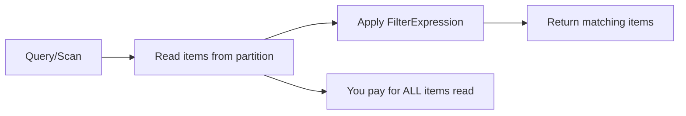

# How to Use DynamoDB FilterExpressions

Author: [nawazdhandala](https://github.com/nawazdhandala)

Tags: AWS, DynamoDB, Query, Filtering

Description: Learn how DynamoDB FilterExpressions work, their limitations on cost and performance, and best practices for filtering data efficiently.

---

FilterExpressions in DynamoDB are one of those features that look helpful on the surface but can quietly destroy your performance if you don't understand how they work under the hood. They feel like a SQL WHERE clause, but they behave very differently.

The critical thing to understand: FilterExpressions are applied after DynamoDB reads the data, not before. You still pay for every item that was read, even if the filter removes 99% of them.

## How FilterExpressions Work

When you run a Query or Scan with a FilterExpression, here's what happens:



Step 1: DynamoDB reads items based on your key condition (for Query) or the entire table (for Scan).
Step 2: DynamoDB applies the FilterExpression to each read item.
Step 3: Only matching items are returned to you.

The billing is based on Step 1, not Step 3.

## Basic FilterExpression Syntax

Here's a simple example:

```javascript
const AWS = require('aws-sdk');
const docClient = new AWS.DynamoDB.DocumentClient();

// Get orders for a customer, but only those over $50
async function getHighValueOrders(customerId) {
  const params = {
    TableName: 'Orders',
    KeyConditionExpression: 'customerId = :cid',
    FilterExpression: 'orderAmount > :minAmount',
    ExpressionAttributeValues: {
      ':cid': customerId,
      ':minAmount': 50
    }
  };

  const result = await docClient.query(params).promise();
  console.log(`Returned: ${result.Count}, Read: ${result.ScannedCount}`);
  return result.Items;
}
```

If the customer has 200 orders and 30 are over $50, `Count` is 30 and `ScannedCount` is 200. You consumed RCUs for 200 items.

## Comparison Operators

FilterExpressions support a rich set of operators:

```javascript
// Equal
FilterExpression: 'category = :cat'

// Not equal
FilterExpression: 'category <> :cat'

// Less than / greater than
FilterExpression: 'price < :maxPrice'
FilterExpression: 'price > :minPrice'
FilterExpression: 'price <= :maxPrice'
FilterExpression: 'price >= :minPrice'

// Between
FilterExpression: 'price BETWEEN :low AND :high'

// Exists / not exists
FilterExpression: 'attribute_exists(email)'
FilterExpression: 'attribute_not_exists(deletedAt)'

// Contains (substring match for strings, membership for sets)
FilterExpression: 'contains(tags, :tag)'

// Begins with
FilterExpression: 'begins_with(#name, :prefix)'

// In (check if value is in a list)
FilterExpression: '#status IN (:s1, :s2, :s3)'

// Size (attribute length)
FilterExpression: 'size(comments) > :minComments'
```

## Combining Conditions

Use `AND`, `OR`, and `NOT` to build complex filters:

```javascript
// Multiple conditions with AND/OR
async function searchOrders(customerId) {
  const params = {
    TableName: 'Orders',
    KeyConditionExpression: 'customerId = :cid',
    FilterExpression: '(#status = :shipped OR #status = :delivered) AND orderAmount > :minAmount',
    ExpressionAttributeNames: {
      '#status': 'status'  // 'status' is a reserved word
    },
    ExpressionAttributeValues: {
      ':cid': customerId,
      ':shipped': 'shipped',
      ':delivered': 'delivered',
      ':minAmount': 100
    }
  };

  return (await docClient.query(params).promise()).Items;
}
```

Use parentheses to control evaluation order. `AND` has higher precedence than `OR`, just like in most programming languages.

## Working with Nested Attributes

DynamoDB supports filtering on nested attributes using dot notation:

```javascript
// Filter on nested map attributes
async function getOrdersWithDiscount(customerId) {
  const params = {
    TableName: 'Orders',
    KeyConditionExpression: 'customerId = :cid',
    FilterExpression: 'pricing.discount > :minDiscount',
    ExpressionAttributeValues: {
      ':cid': customerId,
      ':minDiscount': 0.1
    }
  };

  return (await docClient.query(params).promise()).Items;
}

// Filter on deeply nested attributes
const params = {
  TableName: 'Orders',
  KeyConditionExpression: 'customerId = :cid',
  FilterExpression: 'shipping.address.country = :country',
  ExpressionAttributeValues: {
    ':cid': customerId,
    ':country': 'US'
  }
};
```

## Filtering on Lists and Sets

You can check membership in sets and search within lists:

```javascript
// Check if a string set contains a value
const params = {
  TableName: 'Products',
  KeyConditionExpression: 'categoryId = :cat',
  FilterExpression: 'contains(tags, :tag)',
  ExpressionAttributeValues: {
    ':cat': 'electronics',
    ':tag': 'wireless'
  }
};

// Check list size
const params2 = {
  TableName: 'Posts',
  KeyConditionExpression: 'authorId = :author',
  FilterExpression: 'size(comments) >= :minComments',
  ExpressionAttributeValues: {
    ':author': 'user-001',
    ':minComments': 5
  }
};
```

## Reserved Words

DynamoDB has a long list of reserved words (status, name, year, data, count, etc.). When your attribute names clash with reserved words, use ExpressionAttributeNames:

```javascript
// These attributes are reserved words and need aliases
const params = {
  TableName: 'Events',
  KeyConditionExpression: 'eventType = :type',
  FilterExpression: '#status = :active AND #name <> :empty AND #year = :currentYear',
  ExpressionAttributeNames: {
    '#status': 'status',
    '#name': 'name',
    '#year': 'year'
  },
  ExpressionAttributeValues: {
    ':type': 'conference',
    ':active': 'active',
    ':empty': '',
    ':currentYear': 2026
  }
};
```

It's good practice to always use ExpressionAttributeNames for attribute names, even if they aren't reserved. It prevents surprises when AWS adds new reserved words.

## The Performance Trap

Here's where most people get tripped up. Consider this scenario:

```javascript
// This looks reasonable but might be expensive
async function getActiveUsersInCity(city) {
  const params = {
    TableName: 'Users',
    // No KeyConditionExpression - this is a Scan!
    FilterExpression: '#status = :active AND city = :city',
    ExpressionAttributeNames: { '#status': 'status' },
    ExpressionAttributeValues: {
      ':active': 'active',
      ':city': city
    }
  };

  return (await docClient.scan(params).promise()).Items;
}
```

This scans the entire Users table. If you have 10 million users and 500 are active in the given city, you read 10 million items and return 500. The FilterExpression doesn't make the scan cheaper - it just makes the response smaller.

**The fix:** Create a GSI with `city` as the partition key and `status` as the sort key:

```javascript
// Much better - uses a GSI to narrow the read
async function getActiveUsersInCity(city) {
  const params = {
    TableName: 'Users',
    IndexName: 'city-status-index',
    KeyConditionExpression: 'city = :city AND #status = :active',
    ExpressionAttributeNames: { '#status': 'status' },
    ExpressionAttributeValues: {
      ':active': 'active',
      ':city': city
    }
  };

  return (await docClient.query(params).promise()).Items;
}
```

## When FilterExpressions Are Actually Useful

Despite their limitations, FilterExpressions have their place:

**1. Filtering within a well-scoped Query:**
```javascript
// Query already narrows to one customer's orders
// Filter removes a small percentage - acceptable cost
const params = {
  TableName: 'Orders',
  KeyConditionExpression: 'customerId = :cid AND orderDate >= :start',
  FilterExpression: 'orderAmount > :min AND #status <> :cancelled',
  ExpressionAttributeNames: { '#status': 'status' },
  ExpressionAttributeValues: {
    ':cid': 'cust-001',
    ':start': '2026-01-01',
    ':min': 25,
    ':cancelled': 'cancelled'
  }
};
```

**2. Checking for attribute existence:**
```javascript
// Only return items that have a specific optional attribute
FilterExpression: 'attribute_exists(phoneNumber)'
```

**3. Soft deletes:**
```javascript
// Exclude soft-deleted items
FilterExpression: 'attribute_not_exists(deletedAt)'
```

## Pagination Gotcha with Filters

Filters interact with pagination in a surprising way. If you set `Limit: 10` and have a FilterExpression, DynamoDB reads 10 items, applies the filter, and might return fewer than 10 (or even zero) items. But there could still be more data to paginate through.

```javascript
// This might return 0 items even if matching items exist!
const params = {
  TableName: 'Orders',
  KeyConditionExpression: 'customerId = :cid',
  FilterExpression: 'orderAmount > :high',
  ExpressionAttributeValues: {
    ':cid': 'cust-001',
    ':high': 10000
  },
  Limit: 10  // Reads 10, filters, might return 0
};
```

To reliably get a specific number of results with filters, keep paginating until you have enough:

```javascript
// Reliably get at least N filtered results
async function getFilteredResults(customerId, targetCount) {
  let items = [];
  let lastKey = undefined;

  while (items.length < targetCount) {
    const params = {
      TableName: 'Orders',
      KeyConditionExpression: 'customerId = :cid',
      FilterExpression: 'orderAmount > :high',
      ExpressionAttributeValues: {
        ':cid': customerId,
        ':high': 10000
      },
      Limit: 100,
      ExclusiveStartKey: lastKey
    };

    const result = await docClient.query(params).promise();
    items = items.concat(result.Items);
    lastKey = result.LastEvaluatedKey;

    if (!lastKey) break;  // No more data
  }

  return items.slice(0, targetCount);
}
```

## Monitoring Filter Efficiency

Track the ratio of `Count` to `ScannedCount` to understand filter efficiency:

```javascript
const result = await docClient.query(params).promise();
const efficiency = result.ScannedCount > 0
  ? (result.Count / result.ScannedCount * 100).toFixed(1)
  : 100;

if (efficiency < 50) {
  console.warn(`Low filter efficiency: ${efficiency}% - consider adding a GSI`);
}
```

Set up monitoring with [OneUptime](https://oneuptime.com/blog/post/aws-cloudwatch-alarms/view) to alert on queries where filter efficiency drops below a threshold, so you can add indexes before performance degrades.

## Wrapping Up

FilterExpressions are a post-processing step, not a query optimization. They reduce the size of the response but not the cost of the read. Use them for fine-grained filtering within well-scoped queries. If you find yourself filtering out more than half of the read items, that's a strong signal to create a GSI or rethink your key design. The goal is to push as much filtering as possible into your key conditions, where DynamoDB can be truly efficient.
