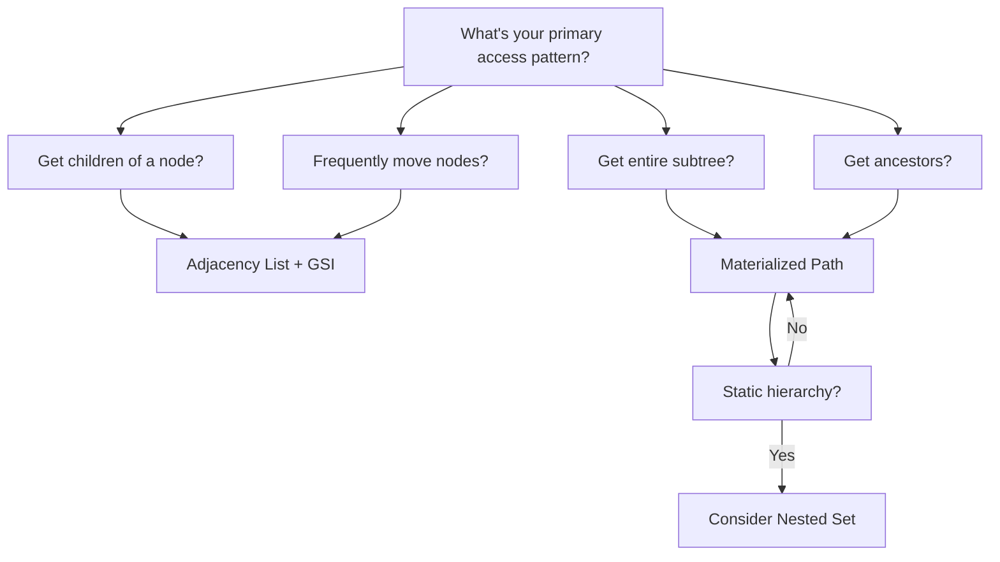

# How to Model Hierarchical Data in DynamoDB

Author: [nawazdhandala](https://github.com/nawazdhandala)

Tags: AWS, DynamoDB, Data Modeling, NoSQL

Description: Learn techniques for modeling tree structures and hierarchical data in DynamoDB, including adjacency lists, composite sort keys, and materialized paths.

---

Hierarchical data is everywhere: organizational charts, file systems, product categories, comment threads, geographic regions. In a relational database, you'd use self-referencing foreign keys or recursive CTEs. DynamoDB doesn't have joins or recursion, so you need different strategies.

The good news is that DynamoDB's flexible schema and fast key-based lookups actually work well for hierarchical data, as long as you design your model around your access patterns.

## Common Hierarchy Access Patterns

Before picking a model, list what you need to do:

1. Get an item and all its children
2. Get an item and all its ancestors (breadcrumb trail)
3. Get all descendants of an item (entire subtree)
4. Move an item to a different parent
5. Get all items at a specific depth

Not every model supports all patterns equally. Pick the one that serves your most important queries.

## Pattern 1: Adjacency List

The adjacency list is the most intuitive model. Each item stores a reference to its parent:

```javascript
// Table: Categories
// Partition key: categoryId
// Attributes: parentId, name, depth

const categories = [
  { categoryId: 'root', parentId: null, name: 'All Products', depth: 0 },
  { categoryId: 'electronics', parentId: 'root', name: 'Electronics', depth: 1 },
  { categoryId: 'computers', parentId: 'electronics', name: 'Computers', depth: 2 },
  { categoryId: 'laptops', parentId: 'computers', name: 'Laptops', depth: 3 },
  { categoryId: 'desktops', parentId: 'computers', name: 'Desktops', depth: 3 },
  { categoryId: 'phones', parentId: 'electronics', name: 'Phones', depth: 2 }
];
```

To get direct children, create a GSI on `parentId`:

```javascript
const AWS = require('aws-sdk');
const docClient = new AWS.DynamoDB.DocumentClient();

// Get all direct children of a category
async function getChildren(parentId) {
  const params = {
    TableName: 'Categories',
    IndexName: 'parentId-index',
    KeyConditionExpression: 'parentId = :pid',
    ExpressionAttributeValues: { ':pid': parentId }
  };

  return (await docClient.query(params).promise()).Items;
}

// Get the full path from root to a node (ancestors)
async function getAncestors(categoryId) {
  const path = [];
  let current = categoryId;

  while (current) {
    const item = await docClient.get({
      TableName: 'Categories',
      Key: { categoryId: current }
    }).promise();

    if (!item.Item) break;
    path.unshift(item.Item);
    current = item.Item.parentId;
  }

  return path;
}
```

**Pros:** Simple to understand, easy to move nodes (just update parentId).
**Cons:** Getting ancestors requires multiple queries. Getting all descendants requires recursive queries.

## Pattern 2: Materialized Path

Store the full path from root to each node as an attribute. This makes ancestor queries trivial:

```javascript
// Each item stores its full path
const items = [
  { id: 'root', path: 'root', name: 'All Products' },
  { id: 'electronics', path: 'root#electronics', name: 'Electronics' },
  { id: 'computers', path: 'root#electronics#computers', name: 'Computers' },
  { id: 'laptops', path: 'root#electronics#computers#laptops', name: 'Laptops' },
  { id: 'desktops', path: 'root#electronics#computers#desktops', name: 'Desktops' }
];
```

Now use `begins_with` to find all descendants:

```javascript
// Get all items under electronics (using path prefix)
async function getDescendants(ancestorPath) {
  const params = {
    TableName: 'Categories',
    IndexName: 'path-index',
    KeyConditionExpression: 'begins_with(#path, :prefix)',
    ExpressionAttributeNames: { '#path': 'path' },
    ExpressionAttributeValues: { ':prefix': ancestorPath }
  };

  // Note: begins_with on a GSI partition key doesn't work directly
  // Instead, use the path as a sort key with a fixed partition key
  return (await docClient.query(params).promise()).Items;
}
```

A better design uses a fixed partition key with the path as the sort key:

```javascript
// Table design: pk = "CATEGORY", sk = path
// This lets begins_with work on the sort key

async function getSubtree(pathPrefix) {
  const params = {
    TableName: 'Categories',
    KeyConditionExpression: 'pk = :pk AND begins_with(sk, :prefix)',
    ExpressionAttributeValues: {
      ':pk': 'CATEGORY',
      ':prefix': pathPrefix
    }
  };

  return (await docClient.query(params).promise()).Items;
}

// Get all items under electronics
const electronics = await getSubtree('root#electronics');
// Returns: electronics, computers, laptops, desktops, phones
```

**Pros:** Efficient subtree queries with `begins_with`. Ancestor path is embedded in each item.
**Cons:** Moving a node requires updating the path of all descendants. Long paths for deep hierarchies.

## Pattern 3: Composite Sort Key with Entity Types

This single-table design stores parent-child relationships as items:

```javascript
// Single table design for hierarchy
// pk: NODE#{nodeId}
// sk: varies by relationship type

const items = [
  // Node metadata
  { pk: 'NODE#electronics', sk: 'META', name: 'Electronics', depth: 1 },
  { pk: 'NODE#computers', sk: 'META', name: 'Computers', depth: 2 },

  // Parent relationships (child points to parent)
  { pk: 'NODE#computers', sk: 'PARENT#electronics', parentId: 'electronics' },
  { pk: 'NODE#laptops', sk: 'PARENT#computers', parentId: 'computers' },

  // Child relationships (parent lists children)
  { pk: 'NODE#electronics', sk: 'CHILD#computers', childId: 'computers' },
  { pk: 'NODE#electronics', sk: 'CHILD#phones', childId: 'phones' },
  { pk: 'NODE#computers', sk: 'CHILD#laptops', childId: 'laptops' },
  { pk: 'NODE#computers', sk: 'CHILD#desktops', childId: 'desktops' }
];
```

This supports multiple access patterns in a single query:

```javascript
// Get a node and all its children in one query
async function getNodeWithChildren(nodeId) {
  const params = {
    TableName: 'HierarchyTable',
    KeyConditionExpression: 'pk = :pk AND (sk = :meta OR begins_with(sk, :childPrefix))',
    ExpressionAttributeValues: {
      ':pk': `NODE#${nodeId}`,
      ':meta': 'META',
      ':childPrefix': 'CHILD#'
    }
  };

  // DynamoDB doesn't support OR in KeyConditionExpression
  // So query without sort key condition and filter, or do two queries
  const allItems = await docClient.query({
    TableName: 'HierarchyTable',
    KeyConditionExpression: 'pk = :pk',
    ExpressionAttributeValues: { ':pk': `NODE#${nodeId}` }
  }).promise();

  const meta = allItems.Items.find(i => i.sk === 'META');
  const children = allItems.Items.filter(i => i.sk.startsWith('CHILD#'));
  const parent = allItems.Items.find(i => i.sk.startsWith('PARENT#'));

  return { node: meta, children, parent };
}
```

**Pros:** All relationships for a node in one query. Flexible for adding new relationship types.
**Cons:** More items per node. Writing a node with relationships requires multiple puts.

## Pattern 4: Nested Set Model

The nested set model assigns left and right numbers to each node during a tree traversal. Finding descendants becomes a range query:

```javascript
// Nested set numbering via depth-first traversal
//     root (1, 12)
//    /          \
// elec (2, 9)  clothing (10, 11)
//   /      \
// comp (3,6) phones (7,8)
//  /    \
// lap(4,5)

const nodes = [
  { id: 'root', lft: 1, rgt: 12, depth: 0 },
  { id: 'electronics', lft: 2, rgt: 9, depth: 1 },
  { id: 'computers', lft: 3, rgt: 6, depth: 2 },
  { id: 'laptops', lft: 4, rgt: 5, depth: 3 },
  { id: 'phones', lft: 7, rgt: 8, depth: 2 },
  { id: 'clothing', lft: 10, rgt: 11, depth: 1 }
];
```

Finding all descendants of "electronics" (lft=2, rgt=9):

```javascript
// Query all nodes where lft > 2 AND rgt < 9
async function getDescendants(nodeId) {
  // First, get the node's lft and rgt values
  const node = await docClient.get({
    TableName: 'NestedSets',
    Key: { id: nodeId }
  }).promise();

  const { lft, rgt } = node.Item;

  // Query using a GSI where lft is the sort key
  const params = {
    TableName: 'NestedSets',
    IndexName: 'tree-index',
    KeyConditionExpression: 'treeId = :tree AND lft BETWEEN :left AND :right',
    ExpressionAttributeValues: {
      ':tree': 'main',
      ':left': lft + 1,
      ':right': rgt - 1
    }
  };

  return (await docClient.query(params).promise()).Items;
}
```

**Pros:** Single query gets entire subtree. Efficient ancestor checks.
**Cons:** Inserting or moving nodes requires renumbering. Not great for frequently changing hierarchies.

## Choosing the Right Pattern



- **Adjacency List** - simplest, best when you mainly query direct children and need to move nodes
- **Materialized Path** - best for subtree queries and breadcrumbs on relatively stable hierarchies
- **Composite Sort Key** - best for single-table designs where you need node metadata and relationships together
- **Nested Set** - best for read-heavy, rarely-changing hierarchies where you need fast subtree queries

## Handling Deep Hierarchies

DynamoDB has a 400KB item size limit and a 1024-byte sort key limit. For very deep hierarchies, materialized paths can exceed these limits.

If paths get too long, consider storing only the last N levels and using a lookup for deeper ancestry:

```javascript
// Truncated path with ancestry lookup
const item = {
  id: 'deep-node',
  path: 'level5#level6#level7#deep-node', // Last 4 levels
  rootPath: 'root#level1#level2#level3#level4', // Path to connect
  depth: 8
};
```

## Monitoring Hierarchy Queries

Complex hierarchy queries can consume significant read capacity, especially when fetching entire subtrees. Monitor your DynamoDB consumed capacity and query latency with [OneUptime](https://oneuptime.com/blog/post/2026-02-06-aws-cloudwatch-logs-exporter-opentelemetry-collector/view) to ensure your hierarchy model scales with your data growth.

## Wrapping Up

Hierarchical data in DynamoDB requires deliberate modeling. There's no single best approach - it depends entirely on how you access the data. Start with your access patterns, pick the model that serves the most important ones efficiently, and accept trade-offs on the less common patterns. The adjacency list is the safest starting point for most applications. Move to materialized paths or nested sets when your subtree query patterns demand it.
