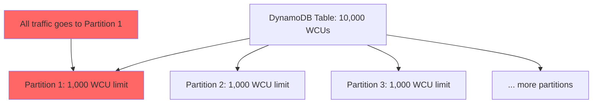

# How to Handle DynamoDB Hot Partitions

Author: [nawazdhandala](https://github.com/nawazdhandala)

Tags: AWS, DynamoDB, Performance, Scaling

Description: Identify, diagnose, and fix DynamoDB hot partition problems with practical strategies including write sharding, caching, and key redesign.

---

You've got a DynamoDB table with plenty of provisioned capacity, but your app keeps getting throttled. The CloudWatch metrics show that overall consumption is well below your limits. What gives? Welcome to the hot partition problem - one of the most frustrating issues in DynamoDB.

A hot partition happens when a disproportionate amount of traffic hits a single partition. Since each partition has its own throughput limit (3,000 RCUs and 1,000 WCUs), no amount of table-level capacity can fix a hot partition.

## Understanding Partitions

DynamoDB distributes your data across partitions based on the hash of your partition key. Each partition is an independent unit with its own storage and throughput:



DynamoDB has adaptive capacity that can burst beyond the per-partition limit temporarily, but sustained hot traffic overwhelms it.

## Symptoms of Hot Partitions

Here's how to tell if you have a hot partition problem:

1. **Throttling despite available capacity** - your table is throttling at 30% of provisioned capacity
2. **Uneven metric distribution** - CloudWatch shows spiky consumed capacity
3. **Specific operations failing** - writes to certain keys fail while others succeed
4. **`ProvisionedThroughputExceededException`** on specific items

## Diagnosing Hot Partitions

### Step 1: Enable Contributor Insights

DynamoDB Contributor Insights shows you the most accessed partition keys:

```bash
# Enable contributor insights
aws dynamodb update-contributor-insights \
  --table-name Orders \
  --contributor-insights-action ENABLE
```

After enabling it, check the results:

```bash
# View the most accessed keys
aws dynamodb describe-contributor-insights \
  --table-name Orders
```

In the CloudWatch console, you'll see graphs like "Most accessed items" and "Most throttled items."

### Step 2: Check CloudWatch Metrics

Look at these metrics at the partition level:

```python
import boto3

cloudwatch = boto3.client('cloudwatch')

# Get throttled write events
response = cloudwatch.get_metric_statistics(
    Namespace='AWS/DynamoDB',
    MetricName='WriteThrottleEvents',
    Dimensions=[
        {'Name': 'TableName', 'Value': 'Orders'}
    ],
    StartTime='2026-02-11T00:00:00Z',
    EndTime='2026-02-12T00:00:00Z',
    Period=300,  # 5 minute intervals
    Statistics=['Sum']
)

for point in sorted(response['Datapoints'], key=lambda x: x['Timestamp']):
    if point['Sum'] > 0:
        print(f"{point['Timestamp']}: {point['Sum']} throttled writes")
```

### Step 3: Analyze Your Access Patterns

Examine your code to identify which partition keys receive the most traffic. Common culprits:

- Status fields as partition keys ("active" gets 90% of traffic)
- Date-based keys (today's date gets all current writes)
- Popular items (viral product, celebrity user)
- Global counters (single item updated by every request)

## Fix 1: Redesign the Partition Key

The most effective fix is choosing a better partition key. The goal is high cardinality with even distribution.

**Before (hot):**
```
Partition key: status = "active"  -> 90% of all items
Partition key: status = "inactive" -> 10% of all items
```

**After (distributed):**
```
Partition key: userId  -> millions of unique values
GSI with status as partition key for status-based queries
```

If you need to query by status, create a GSI rather than using status as the primary partition key. For more on key selection, see our post on [choosing the right partition key](https://oneuptime.com/blog/post/2026-02-12-dynamodb-partition-key/view).

## Fix 2: Write Sharding

When you can't change the partition key design, write sharding distributes traffic across multiple partitions artificially:

```javascript
// Write sharding: append a random suffix to spread writes
const SHARD_COUNT = 10;

function getShardedKey(baseKey) {
  const shard = Math.floor(Math.random() * SHARD_COUNT);
  return `${baseKey}#${shard}`;
}

// Write to a random shard
async function incrementGlobalCounter(counterName, amount) {
  const shardedKey = getShardedKey(counterName);

  await docClient.update({
    TableName: 'Counters',
    Key: { counterId: shardedKey },
    UpdateExpression: 'ADD #count :amount',
    ExpressionAttributeNames: { '#count': 'count' },
    ExpressionAttributeValues: { ':amount': amount }
  }).promise();
}

// Read requires fetching all shards and summing
async function getGlobalCounter(counterName) {
  const promises = [];

  for (let i = 0; i < SHARD_COUNT; i++) {
    promises.push(
      docClient.get({
        TableName: 'Counters',
        Key: { counterId: `${counterName}#${i}` }
      }).promise()
    );
  }

  const results = await Promise.all(promises);
  return results.reduce((sum, r) => sum + (r.Item?.count || 0), 0);
}
```

Writes are 10x more distributed. Reads are 10x more work. This trade-off is usually worth it when writes are the bottleneck. For a deeper dive, check out our post on [DynamoDB write sharding](https://oneuptime.com/blog/post/2026-02-12-dynamodb-write-sharding/view).

## Fix 3: Caching

If reads are causing the hot partition, put a cache in front of DynamoDB:

```javascript
const NodeCache = require('node-cache');
const cache = new NodeCache({ stdTTL: 60 }); // 60-second cache

async function getPopularItem(itemId) {
  // Check cache first
  const cached = cache.get(itemId);
  if (cached) return cached;

  // Cache miss - fetch from DynamoDB
  const result = await docClient.get({
    TableName: 'Items',
    Key: { itemId }
  }).promise();

  // Store in cache
  cache.set(itemId, result.Item);
  return result.Item;
}
```

For a more robust caching layer, use DynamoDB Accelerator (DAX):

```javascript
const AmazonDaxClient = require('amazon-dax-client');

// DAX client drops in as a replacement for the DynamoDB client
const dax = new AmazonDaxClient({
  endpoints: ['dax-cluster.abc123.dax-clusters.us-east-1.amazonaws.com:8111'],
  region: 'us-east-1'
});

const daxDocClient = new AWS.DynamoDB.DocumentClient({ service: dax });

// Same API as regular DynamoDB, but reads go through the cache
const result = await daxDocClient.get({
  TableName: 'Items',
  Key: { itemId: 'popular-item' }
}).promise();
```

DAX handles cache invalidation automatically. When an item is updated through DAX, the cache is updated too.

## Fix 4: Time-Based Bucketing

For time-series data where the "current" bucket gets all the traffic:

```javascript
// Instead of one partition for today, use hourly buckets
function getTimeBucket() {
  const now = new Date();
  const hour = now.toISOString().slice(0, 13); // "2026-02-12T14"
  return hour;
}

// Write to the current hour bucket
async function logEvent(eventType, data) {
  await docClient.put({
    TableName: 'Events',
    Item: {
      partitionKey: `${eventType}#${getTimeBucket()}`,
      sortKey: `${Date.now()}#${Math.random().toString(36).slice(2)}`,
      data: data
    }
  }).promise();
}
```

Hourly buckets spread writes across 24 partitions per day instead of 1.

## Fix 5: Batch and Buffer Writes

If your application generates bursts of writes, buffer them and write in batches:

```javascript
class WriteBuffer {
  constructor(tableName, flushInterval = 1000, maxBatchSize = 25) {
    this.tableName = tableName;
    this.buffer = [];
    this.maxBatchSize = maxBatchSize;

    // Flush periodically
    setInterval(() => this.flush(), flushInterval);
  }

  add(item) {
    this.buffer.push(item);
    if (this.buffer.length >= this.maxBatchSize) {
      this.flush();
    }
  }

  async flush() {
    if (this.buffer.length === 0) return;

    const items = this.buffer.splice(0, this.maxBatchSize);
    const params = {
      RequestItems: {
        [this.tableName]: items.map(item => ({
          PutRequest: { Item: item }
        }))
      }
    };

    try {
      await docClient.batchWrite(params).promise();
    } catch (error) {
      console.error('Batch write failed:', error);
      // Put items back for retry
      this.buffer.unshift(...items);
    }
  }
}
```

Buffering smooths out write spikes and helps DynamoDB's adaptive capacity keep up.

## Monitoring and Alerting

Set up proactive monitoring so you catch hot partitions before they cause user-facing issues:

```bash
# CloudWatch alarm for throttled requests
aws cloudwatch put-metric-alarm \
  --alarm-name "DynamoDB-Throttling-Orders" \
  --metric-name WriteThrottleEvents \
  --namespace AWS/DynamoDB \
  --dimensions Name=TableName,Value=Orders \
  --statistic Sum \
  --period 300 \
  --threshold 10 \
  --comparison-operator GreaterThanThreshold \
  --evaluation-periods 2 \
  --alarm-actions "arn:aws:sns:us-east-1:123456789:alerts"
```

For comprehensive monitoring across all your DynamoDB tables, [OneUptime](https://oneuptime.com/blog/post/aws-cloudwatch-alarms/view) can aggregate throttling metrics and alert your team before hot partitions cause outages.

## Wrapping Up

Hot partitions are a design problem, not a capacity problem. Throwing more throughput at the table won't fix uneven distribution. The best approach is to design your partition keys for even distribution from the start. When that's not possible, use write sharding, caching, time bucketing, or buffering to spread the load. Enable Contributor Insights to identify which keys are hottest, and set up monitoring to catch the problem early. Most hot partition issues can be resolved without downtime once you understand where the traffic is concentrated.
