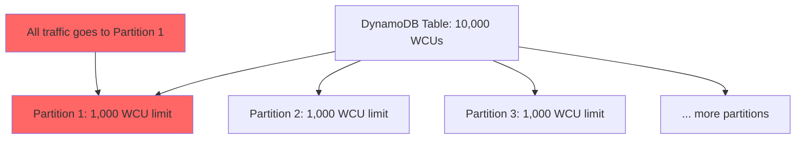

# How to Handle DynamoDB Hot Partitions

Author: [nawazdhandala](https://github.com/nawazdhandala)

Tags: AWS, DynamoDB, Performance, Scaling

Description: Identify, diagnose, and fix DynamoDB hot partition problems with practical strategies including write sharding, caching, and key redesign.

---

You've got a DynamoDB table with plenty of provisioned capacity, but your app keeps getting throttled. The CloudWatch metrics show that overall consumption is well below your limits. What gives? Welcome to the hot partition problem - one of the most frustrating issues in DynamoDB.

A hot partition happens when a disproportionate amount of traffic hits a single partition. Since each partition has its own throughput limit (3,000 RCUs and 1,000 WCUs), no amount of table-level capacity can fix a hot partition.

## Understanding Partitions

DynamoDB distributes your data across partitions based on the hash of your partition key. Each partition is an independent unit with its own storage and throughput:


```mermaid
graph TD
    A[DynamoDB Table: 10,000 WCUs] --> B[Partition 1: 1,000 WCU limit]
    A --> C[Partition 2: 1,000 WCU limit]
    A --> D[Partition 3: 1,000 WCU limit]
    A --> E[... more partitions]

    F[All traffic goes to Partition 1] --> B
    style F fill:#ff6666
    style B fill:#ff6666
```

DynamoDB has burst and adaptive capacity that can help with uneven traffic, but throttling can still occur if a single partition exceeds 3,000 read units or 1,000 write units per second.

## Symptoms of Hot Partitions

Here's how to tell if you have a hot partition problem:

1. **Throttling despite available capacity** - your table is throttling at 30% of provisioned capacity
2. **Uneven metric distribution** - CloudWatch shows spiky consumed capacity
3. **Specific operations failing** - writes to certain keys fail while others succeed
4. **`ProvisionedThroughputExceededException`** on specific items

## Diagnosing Hot Partitions

### Step 1: Enable Contributor Insights

DynamoDB Contributor Insights shows you the most accessed partition keys:

```bash
# Enable contributor insights

aws dynamodb update-contributor-insights \
  --table-name Orders \
  --contributor-insights-action ENABLE
```

After enabling it, check the generated rules:

```bash
# View the Contributor Insights status and rule names
aws dynamodb describe-contributor-insights \
  --table-name Orders
```

Use those rule names in the CloudWatch Contributor Insights console, or call `get-insight-rule-report`, to see the most accessed and most throttled keys:

```bash
aws cloudwatch get-insight-rule-report \
  --rule-name "DynamoDBContributorInsights-PKC-Orders-1234567890123" \
  --start-time 2026-02-11T00:00:00Z \
  --end-time 2026-02-12T00:00:00Z \
  --period 300 \
  --max-contributor-count 10
```

In the CloudWatch console, you'll see graphs like "Most accessed items" and "Most throttled items."

### Step 2: Check CloudWatch Metrics

Look at table and index throttle metrics. DynamoDB does not expose physical-partition metrics directly, but key-range throttle metrics and Contributor Insights help narrow down whether throttling is caused by hot keys:

```python
import boto3
from datetime import datetime, timezone

cloudwatch = boto3.client('cloudwatch')

# Get write throttle events caused by partition/key-range limits
response = cloudwatch.get_metric_statistics(
    Namespace='AWS/DynamoDB',
    MetricName='WriteKeyRangeThroughputThrottleEvents',
    Dimensions=[
        {'Name': 'TableName', 'Value': 'Orders'}
    ],
    StartTime=datetime(2026, 2, 11, tzinfo=timezone.utc),
    EndTime=datetime(2026, 2, 12, tzinfo=timezone.utc),
    Period=300,  # 5 minute intervals
    Statistics=['Sum']
)

for point in sorted(response['Datapoints'], key=lambda x: x['Timestamp']):
    if point['Sum'] > 0:
        print(f"{point['Timestamp']}: {point['Sum']} throttled writes")
```

### Step 3: Analyze Your Access Patterns

Examine your code to identify which partition keys receive the most traffic. Common culprits:

- Status fields as partition keys ("active" gets 90% of traffic)
- Date-based keys (today's date gets all current writes)
- Popular items (viral product, celebrity user)
- Global counters (single item updated by every request)

## Fix 1: Redesign the Partition Key

The most effective fix is choosing a better partition key. The goal is high cardinality with even distribution.

**Before (hot):**
```text
Partition key: status = "active"  -> 90% of all items
Partition key: status = "inactive" -> 10% of all items
```

**After (distributed):**
```text
Partition key: userId  -> millions of unique values
GSI designed for status-based queries, with a sort key or shard/bucket if one status gets heavy traffic
```

If you need to query by status, create a GSI for that access pattern rather than using status as the primary partition key, but make sure the GSI does not recreate the same hot-key problem. For more on key selection, see our post on [choosing the right partition key](https://oneuptime.com/blog/post/2026-02-12-dynamodb-partition-key/view).

## Fix 2: Write Sharding

When you can't change the partition key design, write sharding distributes traffic across multiple partitions artificially:

```javascript
const { DynamoDBClient } = require('@aws-sdk/client-dynamodb');
const {
  DynamoDBDocumentClient,
  GetCommand,
  UpdateCommand
} = require('@aws-sdk/lib-dynamodb');

const docClient = DynamoDBDocumentClient.from(new DynamoDBClient({}));

// Write sharding: append a random suffix to spread writes
const SHARD_COUNT = 10;

function getShardedKey(baseKey) {
  const shard = Math.floor(Math.random() * SHARD_COUNT);
  return `${baseKey}#${shard}`;
}

// Write to a random shard
async function incrementGlobalCounter(counterName, amount) {
  const shardedKey = getShardedKey(counterName);

  await docClient.send(new UpdateCommand({
    TableName: 'Counters',
    Key: { counterId: shardedKey },
    UpdateExpression: 'ADD #count :amount',
    ExpressionAttributeNames: { '#count': 'count' },
    ExpressionAttributeValues: { ':amount': amount }
  }));
}

// Read requires fetching all shards and summing
async function getGlobalCounter(counterName) {
  const promises = [];

  for (let i = 0; i < SHARD_COUNT; i++) {
    promises.push(
      docClient.send(new GetCommand({
        TableName: 'Counters',
        Key: { counterId: `${counterName}#${i}` }
      }))
    );
  }

  const results = await Promise.all(promises);
  return results.reduce((sum, r) => sum + (r.Item?.count || 0), 0);
}
```

Writes are 10x more distributed. Reads are 10x more work. This trade-off is usually worth it when writes are the bottleneck. For a deeper dive, check out our post on [DynamoDB write sharding](https://oneuptime.com/blog/post/2026-02-12-dynamodb-write-sharding/view).

## Fix 3: Caching

If reads are causing the hot partition, put a cache in front of DynamoDB:

```javascript
const { GetCommand } = require('@aws-sdk/lib-dynamodb');
const NodeCache = require('node-cache');
const cache = new NodeCache({ stdTTL: 60 }); // 60-second cache

async function getPopularItem(itemId) {
  // Check cache first
  const cached = cache.get(itemId);
  if (cached) return cached;

  // Cache miss - fetch from DynamoDB
  const result = await docClient.send(new GetCommand({
    TableName: 'Items',
    Key: { itemId }
  }));

  // Store in cache
  cache.set(itemId, result.Item);
  return result.Item;
}
```

For a more robust caching layer, use DynamoDB Accelerator (DAX):

```javascript
import { DaxDocument } from '@amazon-dax-sdk/lib-dax';

// DAX document client can be used with the same DynamoDB document-style API
const daxDocClient = new DaxDocument({
  endpoints: ['dax-cluster.abc123.dax-clusters.us-east-1.amazonaws.com:8111'],
  region: 'us-east-1'
});

// Same API as regular DynamoDB, but reads go through the cache
const result = await daxDocClient.get({
  TableName: 'Items',
  Key: { itemId: 'popular-item' }
});
```

DAX handles cache invalidation automatically for writes that go through DAX. When an item is updated through DAX, the item cache is updated too; writes that bypass DAX can leave cached reads stale until the DAX TTL expires.

## Fix 4: Time-Based Bucketing

For time-series data where the "current" bucket gets all the traffic:

```javascript
const { PutCommand } = require('@aws-sdk/lib-dynamodb');

// Instead of one partition for today, use hourly buckets
function getTimeBucket() {
  const now = new Date();
  const hour = now.toISOString().slice(0, 13); // "2026-02-12T14"
  return hour;
}

// Write to the current hour bucket
async function logEvent(eventType, data) {
  await docClient.send(new PutCommand({
    TableName: 'Events',
    Item: {
      partitionKey: `${eventType}#${getTimeBucket()}`,
      sortKey: `${Date.now()}#${Math.random().toString(36).slice(2)}`,
      data: data
    }
  }));
}
```

Hourly buckets keep each hot time range smaller and reduce the impact of one daily bucket. If the current hour still receives more than a single partition can handle, combine bucketing with write sharding.

## Fix 5: Batch and Buffer Writes

If your application generates bursts of writes, buffer them and write in batches:

```javascript
const { BatchWriteCommand } = require('@aws-sdk/lib-dynamodb');

class WriteBuffer {
  constructor(tableName, flushInterval = 1000, maxBatchSize = 25) {
    this.tableName = tableName;
    this.buffer = [];
    this.maxBatchSize = maxBatchSize;

    // Flush periodically
    setInterval(() => this.flush(), flushInterval);
  }

  add(item) {
    this.buffer.push(item);
    if (this.buffer.length >= this.maxBatchSize) {
      this.flush();
    }
  }

  async flush() {
    if (this.buffer.length === 0) return;

    const items = this.buffer.splice(0, this.maxBatchSize);
    let requestItems = {
      [this.tableName]: items.map(item => ({
        PutRequest: { Item: item }
      }))
    };

    try {
      let backoffMs = 200;

      while (Object.keys(requestItems).length > 0) {
        const result = await docClient.send(new BatchWriteCommand({
          RequestItems: requestItems
        }));

        requestItems = result.UnprocessedItems || {};
        if (Object.keys(requestItems).length > 0) {
          await new Promise(resolve => setTimeout(resolve, backoffMs));
          backoffMs = Math.min(backoffMs * 2, 5000);
        }
      }
    } catch (error) {
      console.error('Batch write failed:', error);
      const unprocessed = requestItems[this.tableName] || [];
      const itemsToRetry = unprocessed.length > 0
        ? unprocessed.map(request => request.PutRequest.Item)
        : items;
      this.buffer.unshift(...itemsToRetry);
    }
  }
}
```

Buffering smooths out short write spikes, but it does not remove the per-partition limit for sustained writes to one key. For sustained hot writes, combine buffering with a key design change or write sharding.

## Monitoring and Alerting

Set up proactive monitoring so you catch hot partitions before they cause user-facing issues:

```bash
# CloudWatch alarm for throttled requests
aws cloudwatch put-metric-alarm \
  --alarm-name "DynamoDB-Throttling-Orders" \
  --metric-name WriteThrottleEvents \
  --namespace AWS/DynamoDB \
  --dimensions Name=TableName,Value=Orders \
  --statistic Sum \
  --period 300 \
  --threshold 10 \
  --comparison-operator GreaterThanThreshold \
  --evaluation-periods 2 \
  --alarm-actions "arn:aws:sns:us-east-1:123456789:alerts"
```

For comprehensive monitoring across all your DynamoDB tables, [OneUptime](https://oneuptime.com/blog/post/2026-02-06-aws-cloudwatch-logs-exporter-opentelemetry-collector/view) can aggregate throttling metrics and alert your team before hot partitions cause outages.

## Wrapping Up

Hot partitions are a design problem, not a capacity problem. Throwing more throughput at the table won't fix uneven distribution. The best approach is to design your partition keys for even distribution from the start. When that's not possible, use write sharding, caching, time bucketing, or buffering to spread the load. Enable Contributor Insights to identify which keys are hottest, and set up monitoring to catch the problem early. Most hot partition issues can be resolved without downtime once you understand where the traffic is concentrated.
