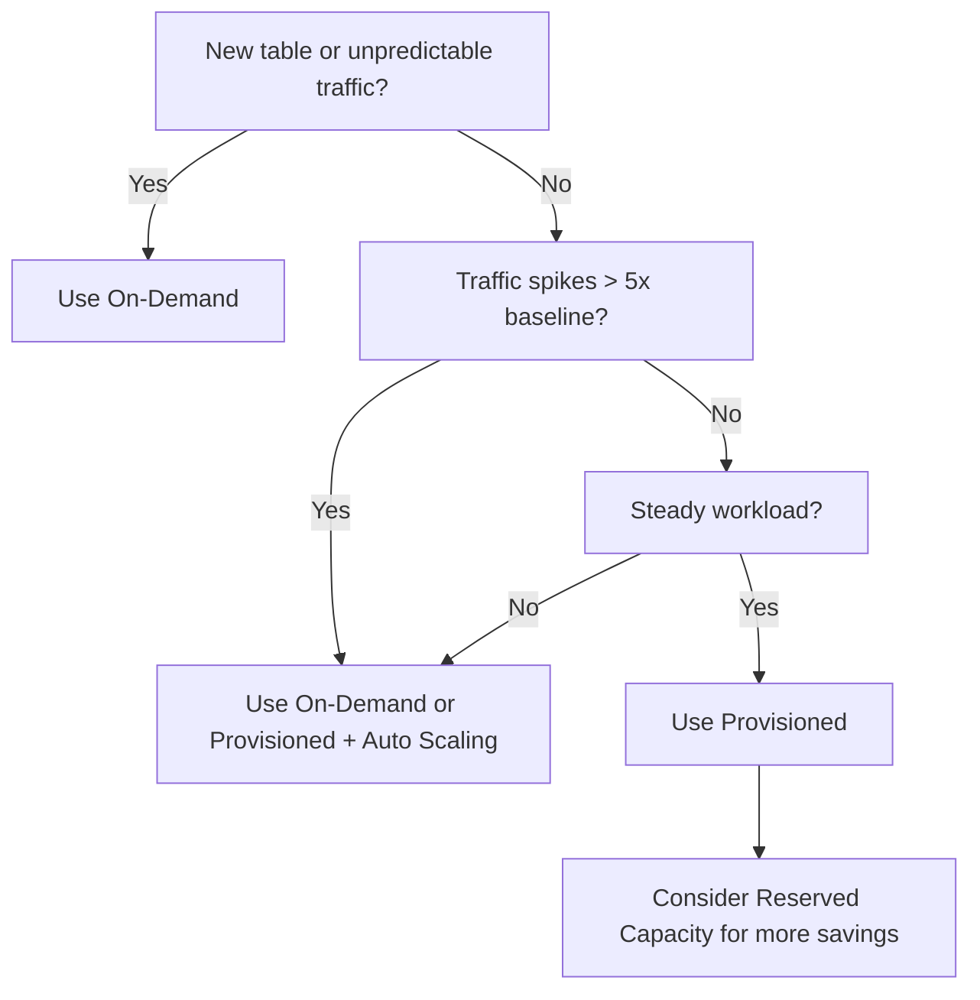

# How to Use DynamoDB On-Demand vs Provisioned Capacity

Author: [nawazdhandala](https://github.com/nawazdhandala)

Tags: AWS, DynamoDB, Cost Optimization, Capacity Planning

Description: Compare DynamoDB on-demand and provisioned capacity modes, understand pricing differences, and learn when to use each for optimal cost and performance.

---

DynamoDB gives you two ways to pay for throughput: on-demand and provisioned. Picking the right one can save you serious money, and picking the wrong one can either blow your budget or throttle your application. Let's break down how each mode works, what they cost, and when to switch between them.

## How Capacity Modes Work

### On-Demand Mode

On-demand is the pay-per-request model. You don't set any capacity limits. DynamoDB serves whatever traffic comes in and bills you per read and write request.

The pricing (in us-east-1 as of 2026):
- Write request unit: $1.25 per million
- Read request unit: $0.25 per million

There's no minimum charge beyond the actual requests. If your table gets zero traffic for a week, you pay nothing for throughput (you still pay for storage).

### Provisioned Mode

Provisioned mode requires you to specify how many reads and writes per second your table needs. You pay for the provisioned capacity whether you use it or not.

The pricing (in us-east-1):
- Write capacity unit (WCU): ~$0.00065 per hour per WCU
- Read capacity unit (RCU): ~$0.00013 per hour per RCU

One WCU handles one 1KB write per second. One RCU handles one 4KB strongly consistent read per second (or two eventually consistent reads).

## Cost Comparison

Let's do the math with a real example. Say your app does 10 million writes and 50 million reads per month with a steady workload:

**On-Demand cost:**
```
Writes: 10M x $1.25 / 1M = $12.50
Reads:  50M x $0.25 / 1M = $12.50
Total:  $25.00/month
```

**Provisioned cost (steady workload, ~3.86 writes/sec, ~19.3 reads/sec):**
```
WCU needed: ~4 (rounding up)
RCU needed: ~20

WCU cost: 4 x $0.00065 x 730 hours = $1.90
RCU cost: 20 x $0.00013 x 730 hours = $1.90
Total: $3.80/month
```

That's a 6.5x cost difference. Provisioned mode wins decisively for steady, predictable workloads.

But now consider a spiky workload - an e-commerce site with flash sales:

```
Normal: 5 writes/sec, 25 reads/sec
Flash sale: 500 writes/sec, 2,500 reads/sec (10-minute spikes, 3x/month)
```

With provisioned mode, you'd need to provision for peak or use auto scaling (which has a delay). With on-demand, you just pay for what you use without worrying about throttling during spikes.

## When to Choose On-Demand

On-demand is the right choice when:

- **Unpredictable traffic** - you don't know how much capacity you'll need
- **New applications** - you haven't established traffic patterns yet
- **Spiky workloads** - traffic varies dramatically (10x+ swings)
- **Development environments** - traffic is low and sporadic
- **Infrequent access** - tables that go hours or days without traffic

The key advantage is simplicity. No capacity planning, no auto scaling configuration, no risk of throttling from under-provisioning.

## When to Choose Provisioned

Provisioned mode makes sense when:

- **Predictable traffic** - you know your reads/writes per second
- **Steady workloads** - traffic doesn't vary much throughout the day
- **Cost-sensitive applications** - you want the lowest possible price
- **High throughput** - sustained high traffic where on-demand pricing adds up
- **Reserved capacity** - you can commit to 1 or 3-year terms for additional savings

With reserved capacity, the savings are even more dramatic:

```
1-year reserved: ~40% savings over regular provisioned pricing
3-year reserved: ~60% savings over regular provisioned pricing
```

## Auto Scaling with Provisioned Mode

You don't have to pick a fixed capacity. Auto scaling adjusts your provisioned capacity based on actual usage:

```javascript
// AWS SDK - configure auto scaling for a DynamoDB table
const applicationAutoScaling = new AWS.ApplicationAutoScaling();

// Register the table as a scalable target
const registerParams = {
  ServiceNamespace: 'dynamodb',
  ResourceId: 'table/Orders',
  ScalableDimension: 'dynamodb:table:WriteCapacityUnits',
  MinCapacity: 5,
  MaxCapacity: 500
};

await applicationAutoScaling.registerScalableTarget(registerParams).promise();

// Define the scaling policy
const policyParams = {
  ServiceNamespace: 'dynamodb',
  ResourceId: 'table/Orders',
  ScalableDimension: 'dynamodb:table:WriteCapacityUnits',
  PolicyName: 'OrdersWriteScaling',
  PolicyType: 'TargetTrackingScaling',
  TargetTrackingScalingPolicyConfiguration: {
    TargetValue: 70,  // Target 70% utilization
    PredefinedMetricSpecification: {
      PredefinedMetricType: 'DynamoDBWriteCapacityUtilization'
    },
    ScaleInCooldown: 60,   // Wait 60 seconds before scaling down
    ScaleOutCooldown: 60   // Wait 60 seconds before scaling up
  }
};

await applicationAutoScaling.putScalingPolicy(policyParams).promise();
```

Auto scaling has a catch though: it reacts to traffic changes, it doesn't predict them. There's a delay of a minute or two between the traffic spike and the capacity increase. During that gap, you might see throttling.

## Switching Between Modes

You can switch between on-demand and provisioned mode, but there are limits:

- You can switch once every 24 hours
- Switching to provisioned requires you to set initial capacity values
- Switching to on-demand takes effect immediately

A common strategy is:

1. Start with on-demand to learn your traffic patterns
2. After a few weeks, analyze your CloudWatch metrics
3. Switch to provisioned once you understand your baseline

Here's how to check your table's current mode and switch:

```bash
# Check current capacity mode
aws dynamodb describe-table --table-name Orders \
  --query "Table.BillingModeSummary.BillingMode"

# Switch to provisioned mode
aws dynamodb update-table \
  --table-name Orders \
  --billing-mode PROVISIONED \
  --provisioned-throughput ReadCapacityUnits=100,WriteCapacityUnits=50

# Switch to on-demand mode
aws dynamodb update-table \
  --table-name Orders \
  --billing-mode PAY_PER_REQUEST
```

## Capacity Planning with CloudWatch

To size your provisioned capacity correctly, look at these CloudWatch metrics:

```
ConsumedReadCapacityUnits  - actual reads consumed
ConsumedWriteCapacityUnits - actual writes consumed
ThrottledRequests          - requests that were rejected
ReadThrottleEvents         - read throttle count
WriteThrottleEvents        - write throttle count
```

Here's a quick analysis approach:

```python
import boto3
from datetime import datetime, timedelta

cloudwatch = boto3.client('cloudwatch')

# Get consumed write capacity for the last 7 days
response = cloudwatch.get_metric_statistics(
    Namespace='AWS/DynamoDB',
    MetricName='ConsumedWriteCapacityUnits',
    Dimensions=[{'Name': 'TableName', 'Value': 'Orders'}],
    StartTime=datetime.utcnow() - timedelta(days=7),
    EndTime=datetime.utcnow(),
    Period=3600,  # 1-hour intervals
    Statistics=['Average', 'Maximum']
)

for datapoint in sorted(response['Datapoints'], key=lambda x: x['Timestamp']):
    print(f"{datapoint['Timestamp']}: avg={datapoint['Average']:.1f}, max={datapoint['Maximum']:.1f}")
```

Provision for your peak, add a 20-30% buffer, and set auto scaling to handle anything beyond that.

## Mixed Workloads: Tables and Indexes

Remember that capacity modes apply to the table and its Global Secondary Indexes. In provisioned mode, each GSI has its own capacity settings:

```bash
# Set different capacity for the table and GSI
aws dynamodb update-table \
  --table-name Orders \
  --billing-mode PROVISIONED \
  --provisioned-throughput ReadCapacityUnits=100,WriteCapacityUnits=50 \
  --global-secondary-index-updates '[
    {
      "Update": {
        "IndexName": "status-index",
        "ProvisionedThroughput": {
          "ReadCapacityUnits": 50,
          "WriteCapacityUnits": 50
        }
      }
    }
  ]'
```

In on-demand mode, GSIs scale independently without any configuration.

## Monitoring for Cost Optimization

Whichever mode you choose, monitor continuously. Traffic patterns change as your app grows. What started as a spiky workload might become steady, or vice versa.

Set up alerts for throttled requests (which mean you're under-provisioned) and for low utilization (which means you're over-provisioned). You can track both through [OneUptime](https://oneuptime.com/blog/post/aws-cloudwatch-alarms/view) to get a unified view of your DynamoDB costs and performance.

## Decision Framework

Here's a quick way to decide:



## Wrapping Up

There's no universally "right" capacity mode. On-demand is the safe, simple choice that works for everything but costs more under sustained load. Provisioned is cheaper for predictable workloads but requires capacity planning and risks throttling if you underestimate. Start with on-demand, measure for a few weeks, and switch to provisioned with auto scaling once you understand your traffic patterns. Review your capacity mode quarterly as your application evolves - what was right at launch might not be right at scale.
