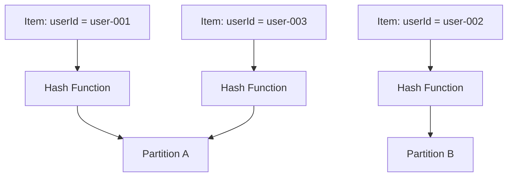

# How to Choose the Right Partition Key for DynamoDB

Author: [nawazdhandala](https://github.com/nawazdhandala)

Tags: AWS, DynamoDB, Database Design, NoSQL

Description: A deep dive into selecting the optimal DynamoDB partition key, covering cardinality, distribution patterns, hot partitions, and practical examples.

---

The partition key is the single most important decision in DynamoDB table design. Get it right, and your table scales smoothly. Get it wrong, and you'll hit throttling, hot partitions, and performance cliffs that are painful to fix.

Unlike relational databases where you can index your way out of most problems, DynamoDB's partition key fundamentally determines how your data is stored and accessed. You can't change it after the table is created without migrating to a new table.

## What the Partition Key Does

DynamoDB uses the partition key to determine which physical partition stores your data. When you write an item, DynamoDB hashes the partition key value to decide where to put it. When you read, it hashes the key again to find the right partition.



Each partition has a throughput limit: 3,000 RCUs and 1,000 WCUs. If too many requests target the same partition, you get throttled - even if the table's overall capacity isn't maxed out.

## The Golden Rule: High Cardinality

Your partition key should have many distinct values, and requests should be distributed evenly across those values. This is called high cardinality with uniform distribution.

**Good partition keys:**
- `userId` - millions of unique users, requests spread across all of them
- `deviceId` - each device has its own key, traffic is distributed
- `orderId` - unique per order, reads are spread out

**Bad partition keys:**
- `status` - only a few values like "active", "inactive", "pending". Most items land on "active"
- `country` - a handful of values, with most traffic hitting "US" or "IN"
- `date` - today's date gets all the writes while yesterday's gets none

Let's put some numbers to it. If you have a table with 1,000 WCUs and your partition key only has 5 distinct values, each partition handles about 200 WCUs. But if 80% of your traffic hits one value, that partition needs 800 WCUs while its limit might be 1,000. You're dangerously close to throttling.

## Analyzing Your Access Patterns

Before choosing a partition key, list every way your application reads and writes data. DynamoDB is an access-pattern-driven database.

Ask yourself:
- What queries does my app make most frequently?
- Which attributes am I filtering on?
- Do I need to fetch a single item or a collection of items?
- What's the read/write ratio?

For an e-commerce app, your access patterns might be:

```
1. Get user profile by userId          -> userId as partition key
2. Get all orders for a user           -> userId as partition key, orderDate as sort key
3. Get order by orderId                -> orderId as partition key (separate table or GSI)
4. Get all orders with status "shipped" -> status as GSI partition key
```

## Composite Partition Keys

Sometimes no single attribute has enough cardinality. In that case, you can create a composite partition key by combining multiple attributes:

```javascript
// Instead of using 'date' as the partition key (low cardinality),
// combine it with another attribute
const partitionKey = `${tenantId}#${date}`;

// Examples:
// "tenant-001#2026-02-12"
// "tenant-002#2026-02-12"
// "tenant-001#2026-02-11"
```

This increases cardinality and spreads traffic more evenly. The hash function sees each combination as a unique key.

## When to Use a Sort Key

If your partition key groups related items together, a sort key lets you organize items within each group. The combination of partition key + sort key must be unique.

Here's a classic pattern for a social media app:

```
Table: Posts
Partition key: authorId
Sort key: createdAt

This lets you:
- Get all posts by an author (query by partition key)
- Get recent posts by an author (query with sort key condition)
- Get a specific post (partition key + sort key)
```

Without a sort key, each partition key value can only have one item. With a sort key, you can store thousands of items under the same partition key.

## Anti-Patterns to Avoid

### Using Sequential IDs

Auto-incrementing IDs concentrate writes on the latest partition:

```
Bad:  id = 1, 2, 3, 4, 5, ...  (all recent writes go to the same partition range)
Good: id = UUID                  (writes spread randomly across partitions)
```

### Using Timestamps as Partition Keys

Similar problem - all current traffic hits the same partition:

```
Bad:  partition_key = "2026-02-12"  (all today's traffic on one partition)
Good: partition_key = userId         (traffic distributed by user)
      sort_key = "2026-02-12"       (date as sort key for range queries)
```

### Overly Broad Keys

Using something like `type = "user"` means every user record shares one partition key value. That's a recipe for hot partitions.

## Real-World Examples

### IoT Sensor Data

Sensors report data every second. Using `sensorId` as the partition key distributes traffic:

```
Partition key: sensorId   (e.g., "sensor-temp-floor3-001")
Sort key: timestamp        (e.g., "2026-02-12T10:30:45.123Z")
```

Each sensor gets its own slice of throughput, and the sort key lets you query time ranges efficiently.

### Multi-Tenant SaaS

For a SaaS app with many tenants, `tenantId` works well if tenants are roughly the same size:

```
Partition key: tenantId    (e.g., "tenant-acme-corp")
Sort key: resourceType#id  (e.g., "USER#user-123" or "PROJECT#proj-456")
```

But if one tenant is 1000x bigger than others, you'll get a hot partition. In that case, add write sharding - append a random suffix to the partition key:

```
Partition key: tenantId#shard  (e.g., "tenant-megacorp#3")
```

For more on this technique, check out our post on [DynamoDB write sharding](https://oneuptime.com/blog/post/2026-02-12-dynamodb-write-sharding/view).

### Event Logging

For event logs, combining the source and a time bucket works well:

```
Partition key: source#hourBucket  (e.g., "api-server#2026-02-12T10")
Sort key: eventId                  (e.g., "evt-abc123")
```

This spreads writes across sources and time buckets while still allowing efficient queries for recent events from a specific source.

## Testing Your Key Design

Before committing to a partition key, simulate your workload. Write a script that generates realistic traffic patterns and check the distribution:

```python
import hashlib
from collections import Counter

# Simulate 100,000 requests with your proposed partition key
partition_keys = []
for i in range(100000):
    # Replace this with your actual key generation logic
    key = f"user-{i % 10000}"  # 10,000 unique users
    partition_keys.append(key)

# Check distribution
counter = Counter(partition_keys)
most_common = counter.most_common(10)
print("Top 10 hottest partition keys:")
for key, count in most_common:
    print(f"  {key}: {count} requests ({count/len(partition_keys)*100:.1f}%)")
```

If any single partition key handles more than a small percentage of total traffic, you might need to rethink your design.

## Monitoring Partition Key Distribution

Once your table is in production, monitor for hot partitions. DynamoDB CloudWatch metrics show consumed capacity at the table level, but you need contributor insights to see per-key metrics.

Enable DynamoDB Contributor Insights to identify the most accessed partition keys:

```bash
# Enable contributor insights on your table
aws dynamodb update-contributor-insights \
  --table-name MyTable \
  --contributor-insights-action ENABLE
```

Set up monitoring with [OneUptime](https://oneuptime.com/blog/post/aws-cloudwatch-alarms/view) to get alerts when throttling occurs, so you can investigate and adjust your key design before it impacts users.

## Wrapping Up

Choosing the right partition key comes down to three principles: high cardinality, uniform distribution, and alignment with your access patterns. Start by listing every query your app needs to make. Then pick a key that spreads traffic evenly while supporting those queries efficiently. Test with realistic data, monitor in production, and don't be afraid to use composite keys or write sharding when a simple key doesn't distribute well enough. Getting this right saves you from a world of pain down the road.
