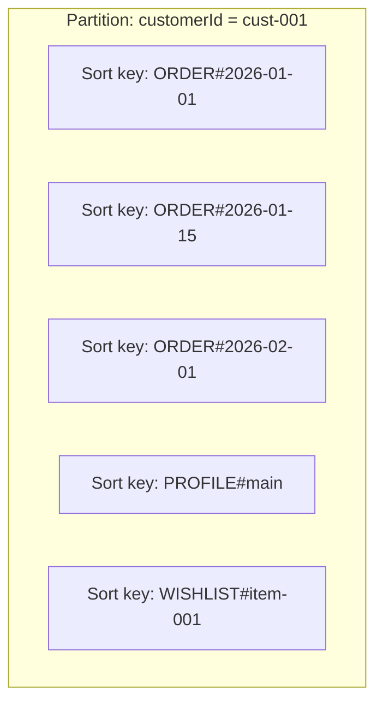

# How to Choose the Right Sort Key for DynamoDB

Author: [nawazdhandala](https://github.com/nawazdhandala)

Tags: AWS, DynamoDB, Database Design, NoSQL

Description: Understand how to select and design effective sort keys for DynamoDB tables, with patterns for hierarchies, time series, and single-table designs.

---

If the partition key decides where your data lives, the sort key decides how it's organized within that location. Together they form the composite primary key, and the sort key opens up a whole range of powerful query patterns that just aren't possible with a partition key alone.

A well-chosen sort key can eliminate the need for additional indexes, reduce costs, and make your queries faster. A poorly chosen one means you'll be scanning, filtering, and wasting throughput.

## How Sort Keys Work

Within a single partition, items are stored in sorted order by the sort key value. When you query a partition, DynamoDB can efficiently find items by sort key using comparison operators:

- `=` (equals)
- `<`, `<=`, `>`, `>=` (comparisons)
- `BETWEEN` (range)
- `begins_with` (prefix matching)

This sorted storage is what makes sort keys so powerful. Instead of reading every item in a partition, DynamoDB jumps directly to the range you need.



## Choosing a Sort Key Data Type

Sort keys can be String, Number, or Binary. The data type affects sort order:

- **String** - sorts lexicographically (alphabetical order, with uppercase before lowercase)
- **Number** - sorts numerically
- **Binary** - sorts by unsigned byte values

Strings are the most versatile because you can build composite sort keys with prefixes.

## Pattern 1: Timestamp Sort Keys

The most common sort key pattern is a timestamp. It lets you query items in chronological order.

```
Table: UserActivity
Partition key: userId
Sort key: timestamp

Items:
  userId: "user-001", timestamp: "2026-02-12T08:00:00Z", action: "login"
  userId: "user-001", timestamp: "2026-02-12T08:05:23Z", action: "view_page"
  userId: "user-001", timestamp: "2026-02-12T08:10:45Z", action: "purchase"
```

Now you can query for specific time ranges:

```javascript
// Get all activity for a user in the last hour
const params = {
  TableName: 'UserActivity',
  KeyConditionExpression: 'userId = :uid AND #ts >= :startTime',
  ExpressionAttributeNames: { '#ts': 'timestamp' },
  ExpressionAttributeValues: {
    ':uid': 'user-001',
    ':startTime': '2026-02-12T07:00:00Z'
  }
};
```

Use ISO 8601 format for timestamps stored as strings. They sort correctly in lexicographic order because the most significant digits come first.

## Pattern 2: Hierarchical Sort Keys

When your data has a hierarchy, encode it in the sort key using a delimiter:

```
Table: Locations
Partition key: orgId
Sort key: location

Items:
  orgId: "acme", location: "USA"
  orgId: "acme", location: "USA#California"
  orgId: "acme", location: "USA#California#San_Francisco"
  orgId: "acme", location: "USA#California#Los_Angeles"
  orgId: "acme", location: "USA#New_York"
  orgId: "acme", location: "USA#New_York#New_York_City"
```

The `begins_with` operator makes hierarchy queries efficient:

```javascript
// Get all locations in California
const params = {
  TableName: 'Locations',
  KeyConditionExpression: 'orgId = :org AND begins_with(#loc, :prefix)',
  ExpressionAttributeNames: { '#loc': 'location' },
  ExpressionAttributeValues: {
    ':org': 'acme',
    ':prefix': 'USA#California'
  }
};
```

This returns both "USA#California" and all cities within it.

## Pattern 3: Entity Type Prefixes (Single-Table Design)

In single-table designs, the sort key often includes a type prefix to distinguish different entities stored under the same partition key:

```
Table: AppData
Partition key: pk
Sort key: sk

Items for customer "cust-001":
  pk: "CUST#cust-001", sk: "PROFILE#main"          -> customer profile
  pk: "CUST#cust-001", sk: "ORDER#2026-01-15#ord-1" -> order
  pk: "CUST#cust-001", sk: "ORDER#2026-02-01#ord-2" -> order
  pk: "CUST#cust-001", sk: "ADDRESS#home"            -> home address
  pk: "CUST#cust-001", sk: "ADDRESS#work"            -> work address
```

Now you can fetch different slices of customer data:

```javascript
// Get customer profile
const profile = await docClient.get({
  TableName: 'AppData',
  Key: { pk: 'CUST#cust-001', sk: 'PROFILE#main' }
}).promise();

// Get all orders
const orders = await docClient.query({
  TableName: 'AppData',
  KeyConditionExpression: 'pk = :pk AND begins_with(sk, :prefix)',
  ExpressionAttributeValues: {
    ':pk': 'CUST#cust-001',
    ':prefix': 'ORDER#'
  }
}).promise();

// Get everything for this customer
const allData = await docClient.query({
  TableName: 'AppData',
  KeyConditionExpression: 'pk = :pk',
  ExpressionAttributeValues: {
    ':pk': 'CUST#cust-001'
  }
}).promise();
```

## Pattern 4: Version Sort Keys

When you need to keep a history of changes to an item, use a version number or timestamp as the sort key:

```
Table: DocumentVersions
Partition key: documentId
Sort key: version

Items:
  documentId: "doc-001", version: "v001", content: "First draft..."
  documentId: "doc-001", version: "v002", content: "Revised..."
  documentId: "doc-001", version: "v003", content: "Final..."
```

To get the latest version, query in reverse order and limit to 1:

```javascript
// Get the latest version of a document
const params = {
  TableName: 'DocumentVersions',
  KeyConditionExpression: 'documentId = :docId',
  ExpressionAttributeValues: {
    ':docId': 'doc-001'
  },
  ScanIndexForward: false,  // Reverse sort order (newest first)
  Limit: 1                   // Only get one item
};
```

## Pattern 5: Composite Sort Keys for Multiple Dimensions

Sometimes you need to sort by multiple attributes. Combine them into a single sort key:

```
Table: Products
Partition key: category
Sort key: price#productId

Items:
  category: "electronics", sort: "00099.99#prod-001"  -> $99.99
  category: "electronics", sort: "00149.99#prod-002"  -> $149.99
  category: "electronics", sort: "00999.99#prod-003"  -> $999.99
```

Notice the zero-padding on the price. Since string comparison is lexicographic, "99.99" would sort after "149.99". Zero-padding ensures correct numeric ordering.

```javascript
// Get all electronics under $200
const params = {
  TableName: 'Products',
  KeyConditionExpression: 'category = :cat AND sk < :maxPrice',
  ExpressionAttributeValues: {
    ':cat': 'electronics',
    ':maxPrice': '00200.00'
  }
};
```

## Anti-Patterns to Avoid

### Random Sort Keys

A random UUID as a sort key gives you uniqueness but loses all query power. You can only do exact lookups, never range queries:

```
Bad:  sort_key = "f47ac10b-58cc-4372-a567-0e02b2c3d479"
      (Can't do begins_with, BETWEEN, or comparison queries)

Good: sort_key = "2026-02-12T10:30:00Z#f47ac10b"
      (Timestamp prefix enables range queries)
```

### Low-Cardinality Sort Keys

A sort key with only a few distinct values doesn't give you much:

```
Bad:  sort_key = "active" or "inactive"
      (Only two values, no real sorting benefit)

Good: sort_key = "active#2026-02-12T10:30:00Z"
      (Status prefix + timestamp gives more flexibility)
```

### Overly Complex Sort Keys

Don't try to cram everything into one sort key. If you need five different access patterns, you might need GSIs instead of a super-complex sort key.

## Sort Key Size Limits

DynamoDB allows sort keys up to 1024 bytes. For strings, that's up to 1024 characters (ASCII) or fewer for multi-byte Unicode. In practice, keep sort keys concise:

```
Good: "ORDER#2026-02-12#ord-12345"  (34 bytes)
Bad:  A sort key that includes a full description or long text
```

## Using Sort Keys with Indexes

Sort keys in Global Secondary Indexes follow the same patterns. The GSI sort key lets you reorder data differently than the base table:

```
Base table:
  Partition key: userId
  Sort key: createdAt

GSI (status-index):
  Partition key: status
  Sort key: createdAt
```

This lets you query "all active users, newest first" via the GSI while the base table supports "all activity for a user, newest first."

## Testing Sort Key Patterns

Before committing to a sort key design, test it with realistic data:

```python
# Generate test items and verify query patterns work
items = [
    {'pk': 'user-001', 'sk': f'ORDER#{date}#{i}'}
    for i, date in enumerate([
        '2026-01-01', '2026-01-15', '2026-02-01', '2026-02-12'
    ])
]

# Verify begins_with returns expected results
order_items = [i for i in items if i['sk'].startswith('ORDER#2026-02')]
print(f"February orders: {len(order_items)}")
```

## Wrapping Up

The sort key is your tool for organizing data within a partition. Use timestamps for chronological data, hierarchical keys for tree structures, type prefixes for single-table designs, and composite keys when you need multi-dimensional sorting. Always use `begins_with` and range operators to your advantage - they're what make sort keys powerful. Plan your sort key around your most frequent query patterns, and test with real data before going to production. A good sort key design can save you from needing extra indexes and keep your DynamoDB costs under control.
