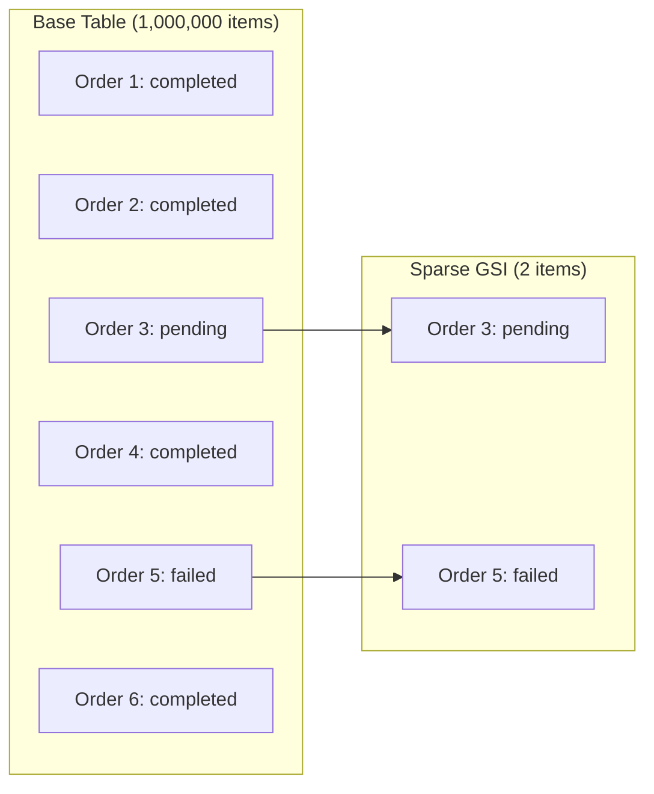

# How to Use DynamoDB Sparse Indexes

Author: [nawazdhandala](https://github.com/nawazdhandala)

Tags: AWS, DynamoDB, Indexes, Data Modeling

Description: Learn how to leverage DynamoDB sparse indexes to efficiently query subsets of data, reduce index costs, and implement patterns like flagged items and active records.

---

A sparse index is a Global Secondary Index (GSI) where the partition key attribute only exists on some items in your table. DynamoDB only copies items into a GSI when the index's key attributes are present. If an item doesn't have the GSI's partition key attribute, it's excluded from the index entirely.

This is incredibly useful. It means you can create an index that contains only the items you care about, rather than indexing everything.

## How Sparse Indexes Work

Consider a table where most orders are in "completed" status, but you frequently need to find the small number of "pending" or "failed" orders:



Instead of creating a GSI on `status` (which would index all 1 million items), you add a `needsAttention` attribute only to items that need it. The GSI indexes only those few items.

## Creating a Sparse Index

The trick is to only set the GSI's partition key attribute on items that should appear in the index:

```javascript
const AWS = require('aws-sdk');
const docClient = new AWS.DynamoDB.DocumentClient();

// When creating an order that needs attention, include the flag attribute
async function createPendingOrder(orderId, customerId, amount) {
  await docClient.put({
    TableName: 'Orders',
    Item: {
      orderId: orderId,
      customerId: customerId,
      amount: amount,
      status: 'pending',
      createdAt: new Date().toISOString(),
      // This attribute triggers inclusion in the sparse index
      needsAttention: 'PENDING'
    }
  }).promise();
}

// When the order is completed, remove the flag attribute
async function completeOrder(orderId) {
  await docClient.update({
    TableName: 'Orders',
    Key: { orderId },
    UpdateExpression: 'SET #status = :completed, completedAt = :now REMOVE needsAttention',
    ExpressionAttributeNames: { '#status': 'status' },
    ExpressionAttributeValues: {
      ':completed': 'completed',
      ':now': new Date().toISOString()
    }
  }).promise();
  // Removing needsAttention removes this item from the sparse index
}
```

Create the GSI with `needsAttention` as the partition key:

```bash
# Create a sparse GSI
aws dynamodb update-table \
  --table-name Orders \
  --attribute-definitions \
    AttributeName=needsAttention,AttributeType=S \
    AttributeName=createdAt,AttributeType=S \
  --global-secondary-index-updates '[
    {
      "Create": {
        "IndexName": "needs-attention-index",
        "KeySchema": [
          {"AttributeName": "needsAttention", "KeyType": "HASH"},
          {"AttributeName": "createdAt", "KeyType": "RANGE"}
        ],
        "Projection": {
          "ProjectionType": "ALL"
        },
        "ProvisionedThroughput": {
          "ReadCapacityUnits": 5,
          "WriteCapacityUnits": 5
        }
      }
    }
  ]'
```

Now querying this index is fast and cheap - it only contains the items that need attention:

```javascript
// Find all orders needing attention, sorted by creation time
async function getOrdersNeedingAttention() {
  const params = {
    TableName: 'Orders',
    IndexName: 'needs-attention-index',
    KeyConditionExpression: 'needsAttention = :val',
    ExpressionAttributeValues: { ':val': 'PENDING' }
  };

  return (await docClient.query(params).promise()).Items;
}
```

## Pattern: Active/Inactive Items

Many apps need to query only active items while keeping inactive ones in the table:

```javascript
// Only active users have the 'isActive' attribute
async function activateUser(userId) {
  await docClient.update({
    TableName: 'Users',
    Key: { userId },
    UpdateExpression: 'SET isActive = :val, activatedAt = :now',
    ExpressionAttributeValues: {
      ':val': 'ACTIVE',
      ':now': new Date().toISOString()
    }
  }).promise();
}

async function deactivateUser(userId) {
  await docClient.update({
    TableName: 'Users',
    Key: { userId },
    UpdateExpression: 'REMOVE isActive SET deactivatedAt = :now',
    ExpressionAttributeValues: {
      ':now': new Date().toISOString()
    }
  }).promise();
}

// Query only active users from the sparse index
async function getActiveUsers() {
  const params = {
    TableName: 'Users',
    IndexName: 'active-users-index',
    KeyConditionExpression: 'isActive = :active',
    ExpressionAttributeValues: { ':active': 'ACTIVE' }
  };

  return (await docClient.query(params).promise()).Items;
}
```

## Pattern: Flagged Items for Processing

Use sparse indexes to create work queues:

```javascript
// Flag an item for background processing
async function flagForProcessing(itemId, processingType) {
  await docClient.update({
    TableName: 'Items',
    Key: { itemId },
    UpdateExpression: 'SET processingQueue = :queue, queuedAt = :now',
    ExpressionAttributeValues: {
      ':queue': processingType,
      ':now': new Date().toISOString()
    }
  }).promise();
}

// Process items from the queue
async function processQueue(processingType) {
  // Fetch items from the sparse index
  const result = await docClient.query({
    TableName: 'Items',
    IndexName: 'processing-queue-index',
    KeyConditionExpression: 'processingQueue = :queue',
    ExpressionAttributeValues: { ':queue': processingType },
    Limit: 10
  }).promise();

  for (const item of result.Items) {
    await processItem(item);

    // Remove from queue by removing the flag attribute
    await docClient.update({
      TableName: 'Items',
      Key: { itemId: item.itemId },
      UpdateExpression: 'REMOVE processingQueue, queuedAt SET processedAt = :now',
      ExpressionAttributeValues: { ':now': new Date().toISOString() }
    }).promise();
  }
}
```

## Pattern: Items with Expiration

Track items that have an expiration date without scanning the whole table:

```javascript
// Set an expiration on an item
async function setExpiration(itemId, expirationDate) {
  await docClient.update({
    TableName: 'Items',
    Key: { itemId },
    UpdateExpression: 'SET expiringFlag = :flag, expirationDate = :date',
    ExpressionAttributeValues: {
      ':flag': 'EXPIRING',
      ':date': expirationDate
    }
  }).promise();
}

// Find items expiring soon
// GSI: partition key = expiringFlag, sort key = expirationDate
async function getExpiringItems(beforeDate) {
  const params = {
    TableName: 'Items',
    IndexName: 'expiring-items-index',
    KeyConditionExpression: 'expiringFlag = :flag AND expirationDate <= :before',
    ExpressionAttributeValues: {
      ':flag': 'EXPIRING',
      ':before': beforeDate
    }
  };

  return (await docClient.query(params).promise()).Items;
}
```

## Pattern: Multi-Status Sparse Indexes

You can use different values of the sparse key attribute to create partitions within the index:

```javascript
// Different flag values for different states
async function updateOrderStatus(orderId, newStatus) {
  const flagValue = ['pending', 'processing', 'failed'].includes(newStatus)
    ? newStatus.toUpperCase()  // Include in sparse index
    : undefined;               // Exclude from sparse index

  if (flagValue) {
    await docClient.update({
      TableName: 'Orders',
      Key: { orderId },
      UpdateExpression: 'SET #status = :status, attentionFlag = :flag',
      ExpressionAttributeNames: { '#status': 'status' },
      ExpressionAttributeValues: {
        ':status': newStatus,
        ':flag': flagValue
      }
    }).promise();
  } else {
    await docClient.update({
      TableName: 'Orders',
      Key: { orderId },
      UpdateExpression: 'SET #status = :status REMOVE attentionFlag',
      ExpressionAttributeNames: { '#status': 'status' },
      ExpressionAttributeValues: { ':status': newStatus }
    }).promise();
  }
}

// Query only failed orders
async function getFailedOrders() {
  return (await docClient.query({
    TableName: 'Orders',
    IndexName: 'attention-index',
    KeyConditionExpression: 'attentionFlag = :flag',
    ExpressionAttributeValues: { ':flag': 'FAILED' }
  }).promise()).Items;
}
```

## Cost Benefits

The cost savings of sparse indexes can be significant:

```
Scenario: 10 million orders, 0.1% need attention (10,000 items)

Full GSI on status:
  - Storage: 10 million items indexed
  - Write cost: every order write also writes to the GSI
  - Read cost: query returns items from a large index

Sparse index:
  - Storage: 10,000 items indexed (1000x less)
  - Write cost: only 10,000 items trigger GSI writes
  - Read cost: query scans a tiny index
```

Storage for the sparse index is 1000x smaller. Write costs are dramatically lower because 99.9% of writes don't touch the index.

## Combining Sparse Indexes with TTL

DynamoDB's Time to Live (TTL) automatically deletes expired items. Combine this with sparse indexes for temporary flags:

```javascript
// Create a temporary flag that auto-expires
async function flagTemporarily(itemId, flagType, durationSeconds) {
  const expiresAt = Math.floor(Date.now() / 1000) + durationSeconds;

  await docClient.update({
    TableName: 'Items',
    Key: { itemId },
    UpdateExpression: 'SET tempFlag = :flag, tempFlagTTL = :ttl',
    ExpressionAttributeValues: {
      ':flag': flagType,
      ':ttl': expiresAt  // DynamoDB TTL attribute
    }
  }).promise();
}
```

When the TTL expires, DynamoDB removes the item attributes, which also removes it from the sparse index.

## Monitoring Sparse Index Usage

Track the size and activity of your sparse indexes to make sure they stay sparse:

```bash
# Check the item count in your index
aws dynamodb describe-table --table-name Orders \
  --query "Table.GlobalSecondaryIndexes[?IndexName=='needs-attention-index'].{ItemCount:ItemCount,SizeBytes:IndexSizeBytes}"
```

If your sparse index grows to contain a large percentage of your base table, it's not really sparse anymore. Reconsider whether the flag attribute is being removed properly. Monitor index sizes with [OneUptime](https://oneuptime.com/blog/post/aws-cloudwatch-alarms/view) to catch unexpected growth.

## Wrapping Up

Sparse indexes are one of DynamoDB's most elegant features. By conditionally setting an attribute, you control exactly which items appear in the index. This makes queries on rare items fast and cheap. Use them for work queues, active record filtering, expiration tracking, and any pattern where you need to efficiently find a small subset of your data. The key discipline is to always REMOVE the flag attribute when an item no longer belongs in the index - otherwise your sparse index stops being sparse.
