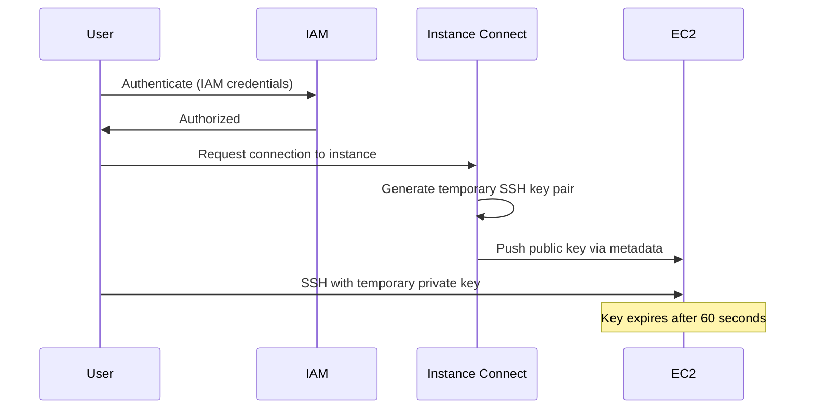

# How to Use EC2 Instance Connect for Browser-Based SSH

Author: [nawazdhandala](https://github.com/nawazdhandala)

Tags: AWS, EC2, Instance Connect, SSH, Security

Description: Learn how to use EC2 Instance Connect for secure browser-based SSH access to your EC2 instances without managing SSH keys.

---

Managing SSH keys is a pain. Distributing them across teams, rotating them, revoking access when someone leaves - it's a burden that scales poorly. EC2 Instance Connect provides a better way: temporary, one-time-use SSH keys that are pushed to the instance for each connection. No permanent keys to manage, full IAM integration for access control, and you can even connect through the browser.

Let's set it up.

## How EC2 Instance Connect Works

Instead of pre-deploying SSH public keys, Instance Connect works like this:

1. You initiate a connection (via browser or CLI)
2. AWS generates a one-time SSH key pair
3. The public key is pushed to the instance's metadata
4. You're connected using the temporary private key
5. The key expires after 60 seconds



The beauty is that access control is handled entirely through IAM policies. No need to manage SSH keys, authorized_keys files, or key distribution.

## Prerequisites

EC2 Instance Connect requires:

- **Instance Connect agent** installed on the instance (pre-installed on Amazon Linux 2 2.0.20190618+, Ubuntu 20.04+)
- **Security group** allowing SSH (port 22) from the Instance Connect service IP range
- **IAM permissions** for the connecting user
- **Public IP or Instance Connect Endpoint** for browser-based access

## Installing the Instance Connect Agent

Check if the agent is already installed:

```bash
# On Amazon Linux 2
rpm -q ec2-instance-connect

# On Ubuntu
dpkg -l ec2-instance-connect
```

If it's not installed:

```bash
# Amazon Linux 2
sudo yum install -y ec2-instance-connect

# Ubuntu
sudo apt-get update && sudo apt-get install -y ec2-instance-connect
```

You can include this in your AMI build or user data to ensure it's always present.

## Configuring Security Groups

For browser-based access through the AWS Console, you need to allow SSH from the EC2 Instance Connect service IP range. These ranges are published by AWS and vary by region.

This command finds the Instance Connect IP ranges for your region:

```bash
# Get Instance Connect IP ranges for us-east-1
curl -s https://ip-ranges.amazonaws.com/ip-ranges.json | \
  python3 -c "
import json, sys
data = json.load(sys.stdin)
for prefix in data['prefixes']:
    if prefix['service'] == 'EC2_INSTANCE_CONNECT' and prefix['region'] == 'us-east-1':
        print(prefix['ip_prefix'])
"
```

Then add the range to your security group:

```bash
# Allow SSH from Instance Connect service
aws ec2 authorize-security-group-ingress \
  --group-id sg-0123456789abcdef0 \
  --protocol tcp \
  --port 22 \
  --cidr 18.206.107.24/29 \
  --description "EC2 Instance Connect"
```

## IAM Policy for Instance Connect

Create an IAM policy that allows users to push SSH keys via Instance Connect.

This policy allows connecting to any instance in the account:

```json
{
  "Version": "2012-10-17",
  "Statement": [
    {
      "Effect": "Allow",
      "Action": [
        "ec2-instance-connect:SendSSHPublicKey"
      ],
      "Resource": "arn:aws:ec2:*:123456789012:instance/*"
    },
    {
      "Effect": "Allow",
      "Action": [
        "ec2:DescribeInstances"
      ],
      "Resource": "*"
    }
  ]
}
```

For tighter control, restrict access to specific instances or tags:

```json
{
  "Version": "2012-10-17",
  "Statement": [
    {
      "Effect": "Allow",
      "Action": "ec2-instance-connect:SendSSHPublicKey",
      "Resource": "arn:aws:ec2:us-east-1:123456789012:instance/*",
      "Condition": {
        "StringEquals": {
          "ec2:ResourceTag/Environment": "development",
          "ec2-instance-connect:osUser": "ec2-user"
        }
      }
    }
  ]
}
```

This policy only allows connections to instances tagged `Environment=development` and only as the `ec2-user` OS user.

## Connecting via the AWS Console (Browser)

The simplest way to use Instance Connect is through the AWS Console:

1. Go to EC2 > Instances
2. Select your instance
3. Click "Connect"
4. Choose "EC2 Instance Connect"
5. Enter the username (ec2-user for Amazon Linux, ubuntu for Ubuntu)
6. Click "Connect"

A browser-based terminal opens with your SSH session. No keys, no client configuration.

## Connecting via the CLI

You can also connect from your terminal using the AWS CLI:

```bash
# Connect using Instance Connect CLI
aws ec2-instance-connect ssh \
  --instance-id i-1234567890abcdef0

# Or specify the OS user
aws ec2-instance-connect ssh \
  --instance-id i-1234567890abcdef0 \
  --os-user ec2-user
```

If you prefer using your regular SSH client, you can push the key manually and connect:

```bash
# Generate a temporary key pair
ssh-keygen -t rsa -f /tmp/temp_key -N "" -q

# Push the public key to the instance (valid for 60 seconds)
aws ec2-instance-connect send-ssh-public-key \
  --instance-id i-1234567890abcdef0 \
  --instance-os-user ec2-user \
  --ssh-public-key file:///tmp/temp_key.pub

# Connect within 60 seconds using the private key
ssh -i /tmp/temp_key ec2-user@<instance-public-ip>

# Clean up
rm /tmp/temp_key /tmp/temp_key.pub
```

## EC2 Instance Connect Endpoint (Private Instances)

What about instances in private subnets with no public IP? That's where EC2 Instance Connect Endpoint comes in. It's a VPC endpoint that lets you connect to private instances without a bastion host, NAT gateway, or public IP.

Create an Instance Connect Endpoint:

```bash
# Create EC2 Instance Connect Endpoint
aws ec2 create-instance-connect-endpoint \
  --subnet-id subnet-0123456789abcdef0 \
  --security-group-ids sg-0123456789abcdef0 \
  --tag-specifications 'ResourceType=instance-connect-endpoint,Tags=[{Key=Name,Value=ic-endpoint}]'
```

Then connect to a private instance through the endpoint:

```bash
# Connect to private instance via Instance Connect Endpoint
aws ec2-instance-connect ssh \
  --instance-id i-1234567890abcdef0 \
  --os-user ec2-user \
  --connection-type eice
```

This eliminates the need for bastion hosts entirely. Your instances can stay in private subnets with no inbound internet access, and you connect through the AWS-managed endpoint.

## Terraform Configuration

Here's a Terraform setup that includes all the pieces:

```hcl
# Security group allowing Instance Connect
resource "aws_security_group" "instance_connect" {
  name_prefix = "instance-connect-"
  vpc_id      = var.vpc_id

  # Allow SSH from Instance Connect Endpoint
  ingress {
    from_port       = 22
    to_port         = 22
    protocol        = "tcp"
    security_groups = [aws_security_group.ic_endpoint.id]
    description     = "SSH from Instance Connect Endpoint"
  }

  egress {
    from_port   = 0
    to_port     = 0
    protocol    = "-1"
    cidr_blocks = ["0.0.0.0/0"]
  }
}

# Instance Connect Endpoint
resource "aws_ec2_instance_connect_endpoint" "main" {
  subnet_id          = var.private_subnet_id
  security_group_ids = [aws_security_group.ic_endpoint.id]

  tags = {
    Name = "instance-connect-endpoint"
  }
}

# EC2 Instance with Instance Connect support
resource "aws_instance" "app" {
  ami                    = var.ami_id
  instance_type          = "t3.medium"
  subnet_id              = var.private_subnet_id
  vpc_security_group_ids = [aws_security_group.instance_connect.id]

  # No public IP needed - connect through IC Endpoint
  associate_public_ip_address = false

  metadata_options {
    http_endpoint = "enabled"
    http_tokens   = "required"
  }

  tags = {
    Name = "private-instance"
  }
}
```

## Auditing Instance Connect Access

Every Instance Connect session is logged in CloudTrail, giving you a complete audit trail of who connected to which instance and when.

Query CloudTrail for Instance Connect events:

```bash
# Search CloudTrail for Instance Connect events
aws cloudtrail lookup-events \
  --lookup-attributes AttributeKey=EventName,AttributeValue=SendSSHPublicKey \
  --start-time "2026-02-01T00:00:00Z" \
  --query 'Events[].{
    Time:EventTime,
    User:Username,
    Instance:Resources[0].ResourceName
  }' \
  --output table
```

This gives you full visibility into SSH access without having to manage SSH key logging yourself.

## Comparison with Other Access Methods

| Method | Key Management | Audit Trail | Private Subnets | Browser Access |
|--------|---------------|-------------|-----------------|----------------|
| Traditional SSH | Manual | Limited | Via bastion | No |
| Instance Connect | None | CloudTrail | Via IC Endpoint | Yes |
| Session Manager | None | CloudTrail + logs | Yes | Yes |
| Bastion Host | Manual | Limited | Yes | No |

Instance Connect is great when you need actual SSH access (for SCP, port forwarding, or tools that require SSH). For command-only access, [Session Manager](https://oneuptime.com/blog/post/2026-02-12-session-manager-ec2-access-without-ssh/view) is another excellent option that doesn't even require port 22 to be open.

## Summary

EC2 Instance Connect eliminates SSH key management while providing secure, auditable access to your instances. Set up the agent on your AMIs, configure IAM policies for access control, and use Instance Connect Endpoints to reach private instances without bastion hosts. Every connection is logged in CloudTrail, giving you the audit trail that traditional SSH key access can't match. For teams moving to a zero-trust networking model, Instance Connect is a significant step forward.
