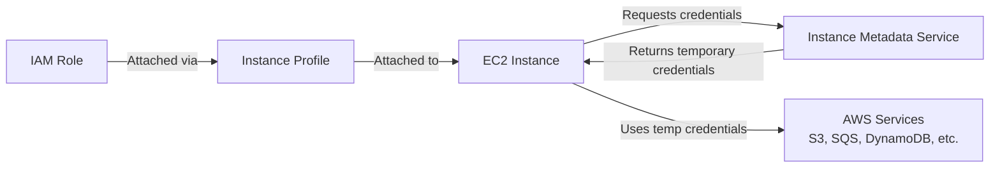

# How to Use EC2 Instance Profiles for IAM Role Access

Author: [nawazdhandala](https://github.com/nawazdhandala)

Tags: AWS, EC2, IAM, Security

Description: Learn how to use EC2 instance profiles to grant IAM role access to your instances, eliminating the need for hard-coded AWS credentials and improving security.

---

If you're still putting AWS access keys on your EC2 instances - in environment variables, config files, or even worse, in your application code - stop. Instance profiles let your EC2 instances assume IAM roles automatically, providing temporary credentials that rotate every few hours without any intervention from you.

It's more secure, easier to manage, and the way AWS intends you to grant permissions to EC2 instances.

## What Are Instance Profiles?

An instance profile is a container for an IAM role. When you attach an instance profile to an EC2 instance, the instance can assume the role and use its permissions. The AWS SDKs and CLI automatically detect and use these credentials through the instance metadata service.

Here's the flow:



The credentials are temporary (they expire and get automatically refreshed), they never touch disk, and they're only available to processes running on that specific instance.

## Creating an IAM Role for EC2

Start by creating an IAM role with a trust policy that allows EC2 to assume it.

Create the role:

```bash
# Create the trust policy
cat > trust-policy.json << 'EOF'
{
  "Version": "2012-10-17",
  "Statement": [
    {
      "Effect": "Allow",
      "Principal": {
        "Service": "ec2.amazonaws.com"
      },
      "Action": "sts:AssumeRole"
    }
  ]
}
EOF

# Create the IAM role
aws iam create-role \
  --role-name EC2AppServerRole \
  --assume-role-policy-document file://trust-policy.json \
  --description "Role for application servers to access AWS services"
```

## Attaching Policies to the Role

Add permissions to the role based on what your application needs. Always follow the principle of least privilege - grant only the permissions your application actually uses.

Attach permissions:

```bash
# Attach an AWS managed policy (e.g., read-only S3 access)
aws iam attach-role-policy \
  --role-name EC2AppServerRole \
  --policy-arn arn:aws:iam::aws:policy/AmazonS3ReadOnlyAccess

# Attach SSM policy for Session Manager access
aws iam attach-role-policy \
  --role-name EC2AppServerRole \
  --policy-arn arn:aws:iam::aws:policy/AmazonSSMManagedInstanceCore
```

For more specific permissions, create a custom policy:

```bash
# Create a custom policy with specific S3 and SQS access
cat > app-policy.json << 'EOF'
{
  "Version": "2012-10-17",
  "Statement": [
    {
      "Sid": "S3Access",
      "Effect": "Allow",
      "Action": [
        "s3:GetObject",
        "s3:PutObject",
        "s3:ListBucket"
      ],
      "Resource": [
        "arn:aws:s3:::my-app-bucket",
        "arn:aws:s3:::my-app-bucket/*"
      ]
    },
    {
      "Sid": "SQSAccess",
      "Effect": "Allow",
      "Action": [
        "sqs:SendMessage",
        "sqs:ReceiveMessage",
        "sqs:DeleteMessage",
        "sqs:GetQueueAttributes"
      ],
      "Resource": "arn:aws:s3:::my-app-queue"
    },
    {
      "Sid": "CloudWatchLogs",
      "Effect": "Allow",
      "Action": [
        "logs:CreateLogGroup",
        "logs:CreateLogStream",
        "logs:PutLogEvents"
      ],
      "Resource": "arn:aws:logs:*:*:log-group:/app/*"
    }
  ]
}
EOF

aws iam create-policy \
  --policy-name EC2AppServerPolicy \
  --policy-document file://app-policy.json

aws iam attach-role-policy \
  --role-name EC2AppServerRole \
  --policy-arn arn:aws:iam::123456789012:policy/EC2AppServerPolicy
```

## Creating the Instance Profile

The instance profile is the bridge between the IAM role and the EC2 instance.

Create and configure the instance profile:

```bash
# Create the instance profile
aws iam create-instance-profile \
  --instance-profile-name EC2AppServerProfile

# Add the role to the instance profile
aws iam add-role-to-instance-profile \
  --instance-profile-name EC2AppServerProfile \
  --role-name EC2AppServerRole
```

## Attaching to a New Instance

Specify the instance profile when launching a new instance.

Launch with the instance profile:

```bash
# Launch an instance with the instance profile
aws ec2 run-instances \
  --image-id ami-0abc123def456 \
  --instance-type t3.medium \
  --key-name my-key \
  --security-group-ids sg-0abc123 \
  --subnet-id subnet-0abc123 \
  --iam-instance-profile Name=EC2AppServerProfile \
  --tag-specifications 'ResourceType=instance,Tags=[{Key=Name,Value=app-server}]'
```

## Attaching to an Existing Instance

You can attach an instance profile to a running instance without stopping it.

Associate the profile with a running instance:

```bash
# Attach instance profile to a running instance
aws ec2 associate-iam-instance-profile \
  --instance-id i-0abc123def456 \
  --iam-instance-profile Name=EC2AppServerProfile

# Verify the association
aws ec2 describe-iam-instance-profile-associations \
  --filters "Name=instance-id,Values=i-0abc123def456"
```

To replace an existing instance profile:

```bash
# First, get the association ID
ASSOC_ID=$(aws ec2 describe-iam-instance-profile-associations \
  --filters "Name=instance-id,Values=i-0abc123def456" \
  --query 'IamInstanceProfileAssociations[0].AssociationId' \
  --output text)

# Replace the instance profile
aws ec2 replace-iam-instance-profile-association \
  --association-id $ASSOC_ID \
  --iam-instance-profile Name=NewEC2AppServerProfile
```

## Verifying the Credentials Work

SSH into the instance and verify that the credentials are available.

Test the instance profile credentials:

```bash
# Check which role is attached (from inside the instance)
curl -s http://169.254.169.254/latest/meta-data/iam/security-credentials/

# Get the actual temporary credentials
curl -s http://169.254.169.254/latest/meta-data/iam/security-credentials/EC2AppServerRole

# Test AWS CLI access (uses instance profile automatically)
aws sts get-caller-identity

# Test specific service access
aws s3 ls s3://my-app-bucket/
```

The AWS CLI and SDKs use the credential provider chain, which checks for instance profile credentials automatically. You don't need to configure anything - it just works.

## Using in Application Code

AWS SDKs automatically detect instance profile credentials. Here are examples in different languages.

Python (boto3):

```python
import boto3

# No credentials needed - boto3 automatically uses the instance profile
s3 = boto3.client('s3')
response = s3.list_objects_v2(Bucket='my-app-bucket')

for obj in response.get('Contents', []):
    print(obj['Key'])
```

Node.js:

```javascript
const { S3Client, ListObjectsV2Command } = require('@aws-sdk/client-s3');

// No credentials needed - SDK uses instance profile automatically
const s3 = new S3Client({ region: 'us-east-1' });

async function listFiles() {
  const command = new ListObjectsV2Command({ Bucket: 'my-app-bucket' });
  const response = await s3.send(command);
  response.Contents.forEach(obj => console.log(obj.Key));
}

listFiles();
```

Java:

```java
import software.amazon.awssdk.services.s3.S3Client;
import software.amazon.awssdk.services.s3.model.ListObjectsV2Request;
import software.amazon.awssdk.services.s3.model.ListObjectsV2Response;

// No credentials needed - SDK uses instance profile automatically
S3Client s3 = S3Client.builder()
    .region(Region.US_EAST_1)
    .build();

ListObjectsV2Response response = s3.listObjectsV2(
    ListObjectsV2Request.builder().bucket("my-app-bucket").build()
);

response.contents().forEach(obj -> System.out.println(obj.key()));
```

## Terraform Setup

Here's the complete instance profile setup in Terraform:

```hcl
# IAM Role
resource "aws_iam_role" "app_server" {
  name = "EC2AppServerRole"

  assume_role_policy = jsonencode({
    Version = "2012-10-17"
    Statement = [{
      Effect    = "Allow"
      Principal = { Service = "ec2.amazonaws.com" }
      Action    = "sts:AssumeRole"
    }]
  })
}

# Custom policy
resource "aws_iam_role_policy" "app_access" {
  name = "app-access"
  role = aws_iam_role.app_server.id

  policy = jsonencode({
    Version = "2012-10-17"
    Statement = [
      {
        Effect   = "Allow"
        Action   = ["s3:GetObject", "s3:PutObject"]
        Resource = "arn:aws:s3:::my-app-bucket/*"
      },
      {
        Effect   = "Allow"
        Action   = ["logs:CreateLogStream", "logs:PutLogEvents"]
        Resource = "*"
      }
    ]
  })
}

# Instance profile
resource "aws_iam_instance_profile" "app_server" {
  name = "EC2AppServerProfile"
  role = aws_iam_role.app_server.name
}

# EC2 instance with instance profile
resource "aws_instance" "app" {
  ami                  = data.aws_ami.amazon_linux.id
  instance_type        = "t3.medium"
  iam_instance_profile = aws_iam_instance_profile.app_server.name

  tags = { Name = "app-server" }
}
```

## Security Best Practices

1. **Never use long-lived access keys on EC2** - always use instance profiles
2. **Follow least privilege** - only grant the specific permissions your app needs
3. **Use resource-level permissions** - specify exact ARNs instead of wildcards
4. **Use condition keys** - restrict permissions by IP range, time, or other conditions
5. **Audit regularly** - use IAM Access Analyzer to find overly permissive policies
6. **Use IMDSv2** - require token-based access to the metadata service

Enforce IMDSv2 to prevent SSRF attacks from exploiting the metadata service:

```bash
# Require IMDSv2 (token-based) on an instance
aws ec2 modify-instance-metadata-options \
  --instance-id i-0abc123 \
  --http-tokens required \
  --http-endpoint enabled
```

For monitoring IAM-related activities and permission issues, check out our guide on [monitoring AWS infrastructure](https://oneuptime.com/blog/post/2026-02-13-aws-cloudwatch-infrastructure-monitoring/view).

## Wrapping Up

Instance profiles are the right way to grant AWS permissions to EC2 instances. They eliminate hard-coded credentials, provide automatic credential rotation, and integrate seamlessly with all AWS SDKs. Create a role, attach policies with least-privilege permissions, wrap it in an instance profile, and attach it to your instance. Your application code doesn't even need to know - the SDK handles credential retrieval automatically.
