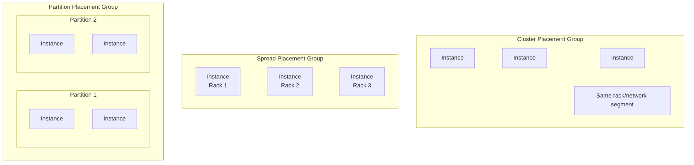

# How to Set Up EC2 Placement Groups for Low Latency

Author: [nawazdhandala](https://github.com/nawazdhandala)

Tags: AWS, EC2, Placement Groups, Networking, Performance

Description: Learn how to use EC2 placement groups to achieve low-latency networking between instances for performance-critical applications.

---

When milliseconds matter, the physical placement of your EC2 instances makes a real difference. Two instances sitting on the same rack can communicate orders of magnitude faster than two instances in different data centers. EC2 placement groups give you control over where AWS puts your instances relative to each other.

This guide covers all three types of placement groups, with a focus on optimizing for low latency.

## What Are Placement Groups?

By default, AWS places your EC2 instances across its infrastructure to minimize correlated failures. That's good for availability but can mean your instances end up far apart physically, adding network latency.

Placement groups let you influence this placement. There are three types:

- **Cluster** - Packs instances close together within a single AZ for lowest latency
- **Spread** - Distributes instances across distinct hardware for maximum availability
- **Partition** - Distributes instances across logical partitions (racks) for large distributed workloads

For low latency, cluster placement groups are what you want. But let's briefly cover all three so you know when to use which.



## Creating a Cluster Placement Group

Cluster placement groups place instances on the same underlying hardware, giving you the lowest possible network latency between them. This is ideal for tightly coupled workloads like HPC, real-time data processing, and high-frequency trading.

This command creates a cluster placement group:

```bash
# Create a cluster placement group
aws ec2 create-placement-group \
  --group-name low-latency-cluster \
  --strategy cluster \
  --tag-specifications 'ResourceType=placement-group,Tags=[{Key=Name,Value=low-latency-cluster},{Key=Environment,Value=production}]'
```

Now launch instances into it:

```bash
# Launch instances in the cluster placement group
aws ec2 run-instances \
  --image-id ami-0abcdef1234567890 \
  --instance-type c5n.18xlarge \
  --count 10 \
  --placement GroupName=low-latency-cluster \
  --key-name my-keypair \
  --security-group-ids sg-0123456789abcdef0 \
  --subnet-id subnet-0123456789abcdef0
```

A few important notes:

- All instances in a cluster placement group must be in the same AZ
- Use the same instance type for all instances - mixing types increases the chance of capacity issues
- The `c5n`, `m5n`, and `r5n` families are optimized for networking and work best in cluster groups
- Launch all instances at the same time if possible - adding instances later might fail if there's not enough co-located capacity

## Enhanced Networking

To get the full benefit of cluster placement groups, make sure enhanced networking is enabled on your instances. Modern instance types have it enabled by default, but it's worth verifying.

This command checks if enhanced networking is enabled on your instance:

```bash
# Check enhanced networking status
aws ec2 describe-instances \
  --instance-ids i-1234567890abcdef0 \
  --query 'Reservations[].Instances[].{
    EnaSupport:EnaSupport,
    SriovSupport:SriovNetSupport
  }'
```

ENA (Elastic Network Adapter) supports up to 100 Gbps networking on supported instance types. Without it, you're capped at much lower throughput.

## Network Performance in Cluster Groups

Here's what you can expect from network performance in a cluster placement group:

| Instance Type | Network Bandwidth | Latency (within cluster) |
|---------------|-------------------|--------------------------|
| c5n.18xlarge  | 100 Gbps          | ~10-25 microseconds      |
| c5.18xlarge   | 25 Gbps           | ~25-50 microseconds      |
| m5.4xlarge    | Up to 10 Gbps     | ~50-100 microseconds     |

Compare this to cross-AZ latency of 1-2 milliseconds - cluster placement groups can be 10-100x faster for inter-instance communication.

## Terraform Configuration

Here's a complete Terraform setup for a low-latency cluster:

```hcl
resource "aws_placement_group" "cluster" {
  name     = "low-latency-cluster"
  strategy = "cluster"
}

resource "aws_launch_template" "hpc" {
  name_prefix   = "hpc-"
  image_id      = var.ami_id
  instance_type = "c5n.18xlarge"
  key_name      = var.key_name

  network_interfaces {
    associate_public_ip_address = false
    security_groups             = [aws_security_group.hpc.id]
  }

  placement {
    group_name = aws_placement_group.cluster.name
  }

  # Enable EFA for even lower latency (HPC workloads)
  # network_interfaces {
  #   interface_type = "efa"
  # }
}

resource "aws_instance" "hpc_node" {
  count = 10

  launch_template {
    id      = aws_launch_template.hpc.id
    version = "$Latest"
  }

  subnet_id = var.subnet_id

  tags = {
    Name = "hpc-node-${count.index + 1}"
  }
}
```

## Elastic Fabric Adapter (EFA) for Ultra-Low Latency

If you need the absolute lowest latency possible (sub-microsecond), look into Elastic Fabric Adapter (EFA). EFA is a network interface that bypasses the operating system kernel, providing direct hardware-level communication between instances.

EFA is only available on specific instance types (c5n.18xlarge, p4d.24xlarge, etc.) and requires a cluster placement group.

This command creates an EFA-enabled network interface:

```bash
# Create an EFA network interface
aws ec2 create-network-interface \
  --subnet-id subnet-0123456789abcdef0 \
  --groups sg-0123456789abcdef0 \
  --interface-type efa \
  --description "EFA interface for HPC"
```

Then attach it to your instance. EFA supports the libfabric API for MPI communication, making it ideal for tightly coupled HPC workloads.

## Best Practices for Low-Latency Placement

1. **Use the same instance type** - This ensures all instances can be placed on the same hardware
2. **Launch together** - Request all instances in a single RunInstances call
3. **Use networking-optimized instances** - The `n` variants (c5n, m5n, r5n) have higher bandwidth
4. **Enable enhanced networking** - Verify ENA is active on all instances
5. **Keep traffic within the placement group** - Cross-group traffic loses the latency benefit
6. **Monitor network performance** - Use CloudWatch metrics like NetworkIn/NetworkOut and track latency with your application

## Handling Capacity Errors

The biggest downside of cluster placement groups is capacity constraints. Since all instances need to be co-located, AWS might not have enough contiguous capacity for your request.

If you get an `InsufficientInstanceCapacity` error:

```bash
# Wait and retry - capacity changes constantly
# Or try a different instance type
# Or try a different AZ

# Check placement group status
aws ec2 describe-placement-groups \
  --group-names low-latency-cluster \
  --query 'PlacementGroups[].{Name:GroupName,State:State,Strategy:Strategy}'
```

To reduce the chance of capacity errors:
- Use instance types with broad availability (m5, c5 families)
- Don't try to pack too many large instances into one cluster
- Have a fallback plan - can your workload tolerate slightly higher latency if co-location isn't possible?

## Measuring the Impact

After setting up your cluster placement group, measure the actual network performance to confirm you're getting the expected benefits.

Use `iperf3` to measure throughput between instances in the cluster:

```bash
# On the server instance
iperf3 -s

# On the client instance
iperf3 -c <server-private-ip> -t 30 -P 4

# For latency testing, use ping
ping -c 100 <server-private-ip> | tail -1
```

You should see single-digit microsecond latencies and multi-gigabit throughput between instances in the same cluster placement group.

## Summary

EC2 placement groups give you control over instance placement that's critical for latency-sensitive workloads. For the lowest latency, use cluster placement groups with networking-optimized instances and enhanced networking. For HPC workloads that need kernel-bypass networking, add EFA. Keep in mind the capacity constraints and plan accordingly. For more specialized placement needs, check out our guides on [spread placement groups for high availability](https://oneuptime.com/blog/post/2026-02-12-spread-placement-groups-high-availability/view) and [cluster placement groups for HPC](https://oneuptime.com/blog/post/2026-02-12-cluster-placement-groups-hpc-workloads/view).
