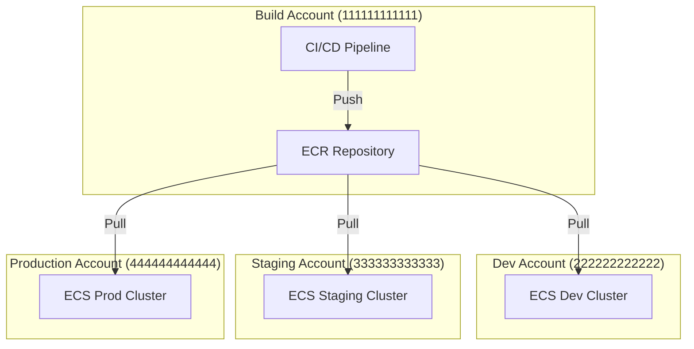

# How to Set Up ECR Cross-Account Image Sharing

Author: [nawazdhandala](https://github.com/nawazdhandala)

Tags: AWS, ECR, Multi-Account, Security, Container Registry

Description: Learn how to share container images across AWS accounts using ECR repository policies, including patterns for organizations with separate build and deployment accounts.

---

Most organizations beyond a certain size run multiple AWS accounts. You might have a shared services account for CI/CD, separate accounts for dev and staging, and a locked-down production account. The question becomes: where do you store container images, and how do other accounts pull them?

The most common pattern is a central ECR repository in a shared account (often the CI/CD or tooling account) with cross-account access configured so deployment accounts can pull images. This keeps image management centralized while letting each environment account run its own ECS clusters.

## The Architecture



Setting this up requires configuration on both sides: a repository policy in the source account and IAM permissions in the destination accounts.

## Step 1: Repository Policy in the Source Account

In the account that owns the ECR repository, set a repository policy that grants pull access to the other accounts.

```hcl
# In the build/shared services account
resource "aws_ecr_repository" "web_app" {
  name = "web-app"

  image_scanning_configuration {
    scan_on_push = true
  }

  image_tag_mutability = "IMMUTABLE"
}

# Grant pull access to dev, staging, and production accounts
resource "aws_ecr_repository_policy" "cross_account" {
  repository = aws_ecr_repository.web_app.name

  policy = jsonencode({
    Version = "2012-10-17"
    Statement = [
      {
        Sid    = "AllowCrossAccountPull"
        Effect = "Allow"
        Principal = {
          AWS = [
            "arn:aws:iam::222222222222:root",  # Dev account
            "arn:aws:iam::333333333333:root",  # Staging account
            "arn:aws:iam::444444444444:root"   # Production account
          ]
        }
        Action = [
          "ecr:GetDownloadUrlForLayer",
          "ecr:BatchGetImage",
          "ecr:BatchCheckLayerAvailability"
        ]
      }
    ]
  })
}
```

Using the CLI:

```bash
# Set repository policy for cross-account access
aws ecr set-repository-policy \
  --repository-name web-app \
  --policy-text '{
    "Version": "2012-10-17",
    "Statement": [
      {
        "Sid": "AllowCrossAccountPull",
        "Effect": "Allow",
        "Principal": {
          "AWS": [
            "arn:aws:iam::222222222222:root",
            "arn:aws:iam::333333333333:root",
            "arn:aws:iam::444444444444:root"
          ]
        },
        "Action": [
          "ecr:GetDownloadUrlForLayer",
          "ecr:BatchGetImage",
          "ecr:BatchCheckLayerAvailability"
        ]
      }
    ]
  }'
```

## Step 2: IAM Permissions in Destination Accounts

In each destination account, the ECS task execution role needs permissions to pull from the cross-account ECR repository. It also needs `ecr:GetAuthorizationToken` which is an account-level permission.

```hcl
# In the dev/staging/production account
resource "aws_iam_role_policy" "ecr_cross_account" {
  name = "ecr-cross-account-pull"
  role = aws_iam_role.ecs_execution_role.id

  policy = jsonencode({
    Version = "2012-10-17"
    Statement = [
      {
        Sid    = "ECRAuth"
        Effect = "Allow"
        Action = [
          "ecr:GetAuthorizationToken"
        ]
        Resource = "*"
      },
      {
        Sid    = "ECRPull"
        Effect = "Allow"
        Action = [
          "ecr:GetDownloadUrlForLayer",
          "ecr:BatchGetImage",
          "ecr:BatchCheckLayerAvailability"
        ]
        Resource = [
          "arn:aws:ecr:us-east-1:111111111111:repository/web-app"
        ]
      }
    ]
  })
}
```

## Step 3: Task Definition with Cross-Account Image

In the destination account's task definition, reference the full image URI from the source account.

```hcl
# In the production account
resource "aws_ecs_task_definition" "web_app" {
  family                   = "web-app"
  network_mode             = "awsvpc"
  requires_compatibilities = ["FARGATE"]
  cpu                      = 512
  memory                   = 1024
  execution_role_arn       = aws_iam_role.ecs_execution_role.arn

  container_definitions = jsonencode([
    {
      name  = "app"
      # Image reference to the source account's ECR
      image = "111111111111.dkr.ecr.us-east-1.amazonaws.com/web-app:v1.2.3"
      essential = true

      portMappings = [
        { containerPort = 8080, protocol = "tcp" }
      ]

      logConfiguration = {
        logDriver = "awslogs"
        options = {
          "awslogs-group"         = "/ecs/web-app"
          "awslogs-region"        = "us-east-1"
          "awslogs-stream-prefix" = "app"
        }
      }
    }
  ])
}
```

## Using AWS Organizations

If your accounts are part of an AWS Organization, you can simplify the repository policy by granting access to the entire organization.

```hcl
resource "aws_ecr_repository_policy" "org_access" {
  repository = aws_ecr_repository.web_app.name

  policy = jsonencode({
    Version = "2012-10-17"
    Statement = [
      {
        Sid    = "AllowOrganizationPull"
        Effect = "Allow"
        Principal = "*"
        Action = [
          "ecr:GetDownloadUrlForLayer",
          "ecr:BatchGetImage",
          "ecr:BatchCheckLayerAvailability"
        ]
        Condition = {
          StringEquals = {
            "aws:PrincipalOrgID" = "o-abc123def4"
          }
        }
      }
    ]
  })
}
```

This is cleaner than listing every account ID and automatically includes new accounts added to the organization.

## Cross-Region Access

ECR repositories are regional. If your source account is in us-east-1 and you need to pull images in eu-west-1, ECS can pull cross-region directly, but it will be slower due to network latency and you'll pay data transfer costs.

For better performance and to reduce cross-region traffic, consider ECR replication.

```hcl
# Set up cross-region replication in the source account
resource "aws_ecr_replication_configuration" "cross_region" {
  replication_configuration {
    rule {
      destination {
        region      = "eu-west-1"
        registry_id = data.aws_caller_identity.current.account_id
      }
    }
  }
}
```

You can also replicate cross-account.

```hcl
resource "aws_ecr_replication_configuration" "cross_account" {
  replication_configuration {
    rule {
      destination {
        region      = "us-east-1"
        registry_id = "444444444444"  # Production account
      }

      repository_filter {
        filter      = "web-app"
        filter_type = "PREFIX_MATCH"
      }
    }
  }
}
```

For cross-account replication, the destination account needs a registry policy allowing the source account to replicate.

```bash
# In the destination account - allow replication from source
aws ecr put-registry-policy \
  --policy-text '{
    "Version": "2012-10-17",
    "Statement": [
      {
        "Sid": "AllowReplication",
        "Effect": "Allow",
        "Principal": {
          "AWS": "arn:aws:iam::111111111111:root"
        },
        "Action": [
          "ecr:CreateRepository",
          "ecr:ReplicateImage"
        ],
        "Resource": "arn:aws:ecr:us-east-1:444444444444:repository/*"
      }
    ]
  }'
```

## Testing Cross-Account Access

After setting everything up, verify it works by pulling an image from the destination account.

```bash
# Authenticate Docker in the destination account
aws ecr get-login-password --region us-east-1 | \
  docker login --username AWS --password-stdin 111111111111.dkr.ecr.us-east-1.amazonaws.com

# Pull the image
docker pull 111111111111.dkr.ecr.us-east-1.amazonaws.com/web-app:v1.2.3
```

If you get authentication errors, check:
1. The repository policy in the source account includes the destination account
2. The IAM role in the destination account has `ecr:GetAuthorizationToken` permission
3. The IAM role has pull permissions scoped to the correct repository ARN

## CI/CD Pipeline Pattern

Here's a typical CI/CD flow for multi-account deployments.

```bash
#!/bin/bash
# build-and-deploy.sh - Run in the build account

# Build and push to ECR
IMAGE_TAG=$(git rev-parse --short HEAD)
ECR_URI="111111111111.dkr.ecr.us-east-1.amazonaws.com/web-app"

docker build -t ${ECR_URI}:${IMAGE_TAG} .
docker push ${ECR_URI}:${IMAGE_TAG}

# Register task definition in the production account
aws ecs register-task-definition \
  --cli-input-json "$(cat task-def.json | jq --arg TAG "$IMAGE_TAG" '.containerDefinitions[0].image = "111111111111.dkr.ecr.us-east-1.amazonaws.com/web-app:" + $TAG')" \
  --region us-east-1 \
  --profile production-deploy

# Update the ECS service
aws ecs update-service \
  --cluster production \
  --service web-app \
  --task-definition web-app \
  --region us-east-1 \
  --profile production-deploy
```

## Security Best Practices

1. **Scope repository policies narrowly** - Grant access to specific accounts, not `*` without conditions
2. **Use immutable tags** - Prevent image tags from being overwritten, which could be a supply chain attack vector
3. **Enable image scanning** - Scan images in the source account before they're available to deployment accounts (see our post on [ECR image scanning](https://oneuptime.com/blog/post/2026-02-12-ecr-image-scanning-vulnerabilities/view))
4. **Audit access** - Use CloudTrail to track who pulls images from your repositories
5. **Use Organizations condition** - If available, use `aws:PrincipalOrgID` instead of listing account IDs

Cross-account ECR sharing is a foundational pattern for multi-account AWS architectures. Set it up once with proper repository policies and replication, and your deployment pipeline works seamlessly across accounts without duplicating images everywhere.
