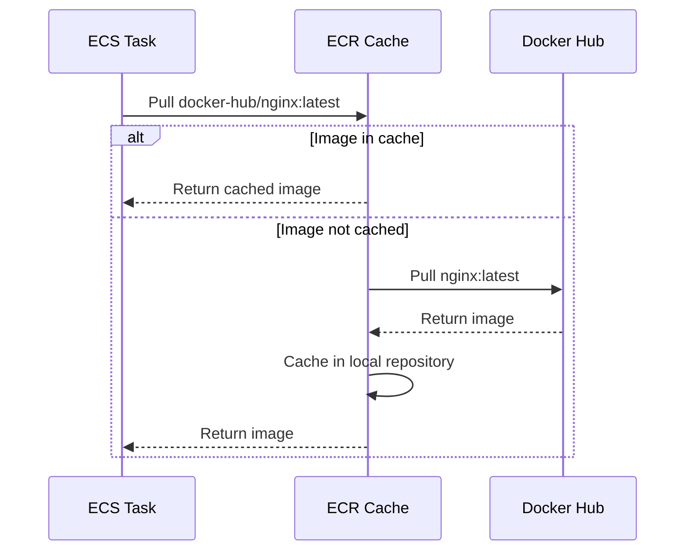

# How to Use ECR Pull-Through Cache for Public Images

Author: [nawazdhandala](https://github.com/nawazdhandala)

Tags: AWS, ECR, Docker Hub, Container Registry, Caching

Description: Learn how to set up ECR pull-through cache rules to cache public container images from Docker Hub, Quay, and other registries, avoiding rate limits and improving reliability.

---

If you're pulling public container images from Docker Hub in your ECS tasks, you're probably hitting rate limits. Docker Hub limits anonymous pulls to 100 per 6 hours and authenticated pulls to 200. When you're running dozens of tasks across multiple clusters, those limits get eaten up fast, and your deployments start failing with pull errors.

ECR pull-through cache solves this. It acts as a caching proxy between your ECS tasks and the upstream registry. The first time you pull an image, ECR fetches it from Docker Hub (or wherever) and stores a copy. Subsequent pulls come from your ECR cache - fast, reliable, and no rate limits.

## How It Works

When you set up a pull-through cache rule, ECR creates a namespace prefix in your registry. Instead of pulling `nginx:latest` from Docker Hub, your tasks pull `YOUR_ACCOUNT.dkr.ecr.REGION.amazonaws.com/docker-hub/nginx:latest`. ECR handles the caching transparently.



## Setting Up a Pull-Through Cache Rule

Create a cache rule that maps a prefix in your ECR to an upstream registry.

```bash
# Cache Docker Hub images
aws ecr create-pull-through-cache-rule \
  --ecr-repository-prefix docker-hub \
  --upstream-registry-url registry-1.docker.io

# Cache Amazon ECR Public Gallery images
aws ecr create-pull-through-cache-rule \
  --ecr-repository-prefix ecr-public \
  --upstream-registry-url public.ecr.aws

# Cache Quay.io images
aws ecr create-pull-through-cache-rule \
  --ecr-repository-prefix quay \
  --upstream-registry-url quay.io

# Cache GitHub Container Registry images
aws ecr create-pull-through-cache-rule \
  --ecr-repository-prefix ghcr \
  --upstream-registry-url ghcr.io
```

In Terraform:

```hcl
resource "aws_ecr_pull_through_cache_rule" "docker_hub" {
  ecr_repository_prefix = "docker-hub"
  upstream_registry_url = "registry-1.docker.io"

  # Optional: credentials for authenticated pulls (higher rate limits)
  credential_arn = aws_secretsmanager_secret.docker_hub_credentials.arn
}

resource "aws_ecr_pull_through_cache_rule" "ecr_public" {
  ecr_repository_prefix = "ecr-public"
  upstream_registry_url = "public.ecr.aws"
}

resource "aws_ecr_pull_through_cache_rule" "quay" {
  ecr_repository_prefix = "quay"
  upstream_registry_url = "quay.io"
}
```

## Using Credentials for Docker Hub

For higher rate limits on Docker Hub (and access to private repos), configure authentication credentials.

```bash
# Store Docker Hub credentials in Secrets Manager
aws secretsmanager create-secret \
  --name ecr-pullthroughcache/docker-hub \
  --secret-string '{"username":"your-docker-username","accessToken":"your-docker-token"}'

# Create the cache rule with credentials
aws ecr create-pull-through-cache-rule \
  --ecr-repository-prefix docker-hub \
  --upstream-registry-url registry-1.docker.io \
  --credential-arn arn:aws:secretsmanager:us-east-1:123456789:secret:ecr-pullthroughcache/docker-hub-AbCdEf
```

In Terraform:

```hcl
# Store Docker Hub credentials
resource "aws_secretsmanager_secret" "docker_hub" {
  name = "ecr-pullthroughcache/docker-hub"
}

resource "aws_secretsmanager_secret_version" "docker_hub" {
  secret_id = aws_secretsmanager_secret.docker_hub.id
  secret_string = jsonencode({
    username    = "your-docker-username"
    accessToken = "your-docker-personal-access-token"
  })
}

# Cache rule with authentication
resource "aws_ecr_pull_through_cache_rule" "docker_hub" {
  ecr_repository_prefix = "docker-hub"
  upstream_registry_url = "registry-1.docker.io"
  credential_arn        = aws_secretsmanager_secret.docker_hub.arn
}
```

## Updating Task Definitions

To use the cache, change your image references in task definitions to use the cache prefix.

Before (pulling directly from Docker Hub):

```json
{
  "containerDefinitions": [
    {
      "name": "nginx",
      "image": "nginx:1.25"
    },
    {
      "name": "redis",
      "image": "redis:7-alpine"
    }
  ]
}
```

After (pulling through ECR cache):

```json
{
  "containerDefinitions": [
    {
      "name": "nginx",
      "image": "123456789.dkr.ecr.us-east-1.amazonaws.com/docker-hub/nginx:1.25"
    },
    {
      "name": "redis",
      "image": "123456789.dkr.ecr.us-east-1.amazonaws.com/docker-hub/redis:7-alpine"
    }
  ]
}
```

For images from Docker Hub's `library` namespace (official images like `nginx`, `redis`), you reference them as `docker-hub/library/nginx` or just `docker-hub/nginx` (ECR handles the library prefix automatically).

For namespaced images (like `grafana/grafana`), use `docker-hub/grafana/grafana`.

## IAM Permissions

Your ECS task execution role needs the standard ECR pull permissions, which the managed `AmazonECSTaskExecutionRolePolicy` already includes. But for the pull-through cache to work, the role also needs permission to create repositories (since ECR auto-creates them on first pull).

```hcl
resource "aws_iam_role_policy" "pull_through_cache" {
  name = "ecr-pull-through-cache"
  role = aws_iam_role.ecs_execution_role.id

  policy = jsonencode({
    Version = "2012-10-17"
    Statement = [
      {
        Effect = "Allow"
        Action = [
          "ecr:GetAuthorizationToken",
          "ecr:BatchGetImage",
          "ecr:GetDownloadUrlForLayer",
          "ecr:BatchCheckLayerAvailability",
          "ecr:BatchImportUpstreamImage",
          "ecr:CreateRepository"
        ]
        Resource = "*"
      }
    ]
  })
}
```

## Cache Behavior

Understanding how the cache behaves helps you avoid surprises:

**First pull**: ECR fetches the image from upstream and caches it. This takes longer than a direct pull because of the extra hop.

**Subsequent pulls**: Served directly from ECR cache. Much faster, no upstream dependency.

**Tag updates**: If the upstream tag changes (like `latest` or `1.25`), ECR doesn't automatically update the cache. You need to delete the cached image or use a specific digest to force a refresh.

**Cache invalidation**: There's no automatic TTL on cached images. If you need the latest version of a mutable tag, delete the cached repository or image first.

```bash
# Force refresh a cached image by deleting the cached copy
aws ecr batch-delete-image \
  --repository-name docker-hub/library/nginx \
  --image-ids imageTag=latest

# Next pull will fetch fresh from Docker Hub
```

## Lifecycle Policies for Cache

Cached images accumulate over time. Apply lifecycle policies to keep storage costs under control.

```hcl
# Lifecycle policy for cached Docker Hub images
resource "aws_ecr_lifecycle_policy" "cache_cleanup" {
  # This repository is auto-created by the pull-through cache
  repository = "docker-hub/library/nginx"

  policy = jsonencode({
    rules = [
      {
        rulePriority = 1
        description  = "Keep last 10 cached image versions"
        selection = {
          tagStatus   = "any"
          countType   = "imageCountMoreThan"
          countNumber = 10
        }
        action = { type = "expire" }
      }
    ]
  })
}
```

The challenge is that repositories are auto-created when images are first pulled. You might need a script or Lambda to apply lifecycle policies to newly created cache repositories.

```python
# Lambda to apply lifecycle policies to new cache repos
import boto3
import json

ecr = boto3.client('ecr')

LIFECYCLE_POLICY = json.dumps({
    "rules": [{
        "rulePriority": 1,
        "description": "Keep last 5 cached versions",
        "selection": {
            "tagStatus": "any",
            "countType": "imageCountMoreThan",
            "countNumber": 5
        },
        "action": {"type": "expire"}
    }]
})

def handler(event, context):
    # List all repositories with cache prefixes
    paginator = ecr.get_paginator('describe_repositories')

    for page in paginator.paginate():
        for repo in page['repositories']:
            name = repo['repositoryName']
            if name.startswith(('docker-hub/', 'ecr-public/', 'quay/')):
                try:
                    ecr.get_lifecycle_policy(repositoryName=name)
                except ecr.exceptions.LifecyclePolicyNotFoundException:
                    print(f"Adding lifecycle policy to {name}")
                    ecr.put_lifecycle_policy(
                        repositoryName=name,
                        lifecyclePolicyText=LIFECYCLE_POLICY
                    )
```

## Dockerfile Updates

If you build images that use public base images, update your Dockerfiles to pull through the cache during builds.

```dockerfile
# Before: pulls directly from Docker Hub
FROM node:18-alpine

# After: pulls through ECR cache
FROM 123456789.dkr.ecr.us-east-1.amazonaws.com/docker-hub/library/node:18-alpine

WORKDIR /app
COPY package*.json ./
RUN npm ci --production
COPY . .
CMD ["node", "server.js"]
```

For CodeBuild, you can configure the environment to use the pull-through cache for build images too.

## Cost vs. Benefits

ECR storage costs $0.10/GB/month for cached images, but you get:

- **No rate limits** - Pull as many images as you need
- **Faster pulls** - Images are in the same region as your ECS cluster
- **Reliability** - Deployments don't fail because Docker Hub is slow or down
- **Network savings** - No data transfer from the internet for cached images

The storage cost for a typical cached image (50-200 MB) is negligible compared to the operational savings.

## Listing Cache Rules

```bash
# List all pull-through cache rules
aws ecr describe-pull-through-cache-rules

# Delete a cache rule
aws ecr delete-pull-through-cache-rule \
  --ecr-repository-prefix docker-hub
```

Pull-through cache is one of those set-and-forget features that eliminates a whole class of deployment failures. If you're using any public container images in your ECS tasks, set it up. Your on-call team will thank you when Docker Hub has its next outage and your deployments keep working. For more on managing your container images, see our post on [managing ECS container images in ECR](https://oneuptime.com/blog/post/manage-ecs-container-images-ecr/view).
