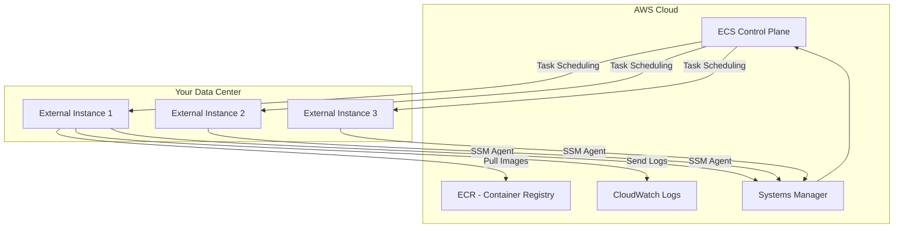

# How to Set Up ECS Anywhere for Hybrid Container Deployments

Author: [nawazdhandala](https://github.com/nawazdhandala)

Tags: AWS, ECS, ECS Anywhere, Hybrid Cloud, On-Premises, Containers

Description: Deploy and manage containers on your on-premises servers and edge locations using Amazon ECS Anywhere with the same ECS APIs and tooling

---

Not everything belongs in the cloud. Maybe you have data sovereignty requirements, legacy hardware you cannot migrate yet, or latency-sensitive workloads that need to run close to your users. ECS Anywhere lets you extend Amazon ECS to your own infrastructure - on-premises servers, edge locations, or even other cloud providers - so you can manage containers everywhere with a single control plane.

This guide walks you through setting up ECS Anywhere from scratch, registering your external instances, and deploying containerized workloads to them.

## What Is ECS Anywhere?

ECS Anywhere extends the ECS control plane to manage containers running on infrastructure outside of AWS. Your external servers register with your ECS cluster as "external instances" and can run ECS tasks just like EC2 instances would.



The key components on each external instance are:

- **SSM Agent** - Manages the connection to AWS Systems Manager
- **ECS Agent** - Manages container lifecycle, same as on EC2
- **Docker** - Container runtime

## Prerequisites

Your external servers need:

- A supported Linux operating system (Amazon Linux 2, Ubuntu 20.04+, RHEL 7+, CentOS 7+, Debian 10+, Fedora 36+, openSUSE Tumbleweed, or SUSE Enterprise Server 15+)
- Docker installed and running
- Outbound internet access to reach AWS APIs (or AWS PrivateLink endpoints)
- At least 1 vCPU and 512MB of RAM available for the ECS agent

## Step 1: Create an ECS Cluster

Create a cluster that will manage both cloud and external instances.

```bash
# Create a cluster for hybrid workloads
aws ecs create-cluster \
  --cluster-name hybrid-cluster \
  --settings "name=containerInsights,value=enabled"
```

## Step 2: Create the Required IAM Role

External instances need an IAM role to communicate with AWS services. This role is assumed via Systems Manager.

```bash
# Create the trust policy for SSM
cat > trust-policy.json << 'EOF'
{
  "Version": "2012-10-17",
  "Statement": [
    {
      "Effect": "Allow",
      "Principal": {
        "Service": "ssm.amazonaws.com"
      },
      "Action": "sts:AssumeRole"
    }
  ]
}
EOF

# Create the IAM role
aws iam create-role \
  --role-name ecsAnywhereRole \
  --assume-role-policy-document file://trust-policy.json

# Attach the required policies
aws iam attach-role-policy \
  --role-name ecsAnywhereRole \
  --policy-arn arn:aws:iam::aws:policy/AmazonSSMManagedInstanceCore

aws iam attach-role-policy \
  --role-name ecsAnywhereRole \
  --policy-arn arn:aws:iam::aws:policy/AmazonEC2ContainerServiceforEC2Role
```

If your tasks pull images from ECR, also attach the ECR read policy.

```bash
# Allow pulling images from ECR
aws iam attach-role-policy \
  --role-name ecsAnywhereRole \
  --policy-arn arn:aws:iam::aws:policy/AmazonEC2ContainerRegistryReadOnly
```

## Step 3: Generate the Activation Key

The activation key is how your external instance authenticates with AWS Systems Manager during initial registration.

```bash
# Create an SSM activation for the external instance
aws ssm create-activation \
  --iam-role ecsAnywhereRole \
  --registration-limit 10 \
  --default-instance-name "ecs-external" \
  --tags "Key=Purpose,Value=ECSAnywhere"
```

This returns an `ActivationId` and `ActivationCode`. Save both - you will need them on the external instance. The activation code is only shown once.

## Step 4: Register the External Instance

SSH into your external server and run the installation script. AWS provides a convenience script that installs the SSM agent, ECS agent, and Docker (if not present).

```bash
# On your external server: download and run the ECS Anywhere install script
curl -o ecs-anywhere-install.sh \
  "https://amazon-ecs-agent.s3.amazonaws.com/ecs-anywhere-install-latest.sh"

# Run the installation
sudo bash ecs-anywhere-install.sh \
  --cluster hybrid-cluster \
  --activation-id "YOUR_ACTIVATION_ID" \
  --activation-code "YOUR_ACTIVATION_CODE" \
  --region us-east-1
```

The script will:

1. Install Docker if it is not already installed
2. Install and configure the SSM agent
3. Register the instance with Systems Manager
4. Install and start the ECS agent
5. Register the instance with your ECS cluster

## Step 5: Verify Registration

Check that the instance appears in your cluster.

```bash
# List container instances in the cluster
aws ecs list-container-instances \
  --cluster hybrid-cluster

# Describe the external instance
aws ecs describe-container-instances \
  --cluster hybrid-cluster \
  --container-instances "arn:aws:ecs:us-east-1:123456789:container-instance/hybrid-cluster/abc123" \
  --query 'containerInstances[0].{Status:status,RegisteredAt:registeredAt,RunningTasks:runningTasksCount,CPU:registeredResources[?name==`CPU`].integerValue,Memory:registeredResources[?name==`MEMORY`].integerValue}'
```

The instance should show as `ACTIVE` with its CPU and memory resources registered.

## Step 6: Create a Task Definition for External Instances

Task definitions for ECS Anywhere use the `EXTERNAL` launch type. They work the same as EC2 task definitions, with a few differences.

```json
{
  "family": "external-web-app",
  "requiresCompatibilities": ["EXTERNAL"],
  "networkMode": "bridge",
  "cpu": "256",
  "memory": "512",
  "containerDefinitions": [
    {
      "name": "web",
      "image": "123456789.dkr.ecr.us-east-1.amazonaws.com/my-app:latest",
      "essential": true,
      "portMappings": [
        {
          "containerPort": 8080,
          "hostPort": 80,
          "protocol": "tcp"
        }
      ],
      "logConfiguration": {
        "logDriver": "awslogs",
        "options": {
          "awslogs-group": "/ecs/external-web-app",
          "awslogs-region": "us-east-1",
          "awslogs-stream-prefix": "external"
        }
      }
    }
  ]
}
```

Note that `awsvpc` network mode is not supported on external instances. Use `bridge` or `host` network mode instead.

```bash
# Register the task definition
aws ecs register-task-definition \
  --cli-input-json file://external-task-def.json
```

## Step 7: Run Tasks on External Instances

You can run one-off tasks or create services.

```bash
# Run a standalone task on external instances
aws ecs run-task \
  --cluster hybrid-cluster \
  --task-definition external-web-app:1 \
  --launch-type EXTERNAL \
  --count 2

# Or create a service for long-running workloads
aws ecs create-service \
  --cluster hybrid-cluster \
  --service-name external-web-service \
  --task-definition external-web-app:1 \
  --desired-count 3 \
  --launch-type EXTERNAL \
  --deployment-configuration "minimumHealthyPercent=50,maximumPercent=200"
```

## Networking Considerations

Since external instances do not have access to AWS VPC networking, you need to handle networking differently:

- **No ALB/NLB integration**: You cannot attach AWS load balancers to external instances. Use your own load balancer (NGINX, HAProxy, etc.) on-premises.
- **No Service Discovery**: AWS Cloud Map does not work with external instances. Use DNS-based discovery or a service mesh like Consul.
- **No awsvpc**: Stick with bridge or host networking modes.

```bash
# Example: Set up NGINX as a load balancer on-premises
# On a separate server, configure NGINX to route to your ECS tasks
```

## Monitoring External Instances

External instances can send container logs to CloudWatch and report metrics via Container Insights.

```bash
# Check the health of external instances
aws ecs describe-container-instances \
  --cluster hybrid-cluster \
  --container-instances $(aws ecs list-container-instances \
    --cluster hybrid-cluster \
    --query 'containerInstanceArns' --output text) \
  --query 'containerInstances[].{Id:ec2InstanceId,Status:status,Agent:agentConnected,Tasks:runningTasksCount}'
```

For comprehensive monitoring, check our guide on [monitoring ECS tasks with CloudWatch metrics](https://oneuptime.com/blog/post/monitor-ecs-tasks-cloudwatch-metrics/view).

## Managing Multiple External Instances

For larger deployments, automate the registration process.

```bash
#!/bin/bash
# Script to register multiple external instances
# Run this on each server via your configuration management tool

CLUSTER="hybrid-cluster"
ACTIVATION_ID="$1"
ACTIVATION_CODE="$2"
REGION="us-east-1"

# Check if already registered
if systemctl is-active --quiet ecs; then
  echo "ECS agent already running, skipping registration"
  exit 0
fi

# Download and run the installer
curl -o /tmp/ecs-install.sh \
  "https://amazon-ecs-agent.s3.amazonaws.com/ecs-anywhere-install-latest.sh"
bash /tmp/ecs-install.sh \
  --cluster "$CLUSTER" \
  --activation-id "$ACTIVATION_ID" \
  --activation-code "$ACTIVATION_CODE" \
  --region "$REGION"
```

## When to Use ECS Anywhere

ECS Anywhere works best for:

- **Hybrid workloads** where some components must stay on-premises
- **Edge computing** where you need containers close to end users or IoT devices
- **Gradual cloud migration** where you want to containerize before migrating
- **Multi-cloud** setups where you want a single container management plane

It is not ideal for:

- Workloads that need tight integration with AWS networking (VPC, ALB, etc.)
- Serverless-style workloads (use Fargate instead)
- Environments without reliable internet connectivity to AWS

## Wrapping Up

ECS Anywhere brings the familiar ECS programming model to your on-premises infrastructure. While it has limitations compared to running in AWS (no VPC networking, no ALB integration, no Fargate), it provides a consistent way to manage containers across hybrid environments. The setup process is straightforward - create a cluster, generate an activation, run the installer on your servers, and start deploying tasks.

For related topics, see our guide on [deploying Docker containers to ECS on EC2](https://oneuptime.com/blog/post/deploy-docker-ecs-ec2/view).
