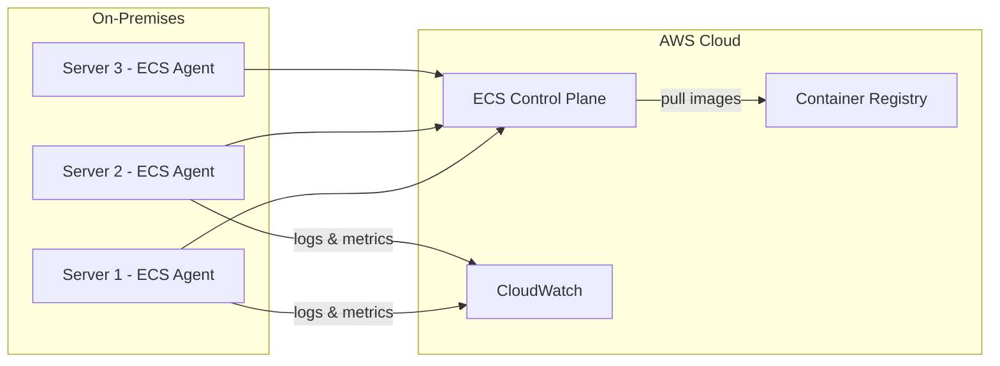

# How to Use ECS Anywhere for Hybrid Deployments

Author: [nawazdhandala](https://github.com/nawazdhandala)

Tags: AWS, ECS, Hybrid Cloud, On-Premises, Containers

Description: Learn how to use ECS Anywhere to run and manage containers on your on-premises servers and edge locations using the same ECS APIs and tools you use in the cloud.

---

Not everything can run in the cloud. Regulatory requirements, data residency laws, latency constraints, or simply having existing on-premises hardware - there are legitimate reasons to keep some workloads running locally. But managing containers across both cloud and on-premises environments usually means running two completely different orchestration systems.

ECS Anywhere lets you register your own servers as ECS capacity and manage them through the same ECS APIs, console, and tools you use for cloud workloads. Your on-premises containers show up in the same cluster as your Fargate tasks. Let's set it up.

## How ECS Anywhere Works

ECS Anywhere installs two agents on your on-premises servers:

1. **Amazon SSM Agent** - Manages the connection between your server and AWS
2. **Amazon ECS Agent** - Registers the server as an ECS container instance and runs tasks



Your servers maintain an outbound connection to AWS. ECS pushes task assignments to the agents, and the agents pull container images and manage container lifecycles locally.

## Prerequisites

Your on-premises servers need:

- A supported Linux distribution (Amazon Linux 2, Ubuntu, RHEL, CentOS, Debian, Fedora, openSUSE)
- Docker installed and running
- Outbound internet access to AWS endpoints (or AWS PrivateLink)
- An IAM role for the ECS agent

## Step 1: Create the ECS Cluster

Create a cluster or use an existing one. ECS Anywhere instances join the cluster alongside any Fargate or EC2 capacity:

```bash
# Create a cluster for hybrid workloads
aws ecs create-cluster \
  --cluster-name hybrid-cluster \
  --settings "name=containerInsights,value=enabled"
```

## Step 2: Create the IAM Role

The ECS agent on your servers needs an IAM role to communicate with AWS services:

```bash
# Create the trust policy for SSM
aws iam create-role \
  --role-name ecsAnywhereRole \
  --assume-role-policy-document '{
    "Version": "2012-10-17",
    "Statement": [
      {
        "Effect": "Allow",
        "Principal": {
          "Service": "ssm.amazonaws.com"
        },
        "Action": "sts:AssumeRole"
      }
    ]
  }'

# Attach the required policies
aws iam attach-role-policy \
  --role-name ecsAnywhereRole \
  --policy-arn arn:aws:iam::aws:policy/AmazonSSMManagedInstanceCore

aws iam attach-role-policy \
  --role-name ecsAnywhereRole \
  --policy-arn arn:aws:iam::aws:policy/service-role/AmazonEC2ContainerServiceforEC2Role
```

If your tasks need to pull images from ECR, add ECR permissions:

```bash
# Add ECR pull permissions
aws iam put-role-policy \
  --role-name ecsAnywhereRole \
  --policy-name ECRPull \
  --policy-document '{
    "Version": "2012-10-17",
    "Statement": [
      {
        "Effect": "Allow",
        "Action": [
          "ecr:GetAuthorizationToken",
          "ecr:BatchCheckLayerAvailability",
          "ecr:GetDownloadUrlForLayer",
          "ecr:BatchGetImage"
        ],
        "Resource": "*"
      }
    ]
  }'
```

## Step 3: Generate the Activation Key

Create an SSM activation that your servers will use to register:

```bash
# Create an SSM activation
aws ssm create-activation \
  --iam-role ecsAnywhereRole \
  --registration-limit 10 \
  --default-instance-name "ecs-anywhere" \
  --tags "Key=Environment,Value=production"
```

This returns an `ActivationId` and `ActivationCode`. You'll need both to register your servers. The `registration-limit` controls how many servers can use this activation.

## Step 4: Register Your Servers

On each on-premises server, run the installation script. AWS provides a helper script that installs both the SSM agent and ECS agent:

```bash
# Download and run the ECS Anywhere installation script
curl --proto "https" -o "ecs-anywhere-install.sh" \
  "https://amazon-ecs-agent.s3.amazonaws.com/ecs-anywhere-install-latest.sh"

# Run the installation
sudo bash ecs-anywhere-install.sh \
  --region us-east-1 \
  --cluster hybrid-cluster \
  --activation-id "ACTIVATION_ID_HERE" \
  --activation-code "ACTIVATION_CODE_HERE"
```

The script installs Docker (if not present), the SSM agent, and the ECS agent. Once complete, the server appears in your ECS cluster as a container instance.

Verify the registration:

```bash
# Check that the instance appears in the cluster
aws ecs list-container-instances \
  --cluster hybrid-cluster \
  --filter "attribute:ecs.os-type == linux"

# Get details about the registered instance
aws ecs describe-container-instances \
  --cluster hybrid-cluster \
  --container-instances arn:aws:ecs:us-east-1:123456789012:container-instance/hybrid-cluster/abc123 \
  --query "containerInstances[0].{id:containerInstanceArn, status:status, cpu:remainingResources[?name=='CPU'].integerValue, memory:remainingResources[?name=='MEMORY'].integerValue, agentVersion:versionInfo.agentVersion}"
```

## Step 5: Deploy Tasks to On-Premises Servers

Create a task definition that targets the EXTERNAL launch type:

```json
{
  "family": "on-prem-app",
  "requiresCompatibilities": ["EXTERNAL"],
  "networkMode": "bridge",
  "cpu": "512",
  "memory": "1024",
  "containerDefinitions": [
    {
      "name": "app",
      "image": "123456789012.dkr.ecr.us-east-1.amazonaws.com/my-app:latest",
      "essential": true,
      "portMappings": [
        {
          "containerPort": 8080,
          "hostPort": 8080,
          "protocol": "tcp"
        }
      ],
      "environment": [
        {"name": "DEPLOYMENT_LOCATION", "value": "on-premises"}
      ],
      "logConfiguration": {
        "logDriver": "awslogs",
        "options": {
          "awslogs-group": "/ecs/on-prem-app",
          "awslogs-region": "us-east-1",
          "awslogs-stream-prefix": "on-prem"
        }
      }
    }
  ]
}
```

Key differences from Fargate task definitions:

- `requiresCompatibilities` is `EXTERNAL` instead of `FARGATE`
- `networkMode` is `bridge` (not `awsvpc` - your servers use standard Docker networking)
- You can use `hostPort` mappings since you control the host

Create an ECS service targeting the EXTERNAL launch type:

```bash
# Create a service that runs on your on-premises servers
aws ecs create-service \
  --cluster hybrid-cluster \
  --service-name on-prem-app \
  --task-definition on-prem-app \
  --desired-count 3 \
  --launch-type EXTERNAL
```

## Hybrid Deployment Pattern

The real power of ECS Anywhere is running the same application in both the cloud and on-premises. You create two services from the same task definition family - one for Fargate and one for EXTERNAL:

```bash
# Cloud deployment (Fargate)
aws ecs create-service \
  --cluster hybrid-cluster \
  --service-name app-cloud \
  --task-definition my-app-fargate \
  --desired-count 5 \
  --launch-type FARGATE \
  --network-configuration '{
    "awsvpcConfiguration": {
      "subnets": ["subnet-abc123"],
      "securityGroups": ["sg-abc123"],
      "assignPublicIp": "DISABLED"
    }
  }'

# On-premises deployment (EXTERNAL)
aws ecs create-service \
  --cluster hybrid-cluster \
  --service-name app-onprem \
  --task-definition my-app-external \
  --desired-count 3 \
  --launch-type EXTERNAL
```

Both services appear in the same cluster, and you manage them through the same API. You can view metrics for both in CloudWatch and use the same deployment tools.

## Monitoring On-Premises Tasks

ECS Anywhere sends logs and metrics to CloudWatch just like cloud-based tasks. If you've enabled Container Insights on the cluster, you'll see per-task metrics for your on-premises instances.

```bash
# Check the status of on-premises tasks
aws ecs list-tasks \
  --cluster hybrid-cluster \
  --service-name on-prem-app \
  --query "taskArns"

# Describe the tasks
aws ecs describe-tasks \
  --cluster hybrid-cluster \
  --tasks $(aws ecs list-tasks --cluster hybrid-cluster --service-name on-prem-app --query "taskArns[0]" --output text) \
  --query "tasks[0].{status:lastStatus, health:healthStatus, startedAt:startedAt}"
```

For more on monitoring, see our guide on [monitoring ECS with Container Insights](https://oneuptime.com/blog/post/2026-02-12-monitor-ecs-container-insights/view).

## Networking Considerations

Since ECS Anywhere servers use `bridge` networking, there are some networking differences to be aware of:

1. **No awsvpc mode.** Your containers share the host's network namespace or use Docker's bridge network. This means port conflicts are possible.

2. **Load balancing.** AWS load balancers can't reach your on-premises servers directly. You'll need an on-premises load balancer (like HAProxy or Nginx) or use DNS-based load balancing.

3. **Service discovery.** Cloud Map doesn't work with EXTERNAL instances. Use your own service discovery mechanism for on-premises services.

4. **Outbound connectivity.** The ECS agent needs to reach AWS endpoints. Make sure your firewall allows HTTPS (port 443) outbound to:
   - `ecs.{region}.amazonaws.com`
   - `ssm.{region}.amazonaws.com`
   - ECR endpoints (if pulling from ECR)
   - CloudWatch endpoints (for logs)

## Updating and Managing Servers

Keep your ECS agent updated on on-premises servers:

```bash
# Check the current agent version
aws ecs describe-container-instances \
  --cluster hybrid-cluster \
  --container-instances $(aws ecs list-container-instances --cluster hybrid-cluster --query "containerInstanceArns[0]" --output text) \
  --query "containerInstances[0].versionInfo"

# Update the agent via SSM
aws ssm send-command \
  --document-name "AWS-RunShellScript" \
  --targets "Key=tag:Environment,Values=production" \
  --parameters 'commands=["sudo yum update -y ecs-init && sudo systemctl restart ecs"]'
```

To deregister a server (for maintenance or decommissioning):

```bash
# Drain the container instance first
aws ecs update-container-instances-state \
  --cluster hybrid-cluster \
  --container-instances arn:aws:ecs:us-east-1:123456789012:container-instance/abc123 \
  --status DRAINING

# Wait for tasks to drain, then deregister
aws ecs deregister-container-instance \
  --cluster hybrid-cluster \
  --container-instance arn:aws:ecs:us-east-1:123456789012:container-instance/abc123
```

## Wrapping Up

ECS Anywhere extends ECS management to your own hardware without requiring you to learn a new orchestration system. You get the same task definitions, the same deployment mechanisms, and the same monitoring tools. It's not perfect - you lose some cloud-native features like awsvpc networking and AWS load balancer integration - but for hybrid scenarios, the unified management experience is a significant operational simplification.

Start by registering one or two test servers, deploy a simple service, and validate that monitoring and logging work correctly. Then expand to your full on-premises fleet.
