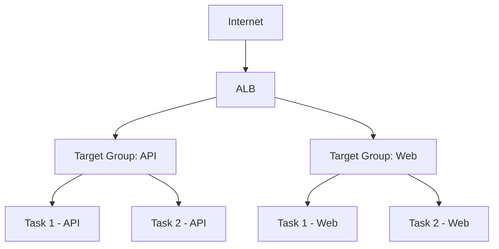

# How to Set Up ECS with Application Load Balancer

Author: [nawazdhandala](https://github.com/nawazdhandala)

Tags: AWS, ECS, ALB, Load Balancer, Containers

Description: A complete guide to setting up an Application Load Balancer with ECS, covering target groups, health checks, path-based routing, SSL termination, and multi-service configurations.

---

An Application Load Balancer (ALB) is the front door for most ECS services. It distributes traffic across your container tasks, handles health checks, terminates SSL, and supports advanced routing that lets multiple services share a single load balancer. Setting it up correctly with ECS takes some attention to detail.

This guide walks through the full setup, from creating the ALB to configuring routing rules for multiple services.

## How ALB Works with ECS

When you attach an ALB to an ECS service, ECS automatically registers and deregisters task IPs (for Fargate) or instance IPs with dynamic ports (for EC2) with the ALB's target group. As tasks scale up, they get registered. As they scale down or fail health checks, they get deregistered.



## Step 1: Create Security Groups

You need separate security groups for the ALB and the ECS tasks.

```bash
# Security group for the ALB - allows traffic from the internet
aws ec2 create-security-group \
  --group-name alb-sg \
  --description "ALB security group" \
  --vpc-id vpc-12345678

aws ec2 authorize-security-group-ingress \
  --group-id sg-alb123 \
  --protocol tcp --port 80 --cidr 0.0.0.0/0

aws ec2 authorize-security-group-ingress \
  --group-id sg-alb123 \
  --protocol tcp --port 443 --cidr 0.0.0.0/0

# Security group for ECS tasks - only allows traffic from the ALB
aws ec2 create-security-group \
  --group-name ecs-tasks-sg \
  --description "ECS tasks security group" \
  --vpc-id vpc-12345678

aws ec2 authorize-security-group-ingress \
  --group-id sg-ecs456 \
  --protocol tcp --port 8080 --source-group sg-alb123
```

The key security principle: the ECS tasks should only accept traffic from the ALB, never directly from the internet.

## Step 2: Create the Application Load Balancer

```bash
# Create the ALB in public subnets
aws elbv2 create-load-balancer \
  --name my-ecs-alb \
  --subnets subnet-public-1 subnet-public-2 \
  --security-groups sg-alb123 \
  --scheme internet-facing \
  --type application \
  --ip-address-type ipv4
```

Save the ALB ARN from the output - you'll need it later.

## Step 3: Create Target Groups

Each ECS service gets its own target group. The target type depends on your launch type.

```bash
# Target group for Fargate services (IP target type)
aws elbv2 create-target-group \
  --name api-service-tg \
  --protocol HTTP \
  --port 8080 \
  --vpc-id vpc-12345678 \
  --target-type ip \
  --health-check-path /health \
  --health-check-protocol HTTP \
  --health-check-interval-seconds 30 \
  --health-check-timeout-seconds 5 \
  --healthy-threshold-count 2 \
  --unhealthy-threshold-count 3 \
  --matcher '{"HttpCode": "200"}'

# Target group for EC2 services (instance target type)
aws elbv2 create-target-group \
  --name web-service-tg \
  --protocol HTTP \
  --port 80 \
  --vpc-id vpc-12345678 \
  --target-type instance \
  --health-check-path /health \
  --health-check-protocol HTTP
```

The health check configuration is crucial. Common settings:

- **path** - an endpoint in your application that returns 200 when the app is ready
- **interval** - how often the ALB checks (30 seconds is a good default)
- **healthy-threshold** - how many consecutive successes before marking healthy
- **unhealthy-threshold** - how many consecutive failures before marking unhealthy
- **timeout** - how long to wait for a health check response

## Step 4: Create Listeners

Listeners define what the ALB listens for and where to route traffic.

```bash
# HTTP listener on port 80 - redirect everything to HTTPS
aws elbv2 create-listener \
  --load-balancer-arn arn:aws:elasticloadbalancing:us-east-1:123456789:loadbalancer/app/my-ecs-alb/abc123 \
  --protocol HTTP \
  --port 80 \
  --default-actions '[{
    "Type": "redirect",
    "RedirectConfig": {
      "Protocol": "HTTPS",
      "Port": "443",
      "StatusCode": "HTTP_301"
    }
  }]'

# HTTPS listener on port 443
aws elbv2 create-listener \
  --load-balancer-arn arn:aws:elasticloadbalancing:us-east-1:123456789:loadbalancer/app/my-ecs-alb/abc123 \
  --protocol HTTPS \
  --port 443 \
  --ssl-policy ELBSecurityPolicy-TLS13-1-2-2021-06 \
  --certificates CertificateArn=arn:aws:acm:us-east-1:123456789:certificate/cert-id \
  --default-actions '[{
    "Type": "forward",
    "TargetGroupArn": "arn:aws:elasticloadbalancing:us-east-1:123456789:targetgroup/api-service-tg/def456"
  }]'
```

The SSL certificate should be created in AWS Certificate Manager (ACM). It's free for ALB use.

## Step 5: Add Path-Based Routing Rules

Route different URL paths to different services sharing the same ALB.

```bash
# Route /api/* to the API service target group
aws elbv2 create-rule \
  --listener-arn arn:aws:elasticloadbalancing:us-east-1:123456789:listener/app/my-ecs-alb/abc123/listener456 \
  --priority 10 \
  --conditions '[{
    "Field": "path-pattern",
    "Values": ["/api/*"]
  }]' \
  --actions '[{
    "Type": "forward",
    "TargetGroupArn": "arn:aws:elasticloadbalancing:us-east-1:123456789:targetgroup/api-service-tg/def456"
  }]'

# Route /admin/* to an admin service target group
aws elbv2 create-rule \
  --listener-arn arn:aws:elasticloadbalancing:us-east-1:123456789:listener/app/my-ecs-alb/abc123/listener456 \
  --priority 20 \
  --conditions '[{
    "Field": "path-pattern",
    "Values": ["/admin/*"]
  }]' \
  --actions '[{
    "Type": "forward",
    "TargetGroupArn": "arn:aws:elasticloadbalancing:us-east-1:123456789:targetgroup/admin-service-tg/ghi789"
  }]'
```

You can also route based on hostname for multi-tenant setups.

```bash
# Host-based routing - route based on the domain name
aws elbv2 create-rule \
  --listener-arn arn:aws:elasticloadbalancing:us-east-1:123456789:listener/app/my-ecs-alb/abc123/listener456 \
  --priority 5 \
  --conditions '[{
    "Field": "host-header",
    "Values": ["api.myapp.com"]
  }]' \
  --actions '[{
    "Type": "forward",
    "TargetGroupArn": "arn:aws:elasticloadbalancing:us-east-1:123456789:targetgroup/api-service-tg/def456"
  }]'
```

## Step 6: Create the ECS Service with ALB

Now tie it all together.

```bash
# Create the ECS service linked to the ALB target group
aws ecs create-service \
  --cluster my-cluster \
  --service-name api-service \
  --task-definition api:1 \
  --desired-count 3 \
  --launch-type FARGATE \
  --network-configuration '{
    "awsvpcConfiguration": {
      "subnets": ["subnet-private-1", "subnet-private-2"],
      "securityGroups": ["sg-ecs456"],
      "assignPublicIp": "DISABLED"
    }
  }' \
  --load-balancers '[{
    "targetGroupArn": "arn:aws:elasticloadbalancing:us-east-1:123456789:targetgroup/api-service-tg/def456",
    "containerName": "api",
    "containerPort": 8080
  }]' \
  --health-check-grace-period-seconds 60 \
  --deployment-configuration '{
    "maximumPercent": 200,
    "minimumHealthyPercent": 100,
    "deploymentCircuitBreaker": {"enable": true, "rollback": true}
  }'
```

The `health-check-grace-period-seconds` is critical. Set it longer than your application's startup time. If your Java app takes 45 seconds to boot, set this to at least 60. Otherwise the ALB will mark your task as unhealthy before it's had a chance to start, ECS will kill it, start a new one, and you'll end up in an infinite restart loop.

## Sticky Sessions

If your application stores session state in memory (which you should avoid, but sometimes can't), enable sticky sessions.

```bash
# Enable sticky sessions on the target group
aws elbv2 modify-target-group-attributes \
  --target-group-arn arn:aws:elasticloadbalancing:us-east-1:123456789:targetgroup/api-service-tg/def456 \
  --attributes \
    Key=stickiness.enabled,Value=true \
    Key=stickiness.type,Value=lb_cookie \
    Key=stickiness.lb_cookie.duration_seconds,Value=86400
```

## Connection Draining

When tasks are deregistered (during deployments or scale-down), the ALB needs time to drain active connections.

```bash
# Set deregistration delay (default is 300 seconds, which is often too long)
aws elbv2 modify-target-group-attributes \
  --target-group-arn arn:aws:elasticloadbalancing:us-east-1:123456789:targetgroup/api-service-tg/def456 \
  --attributes Key=deregistration_delay.timeout_seconds,Value=30
```

For APIs with short-lived requests, 30 seconds is usually sufficient. For WebSocket connections or long-running requests, set it higher.

## Monitoring the ALB

Set up CloudWatch alarms for the ALB metrics that matter most.

```bash
# Alarm on 5xx errors
aws cloudwatch put-metric-alarm \
  --alarm-name alb-5xx-errors \
  --metric-name HTTPCode_Target_5XX_Count \
  --namespace AWS/ApplicationELB \
  --statistic Sum \
  --period 60 \
  --threshold 50 \
  --comparison-operator GreaterThanThreshold \
  --evaluation-periods 3 \
  --dimensions Name=LoadBalancer,Value=app/my-ecs-alb/abc123 \
  --alarm-actions arn:aws:sns:us-east-1:123456789:alerts

# Alarm on unhealthy targets
aws cloudwatch put-metric-alarm \
  --alarm-name alb-unhealthy-targets \
  --metric-name UnHealthyHostCount \
  --namespace AWS/ApplicationELB \
  --statistic Maximum \
  --period 60 \
  --threshold 1 \
  --comparison-operator GreaterThanOrEqualToThreshold \
  --evaluation-periods 2 \
  --dimensions \
    Name=TargetGroup,Value=targetgroup/api-service-tg/def456 \
    Name=LoadBalancer,Value=app/my-ecs-alb/abc123 \
  --alarm-actions arn:aws:sns:us-east-1:123456789:alerts
```

For a comprehensive monitoring setup, check out how to [configure ECS health checks](https://oneuptime.com/blog/post/2026-02-12-ecs-health-checks/view) alongside your ALB.

## Wrapping Up

The ALB is the standard entry point for web-facing ECS services. The setup involves several pieces - security groups, target groups, listeners, and routing rules - but once configured, it handles traffic distribution, SSL termination, and health checking automatically. Use path-based or host-based routing to share a single ALB across multiple services, and always set the health check grace period longer than your application's startup time to avoid the restart loop trap.
