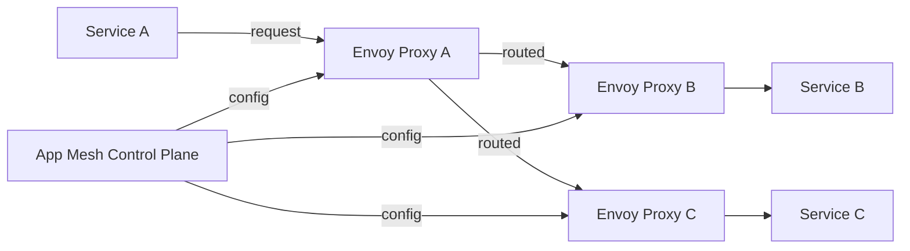

# How to Use ECS with AWS App Mesh for Service Mesh

Author: [nawazdhandala](https://github.com/nawazdhandala)

Tags: AWS, ECS, App Mesh, Microservices, Networking

Description: A practical guide to integrating Amazon ECS with AWS App Mesh for service discovery, traffic management, and observability across your microservices.

---

Running microservices on ECS gets complicated fast. Once you've got five or ten services all talking to each other, you start running into problems - retries, timeouts, circuit breaking, traffic splitting, observability. You can bake all of that into every service individually, or you can push it down to the infrastructure layer with a service mesh.

AWS App Mesh is Amazon's managed service mesh built on Envoy. It gives you consistent traffic management, observability, and security across your ECS services without modifying your application code. Let's walk through how to set it up.

## How App Mesh Works with ECS

At a high level, App Mesh works by injecting an Envoy proxy sidecar into each of your ECS tasks. All inbound and outbound traffic flows through this proxy instead of going directly to your application. The proxy handles routing rules, retries, timeouts, and exports telemetry data.



The App Mesh control plane pushes configuration to each Envoy sidecar, so you don't have to manage Envoy configs by hand. You define your mesh topology using App Mesh resources, and Envoy takes care of the rest.

## Core App Mesh Concepts

Before we start building, you need to understand the main resources:

- **Mesh** - The top-level container for all your service mesh resources
- **Virtual Node** - Represents a specific ECS service. Each virtual node points to a service discovery endpoint.
- **Virtual Service** - An abstraction over your actual services. Other services call the virtual service, not the backing service directly.
- **Virtual Router** - Defines routing rules for a virtual service. You can split traffic, route based on headers, etc.
- **Route** - A rule within a virtual router that matches requests and forwards them to virtual nodes.

## Step 1: Create the Mesh

Start by creating a mesh. This is straightforward:

```bash
# Create the mesh - this is the top-level container for everything
aws appmesh create-mesh \
  --mesh-name my-app-mesh \
  --spec egressFilter={type=DROP_ALL}
```

The `egressFilter` setting of `DROP_ALL` means that traffic can only flow to services that are explicitly defined in the mesh. If you want your services to reach external endpoints, you'd use `ALLOW_ALL` instead or define virtual services for external destinations.

## Step 2: Create Virtual Nodes

Each ECS service gets a virtual node. Here's how to create one for a backend API:

```bash
# Create a virtual node for the backend API service
aws appmesh create-virtual-node \
  --mesh-name my-app-mesh \
  --virtual-node-name backend-api-vn \
  --spec '{
    "serviceDiscovery": {
      "awsCloudMap": {
        "namespaceName": "my-app.local",
        "serviceName": "backend-api"
      }
    },
    "listeners": [
      {
        "portMapping": {
          "port": 8080,
          "protocol": "http"
        },
        "healthCheck": {
          "protocol": "http",
          "path": "/health",
          "healthyThreshold": 2,
          "unhealthyThreshold": 3,
          "timeoutMillis": 2000,
          "intervalMillis": 5000
        }
      }
    ],
    "backends": [
      {
        "virtualService": {
          "virtualServiceName": "database-service.my-app.local"
        }
      }
    ]
  }'
```

The `backends` section declares which other services this node is allowed to talk to. This gives you a clear picture of your service dependencies and prevents unintended communication.

## Step 3: Create Virtual Routers and Routes

Virtual routers handle the actual traffic routing. Here's one with weighted routing for a canary deployment:

```bash
# Create a virtual router with an HTTP listener
aws appmesh create-virtual-router \
  --mesh-name my-app-mesh \
  --virtual-router-name backend-api-vr \
  --spec '{
    "listeners": [
      {
        "portMapping": {
          "port": 8080,
          "protocol": "http"
        }
      }
    ]
  }'

# Create a route that splits traffic between stable and canary versions
aws appmesh create-route \
  --mesh-name my-app-mesh \
  --virtual-router-name backend-api-vr \
  --route-name backend-api-route \
  --spec '{
    "httpRoute": {
      "match": {
        "prefix": "/"
      },
      "action": {
        "weightedTargets": [
          {
            "virtualNode": "backend-api-stable-vn",
            "weight": 90
          },
          {
            "virtualNode": "backend-api-canary-vn",
            "weight": 10
          }
        ]
      },
      "retryPolicy": {
        "maxRetries": 3,
        "perRetryTimeout": {
          "value": 2,
          "unit": "s"
        },
        "httpRetryEvents": ["server-error", "gateway-error"]
      }
    }
  }'
```

This sends 90% of traffic to the stable version and 10% to the canary. The retry policy automatically retries failed requests up to 3 times. You get all of this without changing a single line of application code.

## Step 4: Create Virtual Services

Virtual services tie everything together:

```bash
# Create a virtual service backed by the virtual router
aws appmesh create-virtual-service \
  --mesh-name my-app-mesh \
  --virtual-service-name backend-api.my-app.local \
  --spec '{
    "provider": {
      "virtualRouter": {
        "virtualRouterName": "backend-api-vr"
      }
    }
  }'
```

Other services in the mesh call `backend-api.my-app.local`, and App Mesh routes the request according to the virtual router's rules.

## Step 5: Configure ECS Task Definitions

Now you need to add the Envoy sidecar to your ECS task definitions. Here's the critical part:

```json
{
  "family": "backend-api",
  "networkMode": "awsvpc",
  "requiresCompatibilities": ["FARGATE"],
  "cpu": "512",
  "memory": "1024",
  "proxyConfiguration": {
    "type": "APPMESH",
    "containerName": "envoy",
    "properties": [
      {"name": "IgnoredUID", "value": "1337"},
      {"name": "ProxyIngressPort", "value": "15000"},
      {"name": "ProxyEgressPort", "value": "15001"},
      {"name": "AppPorts", "value": "8080"},
      {"name": "EgressIgnoredIPs", "value": "169.254.170.2,169.254.169.254"}
    ]
  },
  "containerDefinitions": [
    {
      "name": "backend-api",
      "image": "my-registry/backend-api:latest",
      "essential": true,
      "portMappings": [
        {"containerPort": 8080, "protocol": "tcp"}
      ],
      "dependsOn": [
        {"containerName": "envoy", "condition": "HEALTHY"}
      ]
    },
    {
      "name": "envoy",
      "image": "840364872350.dkr.ecr.us-east-1.amazonaws.com/aws-appmesh-envoy:v1.27.0.0-prod",
      "essential": true,
      "environment": [
        {
          "name": "APPMESH_RESOURCE_ARN",
          "value": "arn:aws:appmesh:us-east-1:123456789012:mesh/my-app-mesh/virtualNode/backend-api-vn"
        }
      ],
      "healthCheck": {
        "command": ["CMD-SHELL", "curl -s http://localhost:9901/server_info | grep state | grep -q LIVE"],
        "interval": 5,
        "timeout": 2,
        "retries": 3,
        "startPeriod": 15
      },
      "user": "1337",
      "memory": 256
    }
  ]
}
```

The `proxyConfiguration` block is what tells ECS to set up iptables rules that redirect all traffic through the Envoy sidecar. The `IgnoredUID` of 1337 ensures that Envoy's own traffic doesn't get redirected back to itself.

The `dependsOn` with `HEALTHY` condition makes sure your app doesn't start until Envoy is ready to handle traffic. This prevents request failures during startup.

## Observability with App Mesh

One of the biggest wins of App Mesh is the observability it provides. Envoy exports detailed metrics about every request - latency, error rates, retry counts, connection pools, and more.

You can export these metrics to CloudWatch, X-Ray, or third-party tools. For X-Ray integration, add the X-Ray daemon as another sidecar and enable tracing in the Envoy configuration:

```json
{
  "name": "xray-daemon",
  "image": "amazon/aws-xray-daemon:latest",
  "essential": false,
  "portMappings": [
    {"containerPort": 2000, "protocol": "udp"}
  ],
  "memory": 64
}
```

Then set the `ENABLE_ENVOY_XRAY_TRACING` environment variable to `1` on the Envoy container. You'll get distributed traces across all your services without any instrumentation in your application code.

For more on ECS monitoring, check out our guide on [monitoring ECS with Container Insights](https://oneuptime.com/blog/post/2026-02-12-monitor-ecs-container-insights/view).

## Traffic Management Patterns

App Mesh enables several powerful traffic management patterns:

**Blue/Green Deployments** - Create two virtual nodes (blue and green) and shift all traffic at once by updating the route weights from 100/0 to 0/100.

**Canary Releases** - Gradually shift traffic using weighted targets. Start at 95/5, move to 90/10, then 80/20, and so on.

**Header-Based Routing** - Route requests based on HTTP headers, which is great for testing specific versions:

```json
{
  "httpRoute": {
    "match": {
      "prefix": "/",
      "headers": [
        {
          "name": "x-canary",
          "match": {"exact": "true"}
        }
      ]
    },
    "action": {
      "weightedTargets": [
        {"virtualNode": "backend-api-canary-vn", "weight": 1}
      ]
    }
  }
}
```

## Common Pitfalls

A few things I've seen trip people up:

1. **Forgetting the proxy configuration.** Without the `proxyConfiguration` block in your task definition, traffic won't flow through Envoy and nothing will work.

2. **IAM permissions.** The task execution role needs permission to pull the Envoy image from ECR, and the task role needs `appmesh:StreamAggregatedResources` permission.

3. **DNS resolution.** Make sure your Cloud Map namespaces and service names match what you've configured in the virtual nodes. A mismatch means Envoy can't find the backends.

4. **Health check timing.** Envoy needs time to pull its configuration from the App Mesh control plane. Set an appropriate `startPeriod` on the health check so it doesn't get marked unhealthy during initialization.

## Wrapping Up

AWS App Mesh brings serious service mesh capabilities to ECS without requiring you to manage Envoy configurations by hand. You get traffic management, observability, and resilience features at the infrastructure level. The initial setup takes some effort, but once it's running, managing traffic across your microservices becomes much more straightforward.

Start with a small mesh - maybe two or three services - and expand from there. That way you can learn the patterns and debug issues in a controlled environment before rolling it out to your entire fleet.
