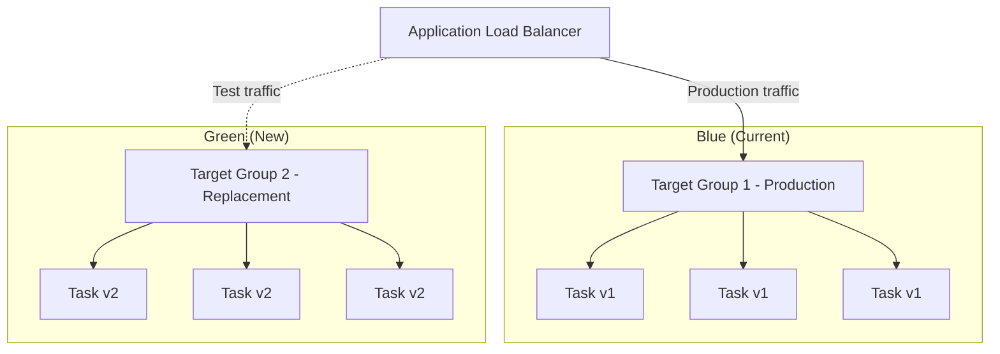

# How to Set Up ECS Blue/Green Deployments with CodeDeploy

Author: [nawazdhandala](https://github.com/nawazdhandala)

Tags: AWS, ECS, CodeDeploy, Blue-Green Deployment, CI/CD

Description: A practical walkthrough of setting up blue/green deployments for ECS services using AWS CodeDeploy, including traffic shifting strategies and rollback configuration.

---

Rolling deployments are simple and work well for most updates. But when you need zero-downtime deployments with instant rollback capability, blue/green deployments are the way to go. With ECS and CodeDeploy, you can run the new version alongside the old one, validate it works, and then shift traffic - all while keeping the old version ready as a fallback.

The idea is simple: instead of replacing tasks in place, you spin up a completely new set of tasks (the "green" environment) alongside the existing ones (the "blue" environment). Traffic shifts to green, and if something goes wrong, you shift back to blue instantly.

## How Blue/Green Works in ECS

The architecture uses two target groups on your Application Load Balancer. CodeDeploy manages the traffic routing between them.



During deployment, CodeDeploy creates the green tasks, optionally routes test traffic to them, then shifts production traffic from the blue target group to the green one. After a configurable wait period, the blue tasks are terminated.

## Setting Up the ALB

You need two target groups and two listeners - one for production traffic and optionally one for test traffic.

```hcl
# Application Load Balancer
resource "aws_lb" "main" {
  name               = "app-alb"
  internal           = false
  load_balancer_type = "application"
  security_groups    = [aws_security_group.alb.id]
  subnets            = var.public_subnet_ids
}

# Production listener
resource "aws_lb_listener" "production" {
  load_balancer_arn = aws_lb.main.arn
  port              = 443
  protocol          = "HTTPS"
  certificate_arn   = var.certificate_arn

  default_action {
    type             = "forward"
    target_group_arn = aws_lb_target_group.blue.arn
  }

  # CodeDeploy will manage this - ignore changes
  lifecycle {
    ignore_changes = [default_action]
  }
}

# Test listener (optional but recommended)
resource "aws_lb_listener" "test" {
  load_balancer_arn = aws_lb.main.arn
  port              = 8443
  protocol          = "HTTPS"
  certificate_arn   = var.certificate_arn

  default_action {
    type             = "forward"
    target_group_arn = aws_lb_target_group.blue.arn
  }

  lifecycle {
    ignore_changes = [default_action]
  }
}

# Blue target group (initial)
resource "aws_lb_target_group" "blue" {
  name        = "app-blue-tg"
  port        = 8080
  protocol    = "HTTP"
  vpc_id      = aws_vpc.main.id
  target_type = "ip"

  health_check {
    path                = "/health"
    healthy_threshold   = 2
    unhealthy_threshold = 3
    interval            = 15
    timeout             = 5
  }
}

# Green target group
resource "aws_lb_target_group" "green" {
  name        = "app-green-tg"
  port        = 8080
  protocol    = "HTTP"
  vpc_id      = aws_vpc.main.id
  target_type = "ip"

  health_check {
    path                = "/health"
    healthy_threshold   = 2
    unhealthy_threshold = 3
    interval            = 15
    timeout             = 5
  }
}
```

## Configuring the ECS Service

The ECS service needs to be configured with the `CODE_DEPLOY` deployment controller instead of the default `ECS` controller.

```hcl
resource "aws_ecs_service" "app" {
  name            = "web-app"
  cluster         = aws_ecs_cluster.main.id
  task_definition = aws_ecs_task_definition.app.arn
  desired_count   = 3
  launch_type     = "FARGATE"

  # Use CodeDeploy for deployments
  deployment_controller {
    type = "CODE_DEPLOY"
  }

  network_configuration {
    subnets         = var.private_subnet_ids
    security_groups = [aws_security_group.task.id]
  }

  load_balancer {
    target_group_arn = aws_lb_target_group.blue.arn
    container_name   = "app"
    container_port   = 8080
  }

  # CodeDeploy manages the task definition, so ignore changes
  lifecycle {
    ignore_changes = [task_definition, load_balancer]
  }
}
```

The `lifecycle` block is important. When CodeDeploy does a deployment, it updates the service's task definition. Terraform shouldn't try to revert that.

## Setting Up CodeDeploy

Create a CodeDeploy application and deployment group for ECS.

```hcl
# CodeDeploy application
resource "aws_codedeploy_app" "app" {
  name             = "web-app"
  compute_platform = "ECS"
}

# IAM role for CodeDeploy
resource "aws_iam_role" "codedeploy" {
  name = "codedeploy-ecs-role"

  assume_role_policy = jsonencode({
    Version = "2012-10-17"
    Statement = [{
      Effect = "Allow"
      Principal = {
        Service = "codedeploy.amazonaws.com"
      }
      Action = "sts:AssumeRole"
    }]
  })
}

resource "aws_iam_role_policy_attachment" "codedeploy" {
  role       = aws_iam_role.codedeploy.name
  policy_arn = "arn:aws:iam::aws:policy/AWSCodeDeployRoleForECS"
}

# Deployment group
resource "aws_codedeploy_deployment_group" "app" {
  app_name               = aws_codedeploy_app.app.name
  deployment_group_name  = "web-app-dg"
  service_role_arn       = aws_iam_role.codedeploy.arn
  deployment_config_name = "CodeDeployDefault.ECSAllAtOnce"

  ecs_service {
    cluster_name = aws_ecs_cluster.main.name
    service_name = aws_ecs_service.app.name
  }

  # Auto rollback on deployment failure or alarms
  auto_rollback_configuration {
    enabled = true
    events  = ["DEPLOYMENT_FAILURE", "DEPLOYMENT_STOP_ON_ALARM"]
  }

  # Traffic shifting configuration
  blue_green_deployment_config {
    deployment_ready_option {
      action_on_timeout = "CONTINUE_DEPLOYMENT"
      wait_time_in_minutes = 5
    }

    terminate_blue_instances_on_deployment_success {
      action                           = "TERMINATE"
      termination_wait_time_in_minutes = 10
    }
  }

  deployment_style {
    deployment_option = "WITH_TRAFFIC_CONTROL"
    deployment_type   = "BLUE_GREEN"
  }

  load_balancer_info {
    target_group_pair_info {
      prod_traffic_route {
        listener_arns = [aws_lb_listener.production.arn]
      }

      test_traffic_route {
        listener_arns = [aws_lb_listener.test.arn]
      }

      target_group {
        name = aws_lb_target_group.blue.name
      }

      target_group {
        name = aws_lb_target_group.green.name
      }
    }
  }
}
```

## Creating a Deployment

To trigger a deployment, create an AppSpec file and start the deployment via the CLI.

Create the AppSpec file.

```yaml
# appspec.yaml
version: 0.0
Resources:
  - TargetService:
      Type: AWS::ECS::Service
      Properties:
        TaskDefinition: "arn:aws:ecs:us-east-1:123456789:task-definition/web-app:5"
        LoadBalancerInfo:
          ContainerName: "app"
          ContainerPort: 8080
```

Trigger the deployment.

```bash
# Start a blue/green deployment
aws deploy create-deployment \
  --application-name web-app \
  --deployment-group-name web-app-dg \
  --revision '{"revisionType":"AppSpecContent","appSpecContent":{"content":"{\"version\":0.0,\"Resources\":[{\"TargetService\":{\"Type\":\"AWS::ECS::Service\",\"Properties\":{\"TaskDefinition\":\"arn:aws:ecs:us-east-1:123456789:task-definition/web-app:5\",\"LoadBalancerInfo\":{\"ContainerName\":\"app\",\"ContainerPort\":8080}}}}]}"}}'
```

## Traffic Shifting Strategies

CodeDeploy supports several traffic shifting strategies:

- **AllAtOnce** - Shift all traffic immediately. Fast but risky.
- **Linear** - Shift a fixed percentage every N minutes (e.g., 10% every 5 minutes).
- **Canary** - Shift a small percentage first, wait, then shift the rest.

```hcl
# Canary deployment config - 10% first, then 100% after 10 minutes
resource "aws_codedeploy_deployment_config" "canary" {
  deployment_config_name = "ECS-Canary-10-10"
  compute_platform       = "ECS"

  traffic_routing_config {
    type = "TimeBasedCanary"

    time_based_canary {
      interval   = 10    # Minutes between shifts
      percentage = 10    # Percentage for the first shift
    }
  }
}

# Linear deployment config - 25% every 5 minutes
resource "aws_codedeploy_deployment_config" "linear" {
  deployment_config_name = "ECS-Linear-25-5"
  compute_platform       = "ECS"

  traffic_routing_config {
    type = "TimeBasedLinear"

    time_based_linear {
      interval   = 5
      percentage = 25
    }
  }
}
```

## Rollback with CloudWatch Alarms

The most powerful feature is automatic rollback based on CloudWatch alarms. If error rates spike during deployment, CodeDeploy rolls back automatically.

```hcl
# Alarm that triggers rollback
resource "aws_cloudwatch_metric_alarm" "high_5xx" {
  alarm_name          = "web-app-high-5xx"
  comparison_operator = "GreaterThanThreshold"
  evaluation_periods  = 2
  metric_name         = "HTTPCode_Target_5XX_Count"
  namespace           = "AWS/ApplicationELB"
  period              = 60
  statistic           = "Sum"
  threshold           = 10
  alarm_description   = "High 5xx error rate - triggers deployment rollback"

  dimensions = {
    LoadBalancer = aws_lb.main.arn_suffix
    TargetGroup  = aws_lb_target_group.green.arn_suffix
  }
}

# Reference the alarm in the deployment group
resource "aws_codedeploy_deployment_group" "app" {
  # ... other config ...

  alarm_configuration {
    alarms  = [aws_cloudwatch_metric_alarm.high_5xx.alarm_name]
    enabled = true
  }
}
```

## Lifecycle Hooks

CodeDeploy supports lifecycle hooks that let you run validation before traffic shifts. You can use Lambda functions to test the green environment before it receives production traffic.

```yaml
# appspec.yaml with hooks
version: 0.0
Resources:
  - TargetService:
      Type: AWS::ECS::Service
      Properties:
        TaskDefinition: "arn:aws:ecs:us-east-1:123456789:task-definition/web-app:5"
        LoadBalancerInfo:
          ContainerName: "app"
          ContainerPort: 8080
Hooks:
  - BeforeAllowTraffic: "arn:aws:lambda:us-east-1:123456789:function:validate-deployment"
  - AfterAllowTraffic: "arn:aws:lambda:us-east-1:123456789:function:post-deploy-checks"
```

Blue/green deployments add complexity compared to rolling updates, but the safety net is worth it for critical services. The ability to validate the new version with test traffic and roll back instantly if something goes wrong can save you from production incidents. For a simpler alternative, check out our post on [rolling deployments in ECS](https://oneuptime.com/blog/post/2026-02-12-rolling-deployments-ecs/view).
