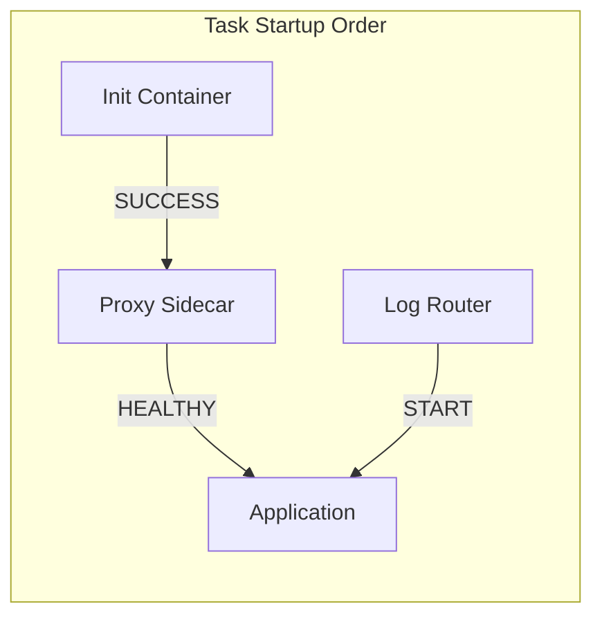

# How to Configure ECS Container Dependencies

Author: [nawazdhandala](https://github.com/nawazdhandala)

Tags: AWS, ECS, Containers, Task Definition, DevOps

Description: Learn how to configure container startup and shutdown ordering in ECS task definitions using dependency conditions like START, HEALTHY, COMPLETE, and SUCCESS.

---

When you run multiple containers in a single ECS task, startup order matters. Your main application might need a sidecar to be running first - maybe a proxy, a log router, or an init container that seeds configuration. Without explicit dependencies, ECS starts all containers simultaneously, and your app might crash because it tries to connect to a sidecar that isn't ready yet.

ECS lets you define dependencies between containers in a task definition. You can say "don't start container A until container B is healthy" or "run container C to completion before starting anything else." Let's walk through how this works.

## Dependency Conditions

ECS supports four dependency conditions:

- **START** - The dependency container has been started. No guarantee it's actually ready.
- **COMPLETE** - The dependency container has run and exited (success or failure).
- **SUCCESS** - The dependency container has run and exited with code 0.
- **HEALTHY** - The dependency container's health check is passing. This is the most useful condition for sidecars.



## Basic Example: App with a Proxy Sidecar

A common pattern is running an application behind an Envoy or Nginx proxy within the same task. The app needs the proxy to be healthy before it starts accepting traffic.

```json
{
  "family": "web-app",
  "networkMode": "awsvpc",
  "requiresCompatibilities": ["FARGATE"],
  "cpu": "512",
  "memory": "1024",
  "containerDefinitions": [
    {
      "name": "envoy",
      "image": "envoyproxy/envoy:v1.28-latest",
      "essential": true,
      "portMappings": [
        { "containerPort": 8080, "protocol": "tcp" }
      ],
      "healthCheck": {
        "command": ["CMD-SHELL", "curl -f http://localhost:9901/ready || exit 1"],
        "interval": 5,
        "timeout": 2,
        "retries": 3,
        "startPeriod": 10
      },
      "logConfiguration": {
        "logDriver": "awslogs",
        "options": {
          "awslogs-group": "/ecs/web-app",
          "awslogs-region": "us-east-1",
          "awslogs-stream-prefix": "envoy"
        }
      }
    },
    {
      "name": "app",
      "image": "123456789.dkr.ecr.us-east-1.amazonaws.com/app:latest",
      "essential": true,
      "dependsOn": [
        {
          "containerName": "envoy",
          "condition": "HEALTHY"
        }
      ],
      "portMappings": [
        { "containerPort": 3000, "protocol": "tcp" }
      ],
      "logConfiguration": {
        "logDriver": "awslogs",
        "options": {
          "awslogs-group": "/ecs/web-app",
          "awslogs-region": "us-east-1",
          "awslogs-stream-prefix": "app"
        }
      }
    }
  ]
}
```

The `dependsOn` on the `app` container means ECS won't start it until the `envoy` container's health check returns success. Without this, the app might start receiving traffic before Envoy is ready to proxy it.

## Init Containers

Init containers run before your main application to perform setup tasks - fetching configuration, running database migrations, warming caches, etc. They run to completion and then stop.

```json
{
  "family": "api-with-migration",
  "networkMode": "awsvpc",
  "requiresCompatibilities": ["FARGATE"],
  "cpu": "512",
  "memory": "1024",
  "containerDefinitions": [
    {
      "name": "db-migrate",
      "image": "123456789.dkr.ecr.us-east-1.amazonaws.com/api:latest",
      "essential": false,
      "command": ["npm", "run", "migrate"],
      "environment": [
        { "name": "DATABASE_URL", "value": "postgresql://db:5432/myapp" }
      ],
      "logConfiguration": {
        "logDriver": "awslogs",
        "options": {
          "awslogs-group": "/ecs/api-migration",
          "awslogs-region": "us-east-1",
          "awslogs-stream-prefix": "migrate"
        }
      }
    },
    {
      "name": "api",
      "image": "123456789.dkr.ecr.us-east-1.amazonaws.com/api:latest",
      "essential": true,
      "dependsOn": [
        {
          "containerName": "db-migrate",
          "condition": "SUCCESS"
        }
      ],
      "command": ["npm", "start"],
      "portMappings": [
        { "containerPort": 8080, "protocol": "tcp" }
      ],
      "logConfiguration": {
        "logDriver": "awslogs",
        "options": {
          "awslogs-group": "/ecs/api",
          "awslogs-region": "us-east-1",
          "awslogs-stream-prefix": "api"
        }
      }
    }
  ]
}
```

Notice that the init container is `essential: false`. If an essential container exits, the entire task stops. Since the init container is supposed to exit, it shouldn't be essential. The `SUCCESS` condition ensures the api container only starts if the migration exits with code 0.

## Terraform Configuration

Here's the same pattern in Terraform.

```hcl
resource "aws_ecs_task_definition" "api" {
  family                   = "api-with-sidecar"
  network_mode             = "awsvpc"
  requires_compatibilities = ["FARGATE"]
  cpu                      = 1024
  memory                   = 2048
  execution_role_arn       = aws_iam_role.execution.arn
  task_role_arn            = aws_iam_role.task.arn

  container_definitions = jsonencode([
    # Init container - runs first
    {
      name      = "config-fetcher"
      image     = "${var.ecr_repo_url}:${var.image_tag}"
      essential = false
      command   = ["sh", "-c", "aws s3 cp s3://my-config/app.conf /shared/app.conf"]

      mountPoints = [
        {
          sourceVolume  = "shared-config"
          containerPath = "/shared"
        }
      ]

      logConfiguration = {
        logDriver = "awslogs"
        options = {
          "awslogs-group"         = "/ecs/config-fetcher"
          "awslogs-region"        = var.region
          "awslogs-stream-prefix" = "init"
        }
      }
    },

    # Log router sidecar
    {
      name      = "log-router"
      image     = "public.ecr.aws/aws-observability/aws-for-fluent-bit:stable"
      essential = true

      firelensConfiguration = {
        type = "fluentbit"
      }

      healthCheck = {
        command     = ["CMD-SHELL", "curl -f http://localhost:2020/api/v1/health || exit 1"]
        interval    = 5
        timeout     = 2
        retries     = 3
        startPeriod = 10
      }
    },

    # Main application - depends on both init and sidecar
    {
      name      = "api"
      image     = "${var.ecr_repo_url}:${var.image_tag}"
      essential = true

      dependsOn = [
        {
          containerName = "config-fetcher"
          condition     = "SUCCESS"
        },
        {
          containerName = "log-router"
          condition     = "HEALTHY"
        }
      ]

      portMappings = [
        { containerPort = 8080, protocol = "tcp" }
      ]

      mountPoints = [
        {
          sourceVolume  = "shared-config"
          containerPath = "/app/config"
          readOnly      = true
        }
      ]

      logConfiguration = {
        logDriver = "awsfirelens"
        options = {
          Name              = "cloudwatch_logs"
          region            = var.region
          log_group_name    = "/ecs/api"
          log_stream_prefix = "api-"
          auto_create_group = "true"
        }
      }
    }
  ])

  volume {
    name = "shared-config"
  }
}
```

## Health Check Requirements

For the `HEALTHY` condition to work, the dependency container MUST have a health check defined. If you use `HEALTHY` without a health check, the task will fail to start.

Good health check patterns for common sidecars:

```json
{
  "envoy": {
    "command": ["CMD-SHELL", "curl -f http://localhost:9901/ready || exit 1"],
    "interval": 5,
    "timeout": 2,
    "retries": 3,
    "startPeriod": 10
  },
  "nginx": {
    "command": ["CMD-SHELL", "curl -f http://localhost:80/health || exit 1"],
    "interval": 5,
    "timeout": 2,
    "retries": 3,
    "startPeriod": 5
  },
  "fluentbit": {
    "command": ["CMD-SHELL", "curl -f http://localhost:2020/api/v1/health || exit 1"],
    "interval": 5,
    "timeout": 2,
    "retries": 3,
    "startPeriod": 10
  }
}
```

## Shutdown Order

Dependencies also affect shutdown order. When a task stops, ECS sends SIGTERM to containers in reverse dependency order. The main application stops first, then the sidecars. This ensures your app finishes its work before the sidecars it depends on go away.

You can control how long ECS waits between SIGTERM and SIGKILL with the `stopTimeout` parameter.

```json
{
  "name": "api",
  "stopTimeout": 30,
  "dependsOn": [
    { "containerName": "envoy", "condition": "HEALTHY" }
  ]
}
```

## Common Patterns

**Application + FireLens log router:**
```
log-router (START) --> app
```

**Application + proxy + init container:**
```
config-init (SUCCESS) --> proxy (HEALTHY) --> app
```

**Application + multiple sidecars:**
```
log-router (START) --> app
proxy (HEALTHY) --> app
metrics-agent (START) --> app
```

## Troubleshooting

**Task stuck in PROVISIONING**: If a dependency container never becomes healthy, the dependent container never starts, and the task stays in PROVISIONING. Check the sidecar's logs and health check configuration.

**Init container keeps restarting**: Make sure the init container is `essential: false`. If it's essential and it exits (even successfully), ECS stops the whole task.

**Wrong condition**: Using `START` when you should use `HEALTHY` means your app might start before the sidecar is actually ready. Always use `HEALTHY` for sidecars that need to be fully initialized.

Container dependencies keep your multi-container tasks running smoothly. Take the time to define them properly, especially for tasks with init containers and proxy sidecars. For more on structuring ECS task definitions, check out our post on [ECS task IAM roles](https://oneuptime.com/blog/post/2026-02-12-configure-ecs-task-iam-roles/view) to make sure each container has the right permissions.
