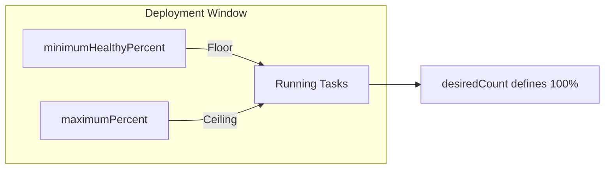

# How to Use ECS Rolling Update Deployment Configuration

Author: [nawazdhandala](https://github.com/nawazdhandala)

Tags: AWS, ECS, Deployments, Rolling Updates, DevOps

Description: Master ECS rolling update deployment configuration to achieve zero-downtime deployments with fine-tuned control over update speed and safety

---

Rolling updates are the default deployment strategy for Amazon ECS services, and for good reason. They let you replace old containers with new ones gradually, keeping your application available throughout the process. But the default settings are not always ideal. Understanding how to tune the deployment configuration can mean the difference between a smooth zero-downtime deploy and an outage.

Let us dig into how ECS rolling updates actually work, how to configure them properly, and what settings to use for different scenarios.

## How ECS Rolling Updates Work

When you update an ECS service (say, by changing the task definition to use a new Docker image), ECS does not replace all tasks at once. Instead, it follows a rolling strategy:

1. ECS launches a batch of new tasks running the updated definition
2. It waits for those tasks to pass health checks
3. It drains connections from a batch of old tasks
4. It stops those old tasks
5. It repeats until all tasks are running the new version

The two key parameters that control this behavior are `minimumHealthyPercent` and `maximumPercent`.

## Understanding the Deployment Parameters



**minimumHealthyPercent** sets the lower bound on the number of tasks that must remain running during a deployment, as a percentage of the desired count. If you have 4 tasks and set this to 50%, ECS will keep at least 2 tasks running at all times.

**maximumPercent** sets the upper bound on the total number of tasks (old + new combined) that can run during deployment. If you have 4 tasks and set this to 200%, ECS can run up to 8 tasks simultaneously during the update.

## Default Configuration

By default, ECS uses these values:

- `minimumHealthyPercent`: 100%
- `maximumPercent`: 200%

This means ECS will never drop below your desired task count and can temporarily double the number of running tasks. It is the safest default because you always maintain full capacity, but it requires enough cluster resources to run double the tasks during deployment.

## Common Deployment Configurations

### Configuration 1: Zero-Downtime with Spare Capacity (Default)

This is the default and works great when you have enough compute headroom.

```json
{
  "deploymentConfiguration": {
    "minimumHealthyPercent": 100,
    "maximumPercent": 200
  },
  "desiredCount": 4
}
```

With 4 desired tasks, ECS will launch new tasks (up to 8 total) before stopping old ones. Your application never drops below 4 tasks.

### Configuration 2: Resource-Constrained Environments

When your cluster does not have room to run extra tasks, you need to stop old ones before starting new ones.

```json
{
  "deploymentConfiguration": {
    "minimumHealthyPercent": 50,
    "maximumPercent": 100
  },
  "desiredCount": 4
}
```

ECS will stop 2 old tasks first, then launch 2 new tasks, bringing you back to 4. Then it repeats for the remaining 2. You temporarily run at 50% capacity, but you never exceed your resource limits.

### Configuration 3: Single Task Service

For services running a single task, you need special handling.

```json
{
  "deploymentConfiguration": {
    "minimumHealthyPercent": 0,
    "maximumPercent": 200
  },
  "desiredCount": 1
}
```

Setting `minimumHealthyPercent` to 0 allows ECS to stop the old task before the new one starts if resources are tight. With `maximumPercent` at 200, it will try to run both simultaneously if possible, but can fall back to stop-then-start.

### Configuration 4: Fast Deployments

When you want to deploy as fast as possible and have plenty of resources.

```json
{
  "deploymentConfiguration": {
    "minimumHealthyPercent": 100,
    "maximumPercent": 300
  },
  "desiredCount": 4
}
```

ECS can spin up all 4 new tasks at once (up to 12 total running), wait for them to be healthy, then drain all 4 old tasks. The deployment completes in a single batch rather than multiple rolling batches.

## Configuring via AWS CLI

You can set deployment configuration when creating or updating a service.

```bash
# Create a service with custom deployment configuration
aws ecs create-service \
  --cluster my-cluster \
  --service-name my-service \
  --task-definition my-app:5 \
  --desired-count 4 \
  --deployment-configuration "minimumHealthyPercent=50,maximumPercent=200"
```

To update an existing service with new deployment settings:

```bash
# Update deployment configuration on an existing service
aws ecs update-service \
  --cluster my-cluster \
  --service-name my-service \
  --deployment-configuration "minimumHealthyPercent=75,maximumPercent=150"
```

## Configuring with CloudFormation

In CloudFormation, the deployment configuration lives inside the service resource.

```yaml
# CloudFormation ECS service with deployment configuration
MyService:
  Type: AWS::ECS::Service
  Properties:
    Cluster: !Ref MyCluster
    ServiceName: my-service
    TaskDefinition: !Ref MyTaskDef
    DesiredCount: 4
    DeploymentConfiguration:
      MinimumHealthyPercent: 75
      MaximumPercent: 150
      DeploymentCircuitBreaker:
        Enable: true
        Rollback: true
```

## Configuring with CDK

If you are using CDK, the deployment configuration is a property on the service construct.

```typescript
// CDK ECS service with deployment configuration
const service = new ecs.FargateService(this, 'Service', {
  cluster,
  taskDefinition: taskDef,
  desiredCount: 4,
  // Fine-tune the rolling update behavior
  minHealthyPercent: 75,
  maxHealthyPercent: 150,
  // Enable circuit breaker for automatic rollback
  circuitBreaker: { rollback: true },
});
```

## Health Check Grace Period

An often overlooked but critical setting is the health check grace period. This tells ECS how long to wait before starting to check the health of newly launched tasks.

```bash
# Set a health check grace period of 120 seconds
aws ecs create-service \
  --cluster my-cluster \
  --service-name my-service \
  --task-definition my-app:5 \
  --desired-count 4 \
  --health-check-grace-period-seconds 120 \
  --deployment-configuration "minimumHealthyPercent=100,maximumPercent=200"
```

If your application takes time to start up (loading caches, warming connections, running migrations), set this grace period long enough to cover the startup time. Without it, ECS might mark healthy-but-slow-starting tasks as unhealthy and keep cycling them, causing the deployment to fail.

## Deployment Circuit Breaker

Pair your rolling update configuration with the deployment circuit breaker. If ECS cannot successfully place new tasks (maybe they keep crashing), the circuit breaker will automatically roll back to the last known good deployment.

```json
{
  "deploymentConfiguration": {
    "minimumHealthyPercent": 100,
    "maximumPercent": 200,
    "deploymentCircuitBreaker": {
      "enable": true,
      "rollback": true
    }
  }
}
```

For more on circuit breakers, check out our guide on [ECS deployment circuit breakers](https://oneuptime.com/blog/post/deployment-circuit-breaker-ecs/view).

## Monitoring Deployments

You should monitor your deployments to catch issues early. Watch for these CloudWatch metrics during a rolling update:

- **RunningTaskCount** - Should stay above your minimum healthy threshold
- **CPUUtilization** and **MemoryUtilization** - Spikes during deployment can indicate resource pressure
- **HealthyHostCount** on the ALB target group - Should never drop to zero

Check our detailed guide on [monitoring ECS tasks with CloudWatch](https://oneuptime.com/blog/post/monitor-ecs-tasks-cloudwatch-metrics/view) for setting up proper alerting.

## Choosing the Right Configuration

Here is a quick decision framework:

| Scenario | minHealthy | maxPercent |
|----------|-----------|------------|
| Production with spare capacity | 100% | 200% |
| Resource-constrained cluster | 50% | 100% |
| Cost-sensitive environment | 50% | 150% |
| Single task service | 0% | 200% |
| Fast deployment needed | 100% | 300% |

The right configuration depends on your tolerance for reduced capacity, your cluster's available resources, and how fast you need deployments to complete.

## Wrapping Up

Rolling update deployment configuration in ECS is straightforward but powerful. The `minimumHealthyPercent` and `maximumPercent` parameters give you fine-grained control over how aggressively ECS replaces tasks during a deployment. Combined with health check grace periods and the deployment circuit breaker, you can build a deployment process that is both fast and safe. Start with the defaults, then tune based on your specific requirements and constraints.
