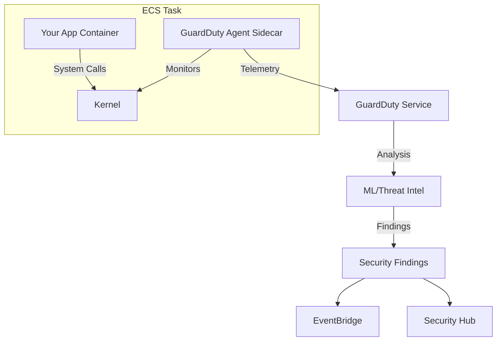

# How to Use ECS Runtime Monitoring with GuardDuty

Author: [nawazdhandala](https://github.com/nawazdhandala)

Tags: AWS, ECS, GuardDuty, Security, Runtime Monitoring, Threat Detection

Description: Enable Amazon GuardDuty runtime monitoring for ECS to detect threats and suspicious behavior in your running containers in real time

---

Your container images might pass vulnerability scans with flying colors, but what happens after deployment? Runtime threats - cryptomining, reverse shells, privilege escalation, data exfiltration - these all happen while containers are running, and static scanning will never catch them. That is where GuardDuty Runtime Monitoring for ECS comes in.

GuardDuty Runtime Monitoring deploys a security agent as a sidecar container in your ECS tasks. This agent monitors operating system-level events (process execution, network connections, file access) and uses machine learning to detect suspicious behavior. Let us set it up.

## How It Works

GuardDuty Runtime Monitoring for ECS uses a lightweight security agent that runs alongside your application containers. The agent collects telemetry about system calls, process activity, DNS queries, and network connections, then sends this data to GuardDuty for analysis.



The agent is managed by AWS and automatically receives updates. You do not need to worry about maintaining it.

## Prerequisites

Before enabling runtime monitoring, make sure you have:

- GuardDuty enabled in your AWS account
- ECS services running on Fargate platform version 1.4.0 or later (or ECS-optimized AMI for EC2 launch type)
- IAM permissions to modify GuardDuty and ECS configurations

## Step 1: Enable GuardDuty Runtime Monitoring

First, enable the runtime monitoring feature in GuardDuty.

```bash
# Get your GuardDuty detector ID
DETECTOR_ID=$(aws guardduty list-detectors --query 'DetectorIds[0]' --output text)

# Enable ECS runtime monitoring
aws guardduty update-detector \
  --detector-id $DETECTOR_ID \
  --features '[{
    "Name": "RUNTIME_MONITORING",
    "Status": "ENABLED",
    "AdditionalConfiguration": [{
      "Name": "ECS_FARGATE_AGENT_MANAGEMENT",
      "Status": "ENABLED"
    }]
  }]'
```

Setting `ECS_FARGATE_AGENT_MANAGEMENT` to `ENABLED` tells GuardDuty to automatically inject the security agent sidecar into your Fargate tasks. This is the easiest approach because you do not need to modify your task definitions.

## Step 2: Configure Auto-Management (Fargate)

With auto-management enabled, GuardDuty automatically adds a sidecar container to your Fargate tasks. You can control which clusters or services get monitored using tags.

```bash
# Tag a cluster to include it in runtime monitoring
aws ecs tag-resource \
  --resource-arn arn:aws:ecs:us-east-1:123456789:cluster/production-cluster \
  --tags key=GuardDutyManaged,value=true
```

To exclude specific services from monitoring:

```bash
# Tag a service to exclude it from runtime monitoring
aws ecs tag-resource \
  --resource-arn arn:aws:ecs:us-east-1:123456789:service/production-cluster/debug-service \
  --tags key=GuardDutyManaged,value=false
```

## Step 3: Configure for EC2 Launch Type

For ECS services running on EC2 instances, you need to enable managed agent configuration.

```bash
# Enable EC2 runtime monitoring
aws guardduty update-detector \
  --detector-id $DETECTOR_ID \
  --features '[{
    "Name": "RUNTIME_MONITORING",
    "Status": "ENABLED",
    "AdditionalConfiguration": [
      {
        "Name": "ECS_FARGATE_AGENT_MANAGEMENT",
        "Status": "ENABLED"
      },
      {
        "Name": "EC2_AGENT_MANAGEMENT",
        "Status": "ENABLED"
      }
    ]
  }]'
```

For EC2 instances, the GuardDuty agent runs as a system-level process rather than a sidecar container. The managed agent is automatically installed and updated on instances running the ECS-optimized AMI.

## Step 4: Verify Runtime Monitoring Is Active

After enabling, verify that the agent is running on your tasks.

```bash
# Check the coverage status for your ECS clusters
aws guardduty list-coverage \
  --detector-id $DETECTOR_ID \
  --filter-criteria '{
    "FilterCriterion": [{
      "CriterionKey": "RESOURCE_TYPE",
      "FilterCondition": {
        "Equals": ["ECS"]
      }
    }]
  }'
```

You can also check individual task coverage.

```bash
# Get detailed coverage statistics
aws guardduty get-coverage-statistics \
  --detector-id $DETECTOR_ID \
  --filter-criteria '{
    "FilterCriterion": [{
      "CriterionKey": "RESOURCE_TYPE",
      "FilterCondition": {
        "Equals": ["ECS"]
      }
    }]
  }' \
  --statistics-type COUNT_BY_COVERAGE_STATUS
```

## Step 5: Set Up Notifications for Findings

When GuardDuty detects a threat, it generates a finding. Set up EventBridge rules to get notified immediately.

```bash
# Create an EventBridge rule for GuardDuty ECS findings
aws events put-rule \
  --name guardduty-ecs-findings \
  --event-pattern '{
    "source": ["aws.guardduty"],
    "detail-type": ["GuardDuty Finding"],
    "detail": {
      "resource": {
        "resourceType": ["ECSCluster"]
      }
    }
  }'

# Add an SNS topic as a target for notifications
aws events put-targets \
  --rule guardduty-ecs-findings \
  --targets "Id=sns-target,Arn=arn:aws:sns:us-east-1:123456789:security-alerts"
```

## Types of Threats Detected

GuardDuty Runtime Monitoring can detect a wide range of threats in your ECS tasks.

**Cryptomining**: Detects processes that communicate with known cryptocurrency mining pools or exhibit mining behavior.

**Malware**: Identifies execution of known malicious binaries, fileless malware, and suspicious file modifications.

**Privilege Escalation**: Catches attempts to escalate privileges within a container, such as modifying cgroup settings or exploiting kernel vulnerabilities.

**Container Escape**: Detects attempts to break out of container isolation, access the host filesystem, or manipulate container runtime settings.

**Reverse Shells**: Identifies network connections that look like reverse shells or command-and-control channels.

**Suspicious DNS**: Catches DNS queries to known malicious domains or unusual DNS activity patterns.

## CloudFormation Setup

Here is a CloudFormation template that sets up GuardDuty runtime monitoring with notifications.

```yaml
AWSTemplateFormatVersion: '2010-09-09'
Description: GuardDuty Runtime Monitoring for ECS

Resources:
  # Enable GuardDuty detector with runtime monitoring
  GuardDutyDetector:
    Type: AWS::GuardDuty::Detector
    Properties:
      Enable: true
      Features:
        - Name: RUNTIME_MONITORING
          Status: ENABLED
          AdditionalConfiguration:
            - Name: ECS_FARGATE_AGENT_MANAGEMENT
              Status: ENABLED

  # SNS topic for security alerts
  SecurityAlertsTopic:
    Type: AWS::SNS::Topic
    Properties:
      TopicName: guardduty-ecs-alerts
      Subscription:
        - Protocol: email
          Endpoint: security-team@example.com

  # EventBridge rule to route findings to SNS
  FindingsRule:
    Type: AWS::Events::Rule
    Properties:
      Name: guardduty-ecs-runtime-findings
      EventPattern:
        source:
          - aws.guardduty
        detail-type:
          - GuardDuty Finding
        detail:
          severity:
            - numeric: [">=", 7]
      Targets:
        - Arn: !Ref SecurityAlertsTopic
          Id: sns-target
```

## Responding to Findings

When you get a GuardDuty finding, here is a general response workflow:

1. **Assess severity** - High and Critical findings need immediate attention
2. **Identify the affected task** - The finding includes the cluster, service, and task ARN
3. **Isolate if necessary** - Update the task's security group to restrict network access
4. **Investigate** - Use ECS Exec to inspect the running container or check CloudWatch logs
5. **Remediate** - Fix the root cause (update image, patch vulnerability, fix misconfiguration)
6. **Deploy fix** - Push a new task definition with the fix

```bash
# Isolate a compromised task by updating its security group
# First, create a restrictive security group
aws ec2 create-security-group \
  --group-name isolated-container \
  --description "Isolated security group for compromised containers" \
  --vpc-id vpc-abc123

# The security group has no ingress/egress rules by default,
# effectively isolating the container from the network
```

For debugging running containers, see our guide on [ECS Exec for interactive container debugging](https://oneuptime.com/blog/post/2026-02-12-ecs-exec-interactive-container-debugging/view).

## Performance Impact

The GuardDuty runtime agent is lightweight. AWS reports less than 1% CPU overhead and minimal memory usage (typically under 50MB). In most workloads, you will not notice any performance difference. However, for extremely latency-sensitive applications, you should benchmark with and without the agent to confirm.

## Cost Considerations

GuardDuty Runtime Monitoring for ECS is priced per vCPU per month for monitored tasks. As of this writing, there is a 30-day free trial when you first enable it. After that, check the current GuardDuty pricing page for your region. The cost is typically small compared to the compute cost of running the tasks themselves.

## Wrapping Up

GuardDuty Runtime Monitoring fills an important gap in container security. Static image scanning and network monitoring are valuable, but they cannot see what happens inside a running container. With runtime monitoring, you get visibility into process execution, file access, and network behavior - the kind of activity that indicates an active compromise. Enable it, set up notifications, and make sure your team has a response plan for when findings come in.

For more on ECS security, see our guide on [configuring ECS task IAM roles](https://oneuptime.com/blog/post/2026-02-12-configure-ecs-task-iam-roles/view).
