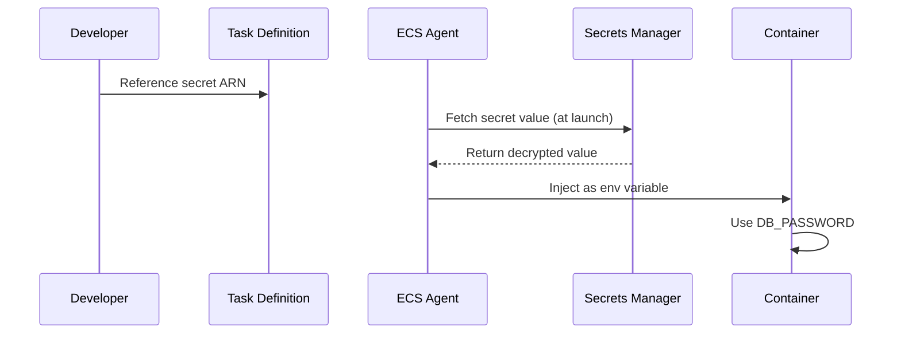

# How to Use ECS with Secrets Manager for Database Credentials

Author: [nawazdhandala](https://github.com/nawazdhandala)

Tags: AWS, ECS, Secrets Manager, Database, Security, Credentials

Description: Securely inject database credentials into ECS tasks using AWS Secrets Manager with automatic rotation and zero plaintext exposure

---

Hardcoding database credentials in environment variables, config files, or Docker images is a security disaster waiting to happen. Even storing them in plain text in parameter store is risky. AWS Secrets Manager gives you encrypted, automatically rotated credentials that ECS can inject directly into your containers at runtime - without your application code ever seeing the secret retrieval logic.

This guide shows you how to set up the complete flow: storing credentials in Secrets Manager, configuring ECS to inject them, setting up automatic rotation, and handling credential changes gracefully.

## The Problem with Plaintext Credentials

If you are currently passing database credentials as plain environment variables in your ECS task definition, anyone with access to describe your task definitions can see them:

```bash
# This exposes your credentials to anyone with ecs:DescribeTaskDefinition
aws ecs describe-task-definition --task-definition my-app:5 \
  --query 'taskDefinition.containerDefinitions[0].environment'
```

The output would show your `DB_PASSWORD` in plain text. That is not acceptable for any serious production environment.

## How ECS Integrates with Secrets Manager

When you reference a Secrets Manager secret in your task definition, the ECS agent fetches the secret value at task launch time and injects it as an environment variable. The secret value never appears in the task definition itself.



## Step 1: Store Database Credentials in Secrets Manager

Create a secret containing your database connection details.

```bash
# Create a secret with database credentials
aws secretsmanager create-secret \
  --name production/myapp/database \
  --description "Production database credentials for my-app" \
  --secret-string '{
    "username": "app_user",
    "password": "S3cureP@ssw0rd!",
    "host": "mydb.cluster-abc123.us-east-1.rds.amazonaws.com",
    "port": "5432",
    "dbname": "myapp_production"
  }'
```

Using a JSON structure for the secret lets you store multiple related values together and reference individual keys from your task definition.

## Step 2: Configure the Task Execution Role

The ECS task execution role needs permission to read from Secrets Manager. This role is used by the ECS agent (not your application) to fetch secrets before starting the container.

```bash
# Create the policy for Secrets Manager access
cat > secrets-policy.json << 'EOF'
{
  "Version": "2012-10-17",
  "Statement": [
    {
      "Effect": "Allow",
      "Action": [
        "secretsmanager:GetSecretValue"
      ],
      "Resource": [
        "arn:aws:secretsmanager:us-east-1:123456789:secret:production/myapp/*"
      ]
    },
    {
      "Effect": "Allow",
      "Action": [
        "kms:Decrypt"
      ],
      "Resource": [
        "arn:aws:kms:us-east-1:123456789:key/your-kms-key-id"
      ]
    }
  ]
}
EOF

# Attach the policy to your task execution role
aws iam put-role-policy \
  --role-name ecsTaskExecutionRole \
  --policy-name SecretsManagerAccess \
  --policy-document file://secrets-policy.json
```

The KMS decrypt permission is only needed if you encrypted the secret with a custom KMS key. If you used the default AWS-managed key, you can skip that part.

## Step 3: Reference Secrets in the Task Definition

In your task definition, use the `secrets` field instead of `environment` to reference Secrets Manager values.

```json
{
  "family": "my-app",
  "executionRoleArn": "arn:aws:iam::123456789:role/ecsTaskExecutionRole",
  "taskRoleArn": "arn:aws:iam::123456789:role/ecsTaskRole",
  "networkMode": "awsvpc",
  "requiresCompatibilities": ["FARGATE"],
  "cpu": "256",
  "memory": "512",
  "containerDefinitions": [
    {
      "name": "app",
      "image": "123456789.dkr.ecr.us-east-1.amazonaws.com/my-app:latest",
      "essential": true,
      "secrets": [
        {
          "name": "DB_USERNAME",
          "valueFrom": "arn:aws:secretsmanager:us-east-1:123456789:secret:production/myapp/database:username::"
        },
        {
          "name": "DB_PASSWORD",
          "valueFrom": "arn:aws:secretsmanager:us-east-1:123456789:secret:production/myapp/database:password::"
        },
        {
          "name": "DB_HOST",
          "valueFrom": "arn:aws:secretsmanager:us-east-1:123456789:secret:production/myapp/database:host::"
        },
        {
          "name": "DB_PORT",
          "valueFrom": "arn:aws:secretsmanager:us-east-1:123456789:secret:production/myapp/database:port::"
        },
        {
          "name": "DB_NAME",
          "valueFrom": "arn:aws:secretsmanager:us-east-1:123456789:secret:production/myapp/database:dbname::"
        }
      ],
      "environment": [
        {
          "name": "NODE_ENV",
          "value": "production"
        }
      ],
      "portMappings": [
        {
          "containerPort": 3000,
          "protocol": "tcp"
        }
      ],
      "logConfiguration": {
        "logDriver": "awslogs",
        "options": {
          "awslogs-group": "/ecs/my-app",
          "awslogs-region": "us-east-1",
          "awslogs-stream-prefix": "ecs"
        }
      }
    }
  ]
}
```

The `valueFrom` format for referencing specific JSON keys is:

```
arn:aws:secretsmanager:REGION:ACCOUNT:secret:SECRET_NAME:JSON_KEY:VERSION_STAGE:VERSION_ID
```

The trailing colons are required even when you omit version stage and version ID (which defaults to the latest version in AWSCURRENT).

## Step 4: Inject the Entire Secret as a Single Variable

If your application expects a connection string rather than individual parameters, you can inject the whole JSON object and parse it in your app.

```json
{
  "secrets": [
    {
      "name": "DB_CREDENTIALS",
      "valueFrom": "arn:aws:secretsmanager:us-east-1:123456789:secret:production/myapp/database"
    }
  ]
}
```

Your application would then parse the JSON:

```javascript
// Parse the full JSON secret in your application
const creds = JSON.parse(process.env.DB_CREDENTIALS);
const connectionString = `postgresql://${creds.username}:${creds.password}@${creds.host}:${creds.port}/${creds.dbname}`;
```

## Step 5: Set Up Automatic Credential Rotation

One of the biggest advantages of Secrets Manager is automatic rotation. For RDS databases, AWS provides built-in rotation Lambda functions.

```bash
# Enable automatic rotation with 30-day interval
aws secretsmanager rotate-secret \
  --secret-id production/myapp/database \
  --rotation-lambda-arn arn:aws:lambda:us-east-1:123456789:function:SecretsManagerRDSRotation \
  --rotation-rules '{"AutomaticallyAfterDays": 30}'
```

For RDS, you can use the built-in rotation template:

```bash
# Set up the rotation Lambda using a SAR template
aws serverlessrepo create-cloud-formation-change-set \
  --application-id arn:aws:serverlessrepo:us-east-1:297356227824:applications/SecretsManagerRDSPostgreSQLRotationSingleUser \
  --stack-name rds-rotation-lambda \
  --parameter-overrides '[
    {"Name": "endpoint", "Value": "https://secretsmanager.us-east-1.amazonaws.com"},
    {"Name": "functionName", "Value": "rds-credential-rotation"}
  ]'
```

## Handling Rotation in Your Application

When credentials rotate, running containers still have the old values. Here is how to handle this:

**Option 1: Redeploy tasks after rotation**

Set up an EventBridge rule that triggers a service update when the secret rotates.

```bash
# EventBridge rule to detect secret rotation
aws events put-rule \
  --name secret-rotation-trigger \
  --event-pattern '{
    "source": ["aws.secretsmanager"],
    "detail-type": ["AWS API Call via CloudTrail"],
    "detail": {
      "eventName": ["RotateSecret"],
      "requestParameters": {
        "secretId": ["production/myapp/database"]
      }
    }
  }'
```

**Option 2: Application-level retry with credential refresh**

Build your application to handle authentication failures by fetching fresh credentials from the Secrets Manager API.

```python
# Python example: retry database connection with fresh credentials
import boto3
import psycopg2
import json

def get_db_credentials():
    """Fetch the latest credentials from Secrets Manager."""
    client = boto3.client('secretsmanager')
    response = client.get_secret_value(SecretId='production/myapp/database')
    return json.loads(response['SecretString'])

def get_connection(retry=True):
    """Connect to database, retry with fresh creds on auth failure."""
    creds = get_db_credentials()
    try:
        return psycopg2.connect(
            host=creds['host'],
            port=creds['port'],
            dbname=creds['dbname'],
            user=creds['username'],
            password=creds['password']
        )
    except psycopg2.OperationalError as e:
        if 'authentication failed' in str(e) and retry:
            # Credentials may have rotated, fetch fresh ones
            creds = get_db_credentials()
            return psycopg2.connect(
                host=creds['host'],
                port=creds['port'],
                dbname=creds['dbname'],
                user=creds['username'],
                password=creds['password']
            )
        raise
```

Note that Option 2 requires your task role (not execution role) to have `secretsmanager:GetSecretValue` permission.

## CDK Configuration

Here is the full setup using AWS CDK.

```typescript
import * as cdk from 'aws-cdk-lib';
import * as ecs from 'aws-cdk-lib/aws-ecs';
import * as secretsmanager from 'aws-cdk-lib/aws-secretsmanager';

// Reference an existing secret
const dbSecret = secretsmanager.Secret.fromSecretNameV2(
  this, 'DbSecret', 'production/myapp/database'
);

// Create the task definition with secret injection
const taskDef = new ecs.FargateTaskDefinition(this, 'TaskDef', {
  memoryLimitMiB: 512,
  cpu: 256,
});

const container = taskDef.addContainer('app', {
  image: ecs.ContainerImage.fromEcrRepository(repo),
  secrets: {
    // Inject individual JSON keys as separate env vars
    DB_USERNAME: ecs.Secret.fromSecretsManager(dbSecret, 'username'),
    DB_PASSWORD: ecs.Secret.fromSecretsManager(dbSecret, 'password'),
    DB_HOST: ecs.Secret.fromSecretsManager(dbSecret, 'host'),
    DB_PORT: ecs.Secret.fromSecretsManager(dbSecret, 'port'),
    DB_NAME: ecs.Secret.fromSecretsManager(dbSecret, 'dbname'),
  },
  logging: ecs.LogDrivers.awsLogs({ streamPrefix: 'app' }),
});
```

CDK automatically grants the task execution role permission to read the secret.

## Wrapping Up

Using Secrets Manager with ECS is the right way to handle database credentials in containers. Your secrets stay encrypted, access is audited through CloudTrail, and rotation can happen automatically. The key points to remember: use the `secrets` field in your task definition (not `environment`), make sure your task execution role has the right permissions, and plan for how your application handles credential rotation.

For related topics, see our guides on [passing environment variables to ECS tasks](https://oneuptime.com/blog/post/pass-environment-variables-ecs-tasks/view) and [configuring ECS task execution roles](https://oneuptime.com/blog/post/configure-ecs-task-execution-roles/view).
