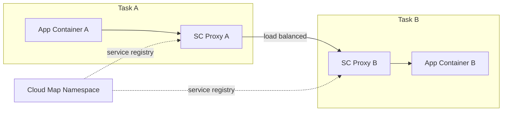

# How to Configure ECS Service Connect for Service-to-Service Communication

Author: [nawazdhandala](https://github.com/nawazdhandala)

Tags: AWS, ECS, Networking, Microservices, Service Mesh

Description: Learn how to set up and configure ECS Service Connect for reliable service-to-service communication with built-in load balancing, retries, and observability.

---

When you've got multiple ECS services that need to talk to each other, you have several options: Cloud Map DNS-based discovery, internal load balancers, App Mesh, or the newer ECS Service Connect. Service Connect sits in a sweet spot - it's simpler than App Mesh but more capable than plain DNS discovery.

Service Connect provides client-side load balancing, automatic retries, and per-service traffic metrics. It runs an Envoy proxy as a sidecar that ECS manages for you, so you don't have to configure Envoy yourself. Let's set it up.

## How Service Connect Works

Service Connect intercepts outbound traffic from your containers and routes it through a managed Envoy proxy. The proxy handles service discovery, load balancing, and retries automatically.



Your application code just connects to `http://service-name:port` and Service Connect handles everything else. No SDK, no client library, no custom discovery logic.

## Prerequisites

You need a Cloud Map namespace. If you don't have one, create it:

```bash
# Create an HTTP namespace for Service Connect
aws servicediscovery create-http-namespace \
  --name production \
  --description "Production services namespace"
```

Note that Service Connect uses HTTP namespaces, not DNS namespaces. This is different from traditional Cloud Map service discovery.

## Configuring Service Connect on the Cluster

First, set the default namespace on your ECS cluster:

```bash
# Update the cluster with the default Service Connect namespace
aws ecs update-cluster \
  --cluster production \
  --service-connect-defaults "namespace=arn:aws:servicediscovery:us-east-1:123456789012:namespace/ns-abc123"
```

This tells ECS which namespace to use by default when services don't specify one.

## Creating a Server Service

A "server" service is one that receives requests from other services. It needs to register its endpoints with Service Connect.

First, create a task definition with port mappings that include a `name` (this is required for Service Connect):

```json
{
  "family": "backend-api",
  "networkMode": "awsvpc",
  "requiresCompatibilities": ["FARGATE"],
  "cpu": "512",
  "memory": "1024",
  "containerDefinitions": [
    {
      "name": "api",
      "image": "my-registry/backend-api:latest",
      "essential": true,
      "portMappings": [
        {
          "name": "api-http",
          "containerPort": 8080,
          "protocol": "tcp",
          "appProtocol": "http"
        }
      ],
      "logConfiguration": {
        "logDriver": "awslogs",
        "options": {
          "awslogs-group": "/ecs/backend-api",
          "awslogs-region": "us-east-1",
          "awslogs-stream-prefix": "api"
        }
      }
    }
  ]
}
```

The `name` field on the port mapping and the `appProtocol` are what Service Connect uses. The `appProtocol` can be `http`, `http2`, or `grpc`.

Now create the ECS service with Service Connect configuration:

```bash
# Create the backend API service with Service Connect
aws ecs create-service \
  --cluster production \
  --service-name backend-api \
  --task-definition backend-api \
  --desired-count 3 \
  --launch-type FARGATE \
  --network-configuration '{
    "awsvpcConfiguration": {
      "subnets": ["subnet-abc123", "subnet-def456"],
      "securityGroups": ["sg-abc123"],
      "assignPublicIp": "DISABLED"
    }
  }' \
  --service-connect-configuration '{
    "enabled": true,
    "namespace": "production",
    "services": [
      {
        "portName": "api-http",
        "discoveryName": "backend-api",
        "clientAliases": [
          {
            "port": 8080,
            "dnsName": "backend-api"
          }
        ]
      }
    ],
    "logConfiguration": {
      "logDriver": "awslogs",
      "options": {
        "awslogs-group": "/ecs/service-connect-proxy",
        "awslogs-region": "us-east-1",
        "awslogs-stream-prefix": "backend-api"
      }
    }
  }'
```

The `clientAliases` section defines the DNS name that other services will use to reach this service. In this case, other services connect to `http://backend-api:8080`.

## Creating a Client Service

A "client" service calls other services but doesn't necessarily receive calls itself. It still needs Service Connect enabled to use the proxy for outbound requests:

```bash
# Create the frontend service that calls the backend API
aws ecs create-service \
  --cluster production \
  --service-name frontend \
  --task-definition frontend \
  --desired-count 2 \
  --launch-type FARGATE \
  --network-configuration '{
    "awsvpcConfiguration": {
      "subnets": ["subnet-abc123", "subnet-def456"],
      "securityGroups": ["sg-frontend"],
      "assignPublicIp": "DISABLED"
    }
  }' \
  --service-connect-configuration '{
    "enabled": true,
    "namespace": "production"
  }'
```

Notice this configuration doesn't have a `services` array - it's a client-only configuration. The frontend can reach the backend at `http://backend-api:8080` through the Service Connect proxy.

In the frontend application code, the call is simple:

```javascript
// The frontend calls the backend API using the Service Connect alias
const response = await fetch('http://backend-api:8080/api/users');
const users = await response.json();
```

No service discovery SDK needed. Just use the DNS name you configured in the `clientAliases`.

## Traffic Management Features

Service Connect provides several traffic management features through the managed Envoy proxy:

### Connection Timeouts

Configure timeouts to prevent slow backends from blocking clients:

```json
{
  "services": [
    {
      "portName": "api-http",
      "discoveryName": "backend-api",
      "timeout": {
        "idleTimeoutSeconds": 300,
        "perRequestTimeoutSeconds": 15
      },
      "clientAliases": [
        {"port": 8080, "dnsName": "backend-api"}
      ]
    }
  ]
}
```

### Load Balancing

Service Connect performs client-side load balancing across all healthy instances of a service. It uses round-robin by default, which distributes requests evenly across available tasks.

### Health Checking

The proxy automatically monitors the health of backend instances and removes unhealthy ones from the load balancing pool. You don't need to configure this - it happens automatically.

## Monitoring Service Connect

Service Connect publishes metrics to CloudWatch under the `AWS/ECS/ManagedScaling` namespace. These include:

- Request count per service
- Response time percentiles (p50, p90, p99)
- Error rates
- Active connection counts

You can also view metrics through the ECS console's Service Connect dashboard, which shows a service map and per-service traffic data.

```bash
# Query Service Connect metrics
aws cloudwatch get-metric-statistics \
  --namespace "AWS/ECS/ManagedScaling" \
  --metric-name RequestCount \
  --dimensions \
    Name=ServiceName,Value=backend-api \
    Name=ClusterName,Value=production \
  --start-time "$(date -u -v-1H +%Y-%m-%dT%H:%M:%SZ)" \
  --end-time "$(date -u +%Y-%m-%dT%H:%M:%SZ)" \
  --period 300 \
  --statistics Sum
```

For deeper monitoring, check out our guide on [monitoring ECS with Container Insights](https://oneuptime.com/blog/post/2026-02-12-monitor-ecs-container-insights/view).

## Service Connect vs Other Options

When should you use Service Connect vs the alternatives?

**Service Connect** is best when:
- You want simple service-to-service communication with built-in load balancing
- You don't need advanced traffic management (weighted routing, header-based routing)
- You want observability without running a full service mesh

**Cloud Map DNS** is sufficient when:
- You just need basic service discovery
- You don't need client-side load balancing or retries
- You want the simplest possible setup

**App Mesh** is better when:
- You need traffic splitting for canary deployments
- You need header-based routing
- You require mTLS between services
- You need full Envoy configuration control

For more on App Mesh, see our post on [using ECS with AWS App Mesh](https://oneuptime.com/blog/post/2026-02-12-ecs-aws-app-mesh-service-mesh/view).

## Common Issues

A few things to watch out for:

1. **Port name is required.** Task definition port mappings used with Service Connect must have a `name` field. Without it, Service Connect can't register the endpoint.

2. **Namespace mismatch.** All services that need to communicate must be in the same namespace. If your frontend is in namespace A and the backend is in namespace B, they can't discover each other.

3. **Security groups.** The proxy uses the same security group as the task. Make sure your security groups allow traffic on the service ports between tasks.

4. **DNS name conflicts.** Don't use DNS names that conflict with real DNS entries. Keep your service aliases short and unique within the namespace.

## Wrapping Up

ECS Service Connect is a solid middle ground between raw DNS discovery and a full service mesh. You get client-side load balancing, automatic health checking, and useful traffic metrics without the complexity of managing Envoy configurations or App Mesh resources. For most microservice architectures on ECS, it's the right choice unless you specifically need the advanced traffic management features of App Mesh.
