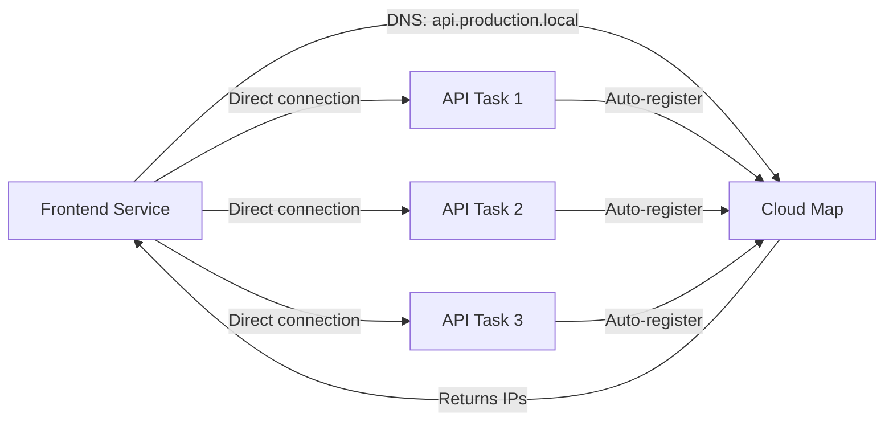

# How to Use ECS Service Discovery with Cloud Map

Author: [nawazdhandala](https://github.com/nawazdhandala)

Tags: AWS, ECS, Cloud Map, Service Discovery, Microservices

Description: Learn how to set up ECS service discovery with AWS Cloud Map so your containers can find each other using DNS names instead of hardcoded endpoints.

---

When you're running microservices on ECS, one of the first challenges is figuring out how services talk to each other. You could put everything behind load balancers, but that adds cost and latency for internal traffic. A cleaner approach is service discovery - letting ECS automatically register and deregister tasks in a DNS namespace so services can find each other by name.

AWS Cloud Map is the service discovery backbone for ECS. It maintains a registry of service instances and makes them available through DNS queries or the Cloud Map API. When an ECS task starts, it registers itself. When it stops, it gets removed. Your services just query a DNS name and get back healthy endpoints.

## How It Works

The architecture is straightforward:

1. You create a Cloud Map namespace (basically a DNS domain)
2. You create Cloud Map services within that namespace
3. ECS automatically registers task IPs as service instances
4. Other services discover endpoints by querying DNS

For example, if your namespace is `production.local` and you have a service called `api`, tasks can reach it at `api.production.local`. The DNS query returns the private IP addresses of healthy tasks.



## Creating a Private DNS Namespace

Start by creating a private DNS namespace in Cloud Map. This namespace is associated with your VPC and only accessible from within it.

Using the AWS CLI:

```bash
# Create a private DNS namespace tied to your VPC
aws servicediscovery create-private-dns-namespace \
  --name production.local \
  --vpc vpc-0abc123def456789 \
  --description "Production service discovery namespace"
```

This creates a Route 53 private hosted zone behind the scenes. You don't need to manage it directly - Cloud Map handles the DNS records.

With Terraform, it looks like this.

```hcl
# Create a Cloud Map namespace for service discovery
resource "aws_service_discovery_private_dns_namespace" "main" {
  name        = "production.local"
  description = "Production service discovery"
  vpc         = aws_vpc.main.id
}
```

## Registering an ECS Service

Now create a Cloud Map service and link it to your ECS service. When tasks start, ECS registers their IPs as A records (or SRV records if you need port info).

```hcl
# Create a Cloud Map service for the API
resource "aws_service_discovery_service" "api" {
  name = "api"

  dns_config {
    namespace_id = aws_service_discovery_private_dns_namespace.main.id

    dns_records {
      ttl  = 10    # Low TTL for faster updates
      type = "A"   # Return IP addresses
    }

    # Use multivalue answer routing for load distribution
    routing_policy = "MULTIVALUE"
  }

  # Health check to remove unhealthy instances
  health_check_custom_config {
    failure_threshold = 1
  }
}

# ECS service with service discovery enabled
resource "aws_ecs_service" "api" {
  name            = "api"
  cluster         = aws_ecs_cluster.main.id
  task_definition = aws_ecs_task_definition.api.arn
  desired_count   = 3
  launch_type     = "FARGATE"

  network_configuration {
    subnets         = var.private_subnet_ids
    security_groups = [aws_security_group.api.id]
  }

  # Link to Cloud Map for service discovery
  service_registries {
    registry_arn = aws_service_discovery_service.api.arn
  }
}
```

The `failure_threshold = 1` in the health check config means a task gets deregistered after one failed health check. ECS manages this automatically - you don't need to configure custom health checkers.

## Using SRV Records

If your services run on non-standard ports or you have multiple containers in a task, SRV records are more useful than A records. SRV records include both the hostname and port number.

```hcl
# Cloud Map service with SRV records
resource "aws_service_discovery_service" "grpc_api" {
  name = "grpc-api"

  dns_config {
    namespace_id = aws_service_discovery_private_dns_namespace.main.id

    dns_records {
      ttl  = 10
      type = "SRV"   # Includes port information
    }

    routing_policy = "MULTIVALUE"
  }

  health_check_custom_config {
    failure_threshold = 1
  }
}

# ECS service - specify which container and port to register
resource "aws_ecs_service" "grpc_api" {
  name            = "grpc-api"
  cluster         = aws_ecs_cluster.main.id
  task_definition = aws_ecs_task_definition.grpc_api.arn
  desired_count   = 3
  launch_type     = "FARGATE"

  network_configuration {
    subnets         = var.private_subnet_ids
    security_groups = [aws_security_group.grpc.id]
  }

  service_registries {
    registry_arn   = aws_service_discovery_service.grpc_api.arn
    container_name = "grpc-server"
    container_port = 50051
  }
}
```

## Querying Service Discovery

From your application code, service discovery is just a DNS lookup. Here's how you'd connect to a discovered service.

```python
# Python example - connecting to a discovered service
import socket
import requests

# Simple DNS resolution
def get_service_endpoints(service_name, namespace="production.local"):
    """Resolve a Cloud Map service to its IP addresses."""
    hostname = f"{service_name}.{namespace}"
    try:
        # getaddrinfo returns all resolved addresses
        results = socket.getaddrinfo(hostname, None)
        ips = list(set(addr[4][0] for addr in results))
        return ips
    except socket.gaierror:
        print(f"Could not resolve {hostname}")
        return []

# Use it to make requests
api_ips = get_service_endpoints("api")
for ip in api_ips:
    response = requests.get(f"http://{ip}:8080/health")
    print(f"{ip}: {response.status_code}")
```

In most cases, you won't even need custom resolution code. Just point your HTTP client at `http://api.production.local:8080` and DNS handles the rest.

```javascript
// Node.js example - just use the DNS name directly
const axios = require('axios');

// DNS resolves to one of the registered task IPs
const response = await axios.get('http://api.production.local:8080/users');
```

## CloudFormation Full Example

Here's a complete CloudFormation template that sets up two services that discover each other.

```yaml
Resources:
  # Service discovery namespace
  ServiceDiscoveryNamespace:
    Type: AWS::ServiceDiscovery::PrivateDnsNamespace
    Properties:
      Name: app.local
      Vpc: !Ref VPC

  # API service discovery entry
  ApiDiscoveryService:
    Type: AWS::ServiceDiscovery::Service
    Properties:
      Name: api
      DnsConfig:
        NamespaceId: !Ref ServiceDiscoveryNamespace
        DnsRecords:
          - Type: A
            TTL: 10
        RoutingPolicy: MULTIVALUE
      HealthCheckCustomConfig:
        FailureThreshold: 1

  # Worker service discovery entry
  WorkerDiscoveryService:
    Type: AWS::ServiceDiscovery::Service
    Properties:
      Name: worker
      DnsConfig:
        NamespaceId: !Ref ServiceDiscoveryNamespace
        DnsRecords:
          - Type: A
            TTL: 10
        RoutingPolicy: MULTIVALUE
      HealthCheckCustomConfig:
        FailureThreshold: 1

  # API ECS service
  ApiService:
    Type: AWS::ECS::Service
    Properties:
      Cluster: !Ref ECSCluster
      TaskDefinition: !Ref ApiTaskDef
      DesiredCount: 3
      LaunchType: FARGATE
      NetworkConfiguration:
        AwsvpcConfiguration:
          Subnets:
            - !Ref PrivateSubnet1
            - !Ref PrivateSubnet2
          SecurityGroups:
            - !Ref ApiSecurityGroup
      ServiceRegistries:
        - RegistryArn: !GetAtt ApiDiscoveryService.Arn
```

## DNS TTL and Caching

One thing to watch out for is DNS caching. Cloud Map records have a TTL (time to live) that determines how long resolvers cache the results. If a task goes down and you have a high TTL, clients might still try to connect to the old IP.

Set your TTL low - 10 seconds is a good default. Some DNS resolvers (including the one in your VPC) might not respect very low TTLs, but 10 seconds is generally honored.

Also, many HTTP clients and language runtimes cache DNS results themselves. Make sure your application respects TTL values. In Java, for example, the JVM caches DNS results indefinitely by default - you'll need to set `networkaddress.cache.ttl` in your security properties.

```java
// Java - prevent infinite DNS caching
java.security.Security.setProperty("networkaddress.cache.ttl", "10");
```

## When to Use Service Discovery vs. Load Balancers

Service discovery and load balancers solve overlapping problems, but they're not interchangeable.

**Use service discovery when:**
- Services communicate internally within the VPC
- You want client-side load balancing
- You need gRPC or other non-HTTP protocols
- Cost matters (no ALB charges)

**Use a load balancer when:**
- You need path-based routing
- You want SSL termination
- External traffic needs to reach your service
- You need sticky sessions or advanced routing

Many architectures use both - a load balancer for external traffic and service discovery for internal communication. It's not an either-or decision.

For monitoring service-to-service communication and tracking down failures in your discovery setup, check out our guide on [monitoring microservices](https://oneuptime.com/blog/post/aws-infrastructure-monitoring/view) for observability patterns that work well with Cloud Map.

## Troubleshooting

If services can't discover each other, check these things:

1. **Security groups** - Make sure the calling service's security group allows outbound traffic and the target service's security group allows inbound on the right port.
2. **VPC DNS settings** - `enableDnsSupport` and `enableDnsHostnames` must both be true on your VPC.
3. **Namespace VPC** - The Cloud Map namespace must be in the same VPC as your services, or you need VPC peering.
4. **Task health** - Only healthy tasks get registered. Check that your container health checks are passing.

Service discovery with Cloud Map is one of those features that simplifies your architecture once it's set up. No more load balancer per service, no more hardcoded endpoints, and no more stale configurations. Your services just find each other by name.
