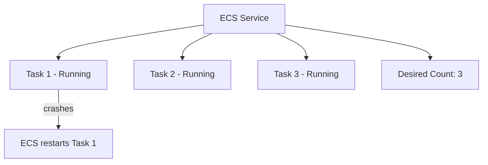

# How to Create an ECS Service for Long-Running Containers

Author: [nawazdhandala](https://github.com/nawazdhandala)

Tags: AWS, ECS, Containers, Docker, Microservices

Description: Learn how to create and manage ECS services for long-running containers, covering desired count, deployment configuration, rolling updates, and service discovery.

---

While one-off tasks are great for batch jobs, most containerized workloads need to run continuously. Web servers, API backends, background workers - these all need to stay up, restart when they crash, and scale based on demand. That's what ECS services do.

An ECS service wraps your task definition with additional capabilities: it maintains a desired number of running tasks, replaces unhealthy ones, handles rolling deployments, and integrates with load balancers and service discovery. Let's set one up.

## What a Service Does

When you create a service with a desired count of 3, ECS guarantees that 3 copies of your task are always running. If a task crashes, ECS starts a new one. If a node goes down, tasks get rescheduled to healthy nodes. If you push a new task definition revision, the service performs a rolling update.



## Creating a Basic Service

You'll need a [cluster](https://oneuptime.com/blog/post/first-ecs-cluster/view) and a [task definition](https://oneuptime.com/blog/post/ecs-task-definition/view) already in place.

```bash
# Create a Fargate service with 3 replicas
aws ecs create-service \
  --cluster my-first-cluster \
  --service-name web-api \
  --task-definition web-app:1 \
  --desired-count 3 \
  --launch-type FARGATE \
  --network-configuration '{
    "awsvpcConfiguration": {
      "subnets": ["subnet-abc123", "subnet-def456"],
      "securityGroups": ["sg-12345678"],
      "assignPublicIp": "DISABLED"
    }
  }' \
  --deployment-configuration '{
    "maximumPercent": 200,
    "minimumHealthyPercent": 100
  }'
```

The deployment configuration controls how updates happen:

- `maximumPercent: 200` means ECS can temporarily run up to 6 tasks (double the desired count) during a deployment
- `minimumHealthyPercent: 100` means ECS won't stop any old tasks until new ones are healthy

This ensures zero-downtime deployments.

## Deployment Strategies

ECS supports different deployment controllers.

### Rolling Update (Default)

The rolling update replaces tasks gradually. You control the pace with `maximumPercent` and `minimumHealthyPercent`.

```bash
# Conservative rolling update - one task at a time
aws ecs create-service \
  --cluster my-first-cluster \
  --service-name api-service \
  --task-definition api:1 \
  --desired-count 4 \
  --launch-type FARGATE \
  --deployment-configuration '{
    "maximumPercent": 125,
    "minimumHealthyPercent": 75
  }' \
  --network-configuration '{
    "awsvpcConfiguration": {
      "subnets": ["subnet-abc123", "subnet-def456"],
      "securityGroups": ["sg-12345678"],
      "assignPublicIp": "DISABLED"
    }
  }'
```

With these settings and 4 desired tasks: ECS keeps at least 3 running (75% of 4) and runs at most 5 simultaneously (125% of 4). So it starts 1 new task, waits for it to be healthy, then stops 1 old task, and repeats.

### Circuit Breaker

Enable the deployment circuit breaker to automatically roll back failed deployments.

```bash
# Service with circuit breaker - automatically rolls back bad deployments
aws ecs create-service \
  --cluster my-first-cluster \
  --service-name resilient-service \
  --task-definition api:1 \
  --desired-count 3 \
  --launch-type FARGATE \
  --deployment-configuration '{
    "maximumPercent": 200,
    "minimumHealthyPercent": 100,
    "deploymentCircuitBreaker": {
      "enable": true,
      "rollback": true
    }
  }' \
  --network-configuration '{
    "awsvpcConfiguration": {
      "subnets": ["subnet-abc123", "subnet-def456"],
      "securityGroups": ["sg-12345678"],
      "assignPublicIp": "DISABLED"
    }
  }'
```

If ECS detects that new tasks keep failing to start or failing health checks, it stops the deployment and rolls back to the last stable version.

## Service with a Load Balancer

For web-facing services, you'll almost always want a load balancer in front. ECS integrates natively with Application Load Balancers.

First, create the ALB and target group (or see our detailed [ECS with ALB guide](https://oneuptime.com/blog/post/ecs-application-load-balancer/view)).

```bash
# Create a service that registers tasks with an ALB target group
aws ecs create-service \
  --cluster my-first-cluster \
  --service-name web-frontend \
  --task-definition web-app:1 \
  --desired-count 3 \
  --launch-type FARGATE \
  --network-configuration '{
    "awsvpcConfiguration": {
      "subnets": ["subnet-abc123", "subnet-def456"],
      "securityGroups": ["sg-12345678"],
      "assignPublicIp": "DISABLED"
    }
  }' \
  --load-balancers '[
    {
      "targetGroupArn": "arn:aws:elasticloadbalancing:us-east-1:123456789:targetgroup/web-tg/abc123",
      "containerName": "web",
      "containerPort": 8080
    }
  ]' \
  --health-check-grace-period-seconds 60
```

The `health-check-grace-period-seconds` gives your container time to start before the ALB health check begins marking it unhealthy. Without this, slow-starting applications might get killed before they finish booting.

## Service Discovery

For internal services that communicate with each other (microservices), use AWS Cloud Map for DNS-based service discovery.

```bash
# Create a Cloud Map namespace
aws servicediscovery create-private-dns-namespace \
  --name internal.myapp \
  --vpc vpc-12345678

# Create a service discovery service
aws servicediscovery create-service \
  --name api \
  --dns-config '{
    "NamespaceId": "ns-abc123",
    "DnsRecords": [{"Type": "A", "TTL": 10}]
  }' \
  --health-check-custom-config '{"FailureThreshold": 1}'

# Create the ECS service with service discovery
aws ecs create-service \
  --cluster my-first-cluster \
  --service-name api-backend \
  --task-definition api:1 \
  --desired-count 3 \
  --launch-type FARGATE \
  --network-configuration '{
    "awsvpcConfiguration": {
      "subnets": ["subnet-abc123", "subnet-def456"],
      "securityGroups": ["sg-12345678"],
      "assignPublicIp": "DISABLED"
    }
  }' \
  --service-registries '[
    {
      "registryArn": "arn:aws:servicediscovery:us-east-1:123456789:service/srv-abc123"
    }
  ]'
```

Now other services can reach this one at `api.internal.myapp` via DNS.

## Updating a Service

To deploy a new version of your application, register a new task definition revision and update the service.

```bash
# Register a new task definition revision (with updated image tag)
aws ecs register-task-definition --cli-input-json file://task-definition-v2.json

# Update the service to use the new revision
aws ecs update-service \
  --cluster my-first-cluster \
  --service web-api \
  --task-definition web-app:2
```

ECS starts a rolling deployment immediately. Monitor it with:

```bash
# Watch the deployment progress
aws ecs describe-services \
  --cluster my-first-cluster \
  --services web-api \
  --query 'services[0].deployments[*].{Status:status,Running:runningCount,Desired:desiredCount,TaskDef:taskDefinition}'
```

You'll see both the old (PRIMARY) and new deployment running simultaneously until the rollout completes.

## Scaling the Service

Change the desired count to scale manually.

```bash
# Scale up to 5 tasks
aws ecs update-service \
  --cluster my-first-cluster \
  --service web-api \
  --desired-count 5

# Scale down to 2 tasks
aws ecs update-service \
  --cluster my-first-cluster \
  --service web-api \
  --desired-count 2
```

For automatic scaling based on metrics, see our [ECS auto scaling guide](https://oneuptime.com/blog/post/ecs-service-auto-scaling/view).

## Force New Deployment

Sometimes you need to force a redeployment without changing the task definition - for example, to pick up a new image with the same tag (like `latest`).

```bash
# Force a new deployment with the same task definition
aws ecs update-service \
  --cluster my-first-cluster \
  --service web-api \
  --force-new-deployment
```

This creates a new deployment that replaces all running tasks, even though the task definition hasn't changed.

## Deleting a Service

To remove a service, first scale it to zero, then delete it.

```bash
# Scale down to zero first
aws ecs update-service \
  --cluster my-first-cluster \
  --service web-api \
  --desired-count 0

# Then delete the service
aws ecs delete-service \
  --cluster my-first-cluster \
  --service web-api
```

Or use `--force` to skip scaling to zero.

```bash
# Force delete (stops all tasks immediately)
aws ecs delete-service \
  --cluster my-first-cluster \
  --service web-api \
  --force
```

## Wrapping Up

ECS services are the backbone of running production containers on AWS. They handle the hard parts - keeping tasks running, rolling out updates safely, and integrating with load balancers and service discovery. Start with a basic service, add a load balancer for web traffic, enable the circuit breaker for safety, and use service discovery for internal communication. Once you've got services running, set up [health checks](https://oneuptime.com/blog/post/ecs-health-checks/view) and [auto scaling](https://oneuptime.com/blog/post/ecs-service-auto-scaling/view) to make them production-ready.
