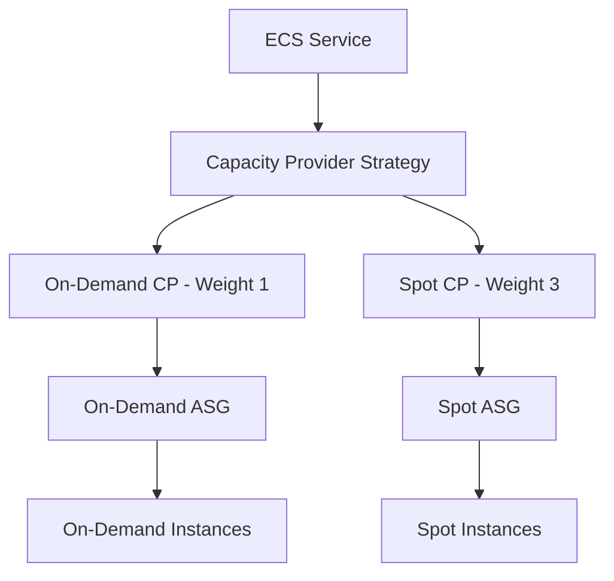

# How to Set Up ECS with Spot Instances and Capacity Providers

Author: [nawazdhandala](https://github.com/nawazdhandala)

Tags: AWS, ECS, Spot Instances, Capacity Providers, Cost Optimization

Description: Set up Amazon ECS with Spot Instances and capacity providers to reduce container compute costs by up to 90 percent while maintaining availability

---

Running containers on AWS is not cheap. If you are using ECS with EC2 launch type and paying full on-demand prices, you are leaving money on the table. Spot Instances can save you up to 90% on compute costs, and ECS capacity providers make it practical to use them in production without constantly worrying about interruptions.

This guide walks you through setting up ECS with a mix of on-demand and Spot instances using capacity providers, so you get cost savings without sacrificing reliability.

## What Are Capacity Providers?

Capacity providers are the bridge between your ECS services and the underlying compute infrastructure. They tell ECS where and how to place tasks, and they handle auto-scaling of the underlying instances automatically.

For EC2-backed ECS clusters, each capacity provider is linked to an Auto Scaling Group (ASG). You can have multiple capacity providers per cluster, which lets you mix on-demand and Spot instances.



## Step 1: Create Auto Scaling Groups

You need two ASGs - one for on-demand instances (your baseline) and one for Spot instances (your cost savings).

First, create a launch template that works for ECS. The instances need the ECS agent and must join your cluster.

```bash
# Create a launch template for ECS instances
aws ec2 create-launch-template \
  --launch-template-name ecs-lt \
  --launch-template-data '{
    "ImageId": "ami-0c55b159cbfafe1f0",
    "InstanceType": "m5.large",
    "IamInstanceProfile": {
      "Arn": "arn:aws:iam::123456789:instance-profile/ecsInstanceRole"
    },
    "UserData": "'$(echo '#!/bin/bash
echo ECS_CLUSTER=my-cluster >> /etc/ecs/ecs.config
echo ECS_ENABLE_SPOT_INSTANCE_DRAINING=true >> /etc/ecs/ecs.config' | base64)'"
  }'
```

Note the `ECS_ENABLE_SPOT_INSTANCE_DRAINING=true` setting. This is critical - it tells the ECS agent to drain tasks when a Spot interruption notice is received, giving your tasks time to shut down gracefully.

Now create the on-demand ASG.

```bash
# Create the on-demand Auto Scaling Group
aws autoscaling create-auto-scaling-group \
  --auto-scaling-group-name ecs-ondemand-asg \
  --launch-template "LaunchTemplateName=ecs-lt,Version=\$Latest" \
  --min-size 1 \
  --max-size 10 \
  --desired-capacity 2 \
  --vpc-zone-identifier "subnet-aaa,subnet-bbb" \
  --new-instances-protected-from-scale-in \
  --tags "Key=Name,Value=ecs-ondemand,PropagateAtLaunch=true"
```

For the Spot ASG, use a mixed instances policy to diversify across instance types. Diversification is key to Spot reliability - the more instance types you can use, the less likely you are to face capacity shortages.

```bash
# Create the Spot Auto Scaling Group with mixed instance types
aws autoscaling create-auto-scaling-group \
  --auto-scaling-group-name ecs-spot-asg \
  --mixed-instances-policy '{
    "LaunchTemplate": {
      "LaunchTemplateSpecification": {
        "LaunchTemplateName": "ecs-lt",
        "Version": "$Latest"
      },
      "Overrides": [
        {"InstanceType": "m5.large"},
        {"InstanceType": "m5a.large"},
        {"InstanceType": "m5d.large"},
        {"InstanceType": "m4.large"},
        {"InstanceType": "c5.large"},
        {"InstanceType": "c5a.large"},
        {"InstanceType": "r5.large"},
        {"InstanceType": "r5a.large"}
      ]
    },
    "InstancesDistribution": {
      "OnDemandBaseCapacity": 0,
      "OnDemandPercentageAboveBaseCapacity": 0,
      "SpotAllocationStrategy": "capacity-optimized"
    }
  }' \
  --min-size 0 \
  --max-size 20 \
  --desired-capacity 0 \
  --vpc-zone-identifier "subnet-aaa,subnet-bbb" \
  --new-instances-protected-from-scale-in
```

The `capacity-optimized` allocation strategy picks instance types with the most available Spot capacity, reducing the chance of interruption.

## Step 2: Create Capacity Providers

Link each ASG to a capacity provider.

```bash
# Create the on-demand capacity provider
aws ecs create-capacity-provider \
  --name ondemand-cp \
  --auto-scaling-group-provider '{
    "autoScalingGroupArn": "arn:aws:autoscaling:us-east-1:123456789:autoScalingGroup:xxx:autoScalingGroupName/ecs-ondemand-asg",
    "managedScaling": {
      "status": "ENABLED",
      "targetCapacity": 80,
      "minimumScalingStepSize": 1,
      "maximumScalingStepSize": 5
    },
    "managedTerminationProtection": "ENABLED"
  }'

# Create the Spot capacity provider
aws ecs create-capacity-provider \
  --name spot-cp \
  --auto-scaling-group-provider '{
    "autoScalingGroupArn": "arn:aws:autoscaling:us-east-1:123456789:autoScalingGroup:yyy:autoScalingGroupName/ecs-spot-asg",
    "managedScaling": {
      "status": "ENABLED",
      "targetCapacity": 100,
      "minimumScalingStepSize": 1,
      "maximumScalingStepSize": 10
    },
    "managedTerminationProtection": "ENABLED"
  }'
```

The `targetCapacity` percentage controls how aggressively managed scaling packs tasks onto instances. Setting the Spot provider to 100% means ECS will try to use all available capacity on Spot instances.

## Step 3: Associate Capacity Providers with Your Cluster

```bash
# Associate both capacity providers with the cluster
aws ecs put-cluster-capacity-providers \
  --cluster my-cluster \
  --capacity-providers ondemand-cp spot-cp \
  --default-capacity-provider-strategy \
    "capacityProvider=ondemand-cp,weight=1,base=2" \
    "capacityProvider=spot-cp,weight=3"
```

The `base` parameter in the strategy means the first 2 tasks always go to on-demand instances. After that, the `weight` ratio kicks in - for every 1 task on on-demand, 3 tasks go to Spot. This gives you a 25/75 on-demand/Spot split after the base tasks.

## Step 4: Configure Your ECS Service

When creating a service, you can override the cluster default strategy or use it as-is.

```bash
# Create a service using the capacity provider strategy
aws ecs create-service \
  --cluster my-cluster \
  --service-name my-service \
  --task-definition my-app:5 \
  --desired-count 8 \
  --capacity-provider-strategy \
    "capacityProvider=ondemand-cp,weight=1,base=2" \
    "capacityProvider=spot-cp,weight=3,base=0"
```

With 8 desired tasks: 2 go to on-demand (base), and the remaining 6 are split 25/75 - roughly 1-2 on on-demand and 4-5 on Spot.

## CDK Configuration

Here is the same setup using AWS CDK, which is considerably cleaner.

```typescript
import * as cdk from 'aws-cdk-lib';
import * as ecs from 'aws-cdk-lib/aws-ecs';
import * as ec2 from 'aws-cdk-lib/aws-ec2';
import * as autoscaling from 'aws-cdk-lib/aws-autoscaling';

// Create the cluster
const cluster = new ecs.Cluster(this, 'Cluster', { vpc });

// On-demand ASG and capacity provider
const onDemandAsg = new autoscaling.AutoScalingGroup(this, 'OnDemandASG', {
  vpc,
  instanceType: ec2.InstanceType.of(ec2.InstanceClass.M5, ec2.InstanceSize.LARGE),
  machineImage: ecs.EcsOptimizedImage.amazonLinux2(),
  minCapacity: 1,
  maxCapacity: 10,
});

const onDemandCp = new ecs.AsgCapacityProvider(this, 'OnDemandCP', {
  autoScalingGroup: onDemandAsg,
  enableManagedScaling: true,
  enableManagedTerminationProtection: true,
  targetCapacityPercent: 80,
});

// Spot ASG with multiple instance types
const spotAsg = new autoscaling.AutoScalingGroup(this, 'SpotASG', {
  vpc,
  mixedInstancesPolicy: {
    instancesDistribution: {
      onDemandPercentageAboveBaseCapacity: 0,
      spotAllocationStrategy: autoscaling.SpotAllocationStrategy.CAPACITY_OPTIMIZED,
    },
    launchTemplate: spotLaunchTemplate,
    launchTemplateOverrides: [
      { instanceType: new ec2.InstanceType('m5.large') },
      { instanceType: new ec2.InstanceType('m5a.large') },
      { instanceType: new ec2.InstanceType('c5.large') },
      { instanceType: new ec2.InstanceType('c5a.large') },
    ],
  },
  minCapacity: 0,
  maxCapacity: 20,
});

const spotCp = new ecs.AsgCapacityProvider(this, 'SpotCP', {
  autoScalingGroup: spotAsg,
  enableManagedScaling: true,
  enableManagedTerminationProtection: true,
  targetCapacityPercent: 100,
  spotInstanceDraining: true,
});

// Add both to the cluster
cluster.addAsgCapacityProvider(onDemandCp);
cluster.addAsgCapacityProvider(spotCp);

// Create service with capacity provider strategy
const service = new ecs.Ec2Service(this, 'Service', {
  cluster,
  taskDefinition: taskDef,
  desiredCount: 8,
  capacityProviderStrategies: [
    { capacityProvider: onDemandCp.capacityProviderName, weight: 1, base: 2 },
    { capacityProvider: spotCp.capacityProviderName, weight: 3 },
  ],
});
```

## Handling Spot Interruptions

Spot instances can be reclaimed with a 2-minute warning. Here is how to handle that gracefully:

1. **Enable Spot instance draining** in the ECS agent config (`ECS_ENABLE_SPOT_INSTANCE_DRAINING=true`)
2. **Use the deployment circuit breaker** to prevent cascading failures during interruptions
3. **Set connection draining** on your ALB target groups to allow in-flight requests to complete
4. **Handle SIGTERM** in your application to gracefully shut down

For application-level graceful shutdown patterns, see our guide on [ECS health checks](https://oneuptime.com/blog/post/ecs-health-checks/view).

## Cost Savings Example

Consider running 20 m5.large instances:

| Configuration | Monthly Cost (approx) |
|---|---|
| All on-demand | $1,400 |
| 25% on-demand + 75% Spot | $525 |
| **Savings** | **$875/month (62%)** |

The actual savings depend on Spot pricing in your region, but 60-70% savings is typical with a diversified instance mix.

## Wrapping Up

Capacity providers with Spot instances give you the best of both worlds - cost savings from Spot pricing and reliability from having an on-demand baseline. The key ingredients are diversifying your Spot instance types, enabling Spot draining, and using a capacity provider strategy that maintains enough on-demand capacity for your critical baseline. Start with a conservative split (50/50) and gradually increase your Spot percentage as you gain confidence.

For more on ECS capacity providers, check out our guide on [using ECS capacity provider auto scaling](https://oneuptime.com/blog/post/use-ecs-capacity-provider-auto-scaling/view).
