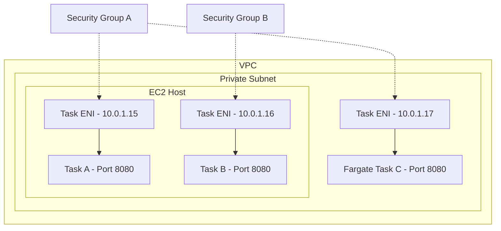

# How to Configure ECS Task Networking (awsvpc Mode)

Author: [nawazdhandala](https://github.com/nawazdhandala)

Tags: AWS, ECS, Networking, VPC, Containers

Description: Understand how awsvpc networking mode works in ECS and learn to configure ENIs, security groups, and subnets for your containerized tasks.

---

Networking in ECS can be confusing if you're coming from Docker Compose or plain Docker where you just expose ports and everything works. ECS has multiple networking modes, but `awsvpc` is the one you should care about. It's required for Fargate and it's the recommended mode for EC2 launch type too. Let's break down how it works and how to configure it properly.

## Networking Modes in ECS

ECS supports four networking modes for tasks:

- **awsvpc** - Each task gets its own elastic network interface (ENI) with a private IP address. This is what we're focusing on.
- **bridge** - The default Docker bridge network. Tasks share the host's network through port mapping.
- **host** - Tasks use the EC2 host's network directly. No port mapping needed but no isolation either.
- **none** - No networking at all. Rarely useful.

Fargate only supports `awsvpc`, so if you're using Fargate (which most people should be), there's no choice to make. For EC2 launch type, `awsvpc` gives you the most control and the best security posture.

## How awsvpc Mode Works

In `awsvpc` mode, ECS attaches an ENI (elastic network interface) to your task. This ENI lives in a subnet you specify and gets a private IP from that subnet's CIDR range. It's like giving each task its own mini EC2 instance from a networking perspective.

This means:
- Each task has its own IP address
- Each task can have its own security group
- No port conflicts between tasks on the same host
- Tasks can be accessed directly by their IP
- Security groups work at the task level, not the host level



Notice how Task A and Task B can both use port 8080 without conflicts. Each has its own ENI and IP address, so port collisions are impossible.

## Basic Task Definition

Here's a task definition configured for awsvpc mode.

```json
{
  "family": "web-app",
  "networkMode": "awsvpc",
  "requiresCompatibilities": ["FARGATE"],
  "cpu": "256",
  "memory": "512",
  "containerDefinitions": [
    {
      "name": "app",
      "image": "123456789.dkr.ecr.us-east-1.amazonaws.com/web-app:latest",
      "portMappings": [
        {
          "containerPort": 8080,
          "protocol": "tcp"
        }
      ],
      "essential": true,
      "logConfiguration": {
        "logDriver": "awslogs",
        "options": {
          "awslogs-group": "/ecs/web-app",
          "awslogs-region": "us-east-1",
          "awslogs-stream-prefix": "ecs"
        }
      }
    }
  ]
}
```

With `awsvpc`, you only specify `containerPort` - there's no `hostPort` mapping because the container gets its own network namespace. The container port IS the port on the ENI.

## Service Network Configuration

When creating a service, you specify the networking details - which subnets and security groups to use.

```hcl
# Terraform - ECS service with awsvpc networking
resource "aws_ecs_service" "web" {
  name            = "web-app"
  cluster         = aws_ecs_cluster.main.id
  task_definition = aws_ecs_task_definition.web.arn
  desired_count   = 3
  launch_type     = "FARGATE"

  network_configuration {
    # Place tasks in private subnets
    subnets = [
      aws_subnet.private_a.id,
      aws_subnet.private_b.id,
      aws_subnet.private_c.id,
    ]

    # Attach security groups to the task ENIs
    security_groups = [
      aws_security_group.web_task.id
    ]

    # Set to true only if tasks need public IPs (e.g., no NAT gateway)
    assign_public_ip = false
  }

  load_balancer {
    target_group_arn = aws_lb_target_group.web.arn
    container_name   = "app"
    container_port   = 8080
  }
}
```

## Security Groups for Tasks

One of the biggest advantages of `awsvpc` is per-task security groups. You can write security group rules that are specific to each service.

```hcl
# Security group for the web app tasks
resource "aws_security_group" "web_task" {
  name_prefix = "web-task-"
  vpc_id      = aws_vpc.main.id

  # Allow traffic from the ALB only
  ingress {
    from_port       = 8080
    to_port         = 8080
    protocol        = "tcp"
    security_groups = [aws_security_group.alb.id]
  }

  # Allow all outbound (for pulling images, DNS, etc.)
  egress {
    from_port   = 0
    to_port     = 0
    protocol    = "-1"
    cidr_blocks = ["0.0.0.0/0"]
  }
}

# Security group for worker tasks - different rules
resource "aws_security_group" "worker_task" {
  name_prefix = "worker-task-"
  vpc_id      = aws_vpc.main.id

  # Workers don't need any ingress
  # They only make outbound connections

  egress {
    from_port   = 0
    to_port     = 0
    protocol    = "-1"
    cidr_blocks = ["0.0.0.0/0"]
  }
}

# Allow web tasks to talk to the database
resource "aws_security_group_rule" "web_to_db" {
  type                     = "ingress"
  from_port                = 5432
  to_port                  = 5432
  protocol                 = "tcp"
  security_group_id        = aws_security_group.database.id
  source_security_group_id = aws_security_group.web_task.id
}
```

This is much more granular than what you get with bridge or host networking, where all tasks on an instance share the same security group context.

## ENI Limits on EC2 Instances

If you're using EC2 launch type with `awsvpc`, there's an important limitation: each EC2 instance has a maximum number of ENIs it can support, which limits how many tasks can run on it.

For example, a `t3.medium` supports 3 ENIs. One is used by the instance itself, leaving 2 for ECS tasks. That's a low number if you want to run many small tasks.

AWS provides a solution called ENI trunking. When enabled, ECS uses a trunk ENI to multiplex multiple tasks on a single ENI, significantly increasing density.

```bash
# Enable ENI trunking for your account
aws ecs put-account-setting-default \
  --name awsvpcTrunking \
  --value enabled

# You also need to enable it per instance with this on the container instance
# Add to your EC2 user data:
# ECS_ENABLE_TASK_ENI=true
```

With trunking enabled on supported instance types, a `c5.large` can go from 3 tasks to about 10 tasks. Check the AWS documentation for specific numbers per instance type.

## Public vs Private Subnets

The `assign_public_ip` setting determines whether your task's ENI gets a public IP address. Here's when to use each option:

**Private subnets (assign_public_ip = false)**:
- Tasks sit behind a NAT Gateway for outbound internet access
- More secure - tasks aren't directly reachable from the internet
- Use this for most production workloads

**Public subnets (assign_public_ip = true)**:
- Tasks get public IPs and can reach the internet directly
- Saves money by avoiding NAT Gateway costs
- Fine for development environments or non-sensitive workloads

```hcl
# Public subnet configuration (development)
network_configuration {
  subnets          = var.public_subnet_ids
  security_groups  = [aws_security_group.task.id]
  assign_public_ip = true  # Task gets a public IP
}

# Private subnet configuration (production)
network_configuration {
  subnets          = var.private_subnet_ids
  security_groups  = [aws_security_group.task.id]
  assign_public_ip = false  # Task only has a private IP
}
```

## Inter-Service Communication

With `awsvpc`, services can communicate using their private IPs. Combined with service discovery (see our [Cloud Map guide](https://oneuptime.com/blog/post/ecs-service-discovery-cloud-map/view)), this gives you clean service-to-service networking.

```hcl
# Allow API service to reach the cache service
resource "aws_security_group_rule" "api_to_cache" {
  type                     = "ingress"
  from_port                = 6379
  to_port                  = 6379
  protocol                 = "tcp"
  security_group_id        = aws_security_group.cache_task.id
  source_security_group_id = aws_security_group.api_task.id
}
```

## Troubleshooting

**Tasks stuck in PROVISIONING**: This often means ECS can't create the ENI. Check that your subnet has available IP addresses and that you haven't hit the ENI limit for your account or instance.

```bash
# Check available IPs in a subnet
aws ec2 describe-subnets \
  --subnet-ids subnet-abc123 \
  --query 'Subnets[0].AvailableIpAddressCount'
```

**Tasks can't pull images**: If tasks are in a private subnet without a NAT Gateway, they can't reach ECR. Either add a NAT Gateway or create VPC endpoints for ECR.

```hcl
# VPC endpoints for ECR (avoids needing NAT Gateway)
resource "aws_vpc_endpoint" "ecr_api" {
  vpc_id            = aws_vpc.main.id
  service_name      = "com.amazonaws.us-east-1.ecr.api"
  vpc_endpoint_type = "Interface"
  subnet_ids        = var.private_subnet_ids
}

resource "aws_vpc_endpoint" "ecr_dkr" {
  vpc_id            = aws_vpc.main.id
  service_name      = "com.amazonaws.us-east-1.ecr.dkr"
  vpc_endpoint_type = "Interface"
  subnet_ids        = var.private_subnet_ids
}

resource "aws_vpc_endpoint" "s3" {
  vpc_id       = aws_vpc.main.id
  service_name = "com.amazonaws.us-east-1.s3"
}
```

**Security group rules not working**: Remember, with `awsvpc`, security groups are on the task's ENI, not on the EC2 host. If you're used to configuring security groups on the instance, you need to shift your thinking to the task level.

The `awsvpc` networking mode makes ECS tasks behave more like independent network endpoints than containers crammed onto a shared host. It's cleaner, more secure, and easier to reason about once you understand the ENI model.
