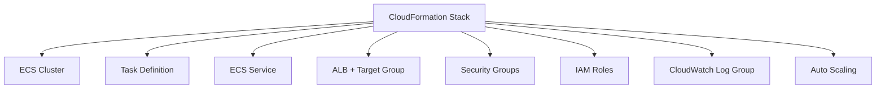

# How to Set Up ECS with CloudFormation

Author: [nawazdhandala](https://github.com/nawazdhandala)

Tags: AWS, ECS, CloudFormation, Infrastructure as Code, DevOps

Description: A complete guide to setting up Amazon ECS clusters, task definitions, and services using AWS CloudFormation templates with practical examples.

---

If you're managing ECS resources through the console or CLI, you're eventually going to run into problems. Someone changes a security group and forgets to document it. A task definition gets updated in production but not staging. Resources drift from their intended configuration and nobody notices until something breaks.

CloudFormation solves this by defining your infrastructure as code. Every change is versioned, reviewable, and reproducible. Let's build a complete ECS setup using CloudFormation, from the cluster all the way to autoscaling.

## The Full Stack

Here's what we'll create:



Each of these is a resource in the CloudFormation template. Let's build them one piece at a time.

## The ECS Cluster

Starting with the cluster is simple:

```yaml
AWSTemplateFormatVersion: '2010-09-09'
Description: ECS Fargate cluster with a complete service deployment

Parameters:
  EnvironmentName:
    Type: String
    Default: production
    AllowedValues: [production, staging, development]
  VpcId:
    Type: AWS::EC2::VPC::Id
  SubnetIds:
    Type: List<AWS::EC2::Subnet::Id>
  ContainerImage:
    Type: String
    Description: ECR image URI for the application
  ContainerPort:
    Type: Number
    Default: 8080
  DesiredCount:
    Type: Number
    Default: 2

Resources:
  ECSCluster:
    Type: AWS::ECS::Cluster
    Properties:
      ClusterName: !Sub "${EnvironmentName}-cluster"
      ClusterSettings:
        - Name: containerInsights
          Value: enabled
      CapacityProviders:
        - FARGATE
        - FARGATE_SPOT
      DefaultCapacityProviderStrategy:
        - CapacityProvider: FARGATE
          Weight: 1
          Base: 1
        - CapacityProvider: FARGATE_SPOT
          Weight: 3
```

This cluster uses a mix of Fargate and Fargate Spot. The `Base: 1` ensures at least one task always runs on regular Fargate (for reliability), while the `Weight: 3` on Spot means 75% of additional tasks will use Spot pricing.

## IAM Roles

ECS needs two roles - an execution role (for pulling images and writing logs) and a task role (for your application's AWS API calls):

```yaml
  TaskExecutionRole:
    Type: AWS::IAM::Role
    Properties:
      RoleName: !Sub "${EnvironmentName}-ecs-execution-role"
      AssumeRolePolicyDocument:
        Version: '2012-10-17'
        Statement:
          - Effect: Allow
            Principal:
              Service: ecs-tasks.amazonaws.com
            Action: sts:AssumeRole
      ManagedPolicyArns:
        - arn:aws:iam::aws:policy/service-role/AmazonECSTaskExecutionRolePolicy
      Policies:
        - PolicyName: SecretAccess
          PolicyDocument:
            Version: '2012-10-17'
            Statement:
              - Effect: Allow
                Action:
                  - secretsmanager:GetSecretValue
                Resource: !Sub "arn:aws:secretsmanager:${AWS::Region}:${AWS::AccountId}:secret:${EnvironmentName}/*"

  TaskRole:
    Type: AWS::IAM::Role
    Properties:
      RoleName: !Sub "${EnvironmentName}-ecs-task-role"
      AssumeRolePolicyDocument:
        Version: '2012-10-17'
        Statement:
          - Effect: Allow
            Principal:
              Service: ecs-tasks.amazonaws.com
            Action: sts:AssumeRole
      Policies:
        - PolicyName: AppPermissions
          PolicyDocument:
            Version: '2012-10-17'
            Statement:
              - Effect: Allow
                Action:
                  - s3:GetObject
                  - s3:PutObject
                Resource: !Sub "arn:aws:s3:::${EnvironmentName}-app-data/*"
              - Effect: Allow
                Action:
                  - sqs:SendMessage
                  - sqs:ReceiveMessage
                Resource: !Sub "arn:aws:sqs:${AWS::Region}:${AWS::AccountId}:${EnvironmentName}-*"
```

## Security Groups

The ALB and ECS tasks need separate security groups:

```yaml
  ALBSecurityGroup:
    Type: AWS::EC2::SecurityGroup
    Properties:
      GroupDescription: Security group for the application load balancer
      VpcId: !Ref VpcId
      SecurityGroupIngress:
        - IpProtocol: tcp
          FromPort: 80
          ToPort: 80
          CidrIp: 0.0.0.0/0
        - IpProtocol: tcp
          FromPort: 443
          ToPort: 443
          CidrIp: 0.0.0.0/0

  ECSSecurityGroup:
    Type: AWS::EC2::SecurityGroup
    Properties:
      GroupDescription: Security group for ECS tasks
      VpcId: !Ref VpcId
      SecurityGroupIngress:
        - IpProtocol: tcp
          FromPort: !Ref ContainerPort
          ToPort: !Ref ContainerPort
          SourceSecurityGroupId: !Ref ALBSecurityGroup
```

The ECS security group only allows inbound traffic from the ALB. This is a critical security boundary - tasks aren't directly accessible from the internet.

## Load Balancer and Target Group

```yaml
  ApplicationLoadBalancer:
    Type: AWS::ElasticLoadBalancingV2::LoadBalancer
    Properties:
      Name: !Sub "${EnvironmentName}-alb"
      Scheme: internet-facing
      Type: application
      SecurityGroups:
        - !Ref ALBSecurityGroup
      Subnets: !Ref SubnetIds

  TargetGroup:
    Type: AWS::ElasticLoadBalancingV2::TargetGroup
    Properties:
      Name: !Sub "${EnvironmentName}-tg"
      Port: !Ref ContainerPort
      Protocol: HTTP
      VpcId: !Ref VpcId
      TargetType: ip
      HealthCheckPath: /health
      HealthCheckIntervalSeconds: 30
      HealthCheckTimeoutSeconds: 5
      HealthyThresholdCount: 2
      UnhealthyThresholdCount: 3
      Matcher:
        HttpCode: "200"

  HTTPListener:
    Type: AWS::ElasticLoadBalancingV2::Listener
    Properties:
      LoadBalancerArn: !Ref ApplicationLoadBalancer
      Port: 80
      Protocol: HTTP
      DefaultActions:
        - Type: forward
          TargetGroupArn: !Ref TargetGroup
```

## Task Definition

```yaml
  LogGroup:
    Type: AWS::Logs::LogGroup
    Properties:
      LogGroupName: !Sub "/ecs/${EnvironmentName}/app"
      RetentionInDays: 30

  TaskDefinition:
    Type: AWS::ECS::TaskDefinition
    Properties:
      Family: !Sub "${EnvironmentName}-app"
      NetworkMode: awsvpc
      RequiresCompatibilities:
        - FARGATE
      Cpu: "512"
      Memory: "1024"
      ExecutionRoleArn: !GetAtt TaskExecutionRole.Arn
      TaskRoleArn: !GetAtt TaskRole.Arn
      ContainerDefinitions:
        - Name: app
          Image: !Ref ContainerImage
          Essential: true
          PortMappings:
            - ContainerPort: !Ref ContainerPort
              Protocol: tcp
          Environment:
            - Name: NODE_ENV
              Value: !Ref EnvironmentName
            - Name: PORT
              Value: !Ref ContainerPort
          Secrets:
            - Name: DATABASE_URL
              ValueFrom: !Sub "arn:aws:secretsmanager:${AWS::Region}:${AWS::AccountId}:secret:${EnvironmentName}/database-url"
          HealthCheck:
            Command:
              - CMD-SHELL
              - !Sub "curl -f http://localhost:${ContainerPort}/health || exit 1"
            Interval: 30
            Timeout: 5
            Retries: 3
            StartPeriod: 60
          LogConfiguration:
            LogDriver: awslogs
            Options:
              awslogs-group: !Ref LogGroup
              awslogs-region: !Ref AWS::Region
              awslogs-stream-prefix: app
```

## ECS Service

```yaml
  ECSService:
    Type: AWS::ECS::Service
    DependsOn: HTTPListener
    Properties:
      ServiceName: !Sub "${EnvironmentName}-app"
      Cluster: !Ref ECSCluster
      TaskDefinition: !Ref TaskDefinition
      DesiredCount: !Ref DesiredCount
      LaunchType: FARGATE
      NetworkConfiguration:
        AwsvpcConfiguration:
          Subnets: !Ref SubnetIds
          SecurityGroups:
            - !Ref ECSSecurityGroup
          AssignPublicIp: DISABLED
      LoadBalancers:
        - TargetGroupArn: !Ref TargetGroup
          ContainerName: app
          ContainerPort: !Ref ContainerPort
      HealthCheckGracePeriodSeconds: 60
      DeploymentConfiguration:
        MinimumHealthyPercent: 100
        MaximumPercent: 200
        DeploymentCircuitBreaker:
          Enable: true
          Rollback: true
```

The `DependsOn: HTTPListener` is important. Without it, CloudFormation might try to create the service before the load balancer listener exists, which would fail.

## Auto Scaling

```yaml
  ScalableTarget:
    Type: AWS::ApplicationAutoScaling::ScalableTarget
    Properties:
      ServiceNamespace: ecs
      ResourceId: !Sub "service/${ECSCluster}/${ECSService.Name}"
      ScalableDimension: ecs:service:DesiredCount
      MinCapacity: 2
      MaxCapacity: 20
      RoleARN: !Sub "arn:aws:iam::${AWS::AccountId}:role/aws-service-role/ecs.application-autoscaling.amazonaws.com/AWSServiceRoleForApplicationAutoScaling_ECSService"

  CPUScalingPolicy:
    Type: AWS::ApplicationAutoScaling::ScalingPolicy
    Properties:
      PolicyName: cpu-target-tracking
      PolicyType: TargetTrackingScaling
      ScalingTargetId: !Ref ScalableTarget
      TargetTrackingScalingPolicyConfiguration:
        TargetValue: 70.0
        PredefinedMetricSpecification:
          PredefinedMetricType: ECSServiceAverageCPUUtilization
        ScaleInCooldown: 300
        ScaleOutCooldown: 60
```

## Outputs

```yaml
Outputs:
  ClusterName:
    Value: !Ref ECSCluster
  ServiceName:
    Value: !GetAtt ECSService.Name
  LoadBalancerDNS:
    Value: !GetAtt ApplicationLoadBalancer.DNSName
  ServiceURL:
    Value: !Sub "http://${ApplicationLoadBalancer.DNSName}"
```

## Deploying the Stack

Save the template and deploy:

```bash
# Deploy the CloudFormation stack
aws cloudformation deploy \
  --template-file ecs-stack.yaml \
  --stack-name production-app \
  --parameter-overrides \
    EnvironmentName=production \
    VpcId=vpc-abc123 \
    SubnetIds=subnet-abc123,subnet-def456 \
    ContainerImage=123456789012.dkr.ecr.us-east-1.amazonaws.com/app:v1.2.3 \
  --capabilities CAPABILITY_NAMED_IAM

# Check the deployment status
aws cloudformation describe-stacks \
  --stack-name production-app \
  --query "Stacks[0].StackStatus"
```

## Updating the Stack

To deploy a new container image, update the parameter:

```bash
# Deploy a new image version
aws cloudformation deploy \
  --template-file ecs-stack.yaml \
  --stack-name production-app \
  --parameter-overrides \
    ContainerImage=123456789012.dkr.ecr.us-east-1.amazonaws.com/app:v1.3.0 \
  --capabilities CAPABILITY_NAMED_IAM
```

CloudFormation detects that only the task definition changed, creates a new task definition revision, and triggers a rolling update on the ECS service.

## Tips for Production Use

1. **Use change sets** to preview changes before applying them
2. **Enable drift detection** to catch manual changes
3. **Store templates in version control** and deploy through CI/CD
4. **Use nested stacks** for large applications with many services
5. **Parameterize everything** that changes between environments

For an alternative infrastructure-as-code approach with more programming language support, see our guide on [ECS with AWS CDK](https://oneuptime.com/blog/post/ecs-with-aws-cdk/view).

## Wrapping Up

CloudFormation gives you a repeatable, version-controlled way to manage your entire ECS infrastructure. The template we built covers everything from the cluster to autoscaling, and you can deploy it to multiple environments by changing the parameters. It takes more upfront effort than clicking through the console, but the long-term benefits of consistency, auditability, and reproducibility are worth it.
