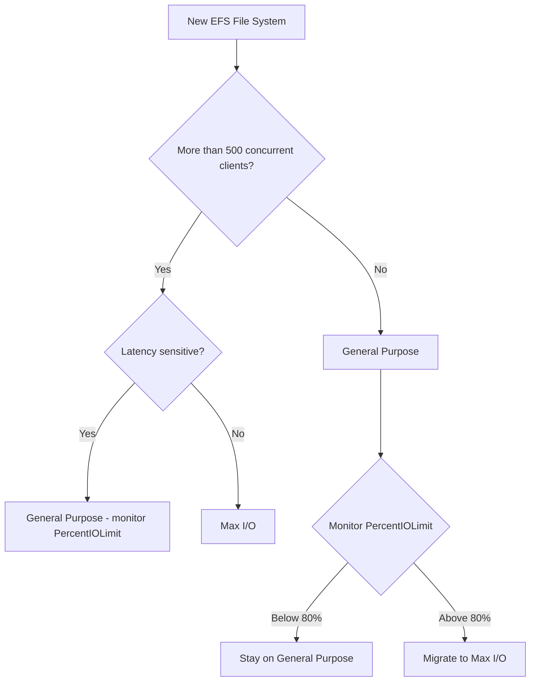

# How to Configure EFS Performance Modes (General Purpose vs Max I/O)

Author: [nawazdhandala](https://github.com/nawazdhandala)

Tags: AWS, EFS, Performance, Storage

Description: Understand the differences between EFS General Purpose and Max I/O performance modes, when to use each, and how to monitor performance to make the right choice.

---

When you create an Amazon EFS file system, one of the first decisions you face is choosing a performance mode: General Purpose or Max I/O. This choice is important because you can't change it after creation - you'd have to create a new file system and migrate your data. Let's break down what each mode offers, when to use it, and how to tell if you've made the right choice.

## The Two Performance Modes

**General Purpose** is the default mode and the right choice for the vast majority of workloads. It provides the lowest per-operation latency and supports up to 35,000 read operations and 7,000 write operations per second.

**Max I/O** is designed for highly parallelized workloads that need to scale to thousands of concurrent clients. It supports virtually unlimited operations per second, but at the cost of slightly higher per-operation latency.

Here's the comparison:

| Feature | General Purpose | Max I/O |
|---------|----------------|---------|
| Latency | Single-digit milliseconds | Slightly higher |
| Max IOPS | 35,000 read / 7,000 write | Unlimited (practically) |
| Max clients | Hundreds | Thousands |
| Best for | Web serving, CMS, dev environments | Big data, genomics, media processing |

## When to Use General Purpose

General Purpose mode is appropriate for:

- **Web applications** serving content from EFS
- **Content management systems** like WordPress
- **Development environments** with shared code repositories
- **Container workloads** on ECS or EKS
- **Lambda functions** accessing shared data
- **Home directories** for developer workstations
- **Any workload with fewer than a few hundred concurrent connections**

Basically, if you're not sure which mode to pick, go with General Purpose. It's the right answer at least 90% of the time.

## When to Use Max I/O

Max I/O mode is for specialized workloads that need massive parallelism:

- **Big data analytics** with hundreds or thousands of compute instances reading the same dataset
- **Genomics processing** where thousands of jobs analyze different portions of the same data
- **Media rendering farms** with hundreds of workers accessing shared assets
- **Machine learning training** across many instances reading training data
- **High-performance computing (HPC)** clusters

The key question is: will you have more than a few hundred instances or connections accessing the file system simultaneously? If yes, consider Max I/O. If not, General Purpose will give you better latency.

## Creating a File System with Each Mode

General Purpose (default):

```bash
# Create with General Purpose performance mode (default)
aws efs create-file-system \
  --performance-mode generalPurpose \
  --encrypted \
  --tags "Key=Name,Value=app-storage"
```

Max I/O:

```bash
# Create with Max I/O performance mode
aws efs create-file-system \
  --performance-mode maxIO \
  --encrypted \
  --tags "Key=Name,Value=data-lake-storage"
```

Remember: this choice is permanent for the life of the file system.

## How to Tell If You Need Max I/O

The best way to know if you need Max I/O is to monitor your General Purpose file system and check if you're hitting the IOPS limit. AWS provides a CloudWatch metric for this.

Check the PercentIOLimit metric:

```bash
# Check how close you are to the General Purpose IOPS limit
aws cloudwatch get-metric-statistics \
  --namespace "AWS/EFS" \
  --metric-name "PercentIOLimit" \
  --dimensions "Name=FileSystemId,Value=fs-0abc123def456789" \
  --start-time "$(date -u -d '24 hours ago' +%Y-%m-%dT%H:%M:%SZ)" \
  --end-time "$(date -u +%Y-%m-%dT%H:%M:%SZ)" \
  --period 3600 \
  --statistics Maximum \
  --output table
```

If `PercentIOLimit` is consistently above 80-90%, you're approaching the General Purpose limit and might benefit from Max I/O. If it's below 50%, you're fine on General Purpose.

Set up a CloudWatch alarm to alert you when you're getting close:

```bash
# Alarm when PercentIOLimit exceeds 80%
aws cloudwatch put-metric-alarm \
  --alarm-name "efs-io-limit-warning" \
  --alarm-description "EFS General Purpose mode approaching IOPS limit" \
  --namespace "AWS/EFS" \
  --metric-name "PercentIOLimit" \
  --dimensions "Name=FileSystemId,Value=fs-0abc123def456789" \
  --statistic Maximum \
  --period 300 \
  --evaluation-periods 6 \
  --threshold 80 \
  --comparison-operator GreaterThanThreshold \
  --alarm-actions "arn:aws:sns:us-east-1:123456789012:ops-alerts"
```

## Monitoring Key Performance Metrics

Beyond PercentIOLimit, there are several metrics you should watch:

```bash
# Get a comprehensive performance snapshot
for METRIC in "PercentIOLimit" "DataReadIOBytes" "DataWriteIOBytes" "MetadataIOBytes" "ClientConnections"; do
  echo "=== $METRIC ==="
  aws cloudwatch get-metric-statistics \
    --namespace "AWS/EFS" \
    --metric-name "$METRIC" \
    --dimensions "Name=FileSystemId,Value=fs-0abc123def456789" \
    --start-time "$(date -u -d '1 hour ago' +%Y-%m-%dT%H:%M:%SZ)" \
    --end-time "$(date -u +%Y-%m-%dT%H:%M:%SZ)" \
    --period 300 \
    --statistics "Average,Maximum" \
    --output table
  echo ""
done
```

The metrics to understand:

- **PercentIOLimit**: How close you are to the General Purpose IOPS limit (only relevant for General Purpose mode)
- **DataReadIOBytes / DataWriteIOBytes**: Total bytes read and written
- **MetadataIOBytes**: I/O used for metadata operations (ls, stat, etc.)
- **ClientConnections**: Number of active NFS connections

## Latency Comparison

The latency difference between General Purpose and Max I/O is real but often overstated. For many workloads, you won't notice it. Here are typical numbers:

**General Purpose:**
- Read latency: 0.5-2 ms
- Write latency: 2-5 ms
- Metadata operations: 1-5 ms

**Max I/O:**
- Read latency: 1-5 ms
- Write latency: 5-15 ms
- Metadata operations: 5-20 ms

The difference matters most for metadata-heavy workloads (lots of small file operations, directory listings) and latency-sensitive applications.

## Migrating Between Performance Modes

Since you can't change the performance mode after creation, migration requires creating a new file system and copying the data. Here's the process:

```bash
# 1. Create new file system with desired performance mode
NEW_FS=$(aws efs create-file-system \
  --performance-mode maxIO \
  --encrypted \
  --tags "Key=Name,Value=data-lake-v2" \
  --query "FileSystemId" \
  --output text)

# 2. Create mount targets (same subnets as the old FS)
# (repeat for each subnet)
aws efs create-mount-target \
  --file-system-id "$NEW_FS" \
  --subnet-id "subnet-0aaa111" \
  --security-groups "sg-0efs123"

# 3. Wait for mount targets to be available
aws efs describe-mount-targets \
  --file-system-id "$NEW_FS" \
  --query "MountTargets[].LifeCycleState"

# 4. Mount both file systems on an instance
sudo mkdir -p /mnt/old-efs /mnt/new-efs
sudo mount -t efs fs-old:/ /mnt/old-efs
sudo mount -t efs $NEW_FS:/ /mnt/new-efs

# 5. Copy data using parallel rsync or fpsync
fpsync -n 16 /mnt/old-efs/ /mnt/new-efs/
```

For large datasets, use AWS DataSync instead of manual copying:

```bash
# Create DataSync task for migration
aws datasync create-task \
  --source-location-arn "arn:aws:datasync:us-east-1:123456789012:location/loc-old" \
  --destination-location-arn "arn:aws:datasync:us-east-1:123456789012:location/loc-new" \
  --name "efs-migration" \
  --options '{
    "VerifyMode": "ONLY_FILES_TRANSFERRED",
    "PreserveDeletedFiles": "PRESERVE",
    "Atime": "BEST_EFFORT",
    "Mtime": "PRESERVE",
    "Uid": "INT_VALUE",
    "Gid": "INT_VALUE",
    "TaskQueueing": "ENABLED"
  }'
```

## Elastic Throughput (The New Option)

AWS introduced Elastic throughput mode as a third option that automatically scales throughput based on workload demand. It effectively removes the need to choose between bursting and provisioned throughput for many workloads. If your workload has unpredictable I/O patterns, Elastic throughput combined with General Purpose performance mode might be the best combination.

```bash
# Create with Elastic throughput
aws efs create-file-system \
  --performance-mode generalPurpose \
  --throughput-mode elastic \
  --encrypted \
  --tags "Key=Name,Value=elastic-storage"
```

For more on throughput modes, see our post on [configuring EFS throughput modes](https://oneuptime.com/blog/post/2026-02-12-efs-throughput-modes-bursting-provisioned/view).

## Decision Framework

Here's a simple flowchart for making the decision:



## Best Practices

1. **Start with General Purpose** unless you have a clear reason for Max I/O. You can always migrate later.
2. **Monitor PercentIOLimit** from day one. Set up a CloudWatch alarm at 80%.
3. **Don't chase Max I/O based on theoretical needs**. Real-world workloads rarely need it.
4. **Consider Elastic throughput** if your I/O pattern is spiky rather than sustained.
5. **Test before migrating**. Create a Max I/O file system, copy a subset of data, and benchmark before committing to a full migration.

For comprehensive EFS monitoring with CloudWatch, check out our guide on [monitoring EFS with CloudWatch](https://oneuptime.com/blog/post/2026-02-12-monitor-efs-cloudwatch/view).

## Wrapping Up

The performance mode choice comes down to one question: do you need massive parallelism or low latency? For almost everyone, General Purpose is the answer. The IOPS limits are high enough for typical workloads, and the lower latency makes everything feel snappier. Only go to Max I/O when you're actually bumping up against the General Purpose limits, and even then, check if optimizing your application's I/O patterns might be a better first step.
