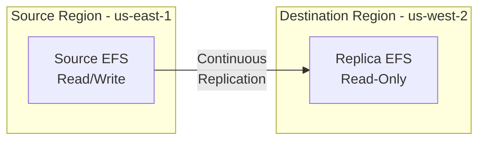

# How to Use EFS Replication for Disaster Recovery

Author: [nawazdhandala](https://github.com/nawazdhandala)

Tags: AWS, EFS, Disaster Recovery, Replication

Description: Set up EFS replication to automatically replicate your file system data to another AWS region or within the same region for disaster recovery purposes.

---

Disaster recovery for file systems has traditionally been a pain. You'd set up rsync jobs, manage complex scripts, deal with consistency issues, and hope you didn't lose too much data when things went wrong. EFS replication makes this dramatically simpler - you tell AWS to replicate your file system to another region, and it handles the rest. The initial sync happens automatically, ongoing changes are replicated continuously, and the RPO (Recovery Point Objective) is typically minutes, not hours.

Let's set it up and build a complete DR strategy around it.

## How EFS Replication Works

EFS replication creates a read-only replica of your file system in a destination region (or in the same region). Here's what happens:

1. You create a replication configuration on your source file system
2. AWS creates a new file system in the destination region
3. The initial data sync begins automatically
4. After the initial sync, changes are replicated continuously
5. The destination file system is read-only (to prevent conflicts)
6. If disaster strikes, you can promote the replica to read-write

The replication is asynchronous, so there's always some lag. For most file systems, changes replicate within minutes, but large bursts of writes can increase the lag.



## Creating a Replication Configuration

The setup is straightforward. Specify the source file system and the destination region:

```bash
# Create cross-region replication
aws efs create-replication-configuration \
  --source-file-system-id "fs-0abc123def456789" \
  --destinations '[{
    "Region": "us-west-2"
  }]'
```

This creates a new file system in us-west-2 and begins replicating data. You can also specify a KMS key for the destination:

```bash
# Create replication with a custom KMS key in the destination
aws efs create-replication-configuration \
  --source-file-system-id "fs-0abc123def456789" \
  --destinations '[{
    "Region": "us-west-2",
    "KmsKeyId": "arn:aws:kms:us-west-2:123456789012:key/mrk-abc123"
  }]'
```

For same-region replication (useful for protecting against accidental deletion):

```bash
# Same-region replication
aws efs create-replication-configuration \
  --source-file-system-id "fs-0abc123def456789" \
  --destinations '[{
    "Region": "us-east-1",
    "AvailabilityZoneName": "us-east-1a"
  }]'
```

## Monitoring Replication Status

Check the replication status and lag:

```bash
# Get replication configuration and status
aws efs describe-replication-configurations \
  --file-system-id "fs-0abc123def456789" \
  --query "Replications[0].{
    Source: SourceFileSystemId,
    SourceRegion: SourceFileSystemRegion,
    Destination: Destinations[0].FileSystemId,
    DestRegion: Destinations[0].Region,
    Status: Destinations[0].Status,
    LastSync: Destinations[0].LastReplicatedTimestamp
  }" \
  --output table
```

The status values you'll see:

- **ENABLED** - Replication is active and working
- **SYNCING** - Initial sync in progress
- **DELETING** - Replication is being removed
- **ERROR** - Something went wrong (check CloudWatch for details)

## Monitoring Replication Lag

Use CloudWatch to track how far behind the replica is:

```bash
# Check replication lag metric
aws cloudwatch get-metric-statistics \
  --namespace "AWS/EFS" \
  --metric-name "TimeSinceLastSync" \
  --dimensions "Name=FileSystemId,Value=fs-0abc123def456789" \
  --start-time "$(date -u -d '6 hours ago' +%Y-%m-%dT%H:%M:%SZ)" \
  --end-time "$(date -u +%Y-%m-%dT%H:%M:%SZ)" \
  --period 300 \
  --statistics Maximum \
  --output table
```

Set up an alarm for excessive lag:

```bash
# Alert if replication is more than 15 minutes behind
aws cloudwatch put-metric-alarm \
  --alarm-name "efs-replication-lag-high" \
  --alarm-description "EFS replication lag exceeds 15 minutes" \
  --namespace "AWS/EFS" \
  --metric-name "TimeSinceLastSync" \
  --dimensions "Name=FileSystemId,Value=fs-0abc123def456789" \
  --statistic Maximum \
  --period 300 \
  --evaluation-periods 3 \
  --threshold 900 \
  --comparison-operator GreaterThanThreshold \
  --alarm-actions "arn:aws:sns:us-east-1:123456789012:dr-alerts"
```

## Failover Procedure

When disaster strikes and you need to switch to the replica, here's the process:

Step 1 - Delete the replication configuration (this promotes the replica to read-write):

```bash
# Delete replication to promote the replica
# Run this in the SOURCE region
aws efs delete-replication-configuration \
  --source-file-system-id "fs-0abc123def456789" \
  --region us-east-1
```

Step 2 - Wait for the destination file system to become read-write:

```bash
# Check the destination file system status
# Run this in the DESTINATION region
aws efs describe-file-systems \
  --file-system-id "fs-0dest789abc123" \
  --region us-west-2 \
  --query "FileSystems[0].{Id:FileSystemId,State:LifeCycleState}" \
  --output table
```

Step 3 - Create mount targets in the destination region if they don't already exist:

```bash
# Create mount targets in us-west-2
aws efs create-mount-target \
  --file-system-id "fs-0dest789abc123" \
  --subnet-id "subnet-0west-a" \
  --security-groups "sg-0efs-west" \
  --region us-west-2

aws efs create-mount-target \
  --file-system-id "fs-0dest789abc123" \
  --subnet-id "subnet-0west-b" \
  --security-groups "sg-0efs-west" \
  --region us-west-2
```

Step 4 - Update your applications to mount the new file system:

```bash
# On instances in us-west-2
sudo umount /mnt/efs
sudo mount -t efs -o tls fs-0dest789abc123:/ /mnt/efs
```

## Automated Failover with Lambda

For faster failover, automate the process with Lambda:

```python
import boto3
import time

def failover_efs(event, context):
    """
    Automated EFS failover procedure.
    Triggered by a manual invoke or a health check failure.
    """
    source_fs_id = event['source_file_system_id']
    source_region = event['source_region']
    dest_region = event['dest_region']
    dest_subnets = event['dest_subnets']
    dest_security_group = event['dest_security_group']

    # Step 1: Get the destination file system ID
    efs_source = boto3.client('efs', region_name=source_region)
    replication = efs_source.describe_replication_configurations(
        FileSystemId=source_fs_id
    )
    dest_fs_id = replication['Replications'][0]['Destinations'][0]['FileSystemId']
    print(f"Destination file system: {dest_fs_id}")

    # Step 2: Delete replication (promotes replica)
    try:
        efs_source.delete_replication_configuration(
            SourceFileSystemId=source_fs_id
        )
        print("Replication deleted, replica promotion started")
    except Exception as e:
        print(f"Error deleting replication (source may be down): {e}")
        # If source region is down, we may need to delete from dest side
        efs_dest = boto3.client('efs', region_name=dest_region)
        efs_dest.delete_replication_configuration(
            SourceFileSystemId=source_fs_id
        )

    # Step 3: Wait for file system to be available
    efs_dest = boto3.client('efs', region_name=dest_region)
    while True:
        fs = efs_dest.describe_file_systems(FileSystemId=dest_fs_id)
        state = fs['FileSystems'][0]['LifeCycleState']
        if state == 'available':
            break
        print(f"Waiting for file system... Current state: {state}")
        time.sleep(10)

    # Step 4: Create mount targets
    existing_mts = efs_dest.describe_mount_targets(FileSystemId=dest_fs_id)
    existing_subnets = {mt['SubnetId'] for mt in existing_mts['MountTargets']}

    for subnet in dest_subnets:
        if subnet not in existing_subnets:
            efs_dest.create_mount_target(
                FileSystemId=dest_fs_id,
                SubnetId=subnet,
                SecurityGroups=[dest_security_group]
            )
            print(f"Created mount target in {subnet}")

    print(f"Failover complete. New file system: {dest_fs_id}")
    return {
        'statusCode': 200,
        'dest_file_system_id': dest_fs_id,
        'dest_region': dest_region
    }
```

## Failback Procedure

After the original region recovers and you want to fail back:

1. Set up replication from the DR file system back to the original region
2. Wait for the initial sync to complete
3. Delete the replication (promotes the new replica)
4. Switch your applications back

```bash
# Set up reverse replication
aws efs create-replication-configuration \
  --source-file-system-id "fs-0dest789abc123" \
  --destinations '[{"Region": "us-east-1"}]' \
  --region us-west-2
```

## Cost Considerations

EFS replication charges:

- **Storage costs** for the replica file system (same rates as the source)
- **Data transfer** between regions (standard AWS inter-region transfer rates)
- **No additional replication-specific charges** beyond storage and transfer

For a 1 TB file system replicating from us-east-1 to us-west-2:
- Source storage: ~$300/month
- Replica storage: ~$300/month
- Initial data transfer: ~$20 (one-time)
- Ongoing transfer: Depends on change rate, typically small

The replica file system also supports lifecycle management, so you can move cold data to IA on the replica too. See our post on [EFS lifecycle management](https://oneuptime.com/blog/post/efs-lifecycle-management-cost-optimization/view) for details.

## Testing Your DR Plan

Don't wait for a real disaster to test your failover. Schedule regular DR drills:

```bash
# DR drill script
#!/bin/bash
# 1. Record current replication status
echo "Pre-drill replication status:"
aws efs describe-replication-configurations \
  --file-system-id "$SOURCE_FS_ID" --region us-east-1

# 2. Create test file on source
ssh prod-instance "echo 'DR test $(date)' > /mnt/efs/dr-test.txt"

# 3. Wait for replication
echo "Waiting 5 minutes for replication..."
sleep 300

# 4. Check file exists on replica (mount and verify)
# This requires an instance in the DR region with the replica mounted

# 5. Practice the failover procedure (in a test environment)
echo "Drill complete. Document results."
```

## CloudFormation Template

```yaml
AWSTemplateFormatVersion: '2010-09-09'
Description: EFS with cross-region replication

Resources:
  SourceFileSystem:
    Type: AWS::EFS::FileSystem
    Properties:
      Encrypted: true
      PerformanceMode: generalPurpose
      ReplicationConfiguration:
        Destinations:
          - Region: us-west-2
      FileSystemTags:
        - Key: Name
          Value: primary-efs

  SourceMountTargetA:
    Type: AWS::EFS::MountTarget
    Properties:
      FileSystemId: !Ref SourceFileSystem
      SubnetId: !Ref SubnetA
      SecurityGroups:
        - !Ref EFSSecurityGroup
```

## Best Practices

1. **Monitor replication lag** continuously. A replica that's hours behind doesn't give you the RPO you think you have.
2. **Test failover regularly** - quarterly at minimum, monthly if you can.
3. **Automate the failover process** so it can be executed quickly under pressure.
4. **Keep mount targets ready** in the DR region. Don't wait until failover to create them.
5. **Document the procedure** and make sure multiple team members know how to execute it.
6. **Consider your RPO and RTO requirements**. EFS replication gives you minutes of RPO, but RTO depends on how fast you can update your applications to use the new file system.

## Wrapping Up

EFS replication gives you a managed, always-on disaster recovery solution for your file system data. The setup is simple - one API call creates the replication - and the ongoing operation is hands-off. The key to a successful DR strategy is testing. Set up the replication today, run a failover drill next week, and then make it a regular practice. When the real disaster hits, you want the failover to be boring and routine, not a scramble.
