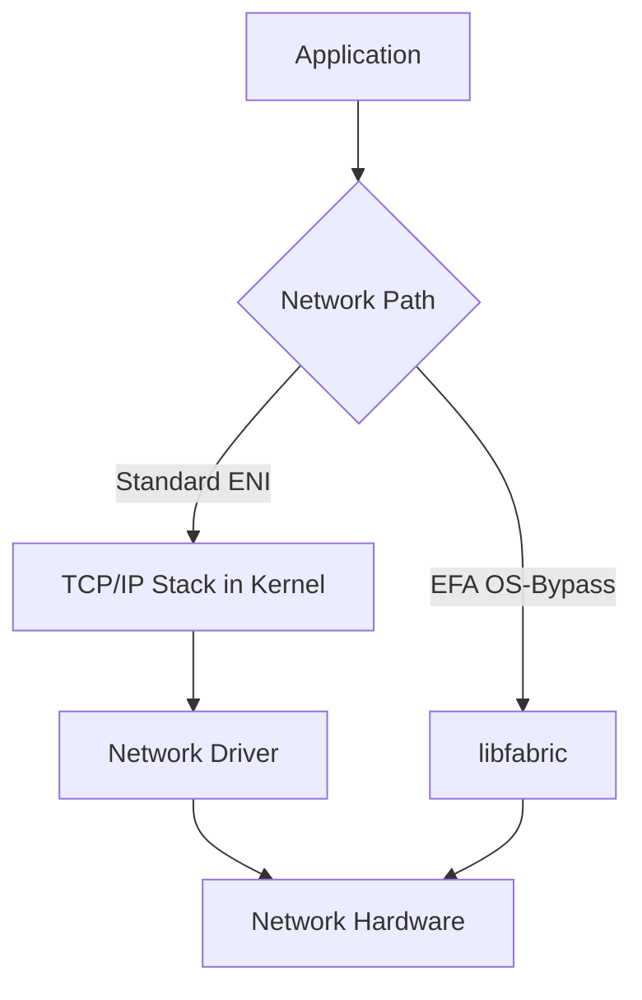

# How to Use Elastic Fabric Adapter (EFA) for HPC on EC2

Author: [nawazdhandala](https://github.com/nawazdhandala)

Tags: AWS, EC2, HPC, EFA, Networking

Description: Step-by-step guide to setting up Elastic Fabric Adapter on EC2 for high-performance computing workloads with low-latency inter-node communication.

---

High-performance computing on the cloud has always had one big bottleneck: network latency between nodes. Traditional TCP/IP networking adds overhead that kills performance for tightly-coupled parallel workloads. AWS addressed this with the Elastic Fabric Adapter (EFA), a network interface that supports OS-bypass communication, giving you near bare-metal latency on EC2.

If you're running MPI jobs, machine learning training across multiple nodes, or any workload where inter-node communication speed matters, EFA is what you need.

## What Makes EFA Different?

Regular network interfaces on EC2 use the kernel's TCP/IP stack for all communication. Every packet goes through the operating system, adding latency at each hop. EFA changes this by providing a libfabric interface that lets applications talk directly to the network hardware, bypassing the OS kernel entirely.

The result? Latencies that are consistently low and throughput that scales with your cluster size. EFA supports both the standard IP networking path (so it works as a regular ENI) and the OS-bypass path for HPC traffic.

Here's a simplified view of how the two approaches differ:



## Supported Instance Types

Not all instance types support EFA. You need to use instances designed for compute-heavy or network-heavy workloads. The most common choices are:

- **c5n.18xlarge** and **c5n.metal** - Compute optimized with 100 Gbps networking
- **p4d.24xlarge** - GPU instances for ML training with 400 Gbps EFA
- **hpc6a.48xlarge** - Purpose-built HPC instances
- **m5n.24xlarge** and **r5n.24xlarge** - General purpose / memory optimized with enhanced networking
- **trn1.32xlarge** - For ML training workloads

Check the latest supported types with:

```bash
# List instance types that support EFA
aws ec2 describe-instance-types \
  --filters "Name=network-info.efa-supported,Values=true" \
  --query 'InstanceTypes[].InstanceType' \
  --output text
```

## Setting Up an EFA-Enabled Instance

Let's walk through launching an instance with EFA. You need to create the instance with an EFA-enabled network interface from the start.

First, create a security group that allows all traffic between cluster nodes. EFA requires that all traffic types are permitted within the cluster:

```bash
# Create a security group for the HPC cluster
aws ec2 create-security-group \
  --group-name hpc-cluster-sg \
  --description "Security group for EFA HPC cluster" \
  --vpc-id vpc-0abc123

# Allow all inbound traffic from the same security group
aws ec2 authorize-security-group-ingress \
  --group-id sg-0abc123 \
  --protocol -1 \
  --source-group sg-0abc123
```

Now launch the instance with EFA:

```bash
# Launch an instance with EFA enabled
aws ec2 run-instances \
  --image-id ami-0abc123def456 \
  --instance-type c5n.18xlarge \
  --key-name my-key \
  --network-interfaces "DeviceIndex=0,SubnetId=subnet-0abc123,Groups=sg-0abc123,InterfaceType=efa" \
  --placement "GroupName=hpc-placement-group"
```

Notice the `InterfaceType=efa` parameter. That's what tells AWS to provision an EFA-capable interface rather than a standard ENI.

## Creating a Placement Group

For HPC workloads, you absolutely want a cluster placement group. This tells AWS to place your instances physically close together in the data center, minimizing network hops.

Create a cluster placement group before launching your instances:

```bash
# Create a cluster placement group
aws ec2 create-placement-group \
  --group-name hpc-placement-group \
  --strategy cluster
```

All instances in the cluster should go into this placement group. The combination of EFA plus a cluster placement group gives you the lowest possible latency between nodes.

## Installing EFA Software

Once your instance is running, SSH in and install the EFA software stack. AWS provides an installer that handles everything.

Download and install the EFA software:

```bash
# Download the EFA installer
curl -O https://efa-installer.amazonaws.com/aws-efa-installer-latest.tar.gz

# Extract the archive
tar -xf aws-efa-installer-latest.tar.gz

# Run the installer
cd aws-efa-installer
sudo ./efa_installer.sh -y

# Reboot to load the new drivers
sudo reboot
```

After the reboot, verify the installation:

```bash
# Check that EFA is available
fi_info -p efa

# Verify the EFA device is present
ls /dev/infiniband/
```

The `fi_info -p efa` command should show available EFA endpoints. If you see output describing the provider capabilities, you're in good shape.

## Installing MPI for Parallel Computing

Most HPC workloads use MPI (Message Passing Interface) for inter-node communication. The EFA installer includes Open MPI built with libfabric support.

Verify MPI is installed and configured:

```bash
# Check Open MPI version (installed by EFA installer)
/opt/amazon/openmpi/bin/mpirun --version

# Set up your PATH and LD_LIBRARY_PATH
export PATH=/opt/amazon/openmpi/bin:$PATH
export LD_LIBRARY_PATH=/opt/amazon/openmpi/lib:$LD_LIBRARY_PATH
```

Add those exports to your `.bashrc` so they persist:

```bash
# Make the environment permanent
echo 'export PATH=/opt/amazon/openmpi/bin:$PATH' >> ~/.bashrc
echo 'export LD_LIBRARY_PATH=/opt/amazon/openmpi/lib:$LD_LIBRARY_PATH' >> ~/.bashrc
```

## Running a Benchmark Test

Let's verify everything works with a simple MPI benchmark. The OSU Micro-Benchmarks are the standard tool for this.

Build and run the OSU latency benchmark:

```bash
# Download OSU Micro-Benchmarks
wget https://mvapich.cse.ohio-state.edu/download/mvapich/osu-micro-benchmarks-7.3.tar.gz
tar -xf osu-micro-benchmarks-7.3.tar.gz
cd osu-micro-benchmarks-7.3

# Configure and build with the EFA-aware MPI
./configure CC=/opt/amazon/openmpi/bin/mpicc CXX=/opt/amazon/openmpi/bin/mpicxx
make -j$(nproc)

# Run the latency test between two nodes
mpirun -n 2 \
  -host node1-ip,node2-ip \
  --mca btl tcp,self \
  --mca pml ^cm \
  -x FI_PROVIDER=efa \
  ./c/mpi/pt2pt/standard/osu_latency
```

You should see latencies in the single-digit microseconds range for small messages. That's a massive improvement over regular TCP networking, which typically shows 20-50 microsecond latencies.

## Setting Up a Multi-Node Cluster

For a real HPC cluster, you'll want to set up SSH connectivity between all nodes and create a hostfile for MPI.

Create a hostfile listing all your cluster nodes:

```bash
# Create a hostfile with your cluster nodes
cat > hostfile << 'EOF'
10.0.1.10 slots=36
10.0.1.11 slots=36
10.0.1.12 slots=36
10.0.1.13 slots=36
EOF
```

Each line specifies a node IP and the number of cores (slots) available. Then run your MPI application across the cluster:

```bash
# Run an MPI application across the cluster
mpirun -n 144 \
  --hostfile hostfile \
  -x FI_PROVIDER=efa \
  -x FI_EFA_USE_DEVICE_RDMA=1 \
  --mca btl tcp,self \
  --mca pml ^cm \
  ./my_hpc_application
```

The `FI_EFA_USE_DEVICE_RDMA=1` environment variable enables RDMA (Remote Direct Memory Access) on supported instances, which provides even better performance for large messages.

## Using AWS ParallelCluster

Manually setting up HPC clusters gets tedious. AWS ParallelCluster automates the whole thing, including EFA configuration.

Install and use ParallelCluster to create an EFA-enabled cluster:

```bash
# Install ParallelCluster
pip3 install aws-parallelcluster

# Create a cluster configuration
pcluster configure --config cluster-config.yaml
```

Here's a sample configuration snippet that enables EFA:

```yaml
Region: us-east-1
Scheduling:
  Scheduler: slurm
  SlurmQueues:
    - Name: hpc
      ComputeResources:
        - Name: c5n-18xl
          InstanceType: c5n.18xlarge
          MinCount: 0
          MaxCount: 10
          Efa:
            Enabled: true
      Networking:
        SubnetIds:
          - subnet-0abc123
        PlacementGroup:
          Enabled: true
```

## Monitoring EFA Performance

You'll want to keep an eye on your EFA cluster's performance. CloudWatch doesn't have EFA-specific metrics out of the box, but you can monitor network throughput and use custom metrics.

For comprehensive monitoring of your HPC infrastructure, consider setting up a monitoring solution that tracks node health, network latency, and job performance. Our post on [monitoring AWS infrastructure](https://oneuptime.com/blog/post/aws-infrastructure-monitoring/view) covers the fundamentals of setting up observability for EC2-based workloads.

## Troubleshooting

**EFA not detected after install**: Make sure you rebooted after running the installer. The kernel modules need to load fresh.

**High latency in benchmarks**: Verify all instances are in the same cluster placement group and same Availability Zone. Also check that `FI_PROVIDER=efa` is set - without it, libfabric might fall back to TCP.

**Permission errors on /dev/infiniband/**: The EFA installer sets up udev rules, but you might need to add your user to the right group. Check `/etc/udev/rules.d/` for EFA rules.

## Wrapping Up

EFA brings HPC-class networking to EC2 by enabling OS-bypass communication. The setup involves launching instances with EFA interfaces, installing the EFA software stack, and configuring MPI to use the EFA provider. Combined with cluster placement groups and the right instance types, you can run tightly-coupled parallel workloads on AWS with latency that rivals on-premises HPC clusters.
