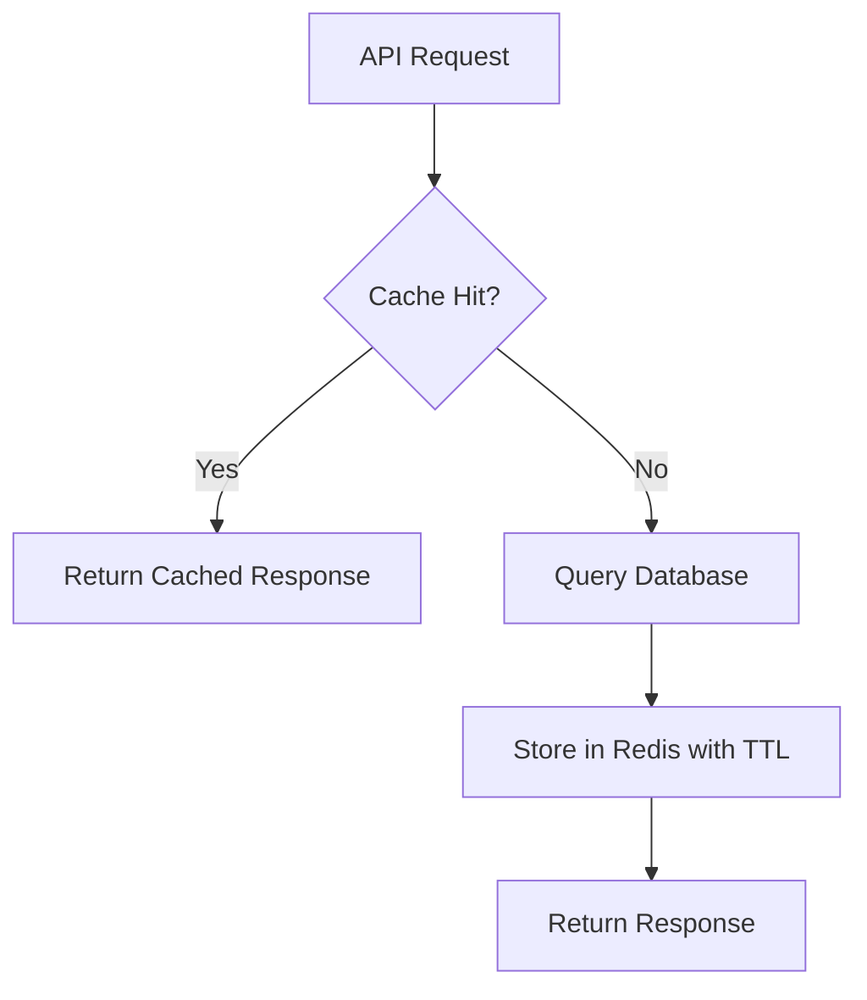

# How to Use ElastiCache Redis for API Response Caching

Author: [nawazdhandala](https://github.com/nawazdhandala)

Tags: AWS, ElastiCache, Redis, API, Caching

Description: Learn how to implement API response caching with ElastiCache Redis to reduce latency, decrease database load, and handle traffic spikes without breaking a sweat.

---

Every time your API hits the database for the same data that hasn't changed in the last 5 minutes, you're wasting compute cycles, database connections, and your users' time. API response caching with Redis fixes this by storing the results of expensive queries and serving them directly from memory on subsequent requests.

The difference can be dramatic - API calls that take 200-500ms hitting the database can drop to 1-5ms from Redis.

## The Cache-Aside Pattern

The most common caching pattern for APIs is cache-aside (also called lazy loading):

1. Check Redis for the cached response
2. If found (cache hit), return it immediately
3. If not found (cache miss), query the database
4. Store the result in Redis with a TTL
5. Return the result



## Basic Implementation

### Python - Flask API Caching

Here's a clean implementation with a reusable caching decorator:

```python
import redis
import json
import hashlib
import functools
from flask import Flask, request, jsonify

app = Flask(__name__)

# Redis connection
cache = redis.Redis(
    host='my-redis.abc123.ng.0001.use1.cache.amazonaws.com',
    port=6379,
    ssl=True,
    decode_responses=True,
    socket_timeout=2,
    retry_on_timeout=True
)

def cache_response(ttl=300, prefix='api'):
    """
    Decorator that caches API responses in Redis.
    TTL is in seconds (default 5 minutes).
    """
    def decorator(func):
        @functools.wraps(func)
        def wrapper(*args, **kwargs):
            # Build a cache key from the function name and request parameters
            key_data = {
                'func': func.__name__,
                'path': request.path,
                'args': request.args.to_dict(),
            }
            key_hash = hashlib.md5(
                json.dumps(key_data, sort_keys=True).encode()
            ).hexdigest()
            cache_key = f"{prefix}:{func.__name__}:{key_hash}"

            # Try to get from cache
            try:
                cached = cache.get(cache_key)
                if cached:
                    response = json.loads(cached)
                    response['_cached'] = True  # Optional: indicate cache hit
                    return jsonify(response)
            except redis.RedisError:
                pass  # Cache unavailable - proceed without cache

            # Cache miss - call the actual function
            result = func(*args, **kwargs)

            # Store in cache
            try:
                cache.setex(cache_key, ttl, json.dumps(result))
            except redis.RedisError:
                pass  # Failed to cache - that's okay

            return jsonify(result)
        return wrapper
    return decorator

# Example API endpoints with caching

@app.route('/api/products')
@cache_response(ttl=600)  # Cache for 10 minutes
def get_products():
    """Get product listing - expensive database query."""
    category = request.args.get('category', 'all')
    # Simulate database query
    products = db.query(
        "SELECT * FROM products WHERE category = %s ORDER BY popularity DESC LIMIT 50",
        [category]
    )
    return {'products': products, 'count': len(products)}

@app.route('/api/products/<int:product_id>')
@cache_response(ttl=300)  # Cache for 5 minutes
def get_product(product_id):
    """Get single product detail."""
    product = db.query(
        "SELECT * FROM products WHERE id = %s", [product_id]
    )
    return {'product': product}

@app.route('/api/stats/dashboard')
@cache_response(ttl=60)  # Cache for 1 minute (frequently changing data)
def get_dashboard_stats():
    """Dashboard stats - aggregation query that's slow but doesn't need to be real-time."""
    stats = db.query("""
        SELECT
            COUNT(*) as total_orders,
            SUM(amount) as total_revenue,
            COUNT(DISTINCT customer_id) as unique_customers
        FROM orders
        WHERE created_at > NOW() - INTERVAL 24 HOUR
    """)
    return {'stats': stats}
```

### Node.js - Express API Caching

```javascript
const express = require('express');
const Redis = require('ioredis');
const crypto = require('crypto');

const app = express();

const redis = new Redis({
  host: 'my-redis.abc123.ng.0001.use1.cache.amazonaws.com',
  port: 6379,
  tls: {},
  retryStrategy: (times) => Math.min(times * 200, 3000),
  maxRetriesPerRequest: 3,
});

/**
 * Middleware that caches API responses in Redis.
 * @param {number} ttl - Time to live in seconds
 * @param {Function} keyGenerator - Custom key generation function
 */
function cacheMiddleware(ttl = 300, keyGenerator = null) {
  return async (req, res, next) => {
    // Generate cache key
    const keyData = keyGenerator
      ? keyGenerator(req)
      : `${req.method}:${req.originalUrl}`;
    const cacheKey = `api:${crypto.createHash('md5').update(keyData).digest('hex')}`;

    try {
      const cached = await redis.get(cacheKey);
      if (cached) {
        const data = JSON.parse(cached);
        res.set('X-Cache', 'HIT');
        return res.json(data);
      }
    } catch (err) {
      console.warn('Cache read error:', err.message);
    }

    // Store the original json method to intercept the response
    const originalJson = res.json.bind(res);
    res.json = (data) => {
      // Cache the response asynchronously
      redis.setex(cacheKey, ttl, JSON.stringify(data)).catch((err) => {
        console.warn('Cache write error:', err.message);
      });

      res.set('X-Cache', 'MISS');
      return originalJson(data);
    };

    next();
  };
}

// Apply caching to specific routes
app.get('/api/products', cacheMiddleware(600), async (req, res) => {
  const products = await db.query('SELECT * FROM products LIMIT 50');
  res.json({ products });
});

app.get('/api/products/:id', cacheMiddleware(300), async (req, res) => {
  const product = await db.query('SELECT * FROM products WHERE id = ?', [req.params.id]);
  res.json({ product });
});

// Shorter cache for frequently changing data
app.get('/api/trending', cacheMiddleware(60), async (req, res) => {
  const trending = await db.query(`
    SELECT p.*, COUNT(oi.id) as recent_orders
    FROM products p
    JOIN order_items oi ON p.id = oi.product_id
    WHERE oi.created_at > NOW() - INTERVAL 1 HOUR
    GROUP BY p.id
    ORDER BY recent_orders DESC
    LIMIT 10
  `);
  res.json({ trending });
});
```

## Cache Invalidation

The hardest part of caching is knowing when to invalidate. Here are three strategies:

### Strategy 1: TTL-Based Expiration

The simplest approach. Set a TTL and accept that data might be stale for up to that duration.

```python
# Data is fresh for 5 minutes, then re-fetched from database
cache.setex('api:products:list', 300, json.dumps(products))
```

### Strategy 2: Event-Based Invalidation

When data changes, explicitly delete the cache entry:

```python
def update_product(product_id, data):
    """Update a product and invalidate its cache."""
    # Update in database
    db.execute("UPDATE products SET name=%s, price=%s WHERE id=%s",
               [data['name'], data['price'], product_id])

    # Invalidate specific product cache
    pattern = f"api:get_product:*"
    # Delete all cached versions of product listings
    for key in cache.scan_iter(match=pattern):
        cache.delete(key)

    # Also invalidate the product list cache
    for key in cache.scan_iter(match="api:get_products:*"):
        cache.delete(key)
```

### Strategy 3: Tag-Based Invalidation

Group cache entries with tags so you can invalidate related entries together:

```python
class TaggedCache:
    def __init__(self, redis_client):
        self.redis = redis_client

    def set(self, key, value, ttl, tags=None):
        """Set a cache entry with optional tags."""
        pipe = self.redis.pipeline()
        pipe.setex(key, ttl, json.dumps(value))

        if tags:
            for tag in tags:
                pipe.sadd(f"tag:{tag}", key)
                pipe.expire(f"tag:{tag}", ttl + 60)

        pipe.execute()

    def get(self, key):
        """Get a cache entry."""
        data = self.redis.get(key)
        return json.loads(data) if data else None

    def invalidate_tag(self, tag):
        """Invalidate all cache entries with a specific tag."""
        tag_key = f"tag:{tag}"
        keys = self.redis.smembers(tag_key)

        if keys:
            pipe = self.redis.pipeline()
            for key in keys:
                pipe.delete(key)
            pipe.delete(tag_key)
            pipe.execute()

# Usage
tagged_cache = TaggedCache(cache)

# Cache with tags
tagged_cache.set(
    'api:products:electronics',
    products,
    ttl=600,
    tags=['products', 'electronics']
)

# Invalidate all product caches when any product changes
tagged_cache.invalidate_tag('products')
```

## Handling Cache Stampedes

When a popular cache entry expires, hundreds of requests might simultaneously hit the database to rebuild it. This is called a cache stampede or thundering herd.

Here's a locking mechanism to prevent it:

```python
import time

def get_with_lock(cache_key, fetch_func, ttl=300, lock_ttl=10):
    """
    Get from cache with stampede protection.
    Only one request fetches from DB when cache expires.
    """
    # Try cache first
    cached = cache.get(cache_key)
    if cached:
        return json.loads(cached)

    # Cache miss - try to acquire a lock
    lock_key = f"lock:{cache_key}"
    lock_acquired = cache.set(lock_key, '1', ex=lock_ttl, nx=True)

    if lock_acquired:
        # We got the lock - fetch from database
        try:
            result = fetch_func()
            cache.setex(cache_key, ttl, json.dumps(result))
            return result
        finally:
            cache.delete(lock_key)
    else:
        # Another request is fetching - wait and retry
        for _ in range(lock_ttl * 10):
            time.sleep(0.1)
            cached = cache.get(cache_key)
            if cached:
                return json.loads(cached)

        # Lock expired without cache being set - fetch directly
        return fetch_func()
```

## Setting Cache TTLs

Choosing the right TTL is a balancing act between freshness and performance:

| Data Type | Recommended TTL | Reason |
|-----------|----------------|--------|
| Static content (about pages) | 1 hour+ | Rarely changes |
| Product listings | 5-15 minutes | Changes occasionally |
| User profiles | 2-5 minutes | Can tolerate slight staleness |
| Search results | 1-5 minutes | Frequently queried, slowly changing |
| Dashboard stats | 30-60 seconds | Needs to be relatively fresh |
| Real-time data (prices) | 5-15 seconds | Needs to be very fresh |

## Monitoring Cache Effectiveness

Track these metrics to know if your caching strategy is working:

```bash
# Check cache hit ratio
aws cloudwatch get-metric-statistics \
  --namespace AWS/ElastiCache \
  --metric-name CacheHitRate \
  --dimensions Name=CacheClusterId,Value=my-redis-001 \
  --start-time $(date -u -d '24 hours ago' +%Y-%m-%dT%H:%M:%S) \
  --end-time $(date -u +%Y-%m-%dT%H:%M:%S) \
  --period 3600 \
  --statistics Average
```

A healthy API cache should have a hit rate above 80%. If it's lower, your TTLs might be too short or your key generation might be too specific.

## Wrapping Up

API response caching with Redis can dramatically reduce your API latency and database load. Start with the cache-aside pattern and TTL-based expiration - they cover 90% of use cases. Add event-based invalidation for data that changes frequently and where freshness matters. And always build your caching layer to fail gracefully - if Redis goes down, your API should still work, just slower.

For more caching patterns, check out the guide on [session caching with Redis](https://oneuptime.com/blog/post/2026-02-12-elasticache-redis-for-session-caching/view). For monitoring, see the guide on [monitoring ElastiCache with CloudWatch](https://oneuptime.com/blog/post/2026-02-12-monitor-elasticache-with-cloudwatch/view).
