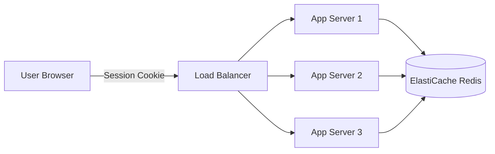

# How to Use ElastiCache Redis for Session Caching

Author: [nawazdhandala](https://github.com/nawazdhandala)

Tags: AWS, ElastiCache, Redis, Session Management, Caching

Description: A hands-on guide to implementing session storage with ElastiCache Redis, covering session management patterns in Python, Node.js, and Java with production-ready configurations.

---

Storing sessions on individual application servers is fine until you have more than one server. The moment you scale horizontally - multiple EC2 instances behind a load balancer, containers in ECS, or functions in Lambda - you need a centralized session store. ElastiCache Redis is one of the best options for this because it's fast, supports TTL-based expiration natively, and can handle thousands of session operations per second.

Let's implement session caching with Redis across different frameworks and languages.

## Why Redis for Sessions

Sessions have a few specific requirements that Redis handles well:

- **Fast reads and writes** - Session lookups happen on every request. Sub-millisecond latency matters.
- **Automatic expiration** - Sessions should expire after a period of inactivity. Redis TTL handles this natively.
- **Atomic operations** - Updating session data needs to be atomic to avoid race conditions.
- **Persistence** - You don't want active sessions to disappear if Redis restarts. Redis with persistence (or a backup strategy) keeps sessions safe.



## Redis Cluster Configuration for Sessions

Sessions don't need a lot of memory per session (typically 1-10 KB each), but they need high availability. Here's a recommended setup:

```bash
# Create a Redis replication group optimized for session storage
aws elasticache create-replication-group \
  --replication-group-id session-store \
  --replication-group-description "Session storage cluster" \
  --engine redis \
  --engine-version 7.0 \
  --cache-node-type cache.r6g.large \
  --num-cache-clusters 3 \
  --automatic-failover-enabled \
  --multi-az-enabled \
  --at-rest-encryption-enabled \
  --transit-encryption-enabled \
  --snapshot-retention-limit 3 \
  --snapshot-window "04:00-05:00" \
  --cache-subnet-group-name my-cache-subnet-group \
  --security-group-ids sg-session-cache
```

Configure the parameter group for session workloads:

```bash
# Create a parameter group optimized for sessions
aws elasticache create-cache-parameter-group \
  --cache-parameter-group-name session-params \
  --cache-parameter-group-family redis7 \
  --description "Parameters optimized for session storage"

# Set maxmemory-policy to volatile-lru (only evict keys with TTL set)
aws elasticache modify-cache-parameter-group \
  --cache-parameter-group-name session-params \
  --parameter-name-values \
    "ParameterName=maxmemory-policy,ParameterValue=volatile-lru" \
    "ParameterName=notify-keyspace-events,ParameterValue=Ex"
```

Using `volatile-lru` means Redis will only evict keys that have a TTL set when memory is full, and it'll evict the least recently used ones first. Since all sessions have TTLs, this is exactly what we want.

## Python - Flask Session Storage

### Using Flask-Session with Redis

Install the dependencies:

```bash
pip install Flask flask-session redis
```

Configure Flask to use Redis for sessions:

```python
from flask import Flask, session
from flask_session import Session
import redis

app = Flask(__name__)

# Configure Redis session backend
app.config['SESSION_TYPE'] = 'redis'
app.config['SESSION_PERMANENT'] = True
app.config['PERMANENT_SESSION_LIFETIME'] = 3600  # 1 hour
app.config['SESSION_USE_SIGNER'] = True  # Sign the session cookie
app.config['SESSION_KEY_PREFIX'] = 'session:'
app.config['SESSION_REDIS'] = redis.Redis(
    host='session-store.abc123.ng.0001.use1.cache.amazonaws.com',
    port=6379,
    ssl=True,
    socket_timeout=5,
    socket_connect_timeout=2,
    retry_on_timeout=True,
    health_check_interval=30,
)

# Initialize Flask-Session
Session(app)

@app.route('/login', methods=['POST'])
def login():
    # After authenticating the user
    session['user_id'] = 42
    session['username'] = 'alice'
    session['role'] = 'admin'
    session['login_time'] = '2026-02-12T10:00:00Z'
    return {'status': 'logged in'}

@app.route('/profile')
def profile():
    if 'user_id' not in session:
        return {'error': 'not authenticated'}, 401

    return {
        'user_id': session['user_id'],
        'username': session['username'],
        'role': session['role']
    }

@app.route('/logout')
def logout():
    session.clear()
    return {'status': 'logged out'}
```

### Custom Session Implementation

For more control, implement session management directly:

```python
import redis
import json
import uuid
import time

class RedisSessionManager:
    def __init__(self, redis_host, redis_port=6379, ttl=3600, prefix='sess:'):
        self.redis = redis.Redis(
            host=redis_host,
            port=redis_port,
            ssl=True,
            decode_responses=True,
            socket_timeout=5,
            retry_on_timeout=True
        )
        self.ttl = ttl
        self.prefix = prefix

    def create_session(self, user_data):
        """Create a new session and return the session ID."""
        session_id = str(uuid.uuid4())
        key = f"{self.prefix}{session_id}"

        session_data = {
            **user_data,
            'created_at': time.time(),
            'last_accessed': time.time()
        }

        # Store session as a Redis hash for efficient field access
        self.redis.hset(key, mapping=session_data)
        self.redis.expire(key, self.ttl)

        return session_id

    def get_session(self, session_id):
        """Retrieve session data and refresh the TTL."""
        key = f"{self.prefix}{session_id}"
        data = self.redis.hgetall(key)

        if not data:
            return None

        # Refresh TTL on access (sliding expiration)
        self.redis.expire(key, self.ttl)
        self.redis.hset(key, 'last_accessed', time.time())

        return data

    def update_session(self, session_id, updates):
        """Update specific fields in the session."""
        key = f"{self.prefix}{session_id}"

        if not self.redis.exists(key):
            return False

        updates['last_accessed'] = time.time()
        self.redis.hset(key, mapping=updates)
        self.redis.expire(key, self.ttl)
        return True

    def destroy_session(self, session_id):
        """Delete a session."""
        key = f"{self.prefix}{session_id}"
        return self.redis.delete(key) > 0

    def get_active_session_count(self):
        """Count active sessions (approximate)."""
        cursor = 0
        count = 0
        while True:
            cursor, keys = self.redis.scan(cursor, match=f"{self.prefix}*", count=100)
            count += len(keys)
            if cursor == 0:
                break
        return count
```

## Node.js - Express Session Storage

### Using express-session with connect-redis

```javascript
const express = require('express');
const session = require('express-session');
const RedisStore = require('connect-redis').default;
const Redis = require('ioredis');

const app = express();

// Create Redis client
const redisClient = new Redis({
  host: 'session-store.abc123.ng.0001.use1.cache.amazonaws.com',
  port: 6379,
  tls: {},
  retryStrategy: (times) => Math.min(times * 200, 3000),
  maxRetriesPerRequest: 3,
  enableReadyCheck: true,
});

// Configure session middleware
app.use(session({
  store: new RedisStore({
    client: redisClient,
    prefix: 'sess:',
    ttl: 3600, // 1 hour in seconds
  }),
  secret: process.env.SESSION_SECRET || 'your-secret-key',
  resave: false,
  saveUninitialized: false,
  cookie: {
    secure: true,      // HTTPS only
    httpOnly: true,     // No JavaScript access
    maxAge: 3600000,    // 1 hour in milliseconds
    sameSite: 'strict'
  },
  name: 'sessionId' // Custom cookie name (avoid default 'connect.sid')
}));

// Routes
app.post('/api/login', (req, res) => {
  // After authentication
  req.session.userId = 42;
  req.session.username = 'alice';
  req.session.role = 'admin';

  res.json({ status: 'logged in' });
});

app.get('/api/profile', (req, res) => {
  if (!req.session.userId) {
    return res.status(401).json({ error: 'not authenticated' });
  }

  res.json({
    userId: req.session.userId,
    username: req.session.username,
    role: req.session.role
  });
});

app.post('/api/logout', (req, res) => {
  req.session.destroy((err) => {
    if (err) console.error('Session destroy error:', err);
    res.clearCookie('sessionId');
    res.json({ status: 'logged out' });
  });
});
```

## Java - Spring Session with Redis

In your `pom.xml`:

```xml
<dependency>
    <groupId>org.springframework.session</groupId>
    <artifactId>spring-session-data-redis</artifactId>
</dependency>
<dependency>
    <groupId>org.springframework.boot</groupId>
    <artifactId>spring-boot-starter-data-redis</artifactId>
</dependency>
```

Configure Spring Session:

```java
import org.springframework.context.annotation.Bean;
import org.springframework.context.annotation.Configuration;
import org.springframework.data.redis.connection.RedisConnectionFactory;
import org.springframework.data.redis.connection.lettuce.LettuceConnectionFactory;
import org.springframework.session.data.redis.config.annotation.web.http.EnableRedisHttpSession;

@Configuration
@EnableRedisHttpSession(maxInactiveIntervalInSeconds = 3600)
public class SessionConfig {

    @Bean
    public RedisConnectionFactory connectionFactory() {
        LettuceConnectionFactory factory = new LettuceConnectionFactory(
            "session-store.abc123.ng.0001.use1.cache.amazonaws.com",
            6379
        );
        factory.setUseSsl(true);
        return factory;
    }
}
```

## Session Security Best Practices

**Regenerate session IDs after login.** This prevents session fixation attacks:

```python
# Python - regenerate session after authentication
old_data = dict(session)
session.clear()
# Flask-Session generates a new ID automatically
for key, value in old_data.items():
    session[key] = value
```

**Store minimal data.** Don't store the entire user object. Store just the user ID and fetch details from the database when needed.

**Use secure cookie settings.** Always set `Secure`, `HttpOnly`, and `SameSite` attributes on session cookies.

**Monitor session counts.** A sudden spike in active sessions might indicate a session fixation attack or a cookie issue causing new sessions on every request.

## Wrapping Up

ElastiCache Redis is an ideal session store - it's fast, supports automatic expiration, and works naturally with horizontal scaling. Use the framework-specific session libraries (Flask-Session, connect-redis, Spring Session) for the quickest setup, and implement a custom session manager when you need more control.

Make sure you enable [encryption](https://oneuptime.com/blog/post/2026-02-12-enable-elasticache-redis-encryption/view) on your session store cluster - sessions contain authentication state, and you don't want that data exposed. For monitoring your session store's health, check out the guide on [monitoring ElastiCache with CloudWatch](https://oneuptime.com/blog/post/2026-02-12-monitor-elasticache-with-cloudwatch/view).
