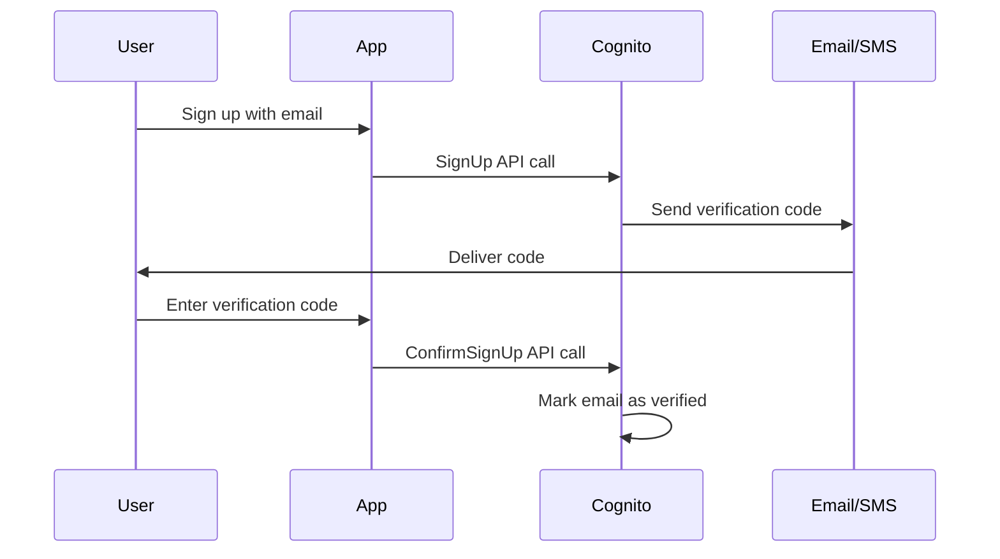

# How to Set Up Email and Phone Verification in Cognito

Author: [nawazdhandala](https://github.com/nawazdhandala)

Tags: AWS, Cognito, Verification, Security

Description: Configure email and phone number verification in Amazon Cognito User Pools, including custom verification messages, SES integration, and SNS setup.

---

Email and phone verification serve two purposes in Cognito. First, they confirm the user actually owns the email address or phone number they provided. Second, they enable those channels for password recovery and MFA. Skipping verification is tempting during development, but in production you want verified contact information for every user.

## How Verification Works

When a user signs up or updates their email/phone, Cognito sends a verification code. The user enters that code to prove they control the address or number. Cognito then marks the attribute as verified in the user profile.

The flow looks like this:



## Configuring Email Verification

Enable email auto-verification in your User Pool:

```hcl
# cognito-verification.tf
resource "aws_cognito_user_pool" "main" {
  name = "my-app-user-pool"

  # Auto-verify email addresses
  auto_verified_attributes = ["email"]
  username_attributes       = ["email"]

  # Verification message template
  verification_message_template {
    default_email_option = "CONFIRM_WITH_CODE"
    email_subject        = "Verify your email for MyApp"
    email_message        = "Hi! Your verification code is {####}. This code expires in 24 hours."
  }

  # Email configuration using Cognito default (dev only)
  email_configuration {
    email_sending_account = "COGNITO_DEFAULT"
  }
}
```

The `{####}` placeholder gets replaced with the actual verification code.

## Using Amazon SES for Production Email

Cognito's default email sender has a 50-email-per-day limit. For production, you need Amazon SES:

```hcl
# SES identity for sending verification emails
resource "aws_ses_email_identity" "auth" {
  email = "noreply@myapp.com"
}

# Or verify the whole domain
resource "aws_ses_domain_identity" "main" {
  domain = "myapp.com"
}

# SES DKIM for better deliverability
resource "aws_ses_domain_dkim" "main" {
  domain = aws_ses_domain_identity.main.domain
}

# Configure Cognito to use SES
resource "aws_cognito_user_pool" "main" {
  name = "my-app-user-pool"

  auto_verified_attributes = ["email"]

  email_configuration {
    email_sending_account  = "DEVELOPER"
    source_arn             = aws_ses_email_identity.auth.arn
    from_email_address     = "MyApp <noreply@myapp.com>"
    reply_to_email_address = "support@myapp.com"
  }
}
```

Make sure SES is out of sandbox mode for production. Otherwise you can only send to verified email addresses.

## Verification with Links Instead of Codes

Cognito supports verification links as an alternative to codes. Users click a link instead of entering a code:

```hcl
resource "aws_cognito_user_pool" "main" {
  name = "my-app-user-pool"

  auto_verified_attributes = ["email"]

  verification_message_template {
    # Use links instead of codes
    default_email_option  = "CONFIRM_WITH_LINK"
    email_subject_by_link = "Verify your email for MyApp"
    email_message_by_link = "Click {##Verify Email##} to confirm your email address."
  }
}
```

The `{##Verify Email##}` placeholder becomes a clickable link. This requires a User Pool domain to be configured.

## Setting Up Phone Verification

Phone verification uses SMS through Amazon SNS. It's more involved than email because SNS has its own configuration:

```hcl
# IAM role for Cognito to send SMS via SNS
resource "aws_iam_role" "cognito_sms" {
  name = "cognito-sms-role"

  assume_role_policy = jsonencode({
    Version = "2012-10-17"
    Statement = [{
      Effect = "Allow"
      Principal = {
        Service = "cognito-idp.amazonaws.com"
      }
      Action = "sts:AssumeRole"
      Condition = {
        StringEquals = {
          "sts:ExternalId" = "cognito-sms-external-id"
        }
      }
    }]
  })
}

resource "aws_iam_role_policy" "cognito_sms" {
  name = "cognito-sms-policy"
  role = aws_iam_role.cognito_sms.id

  policy = jsonencode({
    Version = "2012-10-17"
    Statement = [{
      Effect   = "Allow"
      Action   = "sns:Publish"
      Resource = "*"
    }]
  })
}

# User Pool with phone verification
resource "aws_cognito_user_pool" "main" {
  name = "my-app-user-pool"

  # Auto-verify both email and phone
  auto_verified_attributes = ["email", "phone_number"]

  # SMS configuration
  sms_configuration {
    external_id    = "cognito-sms-external-id"
    sns_caller_arn = aws_iam_role.cognito_sms.arn
    sns_region     = "us-east-1"
  }

  # SMS verification message
  sms_verification_message = "Your MyApp verification code is {####}"

  # Schema must include phone_number
  schema {
    attribute_data_type = "String"
    name                = "phone_number"
    required            = false
    mutable             = true
  }
}
```

## SNS Spending Limits

SMS messages cost money. Set a spending limit to avoid surprises:

```bash
# Set the monthly SMS spending limit
aws sns set-sms-attributes \
  --attributes '{"MonthlySpendLimit": "100"}'

# Check current SMS settings
aws sns get-sms-attributes
```

For production, you'll also want to move out of the SNS SMS sandbox:

```bash
# Request production access for SMS
# This is done through the AWS Support console
# You'll need to provide a use case description
```

## Implementing Verification in Code

Handle the verification flow in your application:

```javascript
// verification.js - Handle email/phone verification
import {
  confirmSignUp,
  resendSignUpCode,
  confirmUserAttribute,
  sendUserAttributeVerificationCode
} from 'aws-amplify/auth';

// Confirm sign-up with verification code
async function verifySignUp(email, code) {
  try {
    const result = await confirmSignUp({
      username: email,
      confirmationCode: code
    });
    console.log('Email verified:', result.isSignUpComplete);
    return result;
  } catch (error) {
    if (error.name === 'CodeMismatchException') {
      console.error('Invalid code, please try again');
    } else if (error.name === 'ExpiredCodeException') {
      console.error('Code expired, requesting a new one');
      await resendCode(email);
    }
    throw error;
  }
}

// Resend verification code
async function resendCode(email) {
  const result = await resendSignUpCode({ username: email });
  console.log('Code sent to:', result.destination);
  return result;
}

// Verify an attribute update (when user changes their email)
async function verifyAttributeChange(attribute, code) {
  await confirmUserAttribute({
    userAttributeKey: attribute,
    confirmationCode: code
  });
  console.log(`${attribute} verified successfully`);
}

// Request a new verification code for attribute changes
async function requestAttributeVerification(attribute) {
  const result = await sendUserAttributeVerificationCode({
    userAttributeKey: attribute
  });
  console.log('Verification code sent:', result.destination);
  return result;
}
```

## Custom Verification Messages

Use Lambda triggers for fully custom verification messages:

```hcl
resource "aws_cognito_user_pool" "main" {
  name = "my-app-user-pool"

  lambda_config {
    custom_message = aws_lambda_function.custom_message.arn
  }
}
```

The Lambda function can customize messages per trigger source:

```javascript
// custom-message-lambda.js
export const handler = async (event) => {
  const { triggerSource, request, response } = event;

  if (triggerSource === 'CustomMessage_SignUp') {
    response.emailSubject = 'Welcome to MyApp - Please verify your email';
    response.emailMessage = `
      <h1>Welcome!</h1>
      <p>Thanks for signing up. Your verification code is: <strong>${request.codeParameter}</strong></p>
      <p>This code expires in 24 hours.</p>
    `;
  }

  if (triggerSource === 'CustomMessage_ForgotPassword') {
    response.emailSubject = 'MyApp Password Reset';
    response.emailMessage = `
      <p>Your password reset code is: <strong>${request.codeParameter}</strong></p>
    `;
  }

  return event;
};
```

For more details on the Custom Message trigger, see [using Cognito Lambda triggers for custom messages](https://oneuptime.com/blog/post/cognito-lambda-triggers-custom-message/view).

## Auto-Confirming Users

In some cases, you might want to skip verification entirely - like when importing users from another system where emails are already verified. Use a Pre Sign-Up Lambda trigger:

```javascript
// auto-confirm-lambda.js - Skip verification for trusted domains
export const handler = async (event) => {
  const email = event.request.userAttributes.email;

  // Auto-confirm users from your corporate domain
  if (email.endsWith('@mycompany.com')) {
    event.response.autoConfirmUser = true;
    event.response.autoVerifyEmail = true;
  }

  return event;
};
```

## Handling Verification Status

Check a user's verification status in your application:

```javascript
// check-verification.js
import { fetchUserAttributes } from 'aws-amplify/auth';

async function checkVerificationStatus() {
  const attributes = await fetchUserAttributes();

  const emailVerified = attributes.email_verified === 'true';
  const phoneVerified = attributes.phone_number_verified === 'true';

  console.log('Email verified:', emailVerified);
  console.log('Phone verified:', phoneVerified);

  return { emailVerified, phoneVerified };
}
```

## Summary

Email verification is essential for any production Cognito setup - use SES to avoid the 50-email daily limit. Phone verification through SNS adds another layer but comes with SMS costs. For the best user experience, consider verification links instead of codes for email, and always implement proper error handling for expired or invalid codes. The Lambda custom message trigger gives you full control over verification emails when the built-in templates aren't enough.
