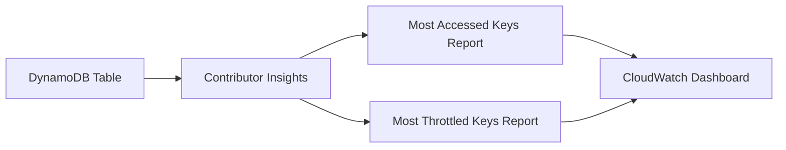

# How to Enable DynamoDB Contributor Insights

Author: [nawazdhandala](https://github.com/nawazdhandala)

Tags: AWS, DynamoDB, Monitoring, CloudWatch

Description: Learn how to enable and use DynamoDB Contributor Insights to identify hot keys, understand access patterns, and troubleshoot throttling issues.

---

DynamoDB Contributor Insights is one of those features that most people don't know about until they're deep into a throttling incident at 2 AM. It uses CloudWatch Contributor Insights under the hood to show you which partition keys and sort keys are getting the most traffic. When you've got a hot partition problem, this is the fastest way to find the offending keys.

## What Contributor Insights Actually Shows You

Contributor Insights tracks two things for your table and its GSIs:

1. **Most accessed items** - which partition keys are getting the most reads and writes
2. **Most throttled items** - which partition keys are being throttled the most

This data is surfaced through CloudWatch reports that update continuously. You get the top-N contributors to your traffic, which makes it trivial to spot uneven workload distribution.



## Enabling Contributor Insights via CLI

Turning it on is a single CLI command per table.

```bash
# Enable Contributor Insights for the base table
aws dynamodb update-contributor-insights \
  --table-name Users \
  --contributor-insights-action ENABLE
```

You can also enable it for specific Global Secondary Indexes.

```bash
# Enable for a GSI
aws dynamodb update-contributor-insights \
  --table-name Users \
  --index-name email-index \
  --contributor-insights-action ENABLE
```

Verify that it's enabled.

```bash
# Check the status
aws dynamodb describe-contributor-insights --table-name Users
```

The response shows the current status for the table and any indexes.

```json
{
  "TableName": "Users",
  "ContributorInsightsRuleList": [
    "DynamoDBContributorInsights-PKC-Users-1707744000000",
    "DynamoDBContributorInsights-PKT-Users-1707744000000",
    "DynamoDBContributorInsights-SKC-Users-1707744000000",
    "DynamoDBContributorInsights-SKT-Users-1707744000000"
  ],
  "ContributorInsightsStatus": "ENABLED"
}
```

The four rules correspond to:
- **PKC**: Partition Key - most accessed (Consumed)
- **PKT**: Partition Key - most Throttled
- **SKC**: Sort Key - most accessed (Consumed)
- **SKT**: Sort Key - most Throttled

## Enabling with CloudFormation / CDK

If you manage your infrastructure as code, here's how to enable it in both CloudFormation and CDK.

CloudFormation template snippet:

```yaml
# CloudFormation resource to enable Contributor Insights
UsersTableContributorInsights:
  Type: AWS::DynamoDB::Table
  Properties:
    TableName: Users
    AttributeDefinitions:
      - AttributeName: user_id
        AttributeType: S
    KeySchema:
      - AttributeName: user_id
        KeyType: HASH
    BillingMode: PAY_PER_REQUEST
    ContributorInsightsSpecification:
      Enabled: true
```

CDK example:

```typescript
import * as dynamodb from 'aws-cdk-lib/aws-dynamodb';

// Enable Contributor Insights when creating the table
const table = new dynamodb.Table(this, 'UsersTable', {
  tableName: 'Users',
  partitionKey: { name: 'user_id', type: dynamodb.AttributeType.STRING },
  billingMode: dynamodb.BillingMode.PAY_PER_REQUEST,
  contributorInsightsEnabled: true,  // This is all it takes
});
```

## Reading the Contributor Insights Data

The data is available through CloudWatch. You can query it programmatically or view it in the console. Here's how to pull the reports via the API.

```python
import boto3
from datetime import datetime, timedelta

cloudwatch = boto3.client('cloudwatch')

# Query the most accessed partition keys in the last hour
end_time = datetime.utcnow()
start_time = end_time - timedelta(hours=1)

# Get the top 10 most accessed partition keys
response = cloudwatch.get_insight_rule_report(
    RuleName='DynamoDBContributorInsights-PKC-Users-1707744000000',
    StartTime=start_time,
    EndTime=end_time,
    Period=3600,
    MaxContributorCount=10,
    Metrics=['Sum'],
    OrderBy='Sum'
)

print("Top 10 most accessed partition keys:")
for contributor in response['Contributors']:
    key_value = contributor['Keys'][0]
    access_count = contributor['ApproximateAggregateValue']
    print(f"  Key: {key_value}, Accesses: {access_count}")
```

And here's how to find the most throttled keys - this is the one you'll reach for during incidents.

```python
import boto3
from datetime import datetime, timedelta

cloudwatch = boto3.client('cloudwatch')

end_time = datetime.utcnow()
start_time = end_time - timedelta(hours=1)

# Get the top throttled partition keys
response = cloudwatch.get_insight_rule_report(
    RuleName='DynamoDBContributorInsights-PKT-Users-1707744000000',
    StartTime=start_time,
    EndTime=end_time,
    Period=3600,
    MaxContributorCount=10,
    Metrics=['Sum'],
    OrderBy='Sum'
)

if response['Contributors']:
    print("Top throttled partition keys (hot partitions!):")
    for contributor in response['Contributors']:
        key_value = contributor['Keys'][0]
        throttle_count = contributor['ApproximateAggregateValue']
        print(f"  Key: {key_value}, Throttles: {throttle_count}")
else:
    print("No throttled keys found - looking good!")
```

## Enabling for All Tables at Once

If you've got many tables and want to enable Contributor Insights across the board, here's a quick script.

```python
import boto3

dynamodb = boto3.client('dynamodb')

def enable_contributor_insights_all_tables():
    """Enable Contributor Insights on every DynamoDB table in the account."""
    paginator = dynamodb.get_paginator('list_tables')

    for page in paginator.paginate():
        for table_name in page['TableNames']:
            try:
                # Enable for the base table
                dynamodb.update_contributor_insights(
                    TableName=table_name,
                    ContributorInsightsAction='ENABLE'
                )
                print(f'Enabled for table: {table_name}')

                # Also enable for all GSIs on this table
                table_desc = dynamodb.describe_table(TableName=table_name)
                gsis = table_desc['Table'].get('GlobalSecondaryIndexes', [])

                for gsi in gsis:
                    gsi_name = gsi['IndexName']
                    dynamodb.update_contributor_insights(
                        TableName=table_name,
                        IndexName=gsi_name,
                        ContributorInsightsAction='ENABLE'
                    )
                    print(f'  Enabled for GSI: {gsi_name}')

            except Exception as e:
                print(f'Error enabling for {table_name}: {e}')

enable_contributor_insights_all_tables()
```

## Creating CloudWatch Alarms on Contributor Insights

You can create alarms that fire when specific keys exceed a threshold - useful for detecting abuse or misconfigured clients.

```bash
# Alert when any single partition key gets more than 1000
# throttled requests in 5 minutes
aws cloudwatch put-managed-insight-rule \
  --rule-name "DynamoDB-Users-HotKeyAlert"
```

A more practical approach is to combine Contributor Insights data with your existing alarm framework. Check out [monitoring DynamoDB with CloudWatch alarms](https://oneuptime.com/blog/post/monitor-dynamodb-with-cloudwatch-alarms/view) for the full alarm setup.

## Cost and Limitations

Contributor Insights costs about $0.02 per 100,000 DynamoDB events processed. For a table handling 1000 requests per second, that works out to roughly $50/month. It's not free, but for production tables where you need visibility, it pays for itself the first time it helps you diagnose a hot key issue.

Limitations to be aware of:
- Data retention is 14 days
- Reports show the top 100 contributors at most
- There's a slight delay (about a minute) in data availability
- Each table and GSI counts as a separate Contributor Insights enablement

## When to Use Contributor Insights

Enable it on tables where:
- You've experienced throttling before and need to understand why
- The access pattern involves user-generated keys (which often creates hot spots)
- You're running multi-tenant workloads where one tenant might dominate traffic
- You need to validate that your key design distributes load evenly

Don't bother with tables that have predictable, uniform access patterns - you already know the answer, and the cost isn't justified.

Contributor Insights is a powerful tool that fills a real gap in DynamoDB observability. Turn it on for your critical tables, set up the reports, and you'll have the data you need when the next hot partition incident happens.
