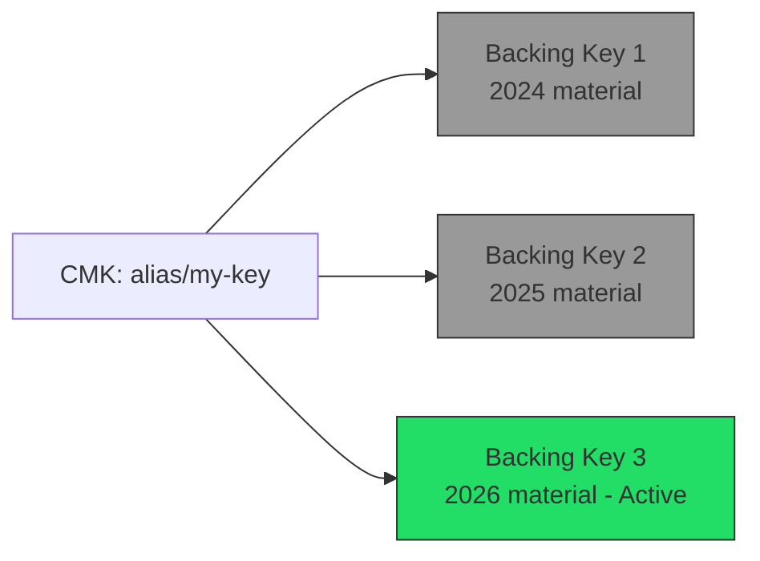

# How to Enable KMS Key Rotation

Author: [nawazdhandala](https://github.com/nawazdhandala)

Tags: AWS, KMS, Encryption, Security, Compliance

Description: Learn how to enable and manage automatic key rotation for AWS KMS customer managed keys, understand how rotation works, and implement custom rotation strategies.

---

Key rotation is one of those security practices that everyone agrees on but few implement well. The idea is simple: periodically replace cryptographic key material so that even if old material is compromised, the blast radius is limited. AWS KMS makes this surprisingly painless for symmetric keys - you flip a switch and it handles everything. But there are nuances worth understanding.

Let's walk through enabling automatic rotation, understanding what actually happens behind the scenes, and handling the cases where automatic rotation doesn't work.

## What KMS Key Rotation Actually Does

When you enable automatic rotation on a symmetric CMK, KMS generates new cryptographic material annually. But here's the important part - it doesn't re-encrypt your existing data. Instead:

- New encrypt operations use the new key material
- Old key material is preserved indefinitely for decrypting existing data
- The key ID, key ARN, alias, and key policy all stay the same
- Your applications don't need any changes

This is called "backing key rotation." The logical key (with its ID, alias, and policies) stays the same. Only the underlying cryptographic material changes. Applications using the key alias or ARN don't even notice.



## Enabling Automatic Rotation

Enabling rotation is a single API call. By default it rotates every 365 days, but you can now customize the period.

```bash
# Enable automatic rotation with default period (365 days)
aws kms enable-key-rotation \
  --key-id alias/production-database

# Verify rotation is enabled
aws kms get-key-rotation-status \
  --key-id alias/production-database
```

Since 2024, AWS supports custom rotation periods between 90 and 2,560 days (about 7 years).

```bash
# Enable rotation with a custom 180-day period
aws kms enable-key-rotation \
  --key-id alias/production-database \
  --rotation-period-in-days 180

# Check the rotation period
aws kms get-key-rotation-status \
  --key-id alias/production-database
```

The output shows you when the next rotation will happen.

```json
{
    "KeyRotationEnabled": true,
    "RotationPeriodInDays": 180,
    "NextRotationDate": "2026-08-12T00:00:00Z"
}
```

## Terraform Configuration

In Terraform, enabling rotation is a single attribute on the key resource.

```hcl
resource "aws_kms_key" "database" {
  description             = "Production database encryption key"
  enable_key_rotation     = true
  rotation_period_in_days = 365

  # Standard key policy
  policy = jsonencode({
    Version = "2012-10-17"
    Statement = [
      {
        Sid    = "EnableRootAccountAccess"
        Effect = "Allow"
        Principal = {
          AWS = "arn:aws:iam::${data.aws_caller_identity.current.account_id}:root"
        }
        Action   = "kms:*"
        Resource = "*"
      }
    ]
  })

  tags = {
    Environment = "production"
    Rotation    = "enabled"
  }
}

resource "aws_kms_alias" "database" {
  name          = "alias/production-database"
  target_key_id = aws_kms_key.database.key_id
}
```

## What Rotation Doesn't Cover

Automatic rotation has some limitations you should know about:

**Asymmetric keys** can't be automatically rotated. If you're using RSA or ECC keys for signing or encryption, you need manual rotation.

**Imported key material** can't be automatically rotated. If you imported your own key material, you'll need a manual process.

**HMAC keys** don't support automatic rotation either.

For all of these cases, you need a manual rotation strategy, which we'll cover next.

## Manual Key Rotation

Manual rotation means creating a new key and pointing your alias to it. This is what you do for asymmetric keys or when you need immediate rotation (say, after a suspected compromise).

```bash
# Step 1: Create a new key
NEW_KEY_ID=$(aws kms create-key \
  --description "Production signing key - rotated 2026-02-12" \
  --key-usage SIGN_VERIFY \
  --key-spec RSA_2048 \
  --query 'KeyMetadata.KeyId' \
  --output text)

echo "New key: $NEW_KEY_ID"

# Step 2: Update the alias to point to the new key
aws kms update-alias \
  --alias-name alias/production-signing \
  --target-key-id "$NEW_KEY_ID"

# Step 3: Keep the old key for verification of existing signatures
# Don't delete it! Just tag it as rotated.
aws kms tag-resource \
  --key-id "old-key-id-here" \
  --tags '[
    {"TagKey": "Status", "TagValue": "rotated"},
    {"TagKey": "RotatedDate", "TagValue": "2026-02-12"},
    {"TagKey": "ReplacedBy", "TagValue": "'"$NEW_KEY_ID"'"}
  ]'
```

The important thing with manual rotation is keeping the old key around for decryption or verification. Applications referencing the alias will automatically use the new key for new operations, but old data still needs the old key.

## Automating Manual Rotation with Lambda

For keys that don't support automatic rotation, you can build a Lambda function to handle it on a schedule.

```python
import boto3
import json
from datetime import datetime

kms_client = boto3.client('kms')

def lambda_handler(event, context):
    """
    Rotate a KMS key manually by creating a new key
    and updating the alias.
    """
    alias_name = event['alias_name']
    key_spec = event.get('key_spec', 'RSA_2048')
    key_usage = event.get('key_usage', 'SIGN_VERIFY')

    # Get the current key behind the alias
    try:
        alias_info = kms_client.describe_key(KeyId=alias_name)
        old_key_id = alias_info['KeyMetadata']['KeyId']
    except Exception as e:
        print(f"Failed to describe current key: {e}")
        raise

    # Create a new key
    new_key = kms_client.create_key(
        Description=f"Rotated key for {alias_name} - {datetime.now().isoformat()}",
        KeyUsage=key_usage,
        KeySpec=key_spec,
        Tags=[
            {'TagKey': 'ManagedBy', 'TagValue': 'rotation-lambda'},
            {'TagKey': 'RotatedFrom', 'TagValue': old_key_id},
            {'TagKey': 'RotationDate', 'TagValue': datetime.now().strftime('%Y-%m-%d')}
        ]
    )
    new_key_id = new_key['KeyMetadata']['KeyId']

    # Copy the key policy from the old key
    old_policy = kms_client.get_key_policy(
        KeyId=old_key_id,
        PolicyName='default'
    )['Policy']

    kms_client.put_key_policy(
        KeyId=new_key_id,
        PolicyName='default',
        Policy=old_policy
    )

    # Update the alias
    kms_client.update_alias(
        AliasName=alias_name,
        TargetKeyId=new_key_id
    )

    # Tag the old key as rotated
    kms_client.tag_resource(
        KeyId=old_key_id,
        Tags=[
            {'TagKey': 'Status', 'TagValue': 'rotated'},
            {'TagKey': 'ReplacedBy', 'TagValue': new_key_id}
        ]
    )

    print(f"Rotated {alias_name}: {old_key_id} -> {new_key_id}")

    return {
        'statusCode': 200,
        'body': json.dumps({
            'old_key_id': old_key_id,
            'new_key_id': new_key_id,
            'alias': alias_name
        })
    }
```

Schedule it with EventBridge to run quarterly or at whatever cadence your compliance framework requires.

```bash
# Create an EventBridge rule to trigger rotation every 90 days
aws events put-rule \
  --name "kms-manual-rotation" \
  --schedule-expression "rate(90 days)" \
  --state ENABLED

# Add the Lambda as a target
aws events put-targets \
  --rule "kms-manual-rotation" \
  --targets '[{
    "Id": "rotation-lambda",
    "Arn": "arn:aws:lambda:us-east-1:123456789012:function:kms-key-rotation",
    "Input": "{\"alias_name\": \"alias/production-signing\"}"
  }]'
```

## Monitoring Rotation

You should verify that rotation is actually happening. CloudTrail logs the `RotateKey` event when automatic rotation occurs.

```bash
# Check for recent rotation events
aws cloudtrail lookup-events \
  --lookup-attributes AttributeKey=EventName,AttributeValue=RotateKey \
  --max-results 10
```

You can also set up a Config rule to ensure all CMKs have rotation enabled.

```bash
# AWS Config rule for rotation compliance
aws configservice put-config-rule \
  --config-rule '{
    "ConfigRuleName": "kms-key-rotation-enabled",
    "Source": {
      "Owner": "AWS",
      "SourceIdentifier": "CMK_BACKING_KEY_ROTATION_ENABLED"
    },
    "Scope": {
      "ComplianceResourceTypes": ["AWS::KMS::Key"]
    }
  }'
```

## On-Demand Rotation

Sometimes you can't wait for the next scheduled rotation - maybe there's been a security incident. KMS now supports on-demand rotation for symmetric keys.

```bash
# Trigger immediate rotation
aws kms rotate-key-on-demand \
  --key-id alias/production-database
```

This creates new backing key material immediately while preserving the old material for decryption. It's the same as automatic rotation, just triggered manually.

## Best Practices

1. **Enable rotation on every symmetric CMK.** There's no cost and no operational impact. There's no reason not to.
2. **Use 365-day rotation for most keys.** Shorter periods add no meaningful security benefit for symmetric keys in KMS.
3. **Don't delete old key material.** KMS handles this automatically for automatic rotation. For manual rotation, keep old keys disabled but not deleted.
4. **Monitor with Config rules.** Catch any keys that were created without rotation enabled.
5. **Document your manual rotation process.** For asymmetric keys, make sure the process is repeatable and tested.

For the full picture on managing your KMS keys, check out our guide on [creating and managing CMKs](https://oneuptime.com/blog/post/2026-02-12-create-manage-kms-customer-managed-keys/view) and [key policies](https://oneuptime.com/blog/post/2026-02-12-kms-key-policies-access-control/view).

## Wrapping Up

KMS key rotation is one of the easiest security wins on AWS. For symmetric keys, it's a single setting with zero application impact. For asymmetric keys, a little automation goes a long way. The key thing to remember is that rotation doesn't re-encrypt existing data - it just ensures new operations use fresh key material. That's by design, and it's what makes rotation so painless to enable.
