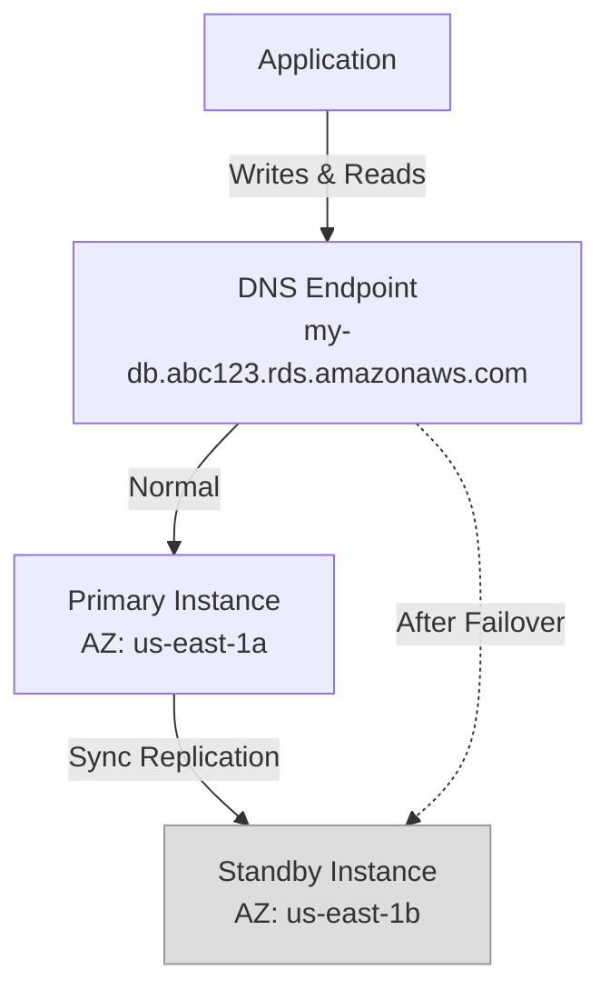

# How to Enable RDS Multi-AZ for High Availability

Author: [nawazdhandala](https://github.com/nawazdhandala)

Tags: AWS, RDS, High Availability, Multi-AZ

Description: Learn how to enable and configure RDS Multi-AZ deployments for high availability, including the differences between instance and cluster modes.

---

If your application can't tolerate database downtime, Multi-AZ is the feature you need. It creates a standby replica of your database in a different availability zone and automatically fails over to it if the primary goes down. The whole process takes 1-2 minutes, and your application connects through the same endpoint without any code changes. Let's walk through setting it up.

## How Multi-AZ Works

When you enable Multi-AZ, RDS does the following:

1. Creates a standby instance in a different AZ
2. Synchronously replicates all writes from the primary to the standby
3. Maintains the standby as an exact copy of the primary
4. Automatically fails over to the standby if the primary fails

The standby is not a read replica - you can't send read traffic to it. Its sole purpose is to be ready to take over if the primary fails.



The DNS endpoint is the key. It always points to whichever instance is currently the primary. During failover, AWS updates the DNS record to point to the standby (now the new primary). Your application reconnects to the same endpoint and gets the new primary.

## Enabling Multi-AZ on a New Instance

When creating a new RDS instance, just add the Multi-AZ flag.

This creates a new PostgreSQL instance with Multi-AZ enabled from the start.

```bash
aws rds create-db-instance \
  --db-instance-identifier my-ha-db \
  --db-instance-class db.r6g.large \
  --engine postgres \
  --engine-version 16.4 \
  --master-username admin \
  --master-user-password 'YourStrongPassword123!' \
  --allocated-storage 100 \
  --storage-type gp3 \
  --multi-az \
  --db-name myappdb \
  --db-subnet-group-name my-db-subnet-group \
  --vpc-security-group-ids sg-db-123 \
  --backup-retention-period 7 \
  --storage-encrypted \
  --deletion-protection
```

The `--multi-az` flag is all it takes. RDS handles the rest - creating the standby, setting up replication, and configuring DNS.

## Enabling Multi-AZ on an Existing Instance

You can convert a single-AZ instance to Multi-AZ without downtime. RDS takes a snapshot, restores it to create the standby, then sets up synchronous replication.

This modifies an existing single-AZ instance to become Multi-AZ.

```bash
aws rds modify-db-instance \
  --db-instance-identifier my-existing-db \
  --multi-az \
  --apply-immediately
```

The conversion process:
1. RDS takes a snapshot of the primary
2. Restores the snapshot in a different AZ to create the standby
3. Sets up synchronous replication between primary and standby
4. Once in sync, the deployment is fully Multi-AZ

This process can take 30 minutes to an hour depending on database size. The primary remains available throughout, but you might see slightly higher I/O during the initial sync.

## Multi-AZ Instance vs Multi-AZ Cluster

AWS offers two Multi-AZ modes. The original is "Multi-AZ Instance" (one primary + one standby). The newer "Multi-AZ Cluster" option (one writer + two readers) provides better availability and allows you to use the readers for read traffic.

Here's how they compare:

```
Feature             | Multi-AZ Instance    | Multi-AZ Cluster
--------------------|----------------------|---------------------
Standby instances   | 1 (not readable)     | 2 (readable)
Failover time       | 60-120 seconds       | ~35 seconds
Read traffic        | Primary only         | Writer + 2 readers
Replication         | Synchronous          | Semi-synchronous
Engine support      | All engines          | MySQL, PostgreSQL
Storage             | EBS                  | Optimized local SSD
```

### Creating a Multi-AZ Cluster

This creates a Multi-AZ DB cluster with two readable standby instances.

```bash
aws rds create-db-cluster \
  --db-cluster-identifier my-ha-cluster \
  --engine postgres \
  --engine-version 16.4 \
  --master-username admin \
  --master-user-password 'YourStrongPassword123!' \
  --db-subnet-group-name my-db-subnet-group \
  --vpc-security-group-ids sg-db-123 \
  --storage-type io2 \
  --allocated-storage 100 \
  --iops 3000 \
  --db-cluster-instance-class db.r6gd.large \
  --backup-retention-period 7 \
  --storage-encrypted
```

Multi-AZ Clusters give you two endpoints:
- **Writer endpoint**: For write operations (and reads if you want)
- **Reader endpoint**: Load-balances reads across the two reader instances

## Monitoring Multi-AZ Status

Check your instance's Multi-AZ status and identify which AZ hosts the primary.

```bash
# Check Multi-AZ status
aws rds describe-db-instances \
  --db-instance-identifier my-ha-db \
  --query 'DBInstances[0].{MultiAZ:MultiAZ,AZ:AvailabilityZone,SecondaryAZ:SecondaryAvailabilityZone}' \
  --output table
```

## Testing Failover

You should test failover before you need it in production. RDS lets you trigger a manual failover.

This command forces a failover to the standby instance.

```bash
# Force a failover
aws rds reboot-db-instance \
  --db-instance-identifier my-ha-db \
  --force-failover
```

During the failover:
1. The primary becomes unavailable
2. DNS is updated to point to the standby
3. The standby becomes the new primary
4. The old primary is recovered and becomes the new standby

Time the failover. It should take 1-2 minutes for Multi-AZ Instance and about 35 seconds for Multi-AZ Cluster.

## Application Considerations

Your application needs to handle failover gracefully. Here are the key points:

### DNS Caching

The most common failover problem is DNS caching. If your application caches the database IP address, it'll keep trying to connect to the old primary after failover.

This Java setting ensures the JVM doesn't cache DNS records too long.

```java
// In your application startup
java.security.Security.setProperty("networkaddress.cache.ttl", "30");
java.security.Security.setProperty("networkaddress.cache.negative.ttl", "10");
```

### Connection Retry Logic

Your application should retry failed connections with backoff.

This Python function implements retry logic for database connections.

```python
import time
import psycopg2

def connect_with_retry(config, max_retries=5, base_delay=1):
    """Connect to the database with exponential backoff retry."""
    for attempt in range(max_retries):
        try:
            conn = psycopg2.connect(**config)
            return conn
        except psycopg2.OperationalError as e:
            if attempt == max_retries - 1:
                raise
            delay = base_delay * (2 ** attempt)
            print(f"Connection failed (attempt {attempt + 1}), retrying in {delay}s: {e}")
            time.sleep(delay)

# Usage
db_config = {
    'host': 'my-ha-db.abc123.us-east-1.rds.amazonaws.com',
    'port': 5432,
    'database': 'myappdb',
    'user': 'admin',
    'password': 'YourStrongPassword123!',
    'connect_timeout': 5
}

conn = connect_with_retry(db_config)
```

### Connection Pooling

If you're using a connection pool (and you should be), configure it to validate connections before use and replace stale connections.

This HikariCP configuration handles failover-related connection issues.

```java
HikariConfig config = new HikariConfig();
config.setJdbcUrl("jdbc:postgresql://my-ha-db.abc123.us-east-1.rds.amazonaws.com:5432/myappdb");
config.setUsername("admin");
config.setPassword("YourStrongPassword123!");

// Connection validation
config.setConnectionTestQuery("SELECT 1");
config.setValidationTimeout(3000);

// Fast detection of broken connections
config.setMaxLifetime(1800000);    // 30 minutes
config.setKeepaliveTime(300000);   // 5 minutes
config.setConnectionTimeout(5000);  // 5 seconds
```

## What Triggers Failover?

RDS automatically fails over in these situations:

- Primary instance failure
- AZ outage
- Primary instance's OS patching
- Primary instance class change
- Primary EBS volume failure

Manual maintenance operations like instance class changes and OS patching are performed on the standby first, then a failover moves traffic to the upgraded standby (now primary). The old primary is then updated. This means most maintenance operations have minimal downtime.

## Cost Impact

Multi-AZ roughly doubles your RDS compute cost because you're paying for two instances. Storage costs also increase since data is replicated. For a db.r6g.large in us-east-1:

- **Single-AZ**: ~$0.26/hour ($190/month)
- **Multi-AZ Instance**: ~$0.52/hour ($380/month)

Is it worth it? If your application generates revenue or serves users who expect availability, absolutely. Two minutes of downtime during a failover is far better than hours of downtime while you manually recover a failed instance.

## Monitoring and Alerting

Set up CloudWatch alerts for failover events. Use [OneUptime](https://oneuptime.com/blog/post/aws-cloudwatch-alerting/view) or CloudWatch to monitor these event types:

- `RDS-EVENT-0049`: Multi-AZ failover started
- `RDS-EVENT-0050`: Multi-AZ failover completed
- `RDS-EVENT-0051`: Multi-AZ failover completed (not a customer-initiated event)

## Wrapping Up

Enabling Multi-AZ is one of the easiest ways to dramatically improve your database's availability. The setup is a single flag, and AWS handles all the complexity of replication and failover. The key is making sure your application handles failover gracefully - retry connections, don't cache DNS, and validate connections from your pool. Test failover regularly so you know it works before you need it in an actual outage.
