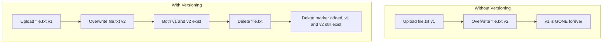

# How to Enable S3 Bucket Versioning

Author: [nawazdhandala](https://github.com/nawazdhandala)

Tags: AWS, S3, Storage, Data Protection

Description: Learn how to enable and manage S3 bucket versioning to protect against accidental deletions and overwrites with practical CLI examples.

---

Versioning is one of those S3 features that you never think about until you accidentally delete a critical file or overwrite a config with bad data. Then you're scrambling to find a backup that may or may not exist. S3 bucket versioning eliminates this problem entirely by keeping every version of every object ever stored in your bucket.

When versioning is enabled, S3 preserves all versions of an object - including when you overwrite it or delete it. You can retrieve any previous version at any time. It's like having an infinite undo button for your storage.

## How Versioning Works

Without versioning, each object has a single copy. Overwrite it and the old data is gone. Delete it and it's gone forever.

With versioning:
- Every object gets a unique version ID
- Overwrites create a new version (old versions are preserved)
- Deletes create a "delete marker" instead of actually removing the data
- You can retrieve any version by its version ID
- You can permanently delete specific versions



## Enable Versioning

Enabling versioning is a single command. Once enabled, it takes effect immediately for all new objects.

Enable versioning on an S3 bucket:

```bash
# Enable versioning
aws s3api put-bucket-versioning \
    --bucket my-bucket \
    --versioning-configuration Status=Enabled

# Verify versioning is enabled
aws s3api get-bucket-versioning --bucket my-bucket

# Output:
# {
#     "Status": "Enabled"
# }
```

Important note: you can't disable versioning once it's enabled. You can only suspend it, which stops creating new versions for future objects but preserves all existing versions. Objects created while versioning was suspended get `null` as their version ID.

```bash
# Suspend versioning (you can't fully disable it)
aws s3api put-bucket-versioning \
    --bucket my-bucket \
    --versioning-configuration Status=Suspended
```

## Understanding Version IDs

When versioning is enabled, every object gets a version ID automatically.

See version IDs in action:

```bash
# Upload a file
aws s3 cp hello.txt s3://my-bucket/hello.txt

# Upload a new version of the same file
echo "updated content" > hello.txt
aws s3 cp hello.txt s3://my-bucket/hello.txt

# List all versions
aws s3api list-object-versions \
    --bucket my-bucket \
    --prefix hello.txt \
    --query "Versions[*].[VersionId,LastModified,Size,IsLatest]" \
    --output table

# Output:
# ---------------------------------------------------------------
# |                    ListObjectVersions                        |
# +----------------------+------------------------+------+-------+
# | abc123def456         | 2026-02-12T10:30:00Z  | 16   | True  |
# | xyz789ghi012         | 2026-02-12T10:00:00Z  | 12   | False |
# +----------------------+------------------------+------+-------+
```

The `IsLatest` field tells you which version is the current one. When you do a normal `GET` or `aws s3 cp`, you always get the latest version.

## Retrieving a Specific Version

You can download any version of an object using its version ID.

Download a specific version:

```bash
# Get a specific version
aws s3api get-object \
    --bucket my-bucket \
    --key hello.txt \
    --version-id xyz789ghi012 \
    hello-old-version.txt

# Compare versions
diff hello.txt hello-old-version.txt
```

## How Deletes Work with Versioning

This is where it gets interesting. When you delete a versioned object, S3 doesn't actually delete anything. It adds a "delete marker" - a zero-byte placeholder that makes the object appear deleted.

Understanding delete markers:

```bash
# Delete an object (this creates a delete marker)
aws s3 rm s3://my-bucket/hello.txt

# The file appears deleted
aws s3 ls s3://my-bucket/hello.txt
# (no output - it looks deleted)

# But all versions still exist
aws s3api list-object-versions \
    --bucket my-bucket \
    --prefix hello.txt \
    --query "{Versions: Versions[*].[VersionId,IsLatest], DeleteMarkers: DeleteMarkers[*].[VersionId,IsLatest]}" \
    --output table
```

To "undelete" an object, you remove the delete marker. We cover this in detail in our guide on [recovering deleted objects from versioned buckets](https://oneuptime.com/blog/post/recover-deleted-objects-versioned-s3-bucket/view).

## Permanently Deleting a Specific Version

To actually remove data from a versioned bucket, you need to specify the version ID.

Permanently delete a specific version:

```bash
# This permanently deletes version xyz789ghi012
aws s3api delete-object \
    --bucket my-bucket \
    --key hello.txt \
    --version-id xyz789ghi012

# Verify it's gone
aws s3api list-object-versions \
    --bucket my-bucket \
    --prefix hello.txt
```

This is the only way to truly remove data from a versioned bucket. Be careful with this operation since it's irreversible.

## Cost Implications

Versioning has storage cost implications you should understand. Every version of every object takes up space, and you pay for all of it.

Check how much storage versions are consuming:

```bash
# Get total size including all versions
aws s3api list-object-versions \
    --bucket my-bucket \
    --query "sum(Versions[].Size)" \
    --output text

# Compare with current object sizes only
aws s3api list-objects-v2 \
    --bucket my-bucket \
    --query "sum(Contents[].Size)" \
    --output text

# Get a breakdown by prefix
aws s3api list-object-versions \
    --bucket my-bucket \
    --prefix "data/" \
    --query "length(Versions)" \
    --output text
```

If old versions are eating too much storage, use lifecycle policies to clean them up.

## Lifecycle Policies for Version Management

The best way to control versioning costs is with lifecycle rules that automatically expire old versions.

Set up lifecycle rules for version cleanup:

```bash
# Expire non-current versions after 90 days
aws s3api put-bucket-lifecycle-configuration \
    --bucket my-bucket \
    --lifecycle-configuration '{
        "Rules": [
            {
                "ID": "expire-old-versions",
                "Status": "Enabled",
                "Filter": {},
                "NoncurrentVersionExpiration": {
                    "NoncurrentDays": 90,
                    "NewerNoncurrentVersions": 5
                }
            },
            {
                "ID": "cleanup-delete-markers",
                "Status": "Enabled",
                "Filter": {},
                "Expiration": {
                    "ExpiredObjectDeleteMarker": true
                }
            },
            {
                "ID": "abort-incomplete-uploads",
                "Status": "Enabled",
                "Filter": {},
                "AbortIncompleteMultipartUpload": {
                    "DaysAfterInitiation": 7
                }
            }
        ]
    }'
```

This configuration:
- Keeps the 5 most recent non-current versions, deletes the rest after 90 days
- Removes orphaned delete markers (when all versions are expired)
- Cleans up incomplete multipart uploads after 7 days

The `NewerNoncurrentVersions` parameter is key - it ensures you always have at least N recent versions to roll back to.

## MFA Delete

For extra protection, you can enable MFA Delete, which requires multi-factor authentication to permanently delete versions or change the versioning state.

Enable MFA Delete (requires root account credentials):

```bash
# MFA Delete can only be enabled by the root account
# You need the root account's MFA device serial and a current token
aws s3api put-bucket-versioning \
    --bucket my-bucket \
    --versioning-configuration Status=Enabled,MFADelete=Enabled \
    --mfa "arn:aws:iam::123456789012:mfa/root-account-mfa-device 123456"
```

With MFA Delete enabled, even if someone compromises your credentials, they can't permanently delete object versions without the physical MFA device.

## Versioning with Replication

Versioning is required for S3 replication. If you're setting up [same-region replication](https://oneuptime.com/blog/post/set-up-s3-same-region-replication/view) or cross-region replication, both source and destination buckets must have versioning enabled.

## Best Practices

1. **Enable versioning on production buckets from day one.** The storage cost is worth the protection.
2. **Always set up lifecycle policies** to expire old versions. Without them, your storage costs will grow indefinitely.
3. **Use MFA Delete** on buckets with truly critical data.
4. **Don't forget about delete markers.** They accumulate over time and can slow down list operations.
5. **Monitor version count and storage** as part of your regular cost reviews.
6. **Consider lifecycle transitions** - move non-current versions to S3-IA or Glacier before expiring them to save money during the retention period.

Versioning is simple to enable and provides enormous value. It's one of the few AWS features where the answer is almost always "yes, turn it on." The only exception might be temporary or cache buckets where data is easily reproducible. For everything else, version it.
