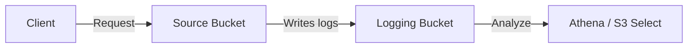

# How to Enable S3 Server Access Logging with CloudFormation

Author: [nawazdhandala](https://github.com/nawazdhandala)

Tags: AWS, S3, CloudFormation, Logging, Security

Description: Step-by-step guide to enabling S3 server access logging using AWS CloudFormation, including log bucket configuration and common troubleshooting tips.

---

S3 server access logs record every request made to your bucket - who accessed what, when, from which IP, and whether it succeeded. They're essential for security audits, troubleshooting access issues, and understanding usage patterns. But setting them up correctly with CloudFormation has a few gotchas that trip people up.

Let's walk through the entire setup, from creating the logging bucket to analyzing the logs.

## How S3 Access Logging Works

When you enable access logging on a bucket (the "source bucket"), S3 writes log records to another bucket (the "target bucket"). Each log record contains details about a single request: the requester, bucket name, request time, action, response status, and error code if applicable.

Here's the high-level flow:



Important: S3 delivers logs on a best-effort basis. Most logs arrive within a few hours, but there's no guarantee. Don't rely on access logs for real-time alerting.

## Creating the Logging Bucket

The logging bucket needs specific permissions to receive logs from S3. Here's the CloudFormation template for the logging bucket:

```yaml
# CloudFormation template for the logging destination bucket
AWSTemplateFormatVersion: '2010-09-09'
Description: S3 Server Access Logging Configuration

Resources:
  LoggingBucket:
    Type: AWS::S3::Bucket
    Properties:
      BucketName: !Sub '${AWS::AccountId}-s3-access-logs'
      LifecycleConfiguration:
        Rules:
          - Id: ExpireOldLogs
            Status: Enabled
            ExpirationInDays: 90
          - Id: TransitionToIA
            Status: Enabled
            Transitions:
              - StorageClass: STANDARD_IA
                TransitionInDays: 30
      PublicAccessBlockConfiguration:
        BlockPublicAcls: true
        BlockPublicPolicy: true
        IgnorePublicAcls: true
        RestrictPublicBuckets: true
      BucketEncryption:
        ServerSideEncryptionConfiguration:
          - ServerSideEncryptionByDefault:
              SSEAlgorithm: AES256
```

Notice the lifecycle rules. Access logs can grow fast, especially on busy buckets. Transitioning to IA after 30 days and expiring after 90 days keeps costs manageable.

## Setting the Bucket Policy for Log Delivery

S3 needs permission to write logs to your logging bucket. This is done through a bucket policy that grants the S3 logging service principal write access:

```yaml
  # Bucket policy granting S3 logging service write access
  LoggingBucketPolicy:
    Type: AWS::S3::BucketPolicy
    Properties:
      Bucket: !Ref LoggingBucket
      PolicyDocument:
        Version: '2012-10-17'
        Statement:
          - Sid: S3ServerAccessLogsPolicy
            Effect: Allow
            Principal:
              Service: logging.s3.amazonaws.com
            Action: s3:PutObject
            Resource: !Sub '${LoggingBucket.Arn}/*'
            Condition:
              ArnLike:
                'aws:SourceArn':
                  - !GetAtt SourceBucket.Arn
              StringEquals:
                'aws:SourceAccount': !Ref 'AWS::AccountId'
```

The `Condition` block is important for security. It ensures that only your specific bucket in your specific account can write logs here. Without it, anyone who knows your logging bucket name could potentially write to it.

## Enabling Logging on the Source Bucket

Now create the source bucket with logging enabled:

```yaml
  # Source bucket with access logging enabled
  SourceBucket:
    Type: AWS::S3::Bucket
    Properties:
      BucketName: !Sub '${AWS::AccountId}-my-application-data'
      LoggingConfiguration:
        DestinationBucketName: !Ref LoggingBucket
        LogFilePrefix: !Sub 'logs/${AWS::AccountId}-my-application-data/'
      BucketEncryption:
        ServerSideEncryptionConfiguration:
          - ServerSideEncryptionByDefault:
              SSEAlgorithm: AES256
      PublicAccessBlockConfiguration:
        BlockPublicAcls: true
        BlockPublicPolicy: true
        IgnorePublicAcls: true
        RestrictPublicBuckets: true
```

The `LogFilePrefix` organizes logs by source bucket. If you're logging multiple buckets to the same destination, this prefix lets you tell them apart.

## The Complete Template

Here's everything pulled together into a single deployable template:

```yaml
# Complete CloudFormation template for S3 access logging
AWSTemplateFormatVersion: '2010-09-09'
Description: S3 bucket with server access logging

Parameters:
  Environment:
    Type: String
    Default: production
    AllowedValues:
      - production
      - staging
      - development
  LogRetentionDays:
    Type: Number
    Default: 90
    Description: Number of days to retain access logs

Resources:
  LoggingBucket:
    Type: AWS::S3::Bucket
    Properties:
      BucketName: !Sub '${AWS::AccountId}-${Environment}-s3-logs'
      LifecycleConfiguration:
        Rules:
          - Id: ExpireOldLogs
            Status: Enabled
            ExpirationInDays: !Ref LogRetentionDays
          - Id: TransitionToIA
            Status: Enabled
            Transitions:
              - StorageClass: STANDARD_IA
                TransitionInDays: 30
          - Id: AbortIncompleteUploads
            Status: Enabled
            AbortIncompleteMultipartUpload:
              DaysAfterInitiation: 7
      PublicAccessBlockConfiguration:
        BlockPublicAcls: true
        BlockPublicPolicy: true
        IgnorePublicAcls: true
        RestrictPublicBuckets: true
      BucketEncryption:
        ServerSideEncryptionConfiguration:
          - ServerSideEncryptionByDefault:
              SSEAlgorithm: AES256

  LoggingBucketPolicy:
    Type: AWS::S3::BucketPolicy
    Properties:
      Bucket: !Ref LoggingBucket
      PolicyDocument:
        Version: '2012-10-17'
        Statement:
          - Sid: S3ServerAccessLogsPolicy
            Effect: Allow
            Principal:
              Service: logging.s3.amazonaws.com
            Action: s3:PutObject
            Resource: !Sub '${LoggingBucket.Arn}/*'
            Condition:
              ArnLike:
                'aws:SourceArn': !GetAtt ApplicationBucket.Arn
              StringEquals:
                'aws:SourceAccount': !Ref 'AWS::AccountId'

  ApplicationBucket:
    Type: AWS::S3::Bucket
    Properties:
      BucketName: !Sub '${AWS::AccountId}-${Environment}-app-data'
      LoggingConfiguration:
        DestinationBucketName: !Ref LoggingBucket
        LogFilePrefix: !Sub '${Environment}-app-data/'
      VersioningConfiguration:
        Status: Enabled
      BucketEncryption:
        ServerSideEncryptionConfiguration:
          - ServerSideEncryptionByDefault:
              SSEAlgorithm: AES256
      PublicAccessBlockConfiguration:
        BlockPublicAcls: true
        BlockPublicPolicy: true
        IgnorePublicAcls: true
        RestrictPublicBuckets: true

Outputs:
  LoggingBucketName:
    Value: !Ref LoggingBucket
    Description: Name of the logging bucket
  ApplicationBucketName:
    Value: !Ref ApplicationBucket
    Description: Name of the application bucket
```

Deploy it with:

```bash
# Deploy the CloudFormation stack
aws cloudformation deploy \
  --template-file s3-logging.yaml \
  --stack-name s3-access-logging \
  --parameter-overrides Environment=production LogRetentionDays=90
```

## Understanding the Log Format

S3 access logs are delivered as space-delimited text files. Each line represents one request. Here's what a log entry looks like:

```
79a59df900b949e55d96a1e698fbacedfd6e09d98eacf8f8d5218e7cd47ef2be my-bucket [06/Feb/2026:00:00:38 +0000] 192.0.2.3 79a59df900b949e55d96a1e698fbacedfd6e09d98eacf8f8d5218e7cd47ef2be 3E57427F3EXAMPLE REST.GET.OBJECT key.json "GET /key.json HTTP/1.1" 200 - 1234 1234 15 10 "-" "aws-sdk-java/1.11.0" - DHixKFIoh9GToG/123abc= SigV4 ECDHE-RSA-AES128-GCM-SHA256 AuthHeader my-bucket.s3.amazonaws.com TLSv1.2
```

The key fields are: requester identity, bucket name, timestamp, remote IP, operation, key, HTTP status, and bytes transferred.

## Querying Logs with Athena

For serious log analysis, use Amazon Athena. Create an external table that points at your log bucket:

```sql
-- Create an Athena table to query S3 access logs
CREATE EXTERNAL TABLE s3_access_logs (
  bucketowner STRING,
  bucket_name STRING,
  requestdatetime STRING,
  remoteip STRING,
  requester STRING,
  requestid STRING,
  operation STRING,
  key STRING,
  request_uri STRING,
  httpstatus STRING,
  errorcode STRING,
  bytessent BIGINT,
  objectsize BIGINT,
  totaltime STRING,
  turnaroundtime STRING,
  referrer STRING,
  useragent STRING,
  versionid STRING,
  hostid STRING,
  sigv STRING,
  ciphersuite STRING,
  authtype STRING,
  endpoint STRING,
  tlsversion STRING
)
ROW FORMAT SERDE 'org.apache.hadoop.hive.serde2.RegexSerDe'
WITH SERDEPROPERTIES (
  'serialization.format' = '1',
  'input.regex' = '([^ ]*) ([^ ]*) \\[(.*?)\\] ([^ ]*) ([^ ]*) ([^ ]*) ([^ ]*) ([^ ]*) (\"[^\"]*\"|-) (-|[0-9]*) ([^ ]*) ([^ ]*) ([^ ]*) ([^ ]*) ([^ ]*) ([^ ]*) (\"[^\"]*\"|-) ([^ ]*) ([^ ]*) ([^ ]*) ([^ ]*) ([^ ]*) ([^ ]*) ([^ ]*)'
)
LOCATION 's3://YOUR-LOG-BUCKET/YOUR-PREFIX/';
```

Then run queries to find interesting patterns:

```sql
-- Find the top 10 IP addresses accessing your bucket
SELECT remoteip, COUNT(*) as request_count
FROM s3_access_logs
WHERE httpstatus = '200'
GROUP BY remoteip
ORDER BY request_count DESC
LIMIT 10;
```

## Common Issues

**Logs not appearing**: It can take up to a couple of hours for logs to start showing up. Don't panic if you don't see them immediately after enabling.

**Circular logging**: Never log a bucket to itself. This creates an infinite loop where each log write generates another log entry, which generates another log entry, and so on. Your costs will explode.

**Permissions errors**: If you see "Access Denied" in CloudFormation, make sure the bucket policy for the logging bucket was applied before enabling logging on the source bucket. Use `DependsOn` if needed.

## Wrapping Up

S3 access logging gives you visibility into who's accessing your data and how. CloudFormation makes the setup reproducible across environments. The key things to remember: always use a separate logging bucket, set lifecycle policies on the log bucket, and use Athena for analysis. For monitoring your entire AWS setup, including getting alerted on unusual access patterns, check out our [infrastructure monitoring guide](https://oneuptime.com/blog/post/2026-02-02-pulumi-aws-infrastructure/view).
