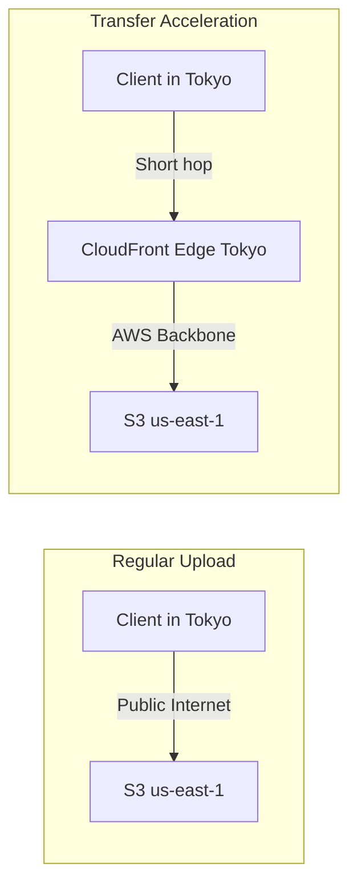

# How to Enable S3 Transfer Acceleration for Faster Uploads

Author: [nawazdhandala](https://github.com/nawazdhandala)

Tags: AWS, S3, Performance, Networking

Description: Speed up long-distance S3 uploads by enabling Transfer Acceleration, which routes data through CloudFront edge locations for optimized network paths.

---

If you're uploading files to an S3 bucket in us-east-1 from an office in Tokyo, or from a mobile app used globally, you're dealing with the physics of long network paths. Your data has to cross oceans, hop through multiple ISPs, and navigate the public internet. S3 Transfer Acceleration solves this by routing your uploads through CloudFront's global network of 400+ edge locations, giving your data an optimized path to S3.

The improvement can be dramatic - I've seen 50-300% speedups for cross-continent uploads. For uploads within the same region, the benefit is minimal or zero. Let's set it up and measure the difference.

## How Transfer Acceleration Works

When you enable Transfer Acceleration, S3 gives you a special endpoint: `your-bucket.s3-accelerate.amazonaws.com`. When you upload to this endpoint, the data goes to the nearest CloudFront edge location first, then travels over AWS's optimized backbone network to your bucket's region.



The key insight: the public internet between you and S3 is replaced by a short hop to a nearby edge location plus a fast trip over AWS's private network.

## Enable Transfer Acceleration

Enabling it is a single API call.

Enable Transfer Acceleration on a bucket:

```bash
# Enable Transfer Acceleration
aws s3api put-bucket-accelerate-configuration \
    --bucket my-bucket \
    --accelerate-configuration Status=Enabled

# Verify it's enabled
aws s3api get-bucket-accelerate-configuration \
    --bucket my-bucket

# Output:
# {
#     "Status": "Enabled"
# }
```

That's it. Your bucket now supports the accelerated endpoint.

Important: Your bucket name can't contain dots (periods) for Transfer Acceleration. Buckets named like `my.bucket.name` won't work with the accelerate endpoint. If your bucket has dots, you'll need to create a new bucket.

## Using the Accelerated Endpoint

Once enabled, use the `s3-accelerate.amazonaws.com` endpoint for uploads.

Upload using Transfer Acceleration with the CLI:

```bash
# Upload using the accelerated endpoint
aws s3 cp large-file.tar.gz s3://my-bucket/data/large-file.tar.gz \
    --endpoint-url https://s3-accelerate.amazonaws.com

# Or set the use_accelerate_endpoint option
aws configure set default.s3.use_accelerate_endpoint true

# Now all s3 commands automatically use the accelerated endpoint
aws s3 cp large-file.tar.gz s3://my-bucket/data/large-file.tar.gz

# Sync with acceleration
aws s3 sync ./uploads/ s3://my-bucket/uploads/

# To disable accelerated endpoint for a specific command,
# override with the standard endpoint
aws s3 cp local.txt s3://my-bucket/ \
    --endpoint-url https://s3.us-east-1.amazonaws.com
```

## Using Transfer Acceleration with SDKs

### Python (boto3)

Upload with Transfer Acceleration in Python:

```python
import boto3
from boto3.s3.transfer import TransferConfig

# Create an S3 client with Transfer Acceleration enabled
s3 = boto3.client('s3', config=boto3.session.Config(
    s3={'use_accelerate_endpoint': True}
))

# Upload a file using the accelerated endpoint
config = TransferConfig(
    multipart_threshold=64 * 1024 * 1024,
    multipart_chunksize=64 * 1024 * 1024,
    max_concurrency=10
)

s3.upload_file(
    'large-dataset.csv',
    'my-bucket',
    'data/large-dataset.csv',
    Config=config
)
print("Upload complete via Transfer Acceleration")
```

### Node.js

Upload with Transfer Acceleration in JavaScript:

```javascript
const { S3Client, PutObjectCommand } = require("@aws-sdk/client-s3");
const fs = require("fs");

// Create client with Transfer Acceleration enabled
const s3 = new S3Client({
    region: "us-east-1",
    useAccelerateEndpoint: true
});

async function uploadFile(filePath, bucket, key) {
    const fileContent = fs.readFileSync(filePath);

    const command = new PutObjectCommand({
        Bucket: bucket,
        Key: key,
        Body: fileContent
    });

    const result = await s3.send(command);
    console.log("Uploaded with acceleration:", result.ETag);
}

uploadFile("large-file.zip", "my-bucket", "uploads/large-file.zip");
```

## Measuring the Speed Improvement

Before committing to the extra cost, measure whether Transfer Acceleration actually helps for your specific use case.

Run the AWS S3 Transfer Acceleration speed comparison tool:

```bash
# AWS provides a speed comparison tool
# Visit: https://s3-accelerate-speedtest.s3-accelerate.amazonaws.com/en/accelerate-speed-comparsion.html

# Or test manually with timing
echo "Testing standard endpoint..."
time aws s3 cp test-100mb.bin s3://my-bucket/speed-test-standard.bin \
    --endpoint-url https://s3.us-east-1.amazonaws.com

echo "Testing accelerated endpoint..."
time aws s3 cp test-100mb.bin s3://my-bucket/speed-test-accelerated.bin \
    --endpoint-url https://s3-accelerate.amazonaws.com
```

Create a more thorough benchmark script:

```bash
#!/bin/bash
# s3-accel-benchmark.sh - Compare standard vs accelerated upload speeds

BUCKET="my-bucket"
TEST_FILE="$1"

if [ -z "$TEST_FILE" ]; then
    echo "Usage: $0 <test-file>"
    echo "Creating a 100MB test file..."
    dd if=/dev/urandom of=/tmp/test-100mb.bin bs=1M count=100
    TEST_FILE="/tmp/test-100mb.bin"
fi

FILE_SIZE=$(du -h "$TEST_FILE" | awk '{print $1}')
echo "Test file: $TEST_FILE ($FILE_SIZE)"
echo "Bucket: $BUCKET"
echo ""

# Test standard upload (3 runs)
echo "=== Standard Endpoint ==="
for i in 1 2 3; do
    echo -n "Run $i: "
    START=$(date +%s%N)
    aws s3 cp "$TEST_FILE" "s3://$BUCKET/speed-test/standard-$i" \
        --endpoint-url "https://s3.us-east-1.amazonaws.com" 2>/dev/null
    END=$(date +%s%N)
    DURATION=$(( ($END - $START) / 1000000 ))
    echo "${DURATION}ms"
done

echo ""

# Test accelerated upload (3 runs)
echo "=== Accelerated Endpoint ==="
for i in 1 2 3; do
    echo -n "Run $i: "
    START=$(date +%s%N)
    aws s3 cp "$TEST_FILE" "s3://$BUCKET/speed-test/accelerated-$i" \
        --endpoint-url "https://s3-accelerate.amazonaws.com" 2>/dev/null
    END=$(date +%s%N)
    DURATION=$(( ($END - $START) / 1000000 ))
    echo "${DURATION}ms"
done

# Cleanup
aws s3 rm "s3://$BUCKET/speed-test/" --recursive 2>/dev/null
```

## Cost Considerations

Transfer Acceleration isn't free. You pay on top of standard S3 transfer costs:

- **$0.04 per GB** for data transferred through a US/Europe edge location
- **$0.08 per GB** for data transferred through other edge locations
- No charge if Transfer Acceleration doesn't improve performance for a particular upload

That last point is important: AWS only charges for accelerated transfers when the accelerated path is actually faster. If the regular path would be faster, S3 routes your request through the standard path and doesn't charge the acceleration fee.

Estimate your monthly acceleration cost:

```bash
# Example: 500 GB/month of uploads from Asia to US
# $0.08 per GB * 500 GB = $40/month for acceleration
# Plus standard S3 request costs

# If you're uploading from within the same region,
# acceleration probably won't help and you won't be charged for it
```

## When Transfer Acceleration Helps

Transfer Acceleration gives the best improvement when:
- **Long distance**: Uploading from a continent different from your bucket's region
- **Large files**: The benefit is more noticeable with larger files (10 MB+)
- **Poor network paths**: When the public internet path between you and the S3 region is congested
- **Global users**: Mobile apps or web applications with users worldwide

It won't help much when:
- You're uploading from the same region as the bucket
- You're on a fast, direct network path to the S3 region
- Your files are very small (the overhead of the edge location hop can negate the benefit)

## Combining with Multipart Upload

For the best performance with large files, combine Transfer Acceleration with [multipart uploads](https://oneuptime.com/blog/post/upload-large-files-to-s3-multipart-upload/view):

```bash
# Configure multipart settings for optimal acceleration
aws configure set default.s3.use_accelerate_endpoint true
aws configure set default.s3.multipart_threshold 64MB
aws configure set default.s3.multipart_chunksize 64MB
aws configure set default.s3.max_concurrent_requests 10

# Upload a large file - automatically uses both acceleration and multipart
aws s3 cp 10gb-archive.tar.gz s3://my-bucket/archives/
```

## Disabling Transfer Acceleration

If you decide it's not worth the cost:

```bash
# Disable Transfer Acceleration
aws s3api put-bucket-accelerate-configuration \
    --bucket my-bucket \
    --accelerate-configuration Status=Suspended

# Unset the CLI configuration
aws configure set default.s3.use_accelerate_endpoint false
```

Transfer Acceleration is a straightforward performance optimization for long-distance S3 uploads. Enable it, test it, and if the speed improvement justifies the cost, keep it running. The fact that AWS only charges when it actually improves performance means there's little risk in turning it on and letting the data tell you whether it's worth it.
