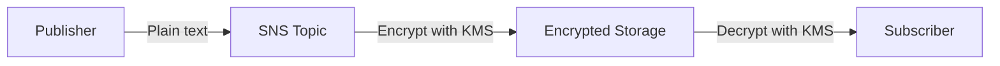

# How to Enable SNS Message Encryption with KMS

Author: [nawazdhandala](https://github.com/nawazdhandala)

Tags: AWS, SNS, KMS, Encryption, Security

Description: Learn how to enable server-side encryption on SNS topics using AWS KMS, configure key policies for cross-service access, and manage encrypted topics.

---

By default, SNS topics don't encrypt messages at rest. If your organization has compliance requirements (HIPAA, PCI-DSS, SOC 2, etc.) or you're handling sensitive data like PII or financial information, you need to enable encryption. SNS uses AWS KMS (Key Management Service) to encrypt messages before they're stored and decrypts them before delivery.

## How SNS Encryption Works

When you enable encryption on a topic, every message published to that topic is encrypted using a KMS key before it's stored in the SNS infrastructure. When SNS delivers the message to subscribers, it decrypts the message using the same key.



Important: the encryption only covers messages at rest within SNS. The connection between your publisher and SNS, and between SNS and subscribers, uses TLS encryption in transit separately.

## Enabling Encryption with the AWS-Managed Key

The simplest option is using the AWS-managed SNS key. No key creation or policy management required.

```bash
# Enable encryption on an existing topic using the default SNS key
aws sns set-topic-attributes \
  --topic-arn arn:aws:sns:us-east-1:123456789012:order-notifications \
  --attribute-name KmsMasterKeyId \
  --attribute-value alias/aws/sns
```

Or create a new encrypted topic.

```bash
# Create a new topic with encryption enabled
aws sns create-topic \
  --name secure-notifications \
  --attributes '{"KmsMasterKeyId": "alias/aws/sns"}'
```

## Using a Customer-Managed KMS Key

For more control over key rotation, access policies, and audit logging, use a customer-managed key (CMK).

### Step 1: Create the KMS Key

```bash
# Create a KMS key for SNS encryption
aws kms create-key \
  --description "Key for encrypting SNS topics" \
  --key-usage ENCRYPT_DECRYPT \
  --origin AWS_KMS

# Create an alias for easier reference
aws kms create-alias \
  --alias-name alias/sns-encryption \
  --target-key-id YOUR_KEY_ID
```

### Step 2: Configure the Key Policy

The KMS key policy must allow SNS to use the key for encrypting and decrypting messages. It also needs to allow subscribers to decrypt.

```json
{
  "Version": "2012-10-17",
  "Statement": [
    {
      "Sid": "AllowAccountAdmin",
      "Effect": "Allow",
      "Principal": {
        "AWS": "arn:aws:iam::123456789012:root"
      },
      "Action": "kms:*",
      "Resource": "*"
    },
    {
      "Sid": "AllowSNSToUseKey",
      "Effect": "Allow",
      "Principal": {
        "Service": "sns.amazonaws.com"
      },
      "Action": [
        "kms:GenerateDataKey",
        "kms:Decrypt"
      ],
      "Resource": "*"
    },
    {
      "Sid": "AllowCloudWatchAlarms",
      "Effect": "Allow",
      "Principal": {
        "Service": "cloudwatch.amazonaws.com"
      },
      "Action": [
        "kms:GenerateDataKey",
        "kms:Decrypt"
      ],
      "Resource": "*"
    },
    {
      "Sid": "AllowS3EventNotifications",
      "Effect": "Allow",
      "Principal": {
        "Service": "s3.amazonaws.com"
      },
      "Action": [
        "kms:GenerateDataKey",
        "kms:Decrypt"
      ],
      "Resource": "*"
    }
  ]
}
```

Apply the key policy.

```bash
# Update the key policy
aws kms put-key-policy \
  --key-id YOUR_KEY_ID \
  --policy-name default \
  --policy file://key-policy.json
```

### Step 3: Enable Encryption on the Topic

```bash
# Enable encryption using the customer-managed key
aws sns set-topic-attributes \
  --topic-arn arn:aws:sns:us-east-1:123456789012:secure-notifications \
  --attribute-name KmsMasterKeyId \
  --attribute-value alias/sns-encryption
```

## Setting Up with Python

Here's a complete setup script.

```python
import json
import boto3

kms = boto3.client('kms')
sns = boto3.client('sns')

def create_encrypted_topic(topic_name, key_alias='alias/sns-encryption'):
    """Create an SNS topic with KMS encryption.

    Creates a CMK if one doesn't exist, sets up the key policy,
    and creates the encrypted topic.
    """
    # Check if the key alias already exists
    key_id = get_or_create_key(key_alias)

    # Create the encrypted topic
    response = sns.create_topic(
        Name=topic_name,
        Attributes={
            'KmsMasterKeyId': key_alias,
        },
        Tags=[
            {'Key': 'Encrypted', 'Value': 'true'},
        ]
    )

    topic_arn = response['TopicArn']
    print(f'Created encrypted topic: {topic_arn}')
    print(f'Using KMS key: {key_alias} ({key_id})')
    return topic_arn

def get_or_create_key(alias):
    """Get an existing KMS key by alias, or create a new one."""
    try:
        response = kms.describe_key(KeyId=alias)
        return response['KeyMetadata']['KeyId']
    except kms.exceptions.NotFoundException:
        pass

    # Create a new key
    key_response = kms.create_key(
        Description='Key for SNS topic encryption',
        KeyUsage='ENCRYPT_DECRYPT',
    )
    key_id = key_response['KeyMetadata']['KeyId']

    # Create the alias
    kms.create_alias(
        AliasName=alias,
        TargetKeyId=key_id,
    )

    # Set the key policy to allow SNS and other AWS services
    policy = {
        'Version': '2012-10-17',
        'Statement': [
            {
                'Sid': 'AllowAccountAdmin',
                'Effect': 'Allow',
                'Principal': {'AWS': f'arn:aws:iam::{boto3.client("sts").get_caller_identity()["Account"]}:root'},
                'Action': 'kms:*',
                'Resource': '*',
            },
            {
                'Sid': 'AllowAWSServices',
                'Effect': 'Allow',
                'Principal': {
                    'Service': [
                        'sns.amazonaws.com',
                        'cloudwatch.amazonaws.com',
                        's3.amazonaws.com',
                        'events.amazonaws.com',
                    ]
                },
                'Action': ['kms:GenerateDataKey', 'kms:Decrypt'],
                'Resource': '*',
            },
        ],
    }

    kms.put_key_policy(
        KeyId=key_id,
        PolicyName='default',
        Policy=json.dumps(policy),
    )

    print(f'Created KMS key: {key_id}')
    return key_id

# Create encrypted topics
create_encrypted_topic('secure-alerts')
create_encrypted_topic('pii-notifications')
```

## Encrypting All Existing Topics

If you need to add encryption to all your existing topics.

```python
import boto3

sns = boto3.client('sns')

def encrypt_all_topics(key_alias='alias/aws/sns'):
    """Enable encryption on all unencrypted SNS topics."""
    paginator = sns.get_paginator('list_topics')
    encrypted_count = 0
    already_encrypted = 0

    for page in paginator.paginate():
        for topic in page['Topics']:
            topic_arn = topic['TopicArn']

            # Check if already encrypted
            attrs = sns.get_topic_attributes(TopicArn=topic_arn)
            current_key = attrs['Attributes'].get('KmsMasterKeyId', '')

            if current_key:
                already_encrypted += 1
                continue

            try:
                sns.set_topic_attributes(
                    TopicArn=topic_arn,
                    AttributeName='KmsMasterKeyId',
                    AttributeValue=key_alias,
                )
                encrypted_count += 1
                print(f'Encrypted: {topic_arn}')
            except Exception as e:
                print(f'Failed to encrypt {topic_arn}: {e}')

    print(f'\nEncrypted {encrypted_count} topics')
    print(f'Already encrypted: {already_encrypted}')

encrypt_all_topics()
```

## Setting Up with CDK

CDK handles the KMS key policy automatically when you use the `masterKey` property.

```typescript
import * as cdk from 'aws-cdk-lib';
import * as sns from 'aws-cdk-lib/aws-sns';
import * as kms from 'aws-cdk-lib/aws-kms';

// Option 1: Use the AWS-managed key (simplest)
const simpleTopic = new sns.Topic(this, 'SimpleEncryptedTopic', {
  topicName: 'simple-encrypted',
  masterKey: kms.Alias.fromAliasName(this, 'SnsKey', 'alias/aws/sns'),
});

// Option 2: Use a customer-managed key (more control)
const encryptionKey = new kms.Key(this, 'SnsEncryptionKey', {
  description: 'Key for SNS topic encryption',
  enableKeyRotation: true,  // Rotate the key annually
  alias: 'sns-encryption',
  removalPolicy: cdk.RemovalPolicy.RETAIN,
});

const secureTopic = new sns.Topic(this, 'SecureEncryptedTopic', {
  topicName: 'secure-notifications',
  masterKey: encryptionKey,
});

// CDK automatically adds the necessary KMS permissions
// when you add subscriptions
```

## Cross-Account Encryption

When using encrypted topics with cross-account subscriptions, the KMS key policy must also grant access to the subscriber account.

```python
import json
import boto3

kms = boto3.client('kms')

def grant_cross_account_key_access(key_id, subscriber_account_id):
    """Grant another AWS account permission to decrypt messages
    from an encrypted SNS topic."""

    # Get the current key policy
    response = kms.get_key_policy(KeyId=key_id, PolicyName='default')
    policy = json.loads(response['Policy'])

    # Add a statement for the subscriber account
    policy['Statement'].append({
        'Sid': f'AllowDecrypt-{subscriber_account_id}',
        'Effect': 'Allow',
        'Principal': {
            'AWS': f'arn:aws:iam::{subscriber_account_id}:root'
        },
        'Action': [
            'kms:Decrypt',
            'kms:DescribeKey',
        ],
        'Resource': '*',
    })

    kms.put_key_policy(
        KeyId=key_id,
        PolicyName='default',
        Policy=json.dumps(policy),
    )

    print(f'Granted decrypt access to account {subscriber_account_id}')

grant_cross_account_key_access('YOUR_KEY_ID', '222222222222')
```

## Disabling Encryption

If you need to remove encryption from a topic (not recommended for production).

```bash
# Disable encryption by setting the key to empty string
aws sns set-topic-attributes \
  --topic-arn arn:aws:sns:us-east-1:123456789012:secure-notifications \
  --attribute-name KmsMasterKeyId \
  --attribute-value ""
```

## Monitoring KMS Key Usage

Keep track of how your encryption keys are being used.

```bash
# Create a CloudWatch alarm for KMS key access denied errors
aws cloudwatch put-metric-alarm \
  --alarm-name "KMS-SNS-AccessDenied" \
  --alarm-description "KMS access denied errors for SNS encryption key" \
  --namespace "AWS/KMS" \
  --metric-name "AccessDeniedCount" \
  --dimensions Name=KeyId,Value=YOUR_KEY_ID \
  --statistic Sum \
  --period 300 \
  --threshold 1 \
  --comparison-operator GreaterThanOrEqualToThreshold \
  --evaluation-periods 1 \
  --alarm-actions arn:aws:sns:us-east-1:123456789012:critical-alerts
```

Encrypting your SNS topics is a quick win for security posture. Use the AWS-managed key for simplicity, or a customer-managed key when you need key rotation control, cross-account access, or audit trail requirements.

For setting up the alerting pipeline on these topics, see [using SNS with CloudWatch alarms](https://oneuptime.com/blog/post/2026-02-12-use-sns-with-cloudwatch-alarms/view). For cross-account setup with encrypted topics, check out [SNS cross-account subscriptions](https://oneuptime.com/blog/post/2026-02-12-set-up-sns-cross-account-subscriptions/view).
