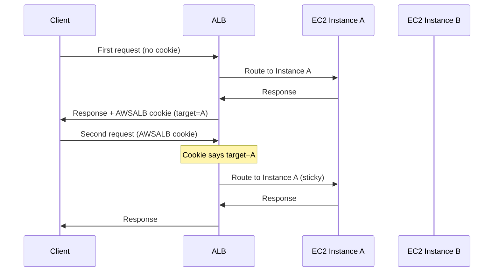
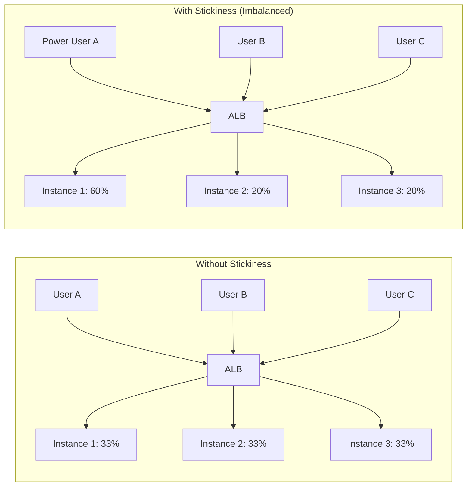

# How to Enable Sticky Sessions on an Application Load Balancer

Author: [nawazdhandala](https://github.com/nawazdhandala)

Tags: AWS, EC2, ALB, Sticky Sessions, Load Balancing, Session Affinity

Description: Learn how to configure sticky sessions on an AWS Application Load Balancer to route returning users to the same backend EC2 instance.

---

By default, a load balancer distributes requests across all healthy targets without any preference. Each request might go to a different instance. For most stateless applications, this is perfect. But some applications store session state on the server - shopping carts, user preferences, authentication tokens, in-memory caches. When a user's next request lands on a different instance, that state is gone.

Sticky sessions (also called session affinity) solve this by routing all requests from the same client to the same target for the duration of the session. Let's configure them on an ALB.

## How Sticky Sessions Work

When sticky sessions are enabled, the ALB inserts a cookie into the response. On subsequent requests, the ALB reads this cookie and routes the request to the same target that handled the original request.



If Instance A becomes unhealthy, the ALB breaks the stickiness and routes to another healthy target.

## Types of Sticky Sessions

The ALB supports two types:

**Duration-based (ALB cookie)** - The ALB generates and manages the cookie. You configure how long it lasts. Simplest to set up.

**Application-based (custom cookie)** - Your application generates the cookie. The ALB uses it for routing decisions. Gives you more control over session lifecycle.

## Enabling Duration-Based Sticky Sessions

Duration-based stickiness uses the `AWSALB` cookie managed by the load balancer.

Enable it via CLI:

```bash
# Enable duration-based sticky sessions (1 hour)
aws elbv2 modify-target-group-attributes \
  --target-group-arn arn:aws:elasticloadbalancing:us-east-1:123456789012:targetgroup/web-targets/1234567890 \
  --attributes \
    Key=stickiness.enabled,Value=true \
    Key=stickiness.type,Value=lb_cookie \
    Key=stickiness.lb_cookie.duration_seconds,Value=3600
```

The duration controls how long the cookie is valid. After it expires, the next request gets routed to any healthy target.

Common duration values:
- **300** (5 minutes) - Short sessions, good for shopping flows
- **3600** (1 hour) - Standard web sessions
- **86400** (1 day) - Long-lived sessions

## Enabling Application-Based Sticky Sessions

If your application already sets a session cookie (like JSESSIONID, PHPSESSID, or a custom one), you can tell the ALB to use it for routing decisions.

```bash
# Enable application-based sticky sessions
aws elbv2 modify-target-group-attributes \
  --target-group-arn arn:aws:elasticloadbalancing:us-east-1:123456789012:targetgroup/web-targets/1234567890 \
  --attributes \
    Key=stickiness.enabled,Value=true \
    Key=stickiness.type,Value=app_cookie \
    Key=stickiness.app_cookie.cookie_name,Value=MYSESSIONID \
    Key=stickiness.app_cookie.duration_seconds,Value=3600
```

With application-based stickiness, the ALB creates its own cookie (`AWSALBAPP`) that maps to the target, but it uses your application's cookie as the trigger. When your application removes or changes its session cookie, the stickiness is broken.

## Terraform Configuration

Here's how to configure both types in Terraform:

```hcl
# Duration-based stickiness
resource "aws_lb_target_group" "web_duration" {
  name     = "web-duration-sticky"
  port     = 80
  protocol = "HTTP"
  vpc_id   = var.vpc_id

  health_check {
    path                = "/health"
    healthy_threshold   = 2
    unhealthy_threshold = 3
    interval            = 30
  }

  stickiness {
    type            = "lb_cookie"
    cookie_duration = 3600
    enabled         = true
  }
}

# Application-based stickiness
resource "aws_lb_target_group" "web_app" {
  name     = "web-app-sticky"
  port     = 80
  protocol = "HTTP"
  vpc_id   = var.vpc_id

  health_check {
    path                = "/health"
    healthy_threshold   = 2
    unhealthy_threshold = 3
    interval            = 30
  }

  stickiness {
    type            = "app_cookie"
    cookie_name     = "JSESSIONID"
    cookie_duration = 3600
    enabled         = true
  }
}
```

## Verifying Sticky Sessions

Test that stickiness is working by making multiple requests and checking which instance handles them.

This script sends multiple requests and shows which target handles each one:

```bash
#!/bin/bash
# Test sticky sessions
ALB_DNS="my-alb-1234567890.us-east-1.elb.amazonaws.com"
COOKIE_JAR="/tmp/cookies.txt"

# Clear any existing cookies
rm -f $COOKIE_JAR

echo "=== Request 1 (no cookie) ==="
curl -s -c $COOKIE_JAR -D - "http://$ALB_DNS/" | head -20

echo ""
echo "=== Saved cookies ==="
cat $COOKIE_JAR

echo ""
echo "=== Request 2 (with cookie) ==="
curl -s -b $COOKIE_JAR -D - "http://$ALB_DNS/" | head -20

echo ""
echo "=== Request 3 (with cookie) ==="
curl -s -b $COOKIE_JAR -D - "http://$ALB_DNS/" | head -20
```

If your application returns the instance ID or hostname, you should see the same server handling all requests once the cookie is set.

## Impact on Load Distribution

Sticky sessions can cause uneven load distribution. If some users are more active than others, the instances handling those users get more load.



To mitigate this:
- Use shorter cookie durations when possible
- Monitor target-level metrics to detect imbalance
- Use Auto Scaling to add capacity for overloaded targets
- Consider moving to a stateless architecture (the best long-term solution)

## Sticky Sessions with Auto Scaling

When Auto Scaling adds or removes instances, stickiness is affected:

**Scale out (add instances)**: New instances don't get sticky sessions from existing users. Only new users (or users whose cookies expire) get routed to new instances. This means newly added instances take a while to ramp up.

**Scale in (remove instances)**: When a target is deregistered, its sticky sessions are broken. Users pinned to that target get routed to a different healthy target.

To handle scale-in gracefully, set a deregistration delay:

```bash
# Give existing connections time to finish during scale-in
aws elbv2 modify-target-group-attributes \
  --target-group-arn $TG_ARN \
  --attributes Key=deregistration_delay.timeout_seconds,Value=120
```

## When NOT to Use Sticky Sessions

Sticky sessions are a workaround, not a best practice. Whenever possible, design your application to be stateless:

- Store session data in Redis, DynamoDB, or ElastiCache
- Use signed JWTs that contain the session data
- Use a shared database for user state
- Store shopping carts server-side in a shared store

Stateless applications scale better, fail more gracefully (no session loss on instance failure), and distribute load more evenly.

If you must use sticky sessions, keep the duration as short as possible and plan for the case where stickiness breaks (instance failure, scale-in, cookie expiration).

## Monitoring Sticky Session Health

Watch these CloudWatch metrics to catch stickiness-related issues:

```bash
# Check for uneven request distribution
aws cloudwatch get-metric-statistics \
  --namespace AWS/ApplicationELB \
  --metric-name RequestCountPerTarget \
  --dimensions Name=TargetGroup,Value=targetgroup/web-targets/1234567890 \
  --start-time $(date -u -d '1 hour ago' +%Y-%m-%dT%H:%M:%S) \
  --end-time $(date -u +%Y-%m-%dT%H:%M:%S) \
  --period 300 \
  --statistics Average
```

For end-to-end monitoring of your ALB's behavior with sticky sessions, including request distribution across targets and session-related errors, set up monitoring that tracks per-target metrics. See [configuring health checks](https://oneuptime.com/blog/post/2026-02-12-configure-health-checks-ec2-load-balancer/view) for more on monitoring your load balancer setup.

## Summary

Sticky sessions ensure that a client's requests consistently reach the same backend instance. Use duration-based stickiness for simplicity, or application-based stickiness when your app manages its own session cookies. Keep durations short, monitor for load imbalance, and - if at all possible - work toward a stateless architecture that doesn't need session affinity at all. Sticky sessions are a practical tool for legacy applications, but they add complexity and reduce the resilience benefits of load balancing.
