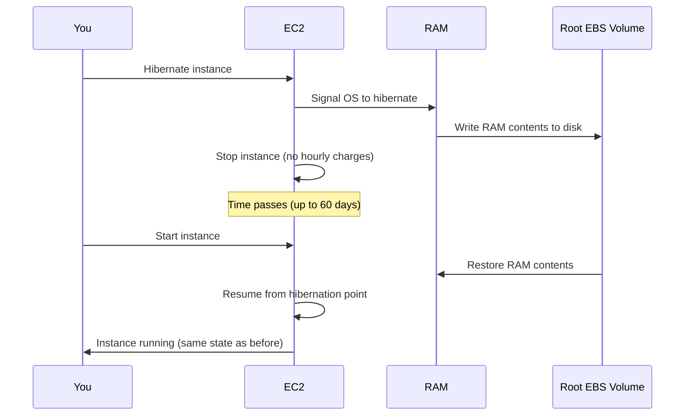

# How to Enable and Use EC2 Hibernation

Author: [nawazdhandala](https://github.com/nawazdhandala)

Tags: AWS, EC2, Hibernation, Cost Optimization, State Management

Description: Learn how to enable and use EC2 hibernation to pause and resume instances while preserving in-memory state and reducing costs.

---

Stopping and starting an EC2 instance means losing everything in RAM. Your application has to cold-start, rebuild caches, reconnect to databases, and reload data structures. That startup process can take minutes for complex applications.

EC2 hibernation solves this. When you hibernate an instance, AWS saves the contents of RAM to the root EBS volume, then stops the instance. When you start it again, the RAM contents are restored and the instance resumes exactly where it left off - like closing and opening a laptop lid.

## How Hibernation Works

Here's the process under the hood:



During hibernation, you're only charged for the EBS storage and any Elastic IPs. No EC2 instance-hour charges.

## Prerequisites for Hibernation

Not every instance can hibernate. Here are the requirements:

**Supported instance types**: Most general-purpose, compute-optimized, memory-optimized, and storage-optimized instance families support hibernation. Check the AWS docs for your specific type.

**Root volume**: Must be an EBS volume (not instance store), encrypted, and large enough to hold the RAM contents plus OS data.

**RAM limit**: Maximum 150 GB of RAM for hibernation.

**OS support**: Amazon Linux 2, Ubuntu 18.04+, Windows Server 2016+, and several other distributions.

**Hibernation agent**: The OS needs the hibernation agent installed (included by default in Amazon Linux 2 and recent AMIs).

**Launch requirement**: Hibernation must be enabled at launch time. You can't enable it on an existing instance.

## Enabling Hibernation at Launch

When launching an instance, you need to enable hibernation and ensure the root volume is encrypted and large enough.

This command launches an instance with hibernation enabled:

```bash
# Launch an instance with hibernation enabled
aws ec2 run-instances \
  --image-id ami-0abcdef1234567890 \
  --instance-type m5.xlarge \
  --count 1 \
  --key-name my-keypair \
  --security-group-ids sg-0123456789abcdef0 \
  --subnet-id subnet-0123456789abcdef0 \
  --hibernation-options Configured=true \
  --block-device-mappings '[
    {
      "DeviceName": "/dev/xvda",
      "Ebs": {
        "VolumeSize": 50,
        "VolumeType": "gp3",
        "Encrypted": true
      }
    }
  ]' \
  --tag-specifications 'ResourceType=instance,Tags=[{Key=Name,Value=hibernation-test}]'
```

The root volume must be encrypted. If you're using a custom KMS key, specify it in the block device mapping:

```bash
"Encrypted": true,
"KmsKeyId": "arn:aws:kms:us-east-1:123456789012:key/12345678-1234-1234-1234-123456789012"
```

## Sizing the Root Volume

The root volume needs enough space for the OS, your applications, and the RAM dump. A good rule of thumb is:

```
Root volume size >= OS + application data + (2 x RAM size)
```

The 2x multiplier gives breathing room for the hibernation file plus normal OS operations. For an m5.xlarge with 16 GB RAM, a 50 GB root volume is comfortable.

## Hibernating and Resuming

Once your instance is running with hibernation enabled, you can hibernate it:

```bash
# Hibernate the instance
aws ec2 stop-instances \
  --instance-ids i-1234567890abcdef0 \
  --hibernate
```

The instance state transitions from `running` to `stopping` to `stopped`. During `stopping`, the RAM contents are being written to EBS, which can take a few minutes depending on how much RAM is in use.

To resume, just start it like any stopped instance:

```bash
# Resume from hibernation
aws ec2 start-instances \
  --instance-ids i-1234567890abcdef0
```

The instance boots to exactly the state it was in when hibernated. Running processes pick up where they left off, TCP connections may need to be re-established (they'll have timed out), but in-memory data structures, caches, and application state are all intact.

## Terraform Configuration

Here's a Terraform setup for a hibernation-capable instance:

```hcl
resource "aws_instance" "hibernatable" {
  ami                    = var.ami_id
  instance_type          = "m5.xlarge"
  key_name               = var.key_name
  subnet_id              = var.subnet_id
  vpc_security_group_ids = [aws_security_group.app.id]

  hibernation = true

  root_block_device {
    volume_size = 50
    volume_type = "gp3"
    encrypted   = true
  }

  metadata_options {
    http_endpoint = "enabled"
    http_tokens   = "required"
  }

  tags = {
    Name = "hibernation-capable"
  }
}
```

## Practical Use Cases

Hibernation is valuable in several scenarios:

**Dev/test environments** - Hibernate developer instances at the end of the workday and resume them in the morning. Developers get their exact environment back without cold-start delays.

```bash
# Schedule hibernation with a cron job or Lambda
# Hibernate all dev instances at 7 PM
aws ec2 describe-instances \
  --filters "Name=tag:Environment,Values=development" "Name=instance-state-name,Values=running" \
  --query 'Reservations[].Instances[].InstanceId' \
  --output text | xargs -n1 -I{} aws ec2 stop-instances --instance-ids {} --hibernate
```

**Pre-warmed instances** - Boot an instance, warm up your application caches and JIT compilers, then hibernate. When you need capacity, resume the hibernated instance and it's immediately ready with warm caches.

**Long-running analysis** - If you're running a multi-hour analysis on an expensive instance but need to pause (maybe to wait for new data), hibernate to save costs without losing progress.

**Scheduled workloads** - Run a batch job during business hours, hibernate overnight, resume the next morning to continue.

## Checking Hibernation Status

You can verify whether an instance supports hibernation and its current state:

```bash
# Check if hibernation is configured
aws ec2 describe-instances \
  --instance-ids i-1234567890abcdef0 \
  --query 'Reservations[].Instances[].{
    ID:InstanceId,
    State:State.Name,
    Hibernation:HibernationOptions.Configured
  }'
```

## Limitations and Gotchas

There are some things to be aware of:

**60-day limit** - An instance can be hibernated for a maximum of 60 days. After that, AWS may terminate it.

**Network connections** - TCP connections will time out during hibernation. Your application needs to handle reconnection gracefully. This includes database connections, message queue consumers, and API clients.

**Time drift** - The system clock will show the time from when the instance was hibernated. NTP corrects this quickly, but applications that depend on precise timing should be aware.

**IP addresses** - The private IP stays the same. Public IPs change unless you use an Elastic IP. Elastic IPs aren't charged while the instance is stopped (hibernated).

**Spot Instances** - Spot Instances support hibernation as an interruption behavior. Instead of being terminated, the instance can be hibernated and resumed when capacity is available.

```bash
# Launch Spot Instance with hibernation on interruption
aws ec2 run-instances \
  --image-id ami-0abcdef1234567890 \
  --instance-type m5.xlarge \
  --hibernation-options Configured=true \
  --instance-market-options '{
    "MarketType": "spot",
    "SpotOptions": {
      "SpotInstanceType": "persistent",
      "InstanceInterruptionBehavior": "hibernate"
    }
  }' \
  --block-device-mappings '[{
    "DeviceName": "/dev/xvda",
    "Ebs": {"VolumeSize": 50, "VolumeType": "gp3", "Encrypted": true}
  }]'
```

## Installing the Hibernation Agent

Most recent AMIs come with the hibernation agent pre-installed. If yours doesn't, install it manually:

```bash
# Amazon Linux 2
sudo yum install -y ec2-hibinit-agent

# Ubuntu
sudo apt-get install -y ec2-hibinit-agent

# Verify it's running
systemctl status hibinit-agent
```

## Cost Savings with Hibernation

The main cost benefit is straightforward: you don't pay for EC2 compute hours while hibernated. You only pay for EBS storage.

For example, an m5.xlarge ($0.192/hr) hibernated for 14 hours overnight:
- Without hibernation: $0.192 x 14 = $2.69/night = $80.64/month
- With hibernation: 50 GB gp3 EBS = $4.00/month for that time
- Monthly savings per instance: roughly $76

For a team with 20 developer instances, that's over $1,500/month in savings, and developers get instant resume instead of cold starts.

## Summary

EC2 hibernation is a powerful feature for workloads that benefit from preserving in-memory state across stop/start cycles. It's particularly valuable for development environments, pre-warmed instances, and scheduled workloads. The key requirements are encrypted EBS root volumes with enough space for RAM, supported instance types, and the hibernation agent. Combined with automation (Lambda functions or scheduled actions), hibernation can significantly reduce EC2 costs while improving the developer experience.
