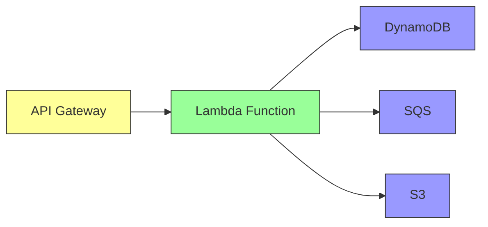

# How to Enable X-Ray Tracing for Lambda Functions

Author: [nawazdhandala](https://github.com/nawazdhandala)

Tags: AWS, Lambda, X-Ray, Tracing, Observability

Description: Step-by-step guide to enabling AWS X-Ray tracing for Lambda functions to visualize request flows, identify bottlenecks, and debug distributed serverless applications.

---

When a user reports that your API is slow, where do you look? CloudWatch Logs tell you what happened inside each function, but they don't show you the end-to-end picture. AWS X-Ray fills that gap. It traces requests as they flow through Lambda functions, API Gateway, DynamoDB, SQS, and other AWS services. You get a visual map of your architecture and can see exactly where time is being spent.

Enabling X-Ray on Lambda is straightforward. Getting useful traces out of it requires a bit more thought. Let's cover both.

## How X-Ray Tracing Works with Lambda

When you enable active tracing on a Lambda function, the Lambda service creates a trace segment for each invocation. This segment records:

- Time spent in the Lambda service (queuing, initialization)
- Time spent in your function code
- Subsegments for AWS SDK calls made by your function

These trace segments are sent to the X-Ray daemon, which runs as part of the Lambda execution environment. No additional infrastructure needed.



Each arrow in the diagram becomes a segment in X-Ray, showing the duration and any errors.

## Enabling X-Ray on a Lambda Function

The simplest way is through the CLI or console.

This command enables active tracing on an existing Lambda function:

```bash
# Enable active tracing
aws lambda update-function-configuration \
  --function-name order-processor \
  --tracing-config Mode=Active

# Verify it's enabled
aws lambda get-function-configuration \
  --function-name order-processor \
  --query 'TracingConfig'
```

Your Lambda execution role also needs permission to write trace data:

```json
{
  "Version": "2012-10-17",
  "Statement": [
    {
      "Effect": "Allow",
      "Action": [
        "xray:PutTraceSegments",
        "xray:PutTelemetryRecords"
      ],
      "Resource": "*"
    }
  ]
}
```

## Enabling with AWS CDK

CDK makes this a one-liner.

This CDK stack creates a traced Lambda function with API Gateway integration:

```typescript
import * as cdk from 'aws-cdk-lib';
import * as lambda from 'aws-cdk-lib/aws-lambda';
import * as apigateway from 'aws-cdk-lib/aws-apigateway';
import { Construct } from 'constructs';

export class TracedApiStack extends cdk.Stack {
  constructor(scope: Construct, id: string, props?: cdk.StackProps) {
    super(scope, id, props);

    // Lambda function with X-Ray tracing enabled
    const orderHandler = new lambda.Function(this, 'OrderHandler', {
      runtime: lambda.Runtime.NODEJS_20_X,
      handler: 'index.handler',
      code: lambda.Code.fromAsset('lambda/orders'),
      tracing: lambda.Tracing.ACTIVE,  // enable X-Ray
      timeout: cdk.Duration.seconds(30),
      memorySize: 256,
    });

    // API Gateway with tracing enabled
    const api = new apigateway.RestApi(this, 'OrdersApi', {
      restApiName: 'Orders API',
      deployOptions: {
        tracingEnabled: true, // enable X-Ray on API Gateway too
      },
    });

    api.root.addResource('orders').addMethod(
      'GET',
      new apigateway.LambdaIntegration(orderHandler)
    );
  }
}
```

## Enabling with SAM

In SAM templates, tracing is a simple property.

```yaml
Globals:
  Function:
    Tracing: Active

Resources:
  OrderFunction:
    Type: AWS::Serverless::Function
    Properties:
      Handler: index.handler
      Runtime: nodejs20.x
      # Tracing is inherited from Globals, or set it here
```

## Adding Custom Subsegments

The automatic tracing captures AWS SDK calls, but you'll want to add custom subsegments for your own operations - database queries, external API calls, and business logic blocks.

This handler adds custom X-Ray subsegments to trace specific operations:

```javascript
const AWSXRay = require('aws-xray-sdk-core');
const https = require('https');

// Instrument the AWS SDK
const AWS = AWSXRay.captureAWS(require('aws-sdk'));

// Instrument HTTP calls
AWSXRay.captureHTTPsGlobal(https);

const { DynamoDBClient, GetItemCommand } = require('@aws-sdk/client-dynamodb');
const dynamodb = new DynamoDBClient({});

exports.handler = async (event) => {
  const segment = AWSXRay.getSegment();

  // Create a subsegment for business logic
  const processSubseg = segment.addNewSubsegment('ProcessOrder');

  try {
    const orderId = event.pathParameters.orderId;

    // This DynamoDB call is automatically traced
    const orderResult = await dynamodb.send(new GetItemCommand({
      TableName: 'orders',
      Key: { orderId: { S: orderId } },
    }));

    // Custom subsegment for data transformation
    const transformSubseg = segment.addNewSubsegment('TransformData');
    const transformedOrder = transformOrder(orderResult.Item);
    transformSubseg.addAnnotation('orderId', orderId);
    transformSubseg.addMetadata('itemCount', transformedOrder.items.length);
    transformSubseg.close();

    // Custom subsegment for external API call
    const enrichSubseg = segment.addNewSubsegment('EnrichWithExternalData');
    try {
      const enrichedData = await callExternalApi(orderId);
      enrichSubseg.addAnnotation('enrichmentSource', 'inventory-service');
      enrichSubseg.close();
    } catch (error) {
      enrichSubseg.addError(error);
      enrichSubseg.close();
      // Continue without enrichment data
    }

    processSubseg.close();

    return {
      statusCode: 200,
      body: JSON.stringify(transformedOrder),
    };
  } catch (error) {
    processSubseg.addError(error);
    processSubseg.close();
    throw error;
  }
};
```

Install the X-Ray SDK:

```bash
npm install aws-xray-sdk-core
```

## Annotations vs. Metadata

X-Ray supports two types of custom data:

**Annotations** are indexed and searchable. Use them for values you'll want to filter traces by.

```javascript
subsegment.addAnnotation('userId', 'user-123');
subsegment.addAnnotation('orderStatus', 'pending');
subsegment.addAnnotation('paymentMethod', 'credit_card');
```

You can then search for traces in the X-Ray console:
- `annotation.userId = "user-123"`
- `annotation.orderStatus = "pending"`

**Metadata** is not indexed but can store larger, more complex data.

```javascript
subsegment.addMetadata('orderDetails', {
  items: order.items,
  shippingAddress: order.address,
  total: order.total,
});
```

Use annotations for the 5-10 most important fields you'll search by. Use metadata for everything else.

## Tracing with AWS SDK v3

The X-Ray SDK v2 wraps the AWS SDK v2 easily, but with AWS SDK v3, you need a different approach.

This configuration instruments AWS SDK v3 calls for X-Ray tracing:

```javascript
const { NodeTracerProvider } = require('@opentelemetry/sdk-trace-node');
const { AWSXRayPropagator } = require('@opentelemetry/propagator-aws-xray');
const { AwsInstrumentation } = require('@opentelemetry/instrumentation-aws-sdk');
const { registerInstrumentations } = require('@opentelemetry/instrumentation');

// Set up OpenTelemetry with X-Ray
const provider = new NodeTracerProvider();
provider.register({
  propagator: new AWSXRayPropagator(),
});

registerInstrumentations({
  instrumentations: [
    new AwsInstrumentation({
      suppressInternalInstrumentation: true,
    }),
  ],
});
```

Alternatively, use the simpler approach with the X-Ray SDK v3 beta:

```javascript
const AWSXRay = require('aws-xray-sdk-core');

// Capture all AWS SDK v3 clients
const { DynamoDBClient } = require('@aws-sdk/client-dynamodb');
const dynamodb = AWSXRay.captureAWSv3Client(new DynamoDBClient({}));
```

## Sampling Rules

By default, X-Ray samples the first request each second and 5% of additional requests. For high-traffic functions, this default keeps costs manageable. For low-traffic or critical functions, you might want to increase the sampling rate.

This command creates a custom sampling rule:

```bash
aws xray create-sampling-rule --cli-input-json '{
  "SamplingRule": {
    "RuleName": "OrderAPI",
    "ResourceARN": "*",
    "Priority": 1000,
    "FixedRate": 0.1,
    "ReservoirSize": 10,
    "ServiceName": "order-processor",
    "ServiceType": "AWS::Lambda::Function",
    "Host": "*",
    "HTTPMethod": "*",
    "URLPath": "/orders/*",
    "Version": 1
  }
}'
```

This rule traces 10% of requests to the order processor, with a reservoir of 10 traces per second (guaranteed minimum).

## Analyzing Traces in the Console

Once tracing is active, the X-Ray console gives you:

**Service Map** - a visual graph of your services and the connections between them. Each node shows average latency, request rate, and error rate.

**Trace List** - a filterable list of individual traces. You can filter by:
- Duration (find slow requests)
- Status code (find errors)
- Annotations (find specific users, orders, etc.)

**Trace Timeline** - a waterfall view of a single trace showing every segment and subsegment, their duration, and any errors.

Filter expressions are powerful:

```
# Find slow traces
duration > 5

# Find errors
http.status >= 500

# Find specific user's requests
annotation.userId = "user-123"

# Find cold starts
!OK AND service("order-processor")

# Combine filters
duration > 2 AND annotation.orderStatus = "failed"
```

## Tracing Across Multiple Lambda Functions

When one Lambda function triggers another (via SQS, SNS, or direct invocation), X-Ray can connect the traces if the trace header is propagated.

For direct invocations, the trace header propagates automatically. For SQS and SNS, you need to pass it explicitly.

This code propagates the X-Ray trace header through SQS:

```javascript
const AWSXRay = require('aws-xray-sdk-core');
const { SQSClient, SendMessageCommand } = require('@aws-sdk/client-sqs');

const sqs = AWSXRay.captureAWSv3Client(new SQSClient({}));

exports.handler = async (event) => {
  const segment = AWSXRay.getSegment();
  const traceHeader = `Root=${segment.trace_id};Parent=${segment.id};Sampled=1`;

  await sqs.send(new SendMessageCommand({
    QueueUrl: process.env.QUEUE_URL,
    MessageBody: JSON.stringify({ orderId: 'ORD-001' }),
    MessageSystemAttributes: {
      AWSTraceHeader: {
        DataType: 'String',
        StringValue: traceHeader,
      },
    },
  }));
};
```

## X-Ray with API Gateway

Enable X-Ray on API Gateway to trace the full request lifecycle from client to Lambda.

```bash
aws apigateway update-stage \
  --rest-api-id abc123 \
  --stage-name prod \
  --patch-operations op=replace,path=/tracingEnabled,value=true
```

This adds API Gateway segments to your traces, showing time spent in:
- Request processing
- Lambda integration
- Response mapping

## Cost Considerations

X-Ray pricing is based on traces recorded and retrieved:
- First 100,000 traces recorded per month are free
- $5 per million traces after that
- $0.50 per million traces retrieved

For most serverless applications, the cost is minimal. If you have very high throughput, adjust your sampling rules to control costs.

## Wrapping Up

X-Ray tracing gives you the distributed tracing capability that's essential for debugging serverless architectures. Enable active tracing on your Lambda functions, add custom subsegments for your business logic, use annotations for searchable data, and propagate trace headers across service boundaries. The service map alone is worth the setup - it shows you your architecture as it actually runs, not as you think it runs.

For complementary monitoring approaches, check out our guides on [debugging Lambda with CloudWatch Logs](https://oneuptime.com/blog/post/2026-02-12-debug-lambda-functions-cloudwatch-logs/view) and [Lambda extensions for monitoring](https://oneuptime.com/blog/post/2026-02-12-lambda-extensions-monitoring/view).
